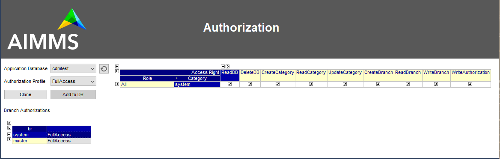

CDM Authentication and Authorization
************************************

AIMMS CDM possesses a role-based security model that is designed to work together with the security model implemented by AIMMS PRO. 

When a CDM-enabled application is deployed through an AIMMS PRO installation, you as an app developer can create *authorization profiles* in which you assign particular permissions on categories in your model to CDM *roles* which are associated in a one-to-one fashion with AIMMS PRO groups. You can subsequently assign an authorization profile to every branch in your application database. In this manner you can provide fine-grained access to every branch within every category.

When you create a new CDM application database, it will initially be configured to provide full access to all branches on all categories. Before you actually deploy to your end-users, you should set up and assign a collection of authorization profiles that fits your security requirements.

The system branch and category
==============================

AIMMS CDM possesses two special entities with respect to assigning authorizations:

* the :token:`system` branch
* the :token:`system` category
* the :token:`All` role

The system branch
-----------------

The :token:`system` branch is a predefined branch in *any* CDM database. It is used to register *administrative modifications* such as creation and updates of categories defined within the model or authorization related changes. Regular *user actions* such as reading and writing data or creating branches are not registered on the system branch. 

With respect to authorization profiles, *user action-related* `permissions <#assignable-permissions>`_ within `authorization profiles <auth.html#reating-authorization-profiles>`_ assigned to the :token:`system` branch, will be valid for *any* other branch as  well. 

The system category
-------------------

The :token:`system` category is predefined, non-modifiable category in *any* CDM database, holding no data.  With respect to authorization profiles, `permissions <auth.html#assignable-permissions>`_ within `authorization profiles <auth.html#creating-authorization-profiles>`_ assigned to the :token:`system` category on a given branch, will be valid for *any* other category as  well.

The All role
------------

The :token:`All` role, is a pre-defined role held by *any* user connected to a CDM database. Any permission assigned to the :token:`All` role for a particular category or branch, will be applied to every user. When connecting to a CDM database from an app that is not deployed from within AIMMS PRO, the :token:`All` role will be the only role held by the connecting user.

Assignable permissions
======================

The following table lists the permissions that you can set system wide, per category, per branch or per specific category/branch combination. 

    ============================== ======================= ========== ================================= ========================== ========================= ================
                     **Application area**                                 **System wide**                     **Per category**           **Per branch**       **Specific**
    ------------------------------------------------------ ---------- --------------------------------- -------------------------- ------------------------- ----------------
      **Permission**                **Description**         **Type**   :token:`system`/:token:`system`   category/:token:`system`   :token:`system`/branch   category/branch
    ============================== ======================= ========== ================================= ========================== ========================= ================
      :token:`ReadDB`               Access to application   User                 x                                                                                           
                                    database                                                                                                                                 
      :token:`DeleteDB`             Delete application      Admin                x                                                                                           
                                    database                                                                                                                                 
      :token:`CreateCategory`       Create/update           Admin                x                                                                                           
                                    category                                                                                                                                 
      :token:`ReadCategory`         Create/update           User                 x                                  x                                                        
                                    category                                                                                                                                 
      :token:`UpdateCategory`       Update                  Admin                x                                  x                                                        
                                    category                                                                                                                                 
      :token:`CreateBranch`         Create new branch       User                 x                                                               x                           
                                    on branch                                                                                                                         
      :token:`ReadBranch`           Read data from          User                 x                                  x                            x                  x          
                                    branch                                                                                                                         
      :token:`WriteBranch`          Write data to           User                 x                                  x                            x                  x           
                                    branch                                                                                                                         
      :token:`WriteAuthorization`   Create authorization    Admin                x                                                                                          
                                    profile                                                                                       
      :token:`WriteAuthorization`   Update authorization    Admin                x                                                               x                           
                                    profile                                                                                       
    ============================== ======================= ========== ================================= ========================== ========================= ================

The minimal set of permissions all users should have *system wide* are ReadDB and ReadCategory, and ReadBranch for *every branch* they need to be able to access. This will provide read-only access to the data in the application database. Each user that should be able to commit to a branch should have the WriteBranch permission on that branch.

Creating authorization profiles
===============================

The authorization system of AIMMS CDM is built around *authorization profiles*, i.e., collections of permissions assigned to combinations of roles and categories. Subsequently, an authorization profile is assigned to every branch in the CDM database, which will allow the CDM service to determine which permissions a user holding particular roles will have on that particular branch. 

When a new CDM database is created it comes with a single authorization profile :token:`FullAccess`, with all permissions set for the :token:`All` role and :token:`system` category, and both the :token:`system` and :token:`master` branch have been assigned the :token:`FullAccess` authorization profile. These initial settings, effectively, will give every connecting user all administrative and user permissions system wide.

You can view all defined authorization profiles in the Authorization page of the CDM library, as displayed below.

Creating new authorization profiles
-----------------------------------

To create a new authorization profile, select an existing authorization profile and press the *Clone* button. This will ask the user about a new profile name, and clone the the role-category specific permissions from the selected profile currently selected authorization profile. After changing the permissions for the new profile, pressing the *Add to DB* button will actually save the newly created authorization profile in the CDM database. You can add new authorization profiles to the CDM database, only when you have the :token:`WriteAuthorization` permission on :token:`system` branch. 

Creating authorization profiles programmatically
------------------------------------------------

You can also create authorization profiles programmatically: the set :token:`cdm::AuthorizationProfiles` contains all defined authorization profiles, and the permissions set for each profile are stored in the parameter :token:`cdm::AuthorizationProfile`. The procedure :token:`cdm::AddAuthorizationProfile` will add a new authorization profile to the CDM database.

Assigning authorization profiles to branches
============================================

You can assign an authorization profile to any branch in your CDM database in the Authorization page of the CDM library. 

Note, that you can only change this, if you have the WriteAuthorization permission on the branch for which you want to change the settings.

Setting authorization profiles on the :token:`system` branch
------------------------------------------------------------

When assigning an authorization profile to the :token:`system` branch, please `remember <auth.html#the-system-branch>`_ that the authorization profile of the :token:`system` branch serves two purposes:

* setting system wide permissions for *administrative* tasks
* setting permissions that will apply to all data branches for regular *user* tasks

Thus you should make sure that the authorization profile that you assign to the :token:`system` branch at least has the WriteAuthorization permission set on the :token:`system` category for *any* administrative role you hold. Failure to do so, will lock you out from making any further system wide authorization changes. 

Reversely, you should be quite careful with setting administrative permissions to non-administrative roles on the :token:`system` category, as this may give regular users administrative permissions you do not want them to have. 

Changing authorization profiles on branches programmatically
------------------------------------------------------------

You can change branch authorizations programmatically by calling the function :js:func:`cdm::SetBranchAuthorization`.