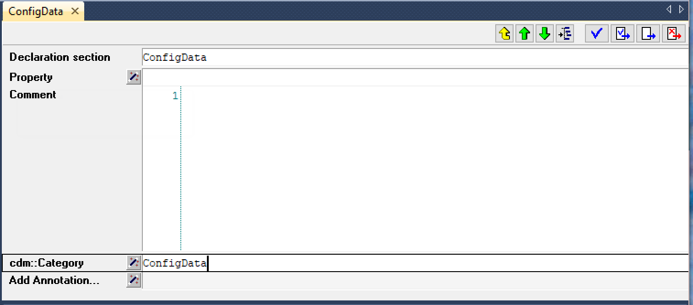

Configuring your model for CDM
******************************

After adding the CDM library to your model, you need to configure your model as to how, and which, data in your model needs to be managed through CDM. The main mechanism for setting this up are CDM data *categories*. In this section we'll discuss how you should view CDM categories, and what you should keep in mind when setting up categories to prevent runtime problems.

CDM categories
==============

CDM categories are collections of identifiers in your model, data changes of which, from a functional point of view, need to be stored in the CDM database in a single transaction. CDM categories are not restricted to identifiers that can be contained within a single database table, they can contain both sets, parameters and variables of differing dimensions, and with differing domains. Categories can contain only a few identifiers, or a large amount of identifiers, as long as their functional role in the model is sufficiently similar to warrant them to be contained in a single category. 

Reasons to create categories
----------------------------

The following sections describe a number of functional reasons that may cause you to create separate categories.

Independent scenarios
+++++++++++++++++++++

The main reason to separate identifiers in your model into different categories should be whether the state of the data of the identifiers in each category needs to be able to change *independently* of the data of identifiers in other categories. This allows you to have multiple users create different scenarios for single categories, and later on mix and match such scenarios for different categories together to create multiple combined data sets to work with. If you do not see a need to mix and match different scenarios for data of different categories, we advise to keep the number of categories as small as possible, as having to manage a large amount of categories inherently adds to the complexity of your application. 

Categories are completely unnecessary as a tool to create groups of identifiers to which a user is expected to make simultaneous changes. CDM stores change sets of *individual changes* in the first place and does not care whether such individual changes are stored in a single category or in multiple categories. Adding multiple categories does, however, add conceptual complexity to your model, and will actually result in having CDM to perform more actions to keep all categories in sync.

Differing auto-commit requirements 
++++++++++++++++++++++++++++++++++

Another reason for creating multiple categories could be when your application has different auto-commit requirements for different classes of identifiers during different phases of your app, as auto-commit behavior in CDM is arranged on a per-category level. If during one phase of your model you want your end-user to manually commit a complete set of changes, while at other locations in your app, you want changes to directly propagate to all other end-users of your application, then this may be a reason to separate the manually committed and auto-committed identifiers into two distinct categories. Auto-commit behavior is typically observed for AIMMS applications that have an operational nature, and where changes by one user directly influence the decision space of other users. 

Defined root sets
+++++++++++++++++

There is, however, one other major reason that actually *necessitates* the use of multiple categories, and is related to the `internal workings <impl.html>`_ of CDM. Before being able to pass any multi-dimensional data, CDM needs to pass all root set elements for all root sets used in the identifiers of a category first, and subsequently passes all other data in a two-staged approach, allowing it to by-pass any subset domains and domain conditions in the first stage, after which it is able to assign the values to the real identifiers in the correct order in the second stage. This approach poses a problem when root sets are *defined* in terms of other parameters in the model. A prime example is a *calendar*, which typically depends on two string parameters setting the begin and end date. When these string parameters have no value, the calendar will by empty, and CDM will not be able to set up the mapping between the numbering used by the CDM database and the internal element numbering of AIMMS, causing all further data transfer of calendar-related data to fail. The same holds for other root sets, which are defined in terms of other numerical, string or element parameters. 

The solution is then to store the parametric data used in the definition of such root sets, along with any other data on which such parameters depend in a separate category. When determining the order of reading data, the CDM library will then make sure that this category is actually read before any categories that depend on these parameters to populate root sets.

Specifying categories
=====================

The CDM library uses *model annotations* to define CDM categories. Through the annotation :token:`cdm::Category` you can assign the name of a category in which a single identifier, or all identifiers underneath a section in your model, should be placed. For instance, in the image below, all identifiers stored underneath the declaration section :token:`ConfigData` will be placed in the CDM category of the same name.

Identifiers underneath a section inherit its annotation values, and thus will end up in the same CDM category. If you want to exclude such an identifier from the category, you can do so by overriding the :token:`cdm::Category` annotation. 

Although the :token:`cdm::Category` annotation can be assigned to any type of identifier, the CDM library will only take sets (including calendars), parameters and variables into account, and will exclude all defined sets and parameters, as these can be recomputed, and thus do not need to be stored in through CDM.

Taking care of dependencies
===========================

When assigning identifiers in your model to a CDM category, you need to pay special attention to other identifiers on which CDM-managed identifiers depend. Whenever you pull the data of CDM-managed identifiers from the versioned CDM database, trying to assign that data to the identifiers in the model, will most likely fail if the dependent identifiers don't hold compatible values that allow the CDM-managed values to be assigned. 

In this manner you have to make sure that for all CDM-managed identifiers

* all of its domain sets, element ranges, and super-sets must hold the set elements for which the versioned CDM database hold values. 
* any identifiers used in numerical ranges, calendar begin- and end-dates, or definitions of other dependent identifiers must hold values that allow the values of CDM-managed identifiers to be assigned from the versioned CDM database

Special caution with respect to root sets
-----------------------------------------

CDM will automatically ensure that all *root sets* and their elements will be represented in the CDM database, as these are necessary for translating label numbers as stored in the CDM database to element numbers in each AIMMS session. But not adding root sets explicitly to *any* CDM category will lead to behavior where such root sets will only grow over time. Deletion of root set elements in the AIMMS model will only be picked up by CDM if the root set is explicitly member of a CDM category. 

Ensuring full data compatibility
--------------------------------

Full data compatibility will be ensured in a number of occasions:

* The dependent identifiers themselves are managed through CDM, i.e., have been assigned to a CDM category themselves as well.
* They are defined in terms of constants or other identifiers that are also managed by CDM.

If you fail to meet this conditions, you may notice that checking out a snapshot from the CDM service may result in errors.

Restrictions on identifier types
--------------------------------

AIMMS CDM allows the following identifier types to be included in a category:

* simple root and subsets, integer sets, indexed sets and relations
* scalar and multi-dimensional numerical, element and string, parameters
* scalar and multi-dimensional numerical and element variables

AIMMS CDM does *not* support compound sets, and data defined over compound sets.

Updating category contents
--------------------------

During the lifetime of your application, it is very likely that contents of the CDM categories you have specified will change. Such changes can consist of new identifiers that you have added to a category, or identifiers that have been deleted from a category, or of structural changes to existing identifiers. 

If you have already initialized an application database for a particular data category, the application database might have to be adapted, the next time you connect to it. You can indicate to the CDM library that you made changes to the existing category setup, by modifying the value of the string parameter :token:`cdm::DataSchemaVersion`, which has an initial value of 1. The value of the data schema version is also stored in the application database, and each time the CDM library connects to it, it will check the version in the model with the version stored in the application database.

If the value of :token:`cdm::DataSchemaVersion` has changed, the CDM category will be checked for changes, and tables will be re-initialized where necessary. 

* If a new identifier has been added to the category, a new corresponding table will be added to the application database

* If an identifier has been deleted from a category, the existing table will be detached from the category, but the corresponding table in the application database will not be deleted (as it still contains history)

* If an identifier has been structurally changed, a new table will be created in the application database, but the old table, and all of its contents, will not be deleted as it contains the history of the identifier prior to the structural change. Note, however, that, currently, CDM does not know how to fill the new table based on the contents of the previous table.

Dealing with name changes
-------------------------

When you simply change the name of identifiers in your model, but do make a structural change to the identifier, you may end up with a situation, where you already have a table in the CDM database still holding valid data, but which corresponds to the old identifier name. 

You can solve this situation by specifying the old identifier name for the :token:`cdm::AlternateName` attribute of the identifier. This will cause the CDM service to first look whether an existing table for the *alternate* name already exists in the database with the correct dimensional structure, before actually creating a new table for the current identifier name. If the structure of the existing table differs for the structure of the actual identifier, the CDM service will then create a new table in the CDM database corresponding to the *current* name of the identifier.

Initializing CDM support in your model
======================================

After you have identified the functional categories that you want CDM to work with, and assigned all identifiers you want to store in each category, the main procedure for actually creating and activating the categories is :token:`cdm::ConnectToApplicationDB`.

Based upon the categories you defined, The CDM library will determine the actual contents of these categories, the order in which categories themselves and all identifiers in each category need to be read in, based on their interdependencies. The determination of this order is determined within the procedure :token:`cdm::ProcessAnnotations`, and you can debug the process using the AIMMS debugger, if the need arises. You can inspect the final resulting order through the parameters :token:`cdm::CategoryOrder` and :token:`cdm::IdentifierOrder`, where identifiers with a higher (absolute) order value depend on identifiers with a lower (absolute) order value, and the order value of defined identifiers is negated. 

Subsequently, the call to :token:`cdm::ConnectToApplicationDB` will create the :token:`CDMRuntime` runtime library, which will hold a number of shadow identifiers for each identifier managed by CDM. These shadow identifiers are used by the CDM library to track state and individual changes to the CDM-managed identifiers in your model during various stages of its operation.

CDM backend specification
-------------------------

After the CDM support in your model has been set up, :token:`cdm::ConnectToApplicationDB` will try to connect to an existing application database. How the CDM library will connect to the CDM service, is determined by various configuration parameters in the CDM library. 

* By setting :token:`cdm::UseEmbeddedServer` to 1, the CDM library will start the embedded CDM service, taking its configuration :token:`CDMConfig.xml` file from the folder specified by :token:`cdm::EmbeddedServerConfigFolder`. The latter defaults to the Config subfolder of the main project folder. You can copy the :token:`CDMConfig.xml` file from the Config subfolder of the :token:`AimmsCDM` library there to get started, and adapt it to your needs. 

* If the application using the CDM library is deployed from within the AIMMS Cloud Platform, and :token:`cdm::CloudServiceName` is set, the CDM library will connect to the an on-demand CDM service with the given name, or start such a service if has not been started yet. The service will connect to the MySQL database specified by 

  * :token:`cdm::DatabaseHost`
  * :token:`cdm::DatabaseUser`
  * :token:`cdm::DatabasePassword`

Typically, these would point to the hostname and credentials of the MySQL application database that you can order with the AIMMS Cloud Platform.

* If the application is deployed from an on-premise PRO server and :token:`cdm::TunnelContext` is set, the CDM library will set up a PRO tunnel to the given tunnel context name. Such PRO tunnels can be configured by the PRO administrator in the PRO portal, and allow the client application to connect to an endpoint behind a firewall through the tunnel. In this case, the configured endpoint would be the service URI of a PRO service running behind the data center firewall.

* In all other cases, the CDM library will connect directly to the URI configured through :token:`cdm::ServiceURI`, which will default to tcp://localhost:19999, i.e. a CDM service running on the local machine, and configured to listen on the default port. This is also the default port on which the embedded CDM will listen.

Initial checkout of data
------------------------

After connecting to the CDM service, the :token:`cdm::ConnectToApplicationDB` function will create (or update) an application database and all of its related category tables, or verify that the existing category setup in the CDM database matches the CDM categories in the model. Which strategy it will choose depends on the parameter :token:`cdm::DataSchemaVersion` which you should change whenever you make changes to the contents of categories. 

If this steps succeeds, the :token:`cdm::ConnectToApplicationDB` function will perform a check-out of all categories in your model to the latest revision on the branch marked as *global* in the CDM database. By default, this will be the :token:`master` branch. You can modify the global branch through the low-level API function :js:func:`cdm::SetGlobalBranch`.

Logging CDM actions
-------------------

You can add logging to your CDM-enabled application, by copying the file :token:`CDMLogConfig.cfg` from the Config folder in the AimmsCDM library to the main project folder. After doing so, any CDM functionality will start logging its actions in more or less detail (depending on the log level set in :token:`CDMLogConfig.cfg`) into the file CDMLog.xml. By default, all loggers will log at INFO level, i.e. report back a summary of any major CDM action executed from within the model. By setting the log level for specific loggers to TRACE, you will get very detailed information about the specific sub-components of CDM, which may help you find issues with your CDM setup. 

* The :token:`CDM` logger will log all client-side actions, when setting the log level higher than INFO, this logger will create log lines with detailed information about the state of and actions upon all categories and CDM-managed identifiers therein when committing and pulling data. 

* The :token:`CDMService` logger will log all server-side actions when using the embedded CDM service, corresponding to the client-side actions logged by the :token:`CDM` logger. If you are not sure whether problems occur at the client- or server-side, this logger may provide you with the additional information necessary to debug the issue.

* The :token:`CDMDB` logger will, at TRACE level, give you very specific information about the queries being executed within the database backing the CDM service. 

To interpret the logs created, you can use tools such as the free community version of &quot;Log4View &quot;:http://www.log4view.com to get a quick overview of any problems that may occur with your CDM setup.

Model constructs to reconsider when using CDM
=============================================

While AIMMS CDM has been designed to allow you to create true multi-user decision support applications with minimal effort, there are a number of model constructs that are fundamentally incompatible with CDM, or which may have undesired effects that you need to be aware of. In such cases, you are strongly advised to modify your model to circumvent such unwanted interactions. 

Because the affected areas typically revolve about the use of sets in manners that don't live well with CDM, the effort to circumvent these problems is typically overseeable.

Renaming elements
-----------------

For any root set in your model that is managed through CDM, AIMMS CDM works with a `global namespace <impl.html#cdm-element-spaces>`_, maintained in the central CDM database, providing a single revision-independent mapping between *element names* and globally assigned *element numbers*. This mapping is used by CDM to translate multiple-dimensional data from a global element numbering to a local element numbering that can be different for each client session, because of the potentially session-specific sequence of adding elements to the root sets used in the application. 

The element-name/-number mapping provided through these global namespaces needs to work for *all clients* at *all times*, that is, over all data revisions stored in the database, and for all available branches. Allowing elements to be simply renamed has the potential to break this paradigm. Typically, such set element renames take place at a particular point in time at a particular branch, which raises the question what should happen to data in other branches, and in past revisions. Should clients accessing such data see the old name, or the new one, and what should happen if a set element is renamed multiple times? Because there is no real good answer to these questions, AIMMS CDM will intercept all calls to the intrinsic AIMMS function :token:`SetElementRename` in your model (as well as through the AIMMS API) and raise an execution error. 

So, if renaming set elements is not an option when using CDM, what other approaches are available? 

* If the name of an element changes frequently, you may opt to use an string parameter defined over the set for displaying the element name, instead of the element itself. As the displayed element name now has become data to which different values can be assigned at different revisions and in different branches, you have complete freedom to change the display name of the element as often as you see fit. 

* A different approach could be to `clone <config.html#cloning-elements>`_ the existing element to a new element with the desired name, and subsequently delete the existing element from the set in the branch at which you want to element to be renamed. In this manner all historic data already present in the data repository will remain untouched, while you will see the renamed element name with identical data in the branch at hand.

Cloning elements
----------------

AIMMS CDM uses a :token:`CDMRuntime` library containing various `shadow identifiers <impl.html#shadow-identifiers>`_ for all CDM-managed identifiers in your model. These shadow identifiers are used to store your application's state during various stages of the version control actions implemented by the CDM library. 

When you use the intrinsic :token:`CloneElement` function in your model, AIMMS will clone an element in a given set, and replicate *all* data defined over the existing element in all identifiers *anywhere in the model* for the cloned element as well. Because this will also apply for the shadow identifiers create by the CDM library, the use of :token:`CloneElement` will prevent the CDM library from detecting any data changes caused by cloning an existing element. Because of this unwanted side-effect, the CDM library will intercept all calls to the intrinsic AIMMS function :token:`CloneElement` and raise a runtime error. 

If you run into this situation, you can simply replace the call to the :token:`CloneElement` by a call to the function :js:func:`cdm::CloneElementInCategory`, which will replicate the data for all relevant identifiers in the given CDM category, but not in the shadow identifiers of the :token:`CDMRuntime` library. A subsequent commit will then pickup the changes caused by cloning the element and store them in the CDM data repository. You may have to repeat this for other categories for which the element has been used as well.

Deleting elements and calling the CleanDependents operator
----------------------------------------------------------

When deleting elements from root sets in your model, this will cause all data defined over that set element to become inactive, or even to be deleted when the :token:`CleanDependents` operator is called. Because the CDM library keeps the state of root sets used in a CDM category within data structures maintained within the DLL that accompanies the CDM library, CDM is still able to pick the element deletion, and also remove the element from the set in the data repository. However, this will by no means give you the certainty that the inactive data defined over that element will also be reset to their default value in the CDM database. The effect of this could be, that you will encounter data to possibly re-appear unexpectedly into your model, when checking out the data after the deleted element has been re-introduced in the data of the model.

If you want to be certain that all inactive data is removed from the branch on which you want to delete the element, you can follow the approach described below:

* Call the function :js:func:`cdm::EmptyElementInCategory`. This will remove all data for the given element from all multi-dimensional identifiers in the given CDM category, *but will not yet delete the element from the root set*. If you now commit the category, the data in the CDM database will be reset to their default value for the given branch. You may have to repeat this for other categories in which the element has been used as well. 

* You can subsequently delete the element from the root set, and remove the element in the CDM data repository as well through a final commit.

Creating globally unique set element names
------------------------------------------

If your existing AIMMS application already supports multiple users, and you have designed a mechanism that allows users to create globally unique set elements, for instance, by using a centrally stored, and ever increasing integer value to make the element unique, you should reconsider where such a mechanism can create race conditions when used in combinations with CDM. 

Typically, using AIMMS CDM will increase concurrency compared to an app that does not use CDM. However, if the mechanism you selected to create the unique component of the set element name does not guarantee *atomicity*, you risk the situation that two end-users will inadvertently create the same element in the central CDM data repository. You can counteract this by revisiting and adapting the mechanism you selected to create unique set element names by e.g. including the end-user initials, and use a user-dependent counter to create unique elements

Alternatively, you can can forfeit the use of counter-based element names altogether and use the function :js:func:`cdm::CreateUuid` to create UUIDs (36-character globally unique hexadecimal strings) to uniquely represent set elements for all clients. You can then use a string parameter to define a more user-friendly display name for such elements.

