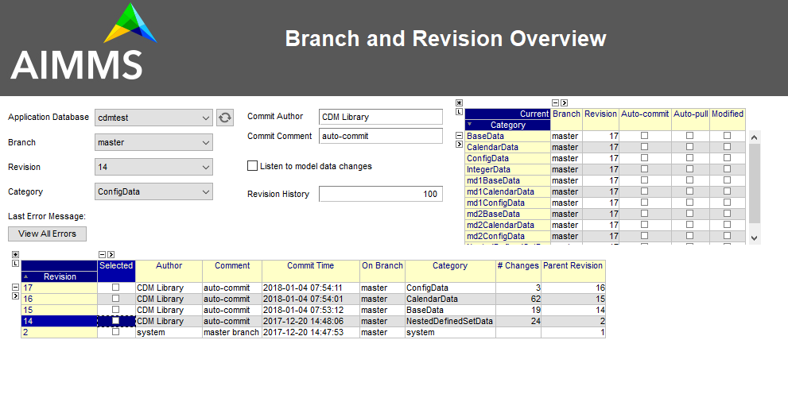
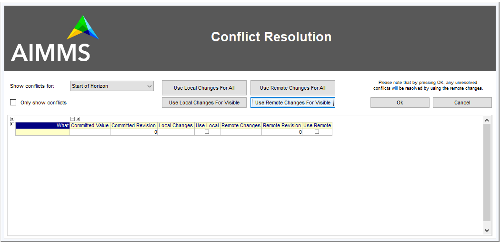
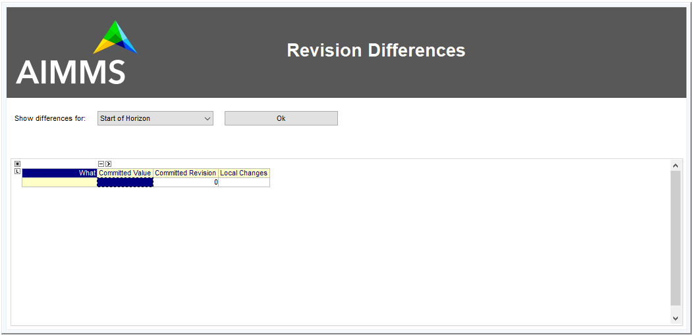

Day-to-day CDM operations
*************************

While the previous chapter focused on adding support for CDM in your model, and adapting your model to using CDM, we will now focus on all aspects of the day-to-day use of a CDM-enabled application by the end-users of your model. 

Most CDM functionality is implemented in a white-box implementation in the section :token:`Branch and Revision Overview Support` of the :token:`AimmsCDM` library, with some low-level functionality like determining and dealing with individual differences of identifiers at the tuple level, as well as all interaction with CDM service implemented through external functions in the CDM DLL. This approach allows you to inspect most of the inner workings of CDM, and, together with inspecting the `log files <config.html#logging-cdm-actions>`_ produced by CDM, will help analyze any problems there may with your CDM setup.

General concepts
================

Before diving in deeper into day-to-day operations you will need to learn some more general version control concepts used by CDM.

Branches and revisions
----------------------

All data in a CDM data repository is organized in one or more *branches*. When a new CDM application database is created, it will start with two standard branches, the :token:`system` branch and the :token:`master` branch. 

The :token:`system` branch is not used to record any data changes, but solely to record administrative events as discussed `here <auth.html#the-system-branch>`_. 

The :token:`master` branch is the initial branch used to store data changes to the data of identifiers in any CDM category of the application at hand. Any commit to a branch will lead to the creation of a new *revision* on that branch, based on a parent revision. The parent revision represents the state of the application data just prior to the changes being made to the application's data, that were committed to constitute the new revision. The CDM library will always maintain the state of the application data corresponding to a given revision in the CDM data repository, and thus is able to determine the individual changes of all identifiers in a particular CDM category compared to the state of that revision, and commit the collective of all individual changes to the CDM data repository as a new revision, with the given revision as its parent.

When checking out the data for a CDM category from a given branch in the CDM data repository, the CDM service will collect the latest values for all changes committed to all revisions on that branch for all stored tuples of every identifier in the category, and pass the collective of these latest stored values on to the client requesting the checkout, allowing the client to restore the exact application state at the latest revision on the given branch.

The initial revision on the :token:`master` branch represents the *empty* state, i.e. the state where no application data whatsoever has been stored yet. New branches can be created based on any revision in the data repository. The initial state of any branch equals the state of the revision on which it is based.

All branches created in the CDM data repository, as well as the revisions on all branches, can be inspected visually on the :token:`Branch and Revision Overview` page of the CDM library, as shown below. From this page, one can also execute the most common version control operations via the context menus of the Category and Revision lists.

High-level versus low-level API
-------------------------------

For day-to-day use the CDM library provides two APIs.

High-level API
++++++++++++++

The high-level API is used through right-mouse menus from within the :token:`Branch and Revision Overview` page in the CDM library to perform the most common version control actions on the data in your model. 

This high-level API is data driven, i.e. it operates on application databases, categories, branches and revisions set through the element parameters 

* :token:`cdm::SelectedDB`
* :token:`cdm::SelectedCategory`
* :token:`cdm::SelectedBranch`
* :token:`cdm::SelectedRevision`

The functions in the high-level API use the low-level API to combine various version control actions to implement their requested actions. If the high-level behavior is what you are looking for, you can use this API within your own code as well, by setting the above element parameters as appropriate and calling the high-level functions. 

Low-level API
+++++++++++++

The  `low-level API <api.html>`_ is implemented in the DLL that comes with the CDM library. This API connects with the CDM service and exposes the full capabilities of the CDM library, and allows you to implement custom actions that are not implemented by the high-level API. The methods exposed by the high-level API can serve as an example from where you can implement your customizations.

Error handling
--------------

Whichever API you use, make sure to check the return values of the CDM methods you call. Typically, if there is some problem with your CDM setup, e.g. because of incorrect dependencies, checking out the data is likely to fail. Not only will this confuse your end-users, if they don't get notified of the problem, but, also, such errors may not set the state of the CDM library correctly, causing subsequent commits to fail as well. 

Low-level API error handling
++++++++++++++++++++++++++++

The low-level API functions, will all return 1 if successful, or 0 otherwise. If you use the low-level API functions, you have to carefully check the return codes, and take appropriate action when a call fails. When a low-level API functions fails, it will call the procedure :token:`cdm::SetError`, which registers all occurring errors and their stack locations in the :token:`cdm::ErrorMessage` and :token:`cdm::StackProcedure` parameters, which can be checked programmatically, or viewed from the :token:`List of Errors` page in the CDM library.  

.. image:: images/listoferrors.png
    :align: center

When checking the return code, you can also use these messages to report the error back to the end-user. 

On-error hooks
++++++++++++++

In addition, :token:`cdm::SetError` will call the procedure pointed to by the element parameter :token:`cdm::OnErrorProcedureHook`. By default it calls the empty procedure :token:`cdm::EmptyErrorProcedureHook`, which you can replace by your own implementation. You can use such a hook to report errors back to the user, or, for instance, to automatically raise an error, that you can catch in an :token:`onerror` block in your own procedures that call low- or high-level API, if you happen to like an exception-based error handling approach. 

If you do not provide an on-error hook yourself, you should still check the return values returned by the low- or high-level API methods.

High-level API error handling
+++++++++++++++++++++++++++++

The high-level API will check the low-level API error codes, and return on failure. If you have set a :token:`cdm::OnErrorProcedureHook` that raises an error when called, you can catch the errors that occur both during low- and high-level API methods from within an on-error block in your code or through the global AIMMS error handler. In all other cases, you should carefully check the return values of the high-level API methods.

Basic actions
=============

This section discusses the basic actions you need to know to get started using CDM: how to retrieve the current data from a branch and how to commit changes.

Checking out data
-----------------

By checking out data you are replacing the current contents of the CDM-controlled identifiers in your model by a data snapshot represented by a particular revision in a given branch. By checking out a snapshot, all local changes to the data of the identifiers of the category you are checking out will get lost. There are several flavors of checking out data:

* The high-level API function :token:`cdm::CheckoutCategoriesSelectedBranch` will checkout *all* categories to the latest revision of the branch pointed to by :token:`cdm::SelectedBranch`
* The high-level API function :token:`cdm::CheckoutCategoriesSelectedRevision` will checkout *all* categories to the revision pointed to by :token:`cdm::SelectedRevision` on :token:`cdm::SelectedBranch`
* The high-level API function :token:`cdm::CheckoutSelectedCategory` will only checkout the category pointed to by :token:`cdm::SelectedCategory` to the latest revision of :token:`cdm::SelectedBranch`.
* The low-level API function :token:`cdm::CheckoutSnapshot` will checkout the specified category, branch and revision. Through the optional arguments :token:`labelsOnly` and :token:`skipInactive` you can indicate whether you only want to retrieve the `label translation <impl.html#cdm-element-spaces>`_ for all relevant element spaces, or that you also want to retrieve `inactive data <impl.html#dealing-with-inactive-data>`_.

For long-lived repositories with a long history, you may want to consider using the `retire <dtd.html#retiring-intermediate-branch-data>`_ and `snapshot <dtd.html#checkout-snapshots>`_ functionality provided by CDM to speed-up the checkout times. You can either completely retire old data on branches in your database, or store checkout snapshots in the database, which will be automatically updated to always allow users to quickly retrieve a recent snapshot updated with a pull request for the remaining commits on the specified branch of the given category.

Committing data
---------------

When some data in your app has changed compared to the state of the latest stored revision on the current branch, you can commit the local changes to the CDM database.

The high-level procedure :token:`cdm::CommitSelectedCategory` performs the commit on the current branch of the category pointed to by :token:`cdm::SelectedCategory`, and subsequently updates all other categories on the same branch to the committed revision. This will make sure that further commits to such categories will not fail because of being out-of-date compared to the latest branch of the selected category you just committed to.

The low-level method to commit data is :js:func:`cdm::CommitChanges` which will only commit the changes for the selected category provided to through the provided procedure argument.

Being up-to-date
++++++++++++++++

Committing data will fail when when the data in your client session is not at the latest revision of the branch in the CDM database that you want to commit to. In such a case, you must first `pull <dtd.html#pulling-changes>`_ all changes from the CDM database to get your client to the latest revision on the current branch, and `resolve any conflicts <dtd.html#merging-branches-and-resolving-conflicts>`_ that may arise between the remote changes that you pulled in and the local changes that you actually want to commit. After you successfully pulled in the changes and resolved any conflicts, you may re-commit your local changes.

Specifying a commit comment
+++++++++++++++++++++++++++

With version control, it is a common practice to specify a *commit comment* in which you can describe, to some extent, which changes you made why in this commit. Along with the commit *author* and *date* , both of which are already added by the CDM library, this will allow you to inspect the list of changes made by multiple users of your application later on, and where necessary `revert <dtd.html#reverting-changes>`_ or `re-apply <dtd.html#cherry-picking-changes>`_ change sets from the list.

The default way to specify a commit comment is through the string parameter :token:`cdm::CommitComment`, or at a lower-level by specifying a custom :token:`commitInfoProcedure` callback function to the low-level API function :token:`cdm::CommitChanges`

Pulling changes
---------------

You will get `notified <callback.html#remote-commit-notification>`_ whenever other users of your application have committed changes to the data you have checked out in your AIMMS session, at which point you can decide whether or not you want to pull in these changes. When you do not `automatically pull in such changes <dtd.html#auto-committing-and-auto-pulling-changes>`_, it is good to realize that, when you want to commit local changes of a category to the CDM database, you are only allowed to do this when you are at the latest revision of the branch that you have currently checked out of that category. 

When you have made local changes to the identifier data of a category, pulling in the changes of new revisions from the CDM database, may lead to *merge conflicts* which you need to resolve. These merge conflicts arise from *differing* changes being made to the same tuple(s) of the same identifier in the change set being pulled in, and the local changes being made by the user on top of the latest revision being checked out in this session. Without further intervention, the CDM library will let remote, already committed changes, prevail over local changes. Conflict resolution is discussed in more detail `here <dtd.html#merging-branches-and-resolving-conflicts>`__.

To pull changes the following functions are available:

* the high-level API function :token:`cdm::PullCategoriesSelectedBranch` pulls in changes for all categories that are on the branch pointed to by :token:`cdm::SelectedBranch`, to bring them to the latest revision of that branch.
* the high-level API function :token:`cdm::PullSelectedCategory` pulls in changes for the category pointed to by :token:`cdm::SelectedCategory`.
* the low-level API function :js:func:`cdm::PullChanges` pulls in changes for the given category, to bring them to the latest revision of the current branch of that category. The output argument :token:`resolved` indicates whether there are any unresolved conflicts after pulling in changes.

Corrective actions
==================

This section discusses how you can undo changes, or selectively (re-)apply changes in commits made by yourself or others.

Rolling back changes
--------------------

As long as you do not have yet committed the local changes you have made to the identifier data of a CDM category, you can undo such changes by *rolling back* all identifier data to the state of the revision of the branch that you have currently checked out. As AIMMS will have this state stored in `shadow identifiers <impl.html#shadow-identifiers>`_ in the :token:`CDMRuntime` library, rolling back is just a local action, i.e., it does not require the CDM library to connect to the CDM service to perform the rollback.

To perform a rollback you can:

* call the high-level API method :token:`cdm::RollbackSelectedCategory` which will roll back the category stored in :token:`cdm::SelectedCategory`
* call the low-level API procedure :js:func:`cdm::RollbackChanges` which will roll back the category provided through its arguments.

Reverting changes
-----------------

Even when you have committed local changes to the CDM database in one or more commits, you can still roll back changes, in this case accomplished by reverting the state of you local data back to the state of a previous revision as retrieved from the CDM database.

* The high-level API function :token:`cdm::RevertCategoriesSelectedRevision` will revert the content of *all* categories to the state at :token:`cdm::SelectedRevision` on :token:`cdm::SelectedBranch`. 
* The low-level API function :js:func:`cdm::RevertToSnapshot` will revert the content of only the category indicated to the branch and revision passed through its argument list.

After reverting the state of the local data to the indicated revision, it's up to you to commit these changes to the CDM database if you so wish, either by explicitly `committing <dtd.html#committing-data>`_ the changes to your current branch, or, when `*auto-commit* <dtd.html#auto-committing-and-auto-pulling-changes>`_ has been set for one or more categories, the CDM library will automatically commit the changes caused by reverting the selected branch. 

After committing the newly created revision, the CDM database will, at the newly committed revision, actually contain the identical data as on the selected revision to which you reverted.

Cherry picking changes
----------------------

You can selectively apply changes made by yourself or others into your own branch by *cherry picking* changes made in other commits. You should be aware that changes made in such a commit can be dependent on elements being added in other commits. In case the element is not known yet in the branch you are working on, cherry picking such a commit will fail unless you prior cherry picked the commit introducing the new elements. 

Cherry picking can be a convenient tool when you have reverted your branch to the state of a previous revision, but do want to include some of the changes that have been committed afterwards. 

To perform a cherry pick you can use:

* the high-level API method :token:`cdm::CherryPickSelectedRevisions` which will cherry pick *all* revision in order set in the identifier :token:`cdm::RevisionsSelected` for :token:`cdm::SelectedDB` and :token:`cdm::SelectedBranch` for the category :token:`cdm::SelectedCategory` into your current branch. You would typically use this method after selecting the revisions to cherry pick in the :token:`Branch and Revision Overview` page of the CDM Library. 

* the low-level API method :js:func:`cdm::CherryPickChanges` method will cherry pick a range of revisions from the indicated branch of the indicated category into the current branch of that category. The output argument :token:`resolved` indicates whether conflicts with any local changes in the category data have been `resolved <dtd.html#merging-branches-and-resolving-conflicts>`_ successfully.

Working with branches
=====================

The CDM database can simultaneously hold various different versions of the state of your application's data. These different states are called *branches*. Branches are created off a particular revision on a given branch in the CDM database, which then defines the initial state of the application data on the newly created branch. Any commits to such a new branch will then alter the initial state of the branch, but will leave the state of the branch from which the new branch was derived, unaltered. 

Thus, branching will create a *tree* of revisions, where the state of each revision is either based upon the state of its parent revision on the same branch plus the local changes committed in that revision, or upon the state of the revision of a given branch at which a new branch has been created.

Reasons to create branches
--------------------------

Independent data sets
+++++++++++++++++++++

You can use branches to create completely independent data sets. This is particular true of you branch off revision 2 of the :token:`master` branch, which represents the empty data set in *any* CDM database. However, you can also create independent data sets by branching off a revision that already holds data that is common to all the independent data sets you want to create. You can switch between the various data sets created in this manner, by checking out the corresponding branches.

Creating multiple scenarios
+++++++++++++++++++++++++++

When you already have a data set from which you want to create multiple scenarios, you can do so by creating new branches at the revision in the CDM database representing that data set, one for each scenario you want to investigate. On each new branch created in this manner, you can commit the changes that make up the scenarios you want to investigate. By checking out the branch that represents a particular scenario, you can work with that scenario in your local session. You can then further adapt the data for that scenario, or perform an optimization run. 

Eventually, if you have decided that you want to continue working with a single scenario, you can `merge <dtd.html#merging-branches-and-resolving-conflicts>`_ the corresponding branch back into the branch representing the original data set from which all scenarios were created. This will add all the individual data changes you made as part of the scenario to the original data set.

Creating branches
-----------------

To create a branch you can

* call the high-level API function :token:`cdm::CreateBranchSelectedRevision` which will 

  * present a dialog to provide the name of the name branch and a comment about the reason for the new branch
  * call the low-level API function :js:func:`cdm::CreateBranch` to create the branch off the revision pointed at by :token:`cdm::SelectedRevision` on :token:`cdm::SelectedBranch`

* call the low-level API function :js:func:`cdm::CreateBranch` to create the branch as specified through its arguments. 

Switching to the newly created branch
+++++++++++++++++++++++++++++++++++++

Notice, that creating a branch will *not* check out your local session to the newly created branch. If you branched off the revision currently checked out in your local session, you can simply change the revision to the initial revision of the newly created branch using the low-level API function :js:func:`cdm::SetRevision` (as both revision actually hold the same data). To obtain the *head* revision of the newly created branch you can call function :js:func:`cdm::EnumerateBranches`, after which you can obtain the head revision from the identifier :token:`cdm::BranchHead`.

If the data in newly created branch differs from the data in your local session, you should perform a full `check out <dtd.html#checking-out-data>`_ to the newly created branch. If you do not check out the newly created branch, but instead try to only set the revision to the head revision of the newly created branch, you will leave the internal data state of your client session in an inconsistent state, which will lead to possibly incorrect commits being performed when you want to commit local changes on the new branch.

Deleting branches
----------------- 

AIMMS CDM also allows you to delete branches from your repository. This is an inherently dangerous operation, as deleting a branch will not only delete the branch itself, but also all branches that are derived from the branch that you delete, and all data on these branches. You cannot delete the protected branches :token:`system` and :token:`master`.

To delete a branch you can

* call the high-level API function :token:`cdm::DeleteSelectedBranch` which will 

  * call the low-level API function :js:func:`cdm::DeleteBranch` to delete the branch pointed at by :token:`cdm::SelectedBranch`
  * update the set :token:`cdm::Branches` and :token:`cdm::Revisions` to remove the all branches and revisions deleted from the CDM database.
  
* call the low-level API function :js:func:`cdm::DeleteBranch` to delete the branch as specified through its arguments.

Comparing multiple branches
---------------------------

In the `branch comparison identifiers <impl.html#branch-comparison-identifiers>`_ AIMMS CDM allows you to compare multiple scenarios, the data of which is stored in multiple branches in the CDM database. You can directly display the contents of these branch comparison identifiers in either the Windows of Web UI. 

To add and remove the identifier data of a particular branch you can

* call the low-level API function :js:func:`cdm::AddBranchToCompareSnapshots` to add branch data
* call the low-level API function :js:func:`cdm::RemoveBranchFromCompareSnapshots` to remove branch data

Please note that these functions will add elements to the domain sets in the actual model, i.e., corresponding to the content of the *current branch*, if the data of held in the branches being added to the branch comparison identifiers are not present in the current branch. Without adding such elements, the branch data cannot be added to the branch comparison identifiers. Therefore, if you want to use the branch comparison functionality, you are advised to temporarily disable `auto-commit <#auto-committing-changes>`_ functionality if applicable, and `revert <dtd.html#reverting-changes>`_ the data of the current branch when you are done comparing scenarios before committing to the current branch.
 
Merging branches and resolving conflicts
----------------------------------------

After you have committed one or multiple changes to a particular branch, you may want to merge such a branch with another branch. For instance, you may want to merge the changes you made to data for a particular scenario you examined, back into the branch on which the scenario was based, because that particular scenario represents the desired action you want to implement for the main branch.

Retiring intermediate branch data
---------------------------------

After you have been working with a given branch for a longer time, most probably only the most recent commits make sense to retain, as individual data changes in the past may have become obsolete, and may lead to longer checkout times, as the current branch data must be reconstructed from a larger amount of commits. Through the function :token:`cdm::RetireBranchData`, you can replace the cumulative changes for all categories from the root of a particular branch up and until a given revision by a single snapshot containing the same change set. 

You can retire commits all branches except the :token:`system` branch. If the resulting branch is not the :token:`master` branch, the resulting branch will be relocated to branch off revision 2 of the master branch, as the snapshot can only be guaranteed to produce the right result if there no preceding commits. 

The function works by first creating snapshots for all data categories on a temporary branch, subsequently deleting all intermediate commits from the data repository, injecting the snapshots into the branch as a single commit, and finally deleting the intermediate branch. Note that if data set to default (or for which elements in the domain are deleted from the root sets) *after* the snapshot, will still be stored in the data repository, although they will not be visible in any checkout. Only when such commits will be included in a snapshots, such data deletions will be completely removed from the data repository.

Checkout snapshots
------------------

Besides completely retiring all old commits on a given branch, CDM also allows you to create checkout snapshots for a given revision of a specified category-branch combination. You can create checkout snapshot by specifying a value >= 0 for the optional argument :token:`cacheUpdate` of the function :js:func:`cdm::CheckoutSnapshot`. It indicates the interval in seconds with which you want the checkout snapshot to be automatically updated by the CDM service to contain the latests data for the given category-branch combination. When checking out, the CDM server will first check whether there is a checkout available for the given category on the specified branch. If so, it will return the snapshot, combined with the result of a pull requests for the changes of the revisions not yet cached. Typically this will drastically reduce the time involved when checking out data on branches with a long history. When searching for a snapshot, the CDM service will consider any snapshot on the path from the head of the specified branch to the root of the revision tree.

If you specify the value of 0 for the :token:`cacheUpdate` argument, the CDM service will cache a snapshot, but will never update it. You can use such cached snapshots, for instance, to speed up the retrieval of data on branches that branch off the given branch posterior to the cached revision. If you store multiple snapshots with a positive :token:`cacheUpdate` value on a given category-branch combination, the CDM service will remove all but the youngest cache entry. Through the functions :js:func:`cdm::GetSnapshotCache` and :js:func:`cdm::DeleteSnapshot` you can retrieve a list of all snapshots currently in the cache, and manually delete snapshot that are no longer of interest to you. 

.. note::

    For CDM backends backed by a MySQL database, you may need to increase the value of the MySQL option :token:`max_allowed_packet` for categories containing a lot of data. If packet size is not big enough to contain the entire snapshot, the connection to the database will be lost when the CDM service tries to store the snapshot. 

Interactive merge
+++++++++++++++++

You can interactively merge two branches from within the :token:`Branch and Revision Overview` page, by selecting a revision on a branch, and selecting the :token:`Merge Selected into...` action from the right-mouse menu. While in interactive mode, you will get the opportunity to provide a merge comment interactively, and to set the conflict resolution algorithm to choose. CDM will resolve conflicts according to one of the following options

* :token:`AlwaysUsingRemote` (default): always let remote changes prevail over local changes (i.e. changes from the merged branch will prevail over changes in the branch to merge into)
* :token:`AlwaysUsingLocal`: always let local changes prevail over remote changes
* :token:`Interactive`: let the end-user resolve all individual conflicts *interactively*
* :token:`WebUI`: not implemented, for now the same as :token:`Interactive`
* :token:`Custom`: use a `custom procedure <callback.html#custom-handling-of-conflict-resolution>`_ to resolve conflicts.

By default, the interactive conflict resolution mode consists of a very generic dialog using identifier names to present the individual conflicts. Before you can start using the interactive conflict resolution mode, you have to `generate <dtd.html#generating-the-conflict-resolution-differencing-ui>`_ the identifier-specific pages used to present the conflicts to the end-user. You can make more clear to your end-user what the actual conflicts are about in their terms by providing values to the string parameter :token:`cdm::UserIdentifierText` for all relevant identifiers. If you provide a descriptive string here, it will be used in the conflict resolution or differencing page, otherwise the identifier name will be used. 

The generic conflict resolution dialog may be overwhelming for end-users. We therefore advise to select either the :token:`AlwaysUsingRemote` or :token:`AlwaysUsingLocal` modes to let CDM resolve conflicts automatically, unless you really see a need for your end-users to resolve conflicts visually. In the latter case, you should at least provide descriptive text for each possible identifier that makes clear to your end-users what part of the regular UI the conflicts are actually about. 

Non-interactive merge
+++++++++++++++++++++

The interactive merge uses the the non-interactive merge facility in CDM which you can call through the procedure :token:`cdm::MergeBranches`. It will merge the data for :token:`cdm::SelectedCategory` for the revision pointed by the :token:`cdm::SelectedRevision` on :token:`cdm::SelectedBranch` into the *current branch* for :token:`cdm::SelectedCategory`. 

In the non-interactive merge mode, you can 

* set the actual merge comment through the string parameter :token:`cdm::MergeComment`, and 
* select the conflict resolution methods to use when merging, through the element parameter :token:`cdm::SelectedConflictResolutionMethod`. 

If all conflicts are resolved successfully, then the result of the merge will be committed as a new revision on the current branch for :token:`cdm::SelectedCategory`, and :token:`cdm::MergeBranches` will return 1. If the conflicts could not be resolved successfully, your repository may be in an undefined state as a result of the failed merge, and you are advised to checkout the category :token:`cdm::SelectedCategory` to the head of its current branch again.

Visually viewing differences
----------------------------

Generating the conflict resolution/differencing UI
--------------------------------------------------

For any project containing the CDM library, you can create a generic UI for visually resolving merge conflicts and viewing differences between revisions as follows.

* Add a new, empty, library to your project called :token:`AimmsCDMUI`
* Run the procedure :token:`cdm::CreatePageManagerFile` to add a page manager file to this library listing a new page for all identifiers in all CDM categories
* Run the procedure :token:`cdm::CreateIdentifierPages` to create the individual difference/conflict resolution pages for all identifiers in all CDM categories

Providing clearly understandable end-user text
++++++++++++++++++++++++++++++++++++++++++++++

By default,  the pages thus created will be shown in the conflict resolution dialog or the data difference page by their identifier name, which may be confusing the end-users of your application. You can change the text displayed for each identifier by specifying the identifier text you want to display through the string parameter :token:`cdm::UserIdentifierText`. 

Adding to source control
++++++++++++++++++++++++

If your project is stored in a source control repository itself, do not forget to add the pages just created to that repository. 

Updating the generated UI
+++++++++++++++++++++++++

Please note that you should re-generate the pages for the conflict resolution dialog whenever you add new identifiers to your CDM categories, or when you make structural changes to existing identifiers in any CDM category. This will make sure that the conflict resolution dialog will remain showing the correct information.

Auto-committing and auto-pulling changes
========================================

By default, CDM leaves it up to you when to commit your changes, or when to pull changes committed by other users who work on the same branch. That's usually a great approach for strategic or tactical applications, or when you work on scenarios that you don't want to share yet.

When your application becomes more operational, however, your end-users will most likely want to see changes made by other users as soon as possible, as operational apps typically work with on a single data set, represented by a single branch in your CDM database.

Auto-pulling changes
--------------------

Whenever a user commits a change set for a given CDM category to a particular branch in the CDM database, all other users connected to the same category will get a notification from the CDM service that a revision has been committed for the given category and branch. You can instruct CDM to automatically pull in such changes by setting the parameter :token:`cdm::AutoPull` to 1 for the category at hand. CDM will then pull in any commits for that category which take place on your current branch. It will skip all commits on other branches. 

By setting :token:`cdm::AutoPull` you make sure that your client session is always up-to-date with the CDM database, and with all other clients who use this setting as well, regardless of the manner of how local changes are committed.

Auto-committing changes
-----------------------

You can also make the CDM library listen to your local data changes, and automatically commit changes to the CDM database. To accomplish this, you need to execute the following two steps:

* Call the procedure :js:func:`cdm::StartListeningToDataChanges` to instruct the CDM library to react to data change notifications of the AIMMS engine. Whenever this procedure has been called, the CDM library will examine all identifiers in all categories upon a data change notification by the AIMMS engine, and register any change in any CDM category.
* If the parameter :token:`cdm::AutoCommit` has been set for a category, then the CDM library will automatically commit the changes to such a category as soon as they are detected.

By setting :token:`cdm::AutoCommit` you increase the concurrency of your app even more. With these settings, you make sure that other client sessions will always be up-to-date with any changes you make as soon as they occur. 

Customizing behavior
--------------------

The behavior described above is actually implemented through the procedures :token:`cdm::DefaultCommitInfoNotification` and :token:`cdm::DataChangeProcedure` passed as the defaults of the (optional) arguments :token:`notificationProcedure` and :token:`datachangeProcedure` to the procedure :js:func:`cdm::CreateCategory`. By specifying other procedures with the same prototypes you can further customize the behavior of your app with respect to incoming commit notifications and detected local data changes, if the need arises.

Obtaining identifier history
============================

Through the function :js:func:`cdm::GetValuesLog` you can obtain the history of a given parameter *reference* on the current branch, from a given revision. The history is stored in the `shadow parameter <impl.html#shadow-identifiers>`_ corresponding to the given parameter reference in the :token:`ValueLogIdentifiers` and :token:`ValueLogDomainIdentifiers` modules of the :token:`CDMRuntime` library. 

As the full history may be very large, and retrieving it may be very time-consuming, the procedure accepts only a reference to a *single* parameter slice, and only for this slice the history will be retrieved. This allow use cases, where you are able to retrieve and display the history of a single field in the UI of an AIMMS app at very low cost, or to retrieve and cache the history of a larger slice at higher costs, and display a sub-slice directly from the shadow identifiers.

Implementing locking semantics
==============================

Although CDM itself offers merge-style version control facilities for AIMMS data, the facilities offered by CDM also allows one to easily implement locking-style version control *at the application level*. 

A working approach to accomplish locking-style version control is to introduce additional parameters into your model with the sole intent to lock specific resources in your model, and add those parameters to a category for which `auto-commit and auto-pull <dtd.html#auto-committing-and-auto-pulling-changes>`_ is activated. Now, when you want to lock specific resources within your application, you can do so by checking the resource for availability and lock it by setting the lock parameter to 1 for the resource at hand. When committing these changes, all other client apps will be automatically notified of the lock change, and henceforth the resource will be locked for all other clients until it is unlocked by the client possessing the lock.

