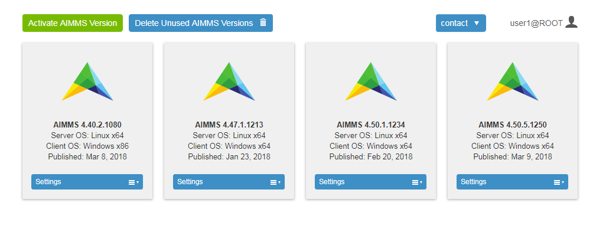
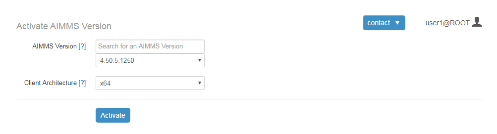

Activate AIMMS Version
======================

As part of every AIMMS release, AIMMS Versions (AIMMS PRO Server packages) will be made available on the AIMMS Cloud Platform. Each AIMMS Versions contains:

* an installation-free AIMMS PRO Client without solvers, which will run the client part of the application on the computer of the end-user, and
* an AIMMS component with all solvers included, to run the server-side optimization sessions.

AIMMS Versions
--------------

Through the AIMMS PRO portal, all users with global administrative privileges and users who are member of the AIMMSPublishers group can activate the AIMMS Versions for their AIMMS Cloud Platform. You can use activated AIMMS Versions to deploy AIMMS applications that are developed and tested using the corresponding AIMMS developer releases.

    
Activate AIMMS Version
----------------------

All released AIMMS Versions are available here. You can choose which  *AIMMS Version* and *Client Architecture* you want to activate for your AIMMS Cloud Platform. 

All activated AIMMS versions are available for deployment of end-user applications to all users from all environments.

Deletion
--------

On the AIMMS Versions section of the AIMMS PRO Portal, you can also delete AIMMS Versions that you don't need anymore. In case the version that you want to delete it still in use by one or more apps, an error message will tell you so, and the version is not deleted.

AIMMS PRO Portal allows you to delete all unused AIMMS Versions in one go by using 'Delete unused AIMMS Version' button. This will check if there are any unused AIMMS Versions and if so then it will delete all such AIMMS versions.

.. note::
 
    AIMMS Cloud Platform supports *AIMMS Version 4.37 or higher*.

