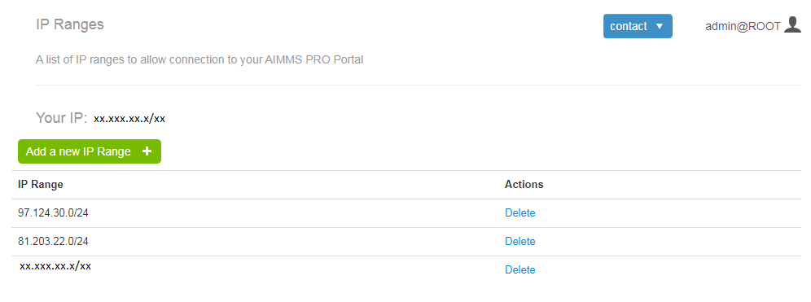
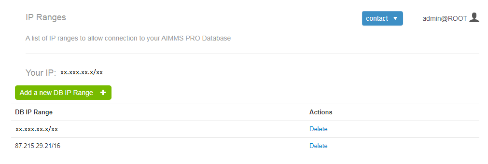

IP Range Blocking
-----------------

This section allows you to add a list of IPs or IP Ranges to allow connection to your AIMMS Cloud Platform.

    
As shown in the above picture, AIMMS PRO Administrator can add IP addresses or subnets from which connection is allowed to your AIMMS Cloud Platform. There are some default rules and validations to add/delete IP Ranges.

* As of now supported masks are: */8, /16, /24, /32*
* It saves first entry only if it is your IP or your IP is in the first saved subnets. You can see your IP from this page, which is displayed on the top of 'Add a new IP Range' Button.
* Once you have added your IP or subnet in which your IP belongs to, you can add other IP addresses or subnets.
* You can delete your IP from the list only if it is the last entry of the list or if you still have one more entry with the subnets to which your IP address belongs to. It does gives validation message i.e. You can't remove this IP Range because you'll lose access to the Portal in such a case. 

Please note that AIMMS Version must be 4.45.1 or higher for WebUI Apps once you have IP Range Blocking enabled on your AIMMS Cloud Platform.
    
DB IP Range Blocking
--------------------

This section allows you to add a list of IPs or IP Ranges which enables you to enhance the security of your AIMMS PRO Application Databses by limiting the access to only specific IP-Ranges.

As shown in the above picture, AIMMS PRO Administrator can add IP addresses or subnets from which connection is allowed to your AIMMS PRO application database. 

