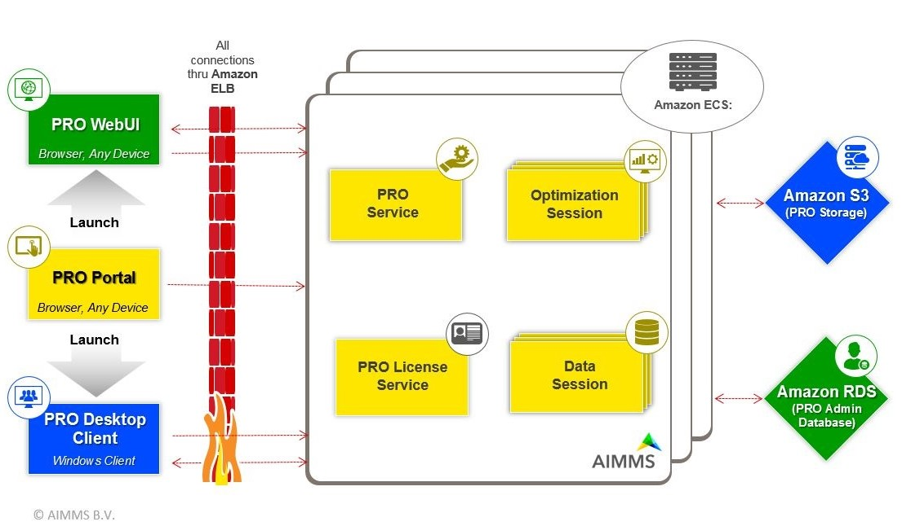

General Architecture
====================

To provide you with a better understanding of what's going on in an AIMMS Cloud Platform setup in terms of communication between the various components, we created the following schema. Please click on it to see a larger version.

* `Overview from left to right <#overview-from-left-to-right>`_
* `Left: the users view <#the-users-view>`_
* `Mid: the provisions given <#the-provisions-given>`_
* `Right: the resources <#the-resources>`_
* `High availability and failover <#high-availability-and-failover>`_

Overview from left to right
---------------------------

This discuss this overview as it corresponds by going from the user view to the realization view.

1.	On the left we have the AIMMS PRO PORTAL in a browser.  Via this portal, a user can logon and subsequently launch either a WebUI data session or a Desktop client session.  
2.	In the middle we have `Amazon ELB <https://aws.amazon.com/elasticloadbalancing/>`_, which provides high availability, automatic scaling, and robust security.
3.	On the right we have the AIMMS PRO Environment consist of 4 components (portal, backend, user sessions and solve sessions) fully managed by AIMMS Cloud Platform which uses `Amazon ECS <https://aws.amazon.com/ec2>`_
4.	On the far right we have 2 Amazon Resources: For AIMMS PRO Storage we use `Amazon S3 <https://aws.amazon.com/s3/>`_ and for AIMMS PRO Administrative database we use `Amazon RDS <https://aws.amazon.com/rds>`_.

The users view
--------------

Let’s zoom in to the left and detail the user requirements met.

The user starts with the PRO portal via a browser such as Chrome or Internet Explorer 8+. At this portal, the following actions are supported:

*	Uploading an AIMMS version. These versions are signed by AIMMS B.V.   
*	Uploading an AIMMS end-user application, a so-called app.  An app is created from within the AIMMS development environment from an AIMMS project by using SSL based encryption of the project.  
*	Launch a desktop application. Here a Windows computer is required.  We support Windows 7 and later. A desktop application runs its own data session. This is still a viable route when only Internet Explorer is available.
*	Launch a WebUI application. Here a Chrome browser is required. Since AIMMS 4.31.1 we also support IE 11 and Microsoft Edge.
*	Finally, the packages, apps, and running jobs are managed via this portal.

The provisions given
--------------------

Let’s zoom in on the middle and detail provisions given:

For the AIMMS Cloud Platform the AIMMS PRO application is divided into smaller components: portal, backend, user sessions and solve sessions, each run in a separate Docker container. These containers can be deployed across multiple virtual servers, thus making the application highly scalable.

AIMMS Cloud Platform uses `AWS Elastic Container Service <https://aws.amazon.com/ec2>`_ to run these Docker containers, enabling rapid scale-up and scale-down by adding or removing virtual servers (AWS EC2s) from this cluster. 

The resources
-------------

Third let’s zoom in to the far right and detail the resources.

The AIMMS Cloud Platform makes use of 2 Amazon resources for storage and admin database:

* `Amazon S3 <https://aws.amazon.com/s3/>`_: The AIMMS packages, the apps, and cases (binary compressed data snapshots) are stored. 
* `Amazon RDS <https://aws.amazon.com/rds>`_:  AIMMS Cloud Platform use this resource to run PRO Admin database which is a PostgreSQL databases where administrative data concerning, users, apps, access rights and so forth are stored.

High availability and failover
------------------------------

The AIMMS Cloud Platform itself is designed for high availability and failover. 

AIMMS Cloud Platform uses AWS Regions to allow our customers to manage network latency and meet regulatory compliance. Data stored in a specific region is not replicated outside that region. Regions are designed withavailability in mind and consist of at least two, often more, Availability Zones. Availability Zones are designed for fault isolation. They are connected to multiple Internet ServiceProviders (ISPs) and different power grids.

AIMMS Cloud Platform uses  `Amazon EC2 <https://aws.amazon.com/ec2>`_ for obtaining computing resources and this service spreads the work across multiple Availability Zones in one Region, reducing the impact of the failure of a single Availability Zone. 

`Amazon EC2 <https://aws.amazon.com/ec2>`_ operates a cluster of virtual servers (EC2s) across which the workload (Docker containers) is spread. Failure of one of the servers will cause the workload (Docker containers) on that server to be re started automatically on another server in the cluster. At worst customers may have to restart their app or solve session in case of server failure. 

