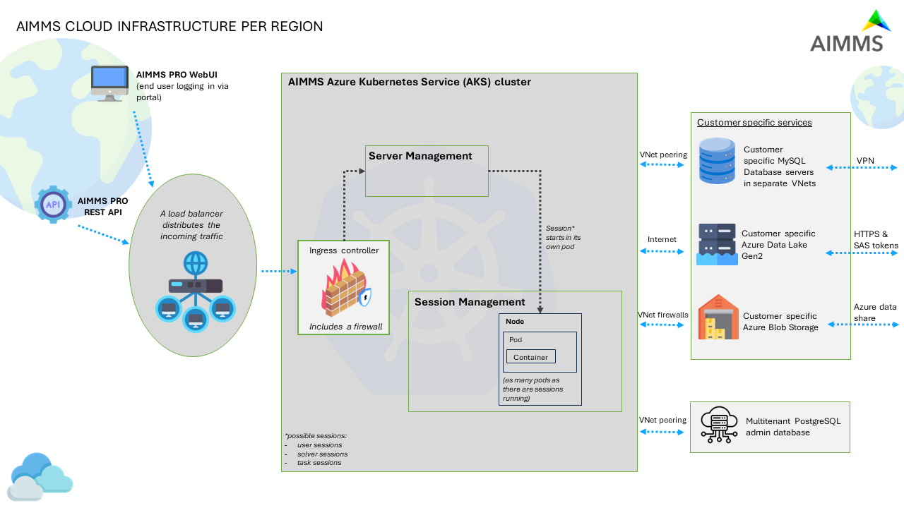

General Architecture
====================

To provide you with a better understanding of what's going on in an AIMMS Cloud Platform setup in terms of communication between the various components, we created the following schema. 

	
[#f1]_ icons attributions in footnotes

* `Overview from left to right <#overview-from-left-to-right>`_
* `Left: the users view <#the-users-view>`_
* `Mid: the AKS cluster <#the-AKS-cluster>`_
* `Right: customer specific services <#customer-specific-services>`_

Overview from left to right
----------------------------

1.	On the left we have the AIMMS PRO PORTAL in a browser.  Via this portal, a user can logon and subsequently launch either a WebUI data session or a Desktop client session. There is also the `AIMMS PRO REST API <https://documentation.aimms.com/cloud/rest-api.html>`_. Any call to this API goes to our AKS cluster.
2.	In the middle we have our `AIMMS Azure Kubernetes Service (AKS) cluster <https://azure.microsoft.com/en-us/products/kubernetes-service>`_, which provides high availability, automatic scaling, and robust security. 
3.	On the right we have the customer specific services; some default, some optional.

The users' view
-----------------

Let’s zoom in to the left and detail the user requirements met.

The user starts with the PRO portal via a browser. When logged in to this portal, the following actions are supported:

*	Uploading an AIMMS version. These versions are signed by AIMMS B.V.   
*	Uploading an AIMMS end-user application, a so-called app.  An app is created from within the AIMMS development environment from an AIMMS project by using SSL based encryption of the project.  
*	Launch a desktop application. Here a Windows computer is required.  We support Windows 7 and later. A desktop application runs its own data session. This is still a viable route when only Internet Explorer is available.
*	Launch a WebUI application. Here a Chrome browser is required. Since AIMMS 4.31.1 we also support IE 11 and Microsoft Edge.
*	Finally, the packages, apps, and running jobs are managed via this portal.

The AKS cluster
--------------------

The AIMMS Cloud Platform runs on an Azure Kubernetes Service (AKS) cluster, designed based on our and our users' needs with functionalities deployed in docker containers. Each session (that is; a user, solver and/or task session) starts in its own pod. We auto-scale nodes whenever needed. 

Customer specific services
----------------------------

Every cloud account is by default equipped with an Azure Data Lake Gen2 Storage account and a customer specific Azure Blob Storage. Optionally we can add `a MySQL database <https://documentation.aimms.com/cloud/db-config.html>`_. We also use a PostgreSQL database for administrating our cloud accounts.

High availability and failover
------------------------------

The AIMMS Cloud Platform itself is designed for high availability and failover. `Find more information about our platform and its (information) security on this page <https://documentation.aimms.com/infosec/cloud-platform-azure.html>`_.

.. rubric:: Footnotes

.. [#f1] `Firewall icon created by smashingstocks - Flaticon <https://www.flaticon.com/free-icons/firewall>`_
	// `Computer, data lake, data warehouse & database icon created by Freepik - Flaticon <https://www.flaticon.com/free-icons/database>`_
	// `Api icon created by berkahicon - Flaticon <https://www.flaticon.com/free-icons/api>`_
	// `Load balancer icons created by Flat Icons - Flaticon <https://www.flaticon.com/free-icons/load-balancer>`_
	// `Server icons created by RaftelDesign - Flaticon <https://www.flaticon.com/free-icons/server>`_

.. spelling:word-list::

    AKS
    end-user
    IE
	MySQL
	PostgreSQL
	docker