AIMMS Cloud Database and VPN configuration
==========================================

.. note::

    This section of the Cloud Platform documentation only applies when your AIMMS Cloud Platform subscription provides you with an application database.

This section describes how to manage and administer the application database and connectivity (through VPN or otherwise) to it.

General Idea
------------
We would like to offer a secure environment to give you access to your application database. In the past we offered DB IP Range filtering on your database, but the database was open to the public via the internet. This is no longer done.

Now the database is only accessible from within an AIMMS session.

If you however need direct access to the application database, we offer two possibilities:

 * *Database Tunnel Application*

   Recommended if you need occasional access to the database (e.g. to inspect some tables, alter the schema, add users, etc.). See `Database Tunnel Application`_ section in this document for more details.
   
 * *VPN (Virtual Private Network) connection*

   Recommended if you need more permanent access, e.g. when you regularly synchronize between an on-premise resource and the application database

The picture below shows the conceptual network topology:

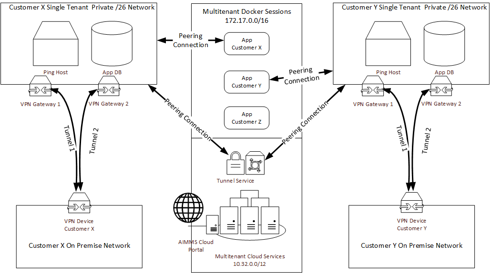

When a VPN connection has been set up, sessions cannot reach anything on premise, because the sessions are configured to only have a route available to their appropriate Customer Single Tenant Private /26 network. 

Similarly, the Tunnel Service and the database tunnel application only allows access to the database of the appropriate customer. Access to that tunnel service is arranged via PRO user/group management.

Initial Database Setup
----------------------
After you receive administrator login credentials for the AIMMS PRO Portal, go to Database Configuration and click the **Create** link to begin setup for the application database.

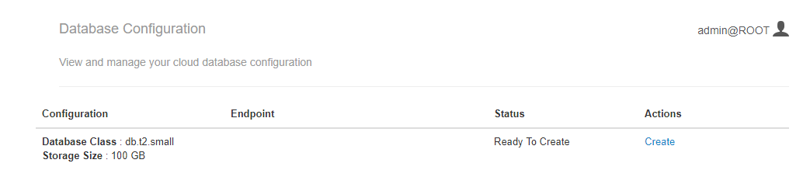
    
Next it will show the following dialog:

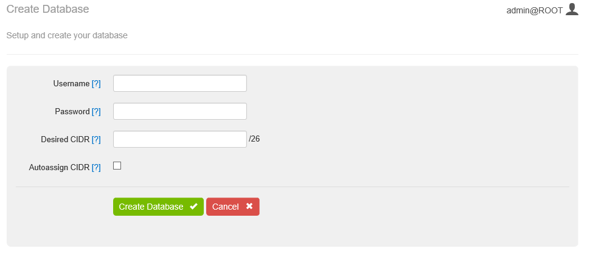

Fill in the username and password for the database administrator who will be accessing the database. Note that password needs to be longer then 8 characters and can be any printable ASCII character except "/", """, or "@". 

Next to that, you can assign an IP address range for the private network that will be created to host the database on the AIMMS Cloud side. You can also choose to automatically assign this range. 

The choice of this IP address range becomes important if you choose to set up a VPN connection to this database. It will always be possible to migrate that database to a different IP range, but that will cost some downtime of the database, and thus some downtime for your applications. See `Migrating the Database`_ and `Adding a VPN Connection`_ sections in this document for more details.

Click **Create Database** and you will be navigated back to the main page. A network will be created to host the database under Networks, as shown below:

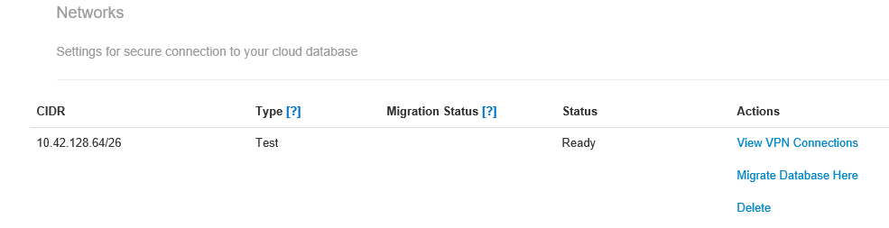

Typically it will take about 20 minutes for the database to be created. When it is done, the status is '*Ready To Use*' and the Endpoint field is set.

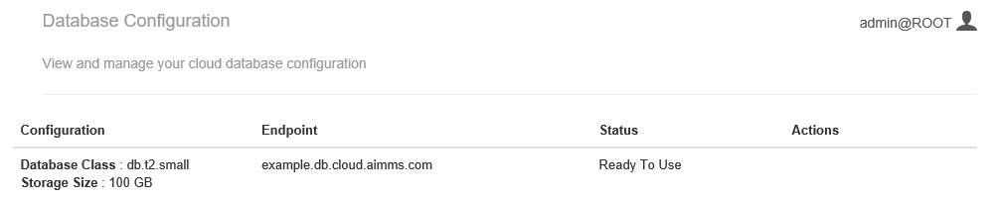

You can reach the database from within an AIMMS session using the Endpoint host name. 
    
Further, the network type has changed to **Production**

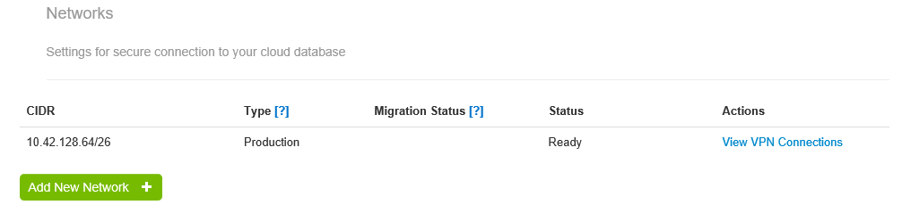

Specifications and Requirements for a VPN Connection
----------------------------------------------------
Before setting up the VPN, be sure you have the following information available. Typically this requires the involvement of your IT department:

 * The AIMMS Cloud db network `CIDR <https://en.wikipedia.org/wiki/Classless_Inter-Domain_Routing>`_ (Classless Inter-Domain Routing) range

   This can be any /26 network range in the any of the private network ranges: 10.0.0.0/8, 172.16.0.0/12 and 192.168.0.0/16, but excluding the 10.32.0.0/12 and 172.17.0.0/16 ranges (which we use for our own services). Furthermore, it cannot have any overlap with any of our other customers' PRO Cloud ranges. This range is specified as the address range of the network. When you submit this range to create a network, we will verify those range conditions.
 * The Customer network `CIDR <https://en.wikipedia.org/wiki/Classless_Inter-Domain_Routing>`_ range

   This can be any network range in any of the private network ranges: 10.0.0.0/8, 172.16.0.0/12 and 192.168.0.0/16, but excluding the 10.32.0.0/12 and 172.17.0.0/16 ranges (which we use for our own services). This range needs to be specified when creating the VPN (see below).
 * The Customer public IP address

   This is the public IP address to reach your VPN appliance. This IP address needs to be specified when creating the VPN (see below).

After setting up the VPN connection in the AIMMS Cloud, you can download a guide to setting up the VPN on your side. This includes two pre-shared-keys (PSKs) to set up the two VPN tunnels. We recommend you to set up two tunnels to ensure availability of your connection. We may do unannounced maintenance on the VPN tunnels, but never on those two tunnels at the same time.

Adding a VPN Connection
-----------------------
You can add new VPN connections to a network by navigating to the **View VPN Connections** on the main database configuration screen for the appropriate network. If the network requires a different CIDR, first create a new network with the appropriate settings.

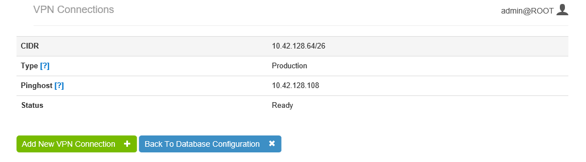

Here you will see more details of the network. After creating the VPN and setting it up locally, you should be able to ping this host with the ``Pinghost`` IP address.

Click **Add New VPN Connection** and the following dialog appears:

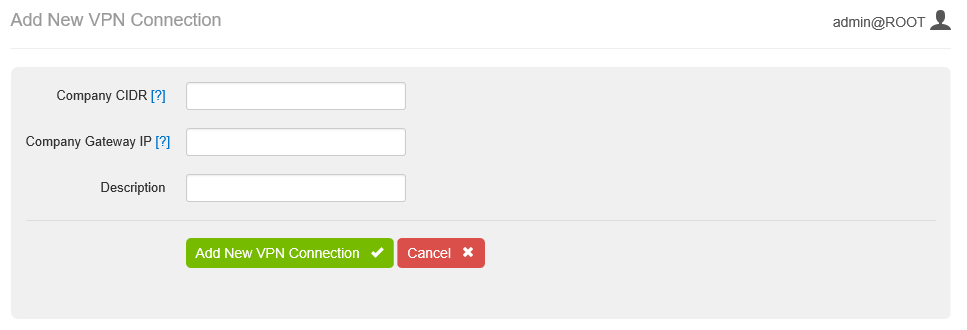

The Company CIDR is the IP range on your private network side, and the Company Gateway IP is the public IP address. Optionally you can add a description to identify this VPN connection, e.g. 'Seattle office'. After creating the new VPN you will be redirected to the VPN Connections/Network details page. Typically this will take about 4-5 minutes.

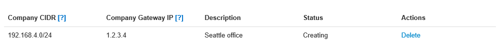

When the VPN connection has been created successfully, you can download a configuration file. 

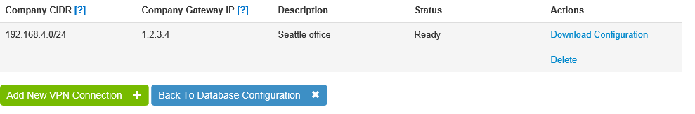

We have several device specialized configurations available. If your device is not on the list, you can choose the Generic configuration file, or contact our customer support for help configuring your specific device.

Setting up a New Network
------------------------
You want to set up a new network for one of two reasons:

 * The IP address range of the current network needs to change because of changed on-premise network conditions.
 * You want to migrate from the prior publicly available database to a database on the private network (potentially using a VPN to access it).

In both situations you end up with a network with Type **Test**. You can migrate your database to this network, after which Type automatically becomes **Production** and the potential prior network (and its VPN connections) will be deleted. Prior to that you might want to add VPN connections to this network and test whether you have set up the VPN correctly by pinging the ``Pinghost``. See also `Adding a VPN Connection`_.

To set up a new network, click **Add New Network** on the main database configuration page. 

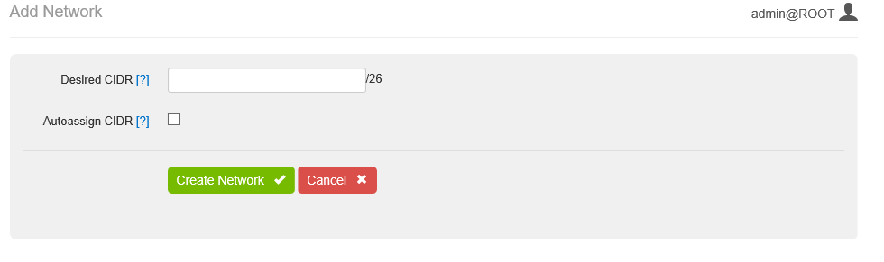

Here you will have the option to either auto assign the network CIDR range or specify it yourself. As mentioned in `Specifications and Requirements for a VPN connection`_ this range can be any /26 network range in the any of the private network ranges: 10.0.0.0/8, 172.16.0.0/12 and 192.168.0.0/16, but excluding the 10.32.0.0/12 and 172.17.0.0/16 ranges (which we use for our own services). Furthermore, it cannot have any overlap with any of our other customers PRO Cloud ranges. This range is specified as the address range of the network. When you submit this range to create a network, we will verify those range conditions.

Creating a new network will take about 3 minutes:

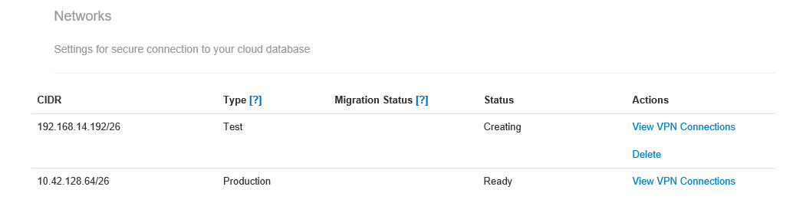

Migrating the Database
----------------------
.. warning::

    Migrating the database will result in a change of the database IP address. Please make sure that all your AIMMS applications and potentially other applications accessing your cloud database use the FQDN specified at the endpoint field before migrating. The migrate mechanism will update the DNS entry to reflect the new IP address.

Before migrating your database, you first need to set up the destination network. See `Setting up a New Network`_ above. Networks with Type **Test** have the action **Migrate Database Here** available. When you click that link you are directed to the Database Migration page. 

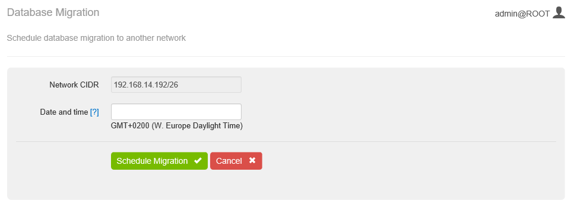

Here you need to enter the date and time to schedule the migration. The migration results in approximately 45 minutes of downtime for access to your database. During this time your AIMMS applications will not be able to access the database and thus are likely to not be functional. The time is specified in your local time zone, according to the browser used to access the AIMMS Cloud Portal. After submitting the date and time for migration you will be directed to the main Database Configuration page. Under **Migration Status** you will see date and time scheduled:

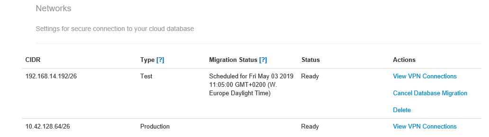

When looking at the Database Configuration page during the scheduled migration time, it will display both networks being in a '*Migration In Progress*' state:

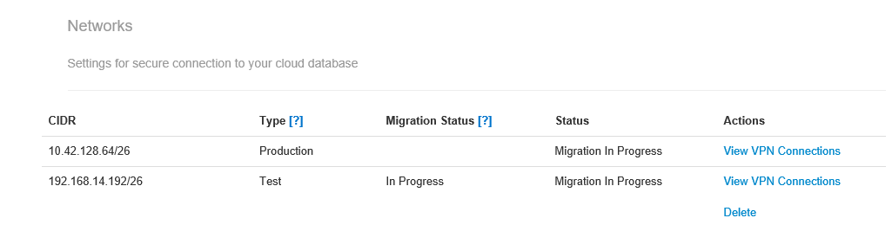

When the migration is finished it will display the migration status as '*Completed*' and the previous production network will have been removed:

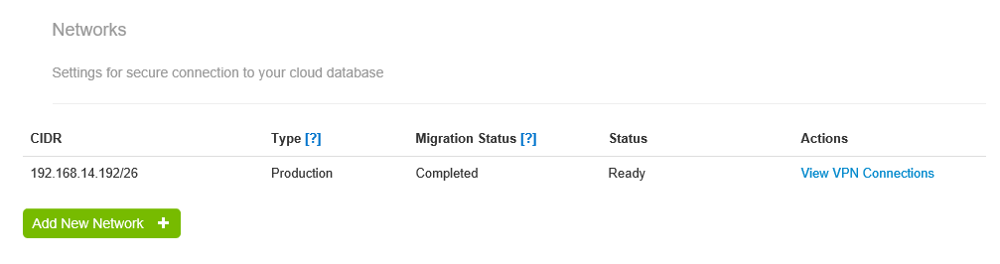
	
Database Tunnel Application
---------------------------
We can provide the simple AIMMS Desktop Application which allows you to open up/close the local connection to the AIMMS Cloud App database. All you need to do is publish this application with AIMMS Version 4.66.2 or higher on your PRO Portal and configure the Tunnel from the `Configuration <https://manual.aimms.com/pro/admin-config-1.html#tunnel>`_ menu. See also `Tunneling Support <https://manual.aimms.com/pro/tunneling.html>`_ for more details on Tunnels.

For example, if your app database is called ``example.db.cloud.aimms.com`` then your Tunnel configuration and DB Tunnel App would be as shown,

.. image:: images/dbtunnelconfig.png
    :align: center
	
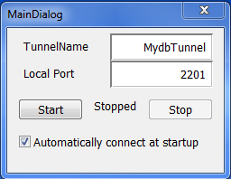
	
Where '*TunnelName*' is URI Context Path and '*Local*' Port can be any port between 1 to 65536. 

You can Start/Stop Tunnel using **Start** and **Stop** buttons. Once you have provided '*TunnelName*' and '*Local Port*', you do not need to click **Start** or **Stop** each time. You can check '*Automatically connect at startup*' parameter, then tunnel can be started automatically upon launching the application. 

When you close the application tunnel will be also closed. You can download DB Tunnel App from `here <https://download.aimms.com/aimms/download/data/PRO/DBTunnel/>`_. 

  

