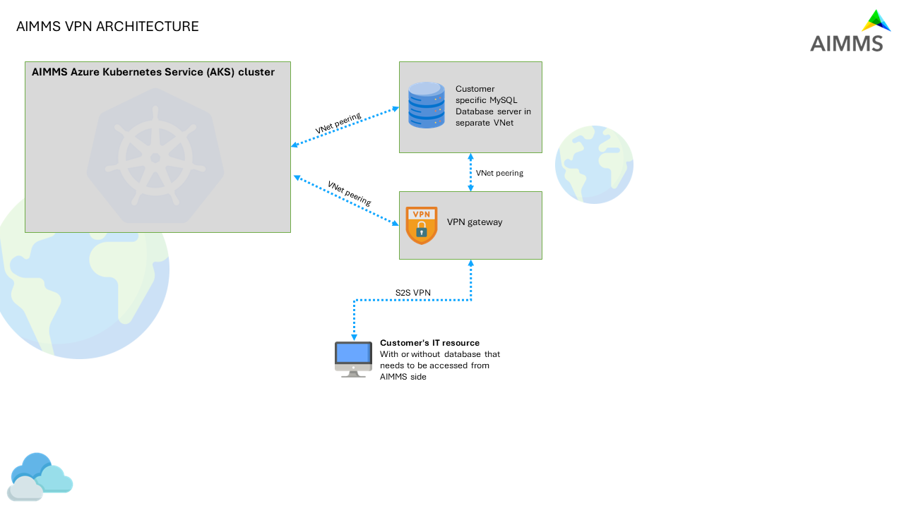

AIMMS Cloud Database and VPN Configuration
==========================================

.. note::

    This article describes one of the many options for data integration with the AIMMS Cloud. A VPN might not be the best solution for your situation. Use our integration helper in the article :doc:`/dataintegration/index` to see which option fits best.

This section describes how to manage and administer the application database and connectivity (through VPN or otherwise) to it.

General Idea
------------
We can attach a MySQL database to any AIMMS Cloud account. This database can be used for storing data - whether this involves input data to be used in AIMMS applications or if it's the results of optimizations. 

The database is only accessible from within an AIMMS session. If you want to access this data from an external source as to push data to it or to retrieve data from it, there are two possibilities:

 * **Database Tunnel Application**

   Recommended if you need occasional access to the database (e.g. to inspect some tables, alter the schema, add users, etc.). See `Database Tunnel Application`_ section in this document for more details.
   
 * **VPN (Virtual Private Network) connection**

   Recommended if you need more permanent access, e.g. when you regularly synchronize between an on-premise resource and the application database. This specific setup is required based on our cloud architecture.

The picture below shows the conceptual network topology:

 

When a VPN connection has been set up, sessions cannot reach anything on premise, because the sessions are configured to only have a route available to their appropriate Customer Single Tenant Private /26 network. 

Similarly, the Tunnel Service and the database tunnel application only allows access to the database of the appropriate customer. Access to that tunnel service is arranged via PRO user/group management.

Initial Database Setup
----------------------
An AIMMS Cloud account does not have a MySQL database by default. If you want one, or would like to understand if your setup already has one, please contact support by sending an email to support@aimms.com. 

Requesting a VPN Connection
----------------------------------------------------
Before setting up the VPN, be sure you have the following information available. Typically this requires the involvement of your IT department:

 * **The Local Address Prefix**
 
   The IP address ranges that will be routed through the VPN gateway to the VPN device (e.g. 10.0.0.0/24)
   
 * **The Local Gateway Public IP**
 
   This should be a valid public IP address of your on-premise device the VPN will need to connect to - as such it must be reachable by Azure.
   
 * **Loadbalancer yes/no**
 
   A loadbalancer is a requirement if you want to have two-way traffic. By default you will only be able to push data to the MySQL database; with a loadbalancer you will create the opportunity to also be able to access an external (on-premise) database from within the AIMMS Cloud.

Requesting the VPN connection can be done by sending an email to support@aimms.com with the above information. 
The default settings are presented below:

.. list-table:: IPsec
   :widths: 50 50
   :header-rows: 0

   * - Encryption algorithm
     - aes-cbc-256
   * - Integrity algorithm
     - 
   * - PFS Group
     - none
   * - SA lifetime (seconds)
     - 3600

.. list-table:: IPsec/IKE parameters
   :widths: 50 50
   :header-rows: 0

   * - IKE version
     - IKEv2
   * - Encryption algorithm
     - aes-cbc-256
   * - Integrity algorithm
     - sha1
   * - Diffie-Hellman group
     - 2
   * - SA lifetime (seconds)
     - 600
   * - UsePolicyBasedTS
     - 
	
But it is possible to deviate from these settings with any of the options presented below:
	
.. list-table:: IKE Phase 1 Encryption (options)
   :widths: 25 25 50
   :header-rows: 1

   * - Encryption
     - Encryption Integrity/PRF
     - DH Group
   * - AES128
     - SHA1
     - DHGroup1
   * - AES192
     - SHA256
     - DHGroup14
   * - AES256
     - SHA384
     - DHGroup2
   * - GCMAES128
     - MD5
     - DHGroup2048
   * - GCMAES256
     - 
     - DHGroup24
   * - 
     - 
     - ECP256
   * - 
     - 
     - ECP384
   * - 
     - 
     - None

.. list-table:: IKE Phase 2 (IPSec) (options)
   :widths: 25 25 50
   :header-rows: 1

   * - IPsec Encryption
     - IPsec Integrity
     - PFS Group
   * - None
     - GCMAES128
     - ECP256
   * - AES128
     - GCMAES192
     - PFS2048
   * - AES192
     - GCMAES256
     - ECP384
   * - AES256
     - MD5
     - None
   * - DES
     - SHA1
     - PFS24
   * - DES3
     - SHA256
     - PFS2
   * - GCMAES128
     - 
     - PFS1
   * - GCMAES192
     - 
     -
   * - GCMAES256
     - 
     -

Other settings are:

 * IPsec SA lifetime in KiloBytes (default = 102400000)
 * IPsec SA lifetime in seconds (default = 27000)
 * DPD timeout in seconds (default = 45)
	
Database Tunnel Application
---------------------------
We have a simple AIMMS Desktop Application available for Windows ('DB Tunnel App') which allows you to open up/close a local connection to the AIMMS Cloud App database. All you need to do is publish this application with **AIMMS Version 4.66.2 or higher** on your PRO Portal and configure the Tunnel from the `Configuration <https://manual.aimms.com/pro/admin-config-1.html#tunnels>`_ menu. See also `Tunneling Support <https://manual.aimms.com/pro/tunneling.html>`_ for more details on Tunnels.

For example, if your app database is called ``example.db.aimms.cloud`` then your Tunnel configuration and DB Tunnel App would be as shown:

.. image:: images/dbtunnelconfig.png
    :align: center

	
.. image:: images/dbtunnelapp_new.png
    :align: center
	
Where '*TunnelName*' is URI Context Path and '*Local Port*' can be any port between **1 to 65536**. 

You can Start/Stop Tunnel using **Start** and **Stop** buttons. Once you have provided '*TunnelName*' and '*Local Port*', you do not need to click **Start** or **Stop** each time. You can check '*Automatically connect at startup*' parameter, after which the tunnel will be started automatically upon launching the application. 

When you close the application, the tunnel will also be closed. You can download the DB Tunnel App from `here <https://download.aimms.com/aimms/download/data/PRO/DBTunnel/>`_. 

We have further enhanced the DB Tunnel App such that it can report errors when it can not start the tunnel. Example scenarios/error messages are:  

	* When the local port is already in use on the same machine by any other application. -- ``pro::tunnel::TunnelStart : while binding to tcp://localhost:3306``
	* When the AIMMS PRO User does not have access to the Tunnel. -- ``pro::tunnel::TunnelStart : Access denied``
	* When the TunnelName is not found. -- ``pro::tunnel::TunnelStart : Tunnel not found``
	
.. image:: images/dbtunnel_error.png
    :align: center
 

Connecting to Cloud DB using MySQL Workbench
---------------------------------------------

Once the tunnel is started, you can connect to the AIMMS Cloud App database locally via MySQL database administrative tool i.e. **MySQL Workbench**. Your connection parameters should be as shown:

.. image:: images/MySQLWorkbench-connect-cloud-DB.png
    :align: center

.. note:: 

	Please make sure that '*Hostname*' is **localhost** and '*Port*' is same as **Local Port** specified in Tunnel App (i.e. in this example it is 2201).

To use tunnels in your AIMMS model, please check 
`model changes for tunneling <https://documentation.aimms.com/pro/tunneling.html#changes-to-aimms-model>`_.

.. spelling:word-list::

    loadbalancer
	aes-cbc-256
	aes
	cbc
	sha
	GCMAES
	ECP
	ipsec
	des
	pfs
	md
	IKE
	