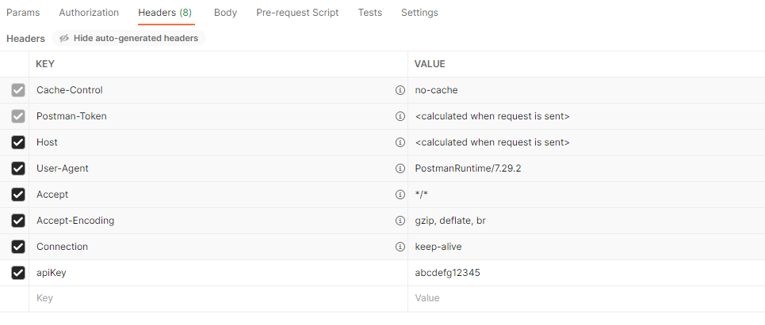

Managing Apps
=============

This REST API Service allows you to Publish, Update and Delete your AIMMS PRO Applications. Please see the following examples and API specs (*Application* section) for the detailed usage.

Setting up Postman for REST API calls for publishing apps
^^^^^^^^^^^^^^^^^^^^^^^^^^^^^^^^^^^^^^^^^^^^^^^^^^^^^^^^^

This is an example on how to use `Postman <https://www.postman.com/>`_ in order
to perform operations an AIMMS applications using the PRO REST API:

1. Start in the Postman request view:

.. image:: images/RequestView.PNG
    :align: center

2. Based on the API method to be tested, select the GET/PATCH/POST/DELETE
command from the drop down menu.

3. The request URL depends on the API spec. In some cases, request parameters are present in the URL.
Examples of the URL:

.. code-block:: php

        https://[account-name].aimms.cloud/pro-api/v1/applications

        https://[account-name].aimms.cloud/pro-api/v1/applications/{projectName}/{projectVersion}

To know what URL should be used, check the corresponding API spec.

4. Within the scope of operations on applications, add an "apikey" header with the api key value.
Note that the header name must correspond to what is defined in the api spec. Make sure to tick the checkbox
after adding the "apikey" field. The rest of the header fields remain unchanged.

Example: Using Postman to Publish an Application (POST)
^^^^^^^^^^^^^^^^^^^^^^^^^^^^^^^^^^^^^^^^^^^^^^^^^^^^^^^

1. When publishing an application it is necessary to provide two fields: ``metadata`` and ``file``.
The field ``metadata`` needs to be provided in json format. The ``file`` field is a file upload that
requires to point to a specific location. Example: ``(C:\Users\UserName\Postman\files)``.
Insert the desired *.aimmspack* in files directory and point to this directory when uploading a ``file``.
Dont forget to select ``form-data`` format. Also note that both ``metadata`` and ``file`` names correspond
to ones defined in the API spec.

.. image:: images/PostView.PNG
    :align: center

The ``metadata`` example is provided below:

.. code-block:: php

        {
            "name": "project7003",
            "description": "my_project",
            "projectVersion": "3.0",
            "aimmsVersionId": "4.84.1.5-linux64-x64-vc141",
            "attributes": {
                "additionalProp1": "prop_1",
                "additionalProp2": "prop_2",
                "additionalProp3": "prop_3",
                "isWebUI": "false",
                "iconUrl": "/icons/my_logo"
            },
            "projectCategory": "cat_1"
        }  

* Starting with **AIMMS PRO 24.2.2** above metadata to publish an application is extended with:

.. code-block:: php

	publishBehavior
	oldProjectName
	oldProjectVersion
		
This allows to publish a new application and also publish a new version of an existing App(update an application). PublishBehavior is either 0 (new publish), 1 (keep old version), 2 (hide old version).

Example: Using Postman to Update an Application (PATCH)
^^^^^^^^^^^^^^^^^^^^^^^^^^^^^^^^^^^^^^^^^^^^^^^^^^^^^^^

1. When updating an application, it is necessary to provide the body in JSON. Do not forget to select
the "raw" format.

.. image:: images/PatchView.PNG
    :align: center

2. For an application update, the following arguments can be used (if an argument is not provided, then it wont be changed):

* **Project description** ("description")

* **Project category** ("projectCategory")

* **Latest app tag** ("isLatest"): latest app tag cannot be explicitly disabled for the selected app. When assigning the latest tag to an app ("isLatest": true), it will be automatically removed from all other app with the same name. 

* **Project attributes** ("attributes"): project attributes represent a list of key-value pairs that allow to store additional information about the project. There are two reserved keywords: 

   1) "isWebUI" key shows if a project is a web UI ("isWebUI": "true") or a win UI project ("isWebUI": "false")

   2) "iconUrl" key points to the location of the application icon to uploaded. Note that "/icons/" is a fixed path prefix and that the app icon must first be uploaded to the PRO storage under a given label (e.g. "my_logo"). Once the icon is placed in the PRO storage, it can be used for app publishing. 

* **Project authorizations** ("authorizations"): project authorizations represent a list of entries, where each entry consists of three fields. See an example of an authorization entry below:

.. code-block:: php

        {
            "authorization": 1,
            "deny": false,
            "entity": 16777095
        }

The "entity" field is a unique ID of either environment, group or user which can be retrieved using the authentication rest API. The "authorization" value varies from 1 to 7 is directly related to read ("authorization": 4), write ("authorization": 2) and execute ("authorization": 1) access. In order to enable multiple authorizations, add up the respective numbers. For example, ""authorization": 5" corresponds to read and execute access. The "deny" field is "true" or "false" when authorization is not, or is permitted.
It is also possible to grant the read permission and restrict the write permission for the same entity ID. This would look like the following:

.. code-block:: php

        {
            "authorization": 4,
            "deny": false,
            "entity": 16777095
        }

        {
            "authorization": 2,
            "deny": true,
            "entity": 16777095
        }

In order to completely remove permissions from an app, assign permissions to an empty list. This can be done as follows:

.. code-block:: php

        "authorizations": []
		
Setting Resource Profiles at Application level
^^^^^^^^^^^^^^^^^^^^^^^^^^^^^^^^^^^^^^^^^^^^^^

The resource profile feature allows us to manage and apply resource limits (e.g. CPU and memory limits of Solver and Data sessions) at the application level. Resource limits can be applied at Account level or Application level.

* **Account Level Limits**: These limits can be specified at the account level through our Cloud Account Management Tool.
* **Application Level Limits**: Our data model and services already support resource limits at the application level. These limits override the account-level values. Instead of manually entering these values, they are defined in terms of predefined resource profiles.

**Resource Profiles**: Resource profiles are predefined configurations specifying all supported resource limits, such as CPU and memory limits. Each profile is assigned a unique name and is stored globally in PRO Database.

**Usage**: When publishing or editing an app via the REST API, a resource profile can be selected, and the resource limits defined in the selected profile will be applied to the app.

	* ``GET /pro-api/v1/customization/resource-profiles`` - retrieves the list of profiles. 
	* ``PATCH /pro-api/v1/applications/{projectName}/{projectVersion}`` - now has an additional parameter called "resourceProfile". 
	* ``POST /pro-api/v1/applications`` - now accept a new JSON metadata field called "resourceProfile".
	 
**Special Profiles**:
	* "<account>": Indicates that the app should use the account-level resource limits.
	* "<unknown>": Indicates that the app has custom resource limits not tied to any profile. This is the default profile. When editing an app with the "<unknown>" profile, the service will retain the existing resource limits without modifying them. This is designed to ensure the UI can display the correct profile name and send it back to the service if necessary.
	
Currently, resource profiles can only be set for an app through the REST API. In the future, we plan to extend this functionality to Portal 3's Publish and Edit App UI, making it more user-friendly.
 
