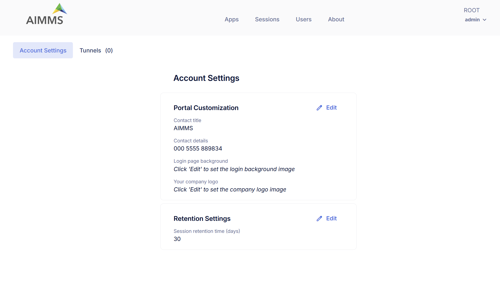

Configuration
=============

Configuration lets administrators manage Account level settings and configure tunnels.

Account Settings
----------------

The Account Settings page allows administrators to manage portal appearance, retention settings for sessions and MFA enforcement.

Portal Customization
^^^^^^^^^^^^^^^^^^^^

These settings allows you to customize your AIMMS PRO Portal where you can upload Image for Login page and your Company logo. You can also specify in-house support contact details which will be displayed on all Portal Pages. (see below).

You need to specify following fields:

* Contact Title - The title for the support contact block (plain text).
* Contact Text - The text for the support contact block. This can contain any HTML.
* Login Page Background - Background Image for the left-hand side of the login screen (JPEG, PNG or GIF). Image width should be between 640 and 2500 and image height should be between 800 and 2500.
* Your Company Logo - Logo for all portal pages except login page (JPEG, PNG or GIF). Image width should be between 10 and 120 and image height should be between 10 and 80. 

Retention Settings
^^^^^^^^^^^^^^^^^^

This section allows you to set retention time (in days) after which a sessions (WebUI and Solve sessions) will be removed from the list. Default retention time is 30 days.

Multi-Factor Authentication (MFA)
^^^^^^^^^^^^^^^^^^^^^^^^^^^^^^^^^

Multi-Factor Authentication (MFA) enhances account security by requiring a second verification factor during sign-in. MFA can be configured either by individual users or enforced at the account level by an administrator for all users within the same AIMMS Cloud account.

**Admin Configuration**

Administrators can manage MFA enforcement through the Account Settings page under the Configuration. Admin can choose one of the following options:

* Optional for everyone – Users can decide individually whether to enable MFA.
* Required for everyone - MFA is enforced for all users in the cloud account.

When an administrator enforces MFA for a cloud account:

* All users in that account are required to set up MFA upon their next login.
* The Security section under each user's User Settings will display a message indicating that MFA is required by the administrator.
* Users cannot disable MFA while enforcement is active. The Disable MFA option will be unavailable.
* Users can reset their own MFA, if they lose access to their authenticator device.

Tunnels
-------

AIMMS PRO allows the AIMMS PRO Client to connect to the AIMMS license server and the AIMMS PRO backend via a websockets proxy running on the web port of PRO (the only port that needs to be opened in case PRO is running behind a firewall, by default 8080). By using the PRO Configurator to enable the tunneling functionality, any port and host reachable by PRO (but not by the client) can be made available via the websockets proxy.

