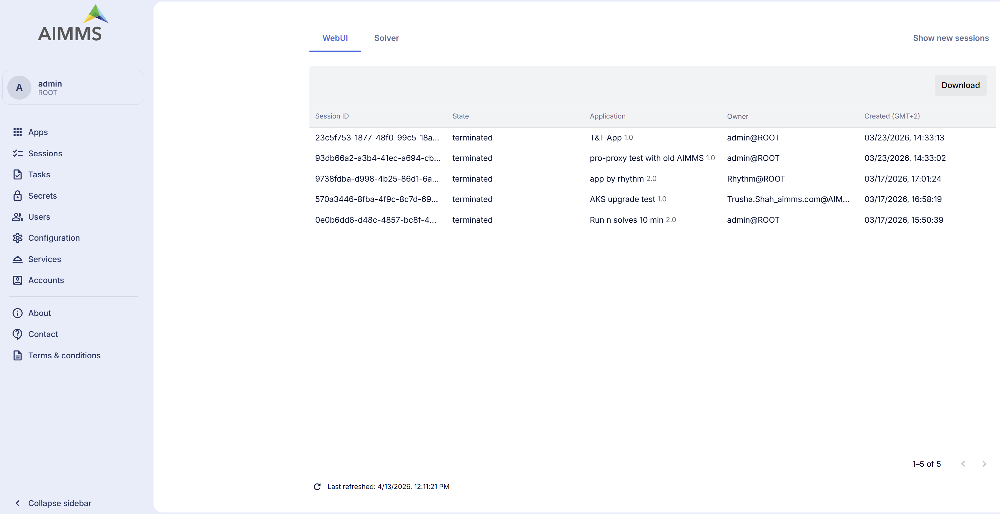
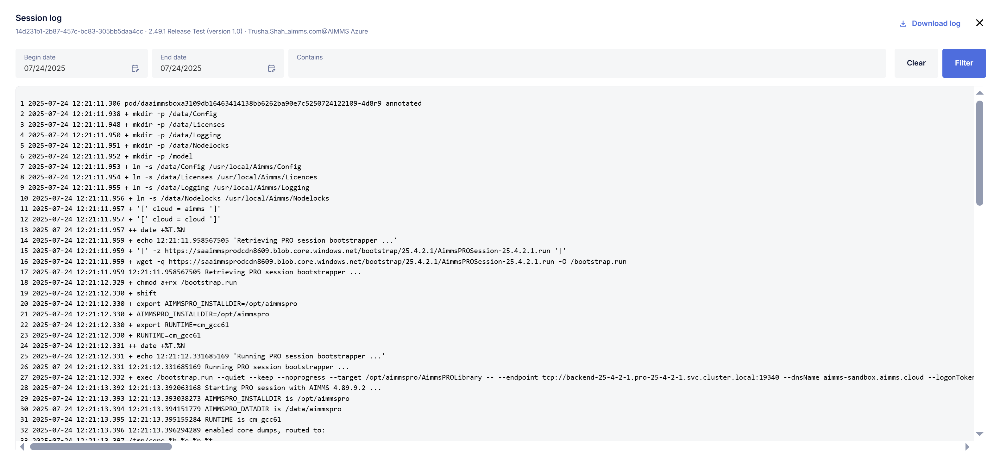
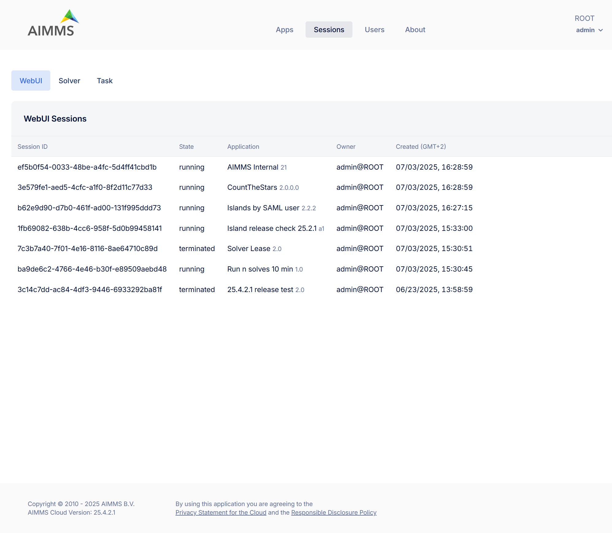
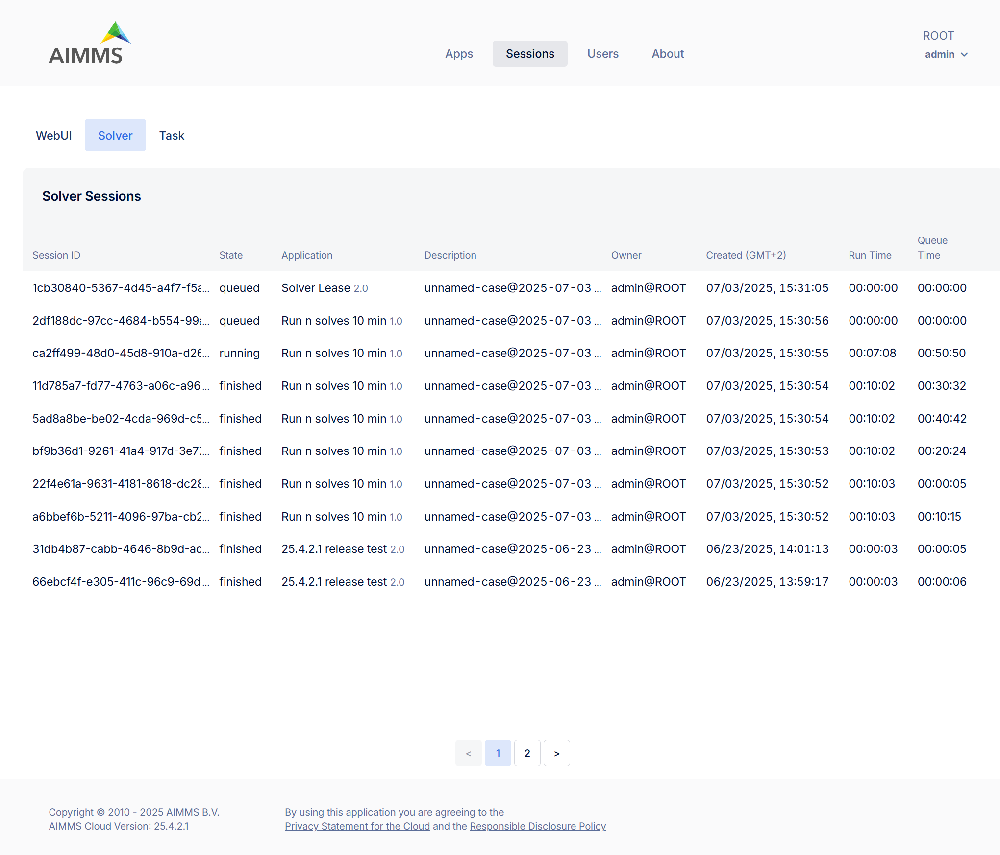

Legacy Sessions
===============

The WebUI and Solve sessions recorded before the new Sessions page was introduced can be found under Legacy Sessions. Task sessions are listed on a separate page, Tasks.

If you are an administrator, you will not only see your own sessions but also all sessions created by other users.

Tabs Overview
^^^^^^^^^^^^^

**WebUI**: View and manage sessions involving the the use of AIMMS WebUI applications.

**Solver**: View and manage sessions related to solver activities (e.g., optimization sessions).

Usage
^^^^^

Terminating Active Sessions
---------------------------

You can terminate active sessions that are still running, either because they are taking too long or are no longer needed.

Inspecting Sessions
-------------------

Terminated, failed, or completed sessions remain visible in the portal. This allows you to review session history, understand usage patterns, or investigate issues through associated logs.

In addition to reviewing session details, you now have access to two new options in the session context menu:

**Session log**: Opens a detailed log of activities that occurred during the session. This is useful for troubleshooting errors, tracking execution steps, and understanding session behavior. Within the session log view, you also have the option to Download log, allowing you to save the log content for offline analysis or sharing with others.

**App stats**: Display various performance metrics for an app related to WebUI, Solver and Task session executions, such as launch time, queuetime and runtime duration, and active count (if applicable). For more details on App stats, please visit the detailed `documentation <https://documentation.aimms.com/cloud/newportal-stats.html>`__ 

These options enhance your ability to analyze individual sessions more effectively.

Deleting Sessions
-----------------

Once you have reviewed a session’s outcome or no longer need the information, you can delete it by yourself or they will be automatically deleted after a certain period. By default, sessions older than 30 days are automatically removed. 

To change this setting:

	* Go to Configuration > Retention Settings
	* Adjust the Session retention time to your preferred duration. 

.. note::

	* Retention settings are applied to WebUI and Solver sessions.
	* Deletion is only possible for terminated/finished/completed sessions.
	
Filtering & Sorting Sessions
----------------------------

The **Sessions** page provides filtering and sorting tools to help you quickly locate the sessions you need.

**Sorting Sessions**

1. Open the column menu by clicking on the filter/sort icon next to a column header.
2. Under **Sorting**, choose one of the options: No sorting, Ascending, Descending.
3. Click **Apply** to update the table.

.. note::

	Sorting can only be applied on **one column at a time**. If you apply sorting on another column, the previous sorting is automatically cleared.

**Filtering Sessions**

1. Open the column menu by clicking on the filter/sort icon next to a column header.
2. Under **Filter**, enter or select a value for that column. For example, you can filter by Session ID, State, Application Name/Version, or created(date/time).
3. Multiple filters can be applied across different columns at the same time.
4. Use **Clear all** to remove filters for that column.

**Exporting Session Data**

You can now export the session data displayed on the Sessions page for offline analysis or reporting. The **Export Table** option is available under the three-dot menu(⋮) on each tab of the Sessions page. The session data will be downloaded as a CSV file containing all columns.
	
WebUI Sessions
^^^^^^^^^^^^^^

The WebUI Sessions tab displays a table listing all sessions initiated by users. Each row contains the following information:

.. csv-table:: 
   :header: "Column", "Description"
   :widths: 40, 40

	Session ID , Unique identifier assigned to the session.                                                    
	State , "Status of the session (e.g., terminated)"                
	Application , Name and version of the application associated with the session. 
	Owner , The user who initiated the session.
	Created (GMT+2) , Timestamp indicating when the session was started.
	

	
**Manage WebUI Sessions**:

To manage individual sessions, right-click a session row to open the context menu with the following options:
 
	* Session log (*disabled for queued sessions*): View or download detailed logs of the session’s activity.
	* App stats: View performance metrics for the WebUI session.
	* Terminate (*disabled for already terminated sessions*): Ends an active session.
	* Delete: Permanently removes the session record from the list.
	
Solver Sessions
^^^^^^^^^^^^^^^

The Solver Sessions tab provides insight into all computational solver sessions triggered by users or applications. Each row contains the following information:

.. csv-table:: 
   :header: "Column", "Description"
   :widths: 40, 40

	Session ID , Unique identifier assigned to the session.                                                    
	State , "Status of the session (typically finished)"                
	Application , Name and version of the application associated with the session. 
	Descrption , Typically includes case or scenario details passed during execution.
	Owner , The user who initiated the session.
	Created (GMT+2) , Timestamp indicating when the session was created.
	Run Time , Total time the model was solving.
	Queue Time , Time the session spent in the execution queue before starting.
	

	
**Manage Solver Sessions**:

To manage individual sessions, right-click a session row to open the context menu with the following options:
 
	* Session log (*disabled for queued sessions*): View or download detailed logs of the session’s activity.
	* App stats: View performance metrics for the Solver session.
	* Terminate (*disabled for already terminated sessions*): Ends an active session.
	* Delete: Permanently removes the session record from the list.
	
Task Sessions
^^^^^^^^^^^^^

Task sessions are available on the dedicated :doc:`newportal-tasks` page.
	