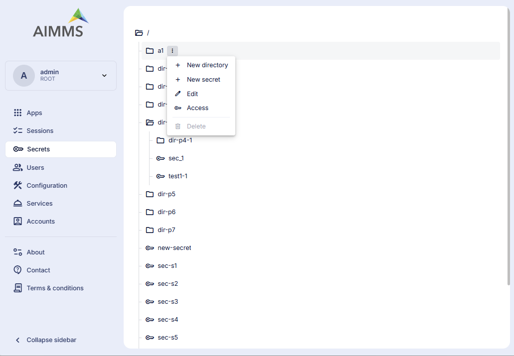

Secrets
=======

The Secrets page provides a centralized interface to manage directories and secrets within the AIMMS PRO environment. It allows authorized users to securely organize, store, and control access to sensitive information required by applications.

Overview
^^^^^^^^

The right-hand side of the page displays a tree view representing the hierarchical structure of directories and secrets, 

**Directories**: Directories are shown with a folder icon and can contain,

	* Subdirectories
	* Secrets
	
**Secrets**: Secrets are shown with a key icon and represent stored sensitive values.

The **root directory** (/) is displayed at the top of the tree.

Directories can be expanded or collapsed to navigate through the hierarchy.

Managing Directories and Secrets
^^^^^^^^^^^^^^^^^^^^^^^^^^^^^^^^

Depending on your access permissions, you can perform the following actions:

	* Browse directories and secrets
	* Create new directories
	* Create new secrets
	* Modify existing secrets
	* Delete secrets or empty directories

All actions are performed within the context of the selected directory or secret.

Access and Permissions
^^^^^^^^^^^^^^^^^^^^^^

	* By default, the root directory (/) is available only to **Admin users**.
	* Non-admin users will not see any items unless access is explicitly granted.
	* Access is managed per directory or secret and is enforced strictly on the selected item.
	
Only **Admin users** can:

	* Grant access to users or groups
	* Modify or revoke existing access permissions
	* Manage access for any item
	
**Managing Access**

	* Item access can be configured at either the **group level** or the **user level**.
	* When an item is created, it inherits access permissions from its parent directory. (Note: Parent permissions are used only at creation time and do not grant implicit access afterward)
	* Access is always evaluated on the resource itself, not on parent directories.
	
**Access Types**

*Directories*
	* read - Allows listing items under the directory only
	* read_write — Allows listing items, creating new items under the directory, and deleting empty directories
	
*Secrets*
	* read — Allows reading the secret content only
	* read_write — Allows reading, modifying, and deleting the secret
	

	