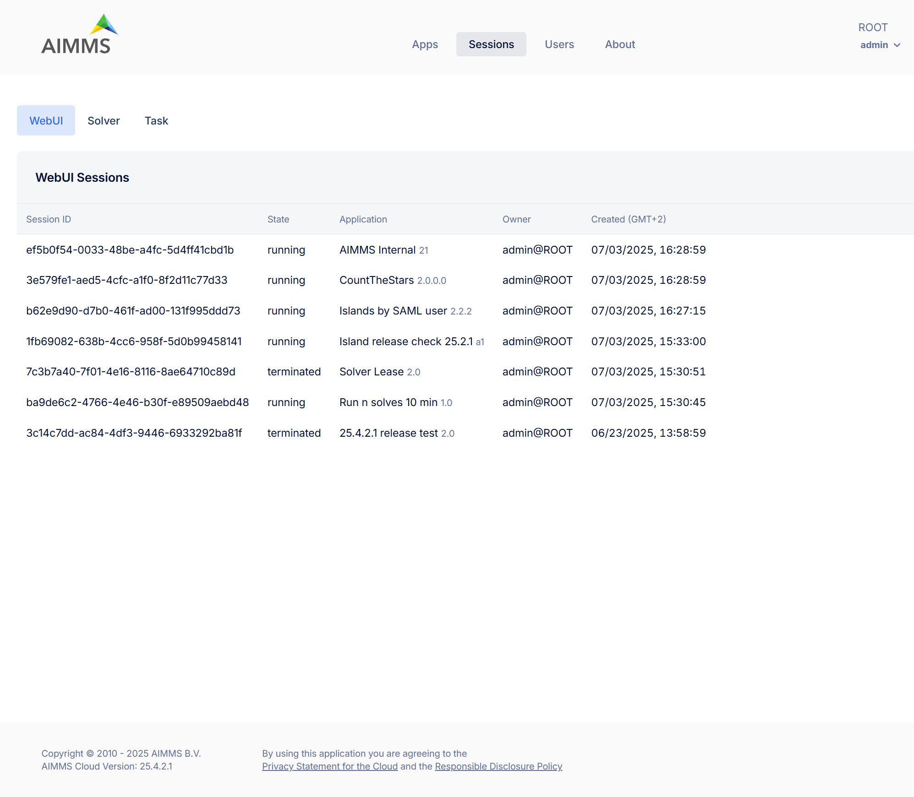
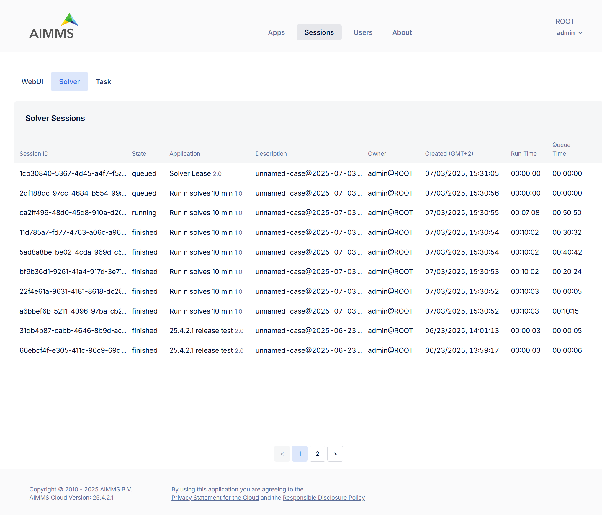
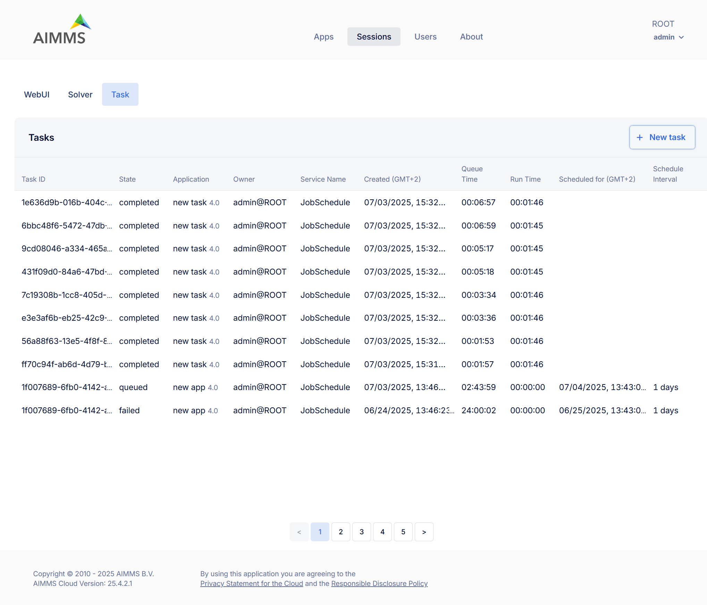
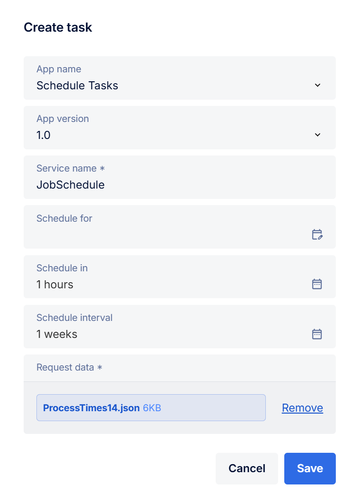

Sessions
========

The Sessions page of the portal provides an overview and management interface for all your active and historical sessions initiated on your AIMMS Cloud Platform across three tabs: WebUI, Solver, and Task. These tabs provide insights into past and current sessions initiated via the cloud environment.

If you are an administrator, you will not only see your own sessions but also all sessions created by other users.

Tabs Overview
^^^^^^^^^^^^^

WebUI: View and manage sessions involving the the use of AIMMS WebUI applications.

Solver: View and manage sessions related to solver activities (e.g., optimization sessions).

Task: View, manage and create tasks.

Usage
^^^^^

Terminating Active Sessions
---------------------------

You can terminate active sessions that are still running, either because they are taking too long or are no longer needed.

Inspecting Sessions
-------------------

Terminated, failed, or completed sessions remain visible in the portal. This allows you to review session history, understand usage patterns, or investigate issues through associated logs.

Deleting Sessions
-----------------

Once you have reviewed a session’s outcome or no longer need the information, you can delete it by yourself or they will be automatically deleted after a certain period. By default, sessions older than 30 days are automatically removed. 

To change this setting:
* Go to Configuration > Retention Settings
* Adjust the Session retention time to your preferred duration. 

.. note::

	* Retention settings are applied to WebUI and Solver sessions.
	* Deletion is only possible for terminated/finished/completed sessions.
	
WebUI Sessions
^^^^^^^^^^^^^^

The WebUI Sessions tab displays a table listing all sessions initiated by users. Each row contains the following information:

.. csv-table:: 
   :header: "Column", "Description"
   :widths: 40, 40

	Session ID , Unique identifier assigned to the session.                                                    
	State , "Status of the session (e.g., terminated)"                
	Application , Name and version of the application associated with the session. 
	Owner , The user who initiated the session.
	Created (GMT+2) , Timestamp indicating when the session was started.
	

	
**Manage WebUI Sessions**:

To manage individual sessions open the Action Menu i.e. three-dot menu (⋮) at the end of a session row to access session options,
 
	* Terminate: (Disabled for already terminated sessions) Ends an active session.
	* Delete: Permanently removes the session record from the list.
	
Solver Sessions
^^^^^^^^^^^^^^^

The Solver Sessions tab provides insight into all computational solver sessions triggered by users or applications. Each row contains the following information:

.. csv-table:: 
   :header: "Column", "Description"
   :widths: 40, 40

	Session ID , Unique identifier assigned to the session.                                                    
	State , "Status of the session (typically finished)"                
	Application , Name and version of the application associated with the session. 
	Descrption , Typically includes case or scenario details passed during execution.
	Owner , The user who initiated the session.
	Created (GMT+2) , Timestamp indicating when the session was created.
	Run Time , Total time the model was solving.
	Queue Time , Time the session spent in the execution queue before starting.
	

	
**Manage Solver Sessions**:

To manage individual sessions open the Action Menu i.e. three-dot menu (⋮) at the end of a session row to access session options,
 
	* Terminate: (Disabled for already terminated sessions) Ends an active session.
	* Delete: Permanently removes the session record from the list.
	
Task Sessions
^^^^^^^^^^^^^

The Task tab shows scheduled or background `tasks <https://documentation.aimms.com/cloud/tasks.html>`_ configured within the AIMMS app. Each task entry includes following information:

.. csv-table:: 
   :header: "Column", "Description"
   :widths: 40, 40

	Task ID , Unique identifier assigned to the task.                                                    
	State , "Status of the task (typically completed or failed)"                
	Application , Name and version of the application from which the task was launched.
	Owner , The user who initiated the task.
	Service Name , "The internal task service used (e.g., JobSchedule)"
	Created (GMT+2) , Timestamp indicating when the task was created.
	Queue Time , Time the task spent in the execution queue before starting.
	Run Time , Total time the model was solving.
	Scheduled for (GMT+2) , If scheduled this shows the future time the task is planned to run.
	Schedule Interval , "If recurring this field shows the repeat interval (e.g., daily, hourly)"
	

**Manage Task Sessions**:

Each task listed in the Tasks tab includes a three-dot menu on the far right, offering the following actions:

	* Download response data: Allows you to download the output or results generated by the completed task. This includes any response files or solution data returned by the model.
	* Interrupt solve: (Available only while a task is still running) Stops the solve process of the task while allowing the rest of the task execution (e.g., post-solve steps) to proceed. Useful if you want to stop the optimization early. Task status will be 'completed'. (This option is disabled for completed tasks.)
	* Interrupt execution: (Also only available for running tasks) Immediately stops the entire task, interrupting the task execution itself outside of the solve. Task status will be 'failed'(Also disabled for completed tasks.)
	* Delete: Removes the task and its associated data (input/output/logs) from the portal. Use this to keep your task list clean once you've inspected the results.
	
**Create Task**:

The Task Sessions tab also allows you to create/schedule tasks by clicking the “+ New task” button, you can define a task that will be executed immediately, at a future time, or on a recurring basis.

	
When creating a task, you are prompted to fill in several fields that define the application, timing, and data for the task. Here is what each field means:

.. csv-table:: 
   :header: "Column", "Description"
   :widths: 40, 60

	App name , Dropdown to select the AIMMS application you want to schedule as a task. This list displays all applications you have access to.                                 
	App version , "Select which version of the app to use. Typically, this will be the latest (e.g., 2.0 <latest>), but older versions may be available."                
	Service name (required) , Enter the name of the service that should handle this task.
	Schedule for , "(Optional) it indicates the time point a task should run after it. The task will not start until after the time point is passed."
	Schedule in , "(Optional) indicates the interval a task should run after. The task will not start until after the interval is passed."
	Schedule interval , "(Optional) indicates that the task should be repeated in the given intervals. For example, if it is set to 1 day, the task will be scheduled for the next day after the initial schedule. These recurring tasks are indexed within the group starting from zero. The first task with *scheduleInterval* will have *groupIndex=0* and subsequent runs will have the next groupIndexes in order. To stop the automated scheduling, the last scheduled task should be deleted."
	Request data , (required)	Upload the input file that contains input data for the task. This is mandatory to tell the task what data to use.
	
Batch Operations
----------------
The Terminate and Delete buttons at the top right of the session list on WebUI and Solver tab allow you to perform batch operations on multiple selected sessions. For Tasks tab only Delete is available.
	