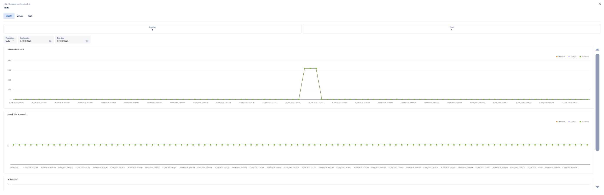

App Stats (Application Statistics)
==================================

The Stats page provides a graphical representation of various performance metrics related to WebUI, Solver and Task session executions. It is primarily used for monitoring execution trends, performance statistics, and historical activity over a selectable time period. Both from the Apps and the Sessions page of the PRO portal, you can retrieve statistics about the end-user applications that you are working with.

Tabs
----

WebUI / Solver / Task:
 
Select the context for which you want to view statistics,

* When the Stats page is opened from the Apps page, it defaults to the WebUI tab.
* When opened from the Sessions page, it automatically opens the tab that corresponds to the selected session (e.g., WebUI, Solver, or Task).

This ensures that the stats view aligns with the user's navigation path for a more intuitive experience.

Filters and Controls
--------------------

**Running / Total Counters (Top Right)**:

* Running: Number of WebUI sessions currently in progress.
* Total: Total number of sessions executed in the selected date range.

**Resolution**:

* Choose how data should be grouped (auto, hour, day, week, or month).
* This helps in analyzing trends over time at different granularities.

**Begin Date / End Date**:

* Select the time window for which the data should be retrieved.
* Only executions that occurred within this date range will be shown on the graph.

**User Filter(Admin only)**:

* Available only to Admin users.
* Select a specific user or choose <all users> to view combined data.

Performance Graphs
------------------

**Run Time in Seconds**:

* Tracks how long each session takes to complete.
* Helps identify performance spikes or slowdowns over time.

**Launch Time in Seconds**:

* Available for WebUI and Solver sessions.
* Measures the time taken for a session to launch.
* Useful for identifying delays during session startup.

**Queue Time in Seconds**:

* Available for Solver and Task sessions.
* Measures the time taken for a session to launch.
* Useful for identifying delays during session startup.

**Active Count**:

* Shows the number of sessions active at each time point.
* Indicates periods of peak or low usage.

.. note::

	If no matching sessions are found for the selected filters, graphs may appear flat or empty.
