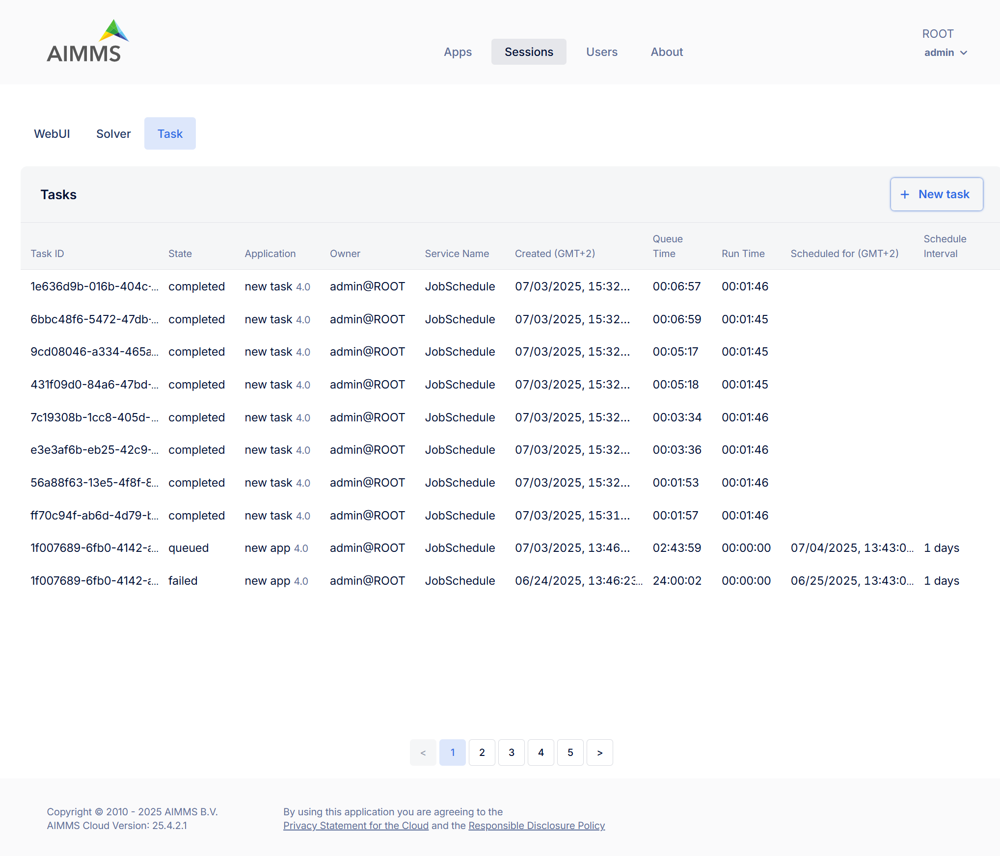
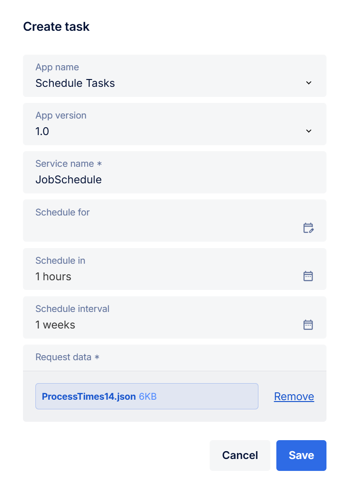

Tasks
=====

The Tasks page shows scheduled or background `tasks <https://documentation.aimms.com/cloud/tasks.html>`_ configured within the AIMMS app. Each task entry includes the following information:

.. csv-table::
   :header: "Column", "Description"
   :widths: 40, 40

	Task ID , Unique identifier assigned to the task.
	State , "Status of the task (typically completed or failed)"
	Application , Name and version of the application from which the task was launched.
	Owner , The user who initiated the task.
	Service Name , "The internal task service used (e.g., JobSchedule)"
	Created (GMT+2) , Timestamp indicating when the task was created.
	Queue Time , Time the task spent in the execution queue before starting.
	Run Time , Total time the model was solving.
	Scheduled for (GMT+2) , If scheduled this shows the future time the task is planned to run.
	Schedule Interval , "If recurring this field shows the repeat interval (e.g., daily, hourly)"

Manage Task Sessions
--------------------

Each task listed in the Tasks page includes a context menu when you right-click any row, offering the following actions:

	* Download response data: Allows you to download the output or results generated by the completed task. This includes any response files or solution data returned by the model.
	* Session log (*disabled for queued sessions*): View or download detailed logs of the session's activity.
	* Interrupt solve (*available only while a task is still running*): Stops the solve process of the task while allowing the rest of the task execution (e.g., post-solve steps) to proceed. Useful if you want to stop the optimization early. Task status will be 'completed'. (This option is disabled for completed tasks.)
	* Interrupt execution (*also only available for running tasks*): Immediately stops the entire task, interrupting the task execution itself outside of the solve. Task status will be 'failed'. (Also disabled for completed tasks.)
	* Delete: Removes the task and its associated data (input/output/logs) from the portal. Use this to keep your task list clean once you've inspected the results.

Create Task
-----------

Click the **+ New task** button to create or schedule a task that will be executed immediately, at a future time, or on a recurring basis.

When creating a task, fill in the following fields:

.. csv-table::
   :header: "Field", "Description"
   :widths: 40, 60

	App name , Dropdown to select the AIMMS application you want to schedule as a task. This list displays all applications you have access to.
	App version , "Select which version of the app to use. Typically this will be the latest (e.g., 2.0 <latest>), but older versions may be available."
	Service name (required) , Enter the name of the service that should handle this task.
	Schedule for , "(Optional) The time point after which the task should run. The task will not start until this time has passed."
	Schedule in , "(Optional) The interval after which the task should run. The task will not start until this interval has passed."
	Schedule interval , "(Optional) Repeat interval for recurring tasks. For example, if set to 1 day, the task will be scheduled again the next day after each run. Recurring tasks are indexed within the group starting from zero. To stop automated scheduling, delete the last scheduled task."
	Request data (required) , Upload the input file that contains input data for the task.

Batch Operations
----------------

The **Interrupt solve**, **Interrupt execution**, and **Delete** buttons appear at the top right of the task list when multiple tasks are selected, allowing you to perform batch operations.
