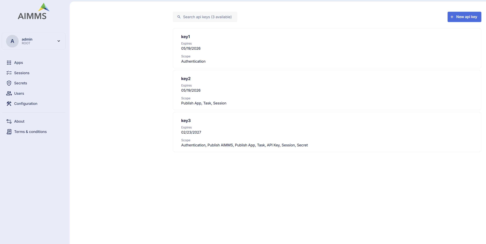

User API Keys
=============

Requests made to the AIMMS PRO REST API are authenticated and authorized using API Keys. The **User API Keys** page is now a dedicated section in the Cloud Portal, providing a centralized place to manage all your API keys for programmatic access.

.. note::

	API Key management has been moved to a dedicated service, laying the foundation for more user-related features and improvements to be introduced in future updates.

To access the User API Keys page:

1. Log in to the AIMMS Cloud Portal.
2. Click on your username in the top-left corner.
3. Select **User API Keys** from the navigation menu on the left sidebar.

.. note::

	Previously, API keys were managed under **User Settings**. They now have a dedicated page for easier access and management.
	

Overview
--------

The API Keys page lists all your active API keys with the following details:

* **Key Name** – The identifier of the key.
* **Expiry Date** – When the key will no longer be valid. The maximum expiration date for any API key is 1 year from the creation date.
* **Scope** – The level of access the key provides (e.g., Authentication, PublishApp, Session, Task, etc.).

To create a new API key click the **+ New API key** button in the top-right corner of the page.

.. important::

	Copy and save your API key immediately after creation. For security reasons, the key value will not be shown again. Also Deleting an API key is permanent and cannot be undone. Any integrations or scripts using that key will immediately stop working.

Available Scopes
----------------

Scopes allow you to limit the permissions of an API key. You can assign one or more scopes to a key based on the level of access required.

Available scopes that can be assigned to an API key,

* **Authentication** - Allows operations on Environments, Groups, and Users
* **PublishApp** - Allows management of AIMMS applications (e.g., publishing, updating, editing, and deleting apps)
* **PublishAimms** - Allows publishing of AIMMS versions to the Cloud Portal
* **Tasks** - Allows management of Tasks
* **APIKey** - Permits operations on API keys themselves (e.g., creating and deleting keys)
* **Session** - Enables operations related to WebUI, Solve, and Task sessions (e.g., retrieving session information, logs, terminating, or deleting a session)
* **Secret** - Allows management of Secrets stored in the Cloud Portal
* **User** - Allows user specific operations. Reserved for future use.
* **Account** - Allows operations related to account-level management and configuration
