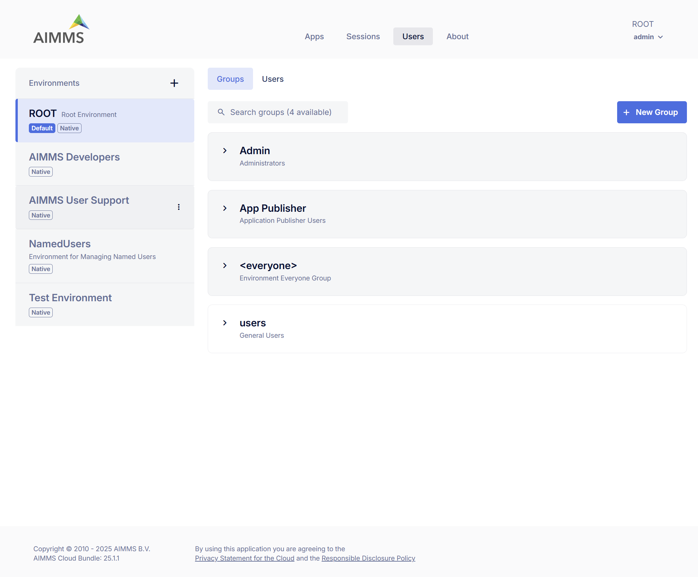
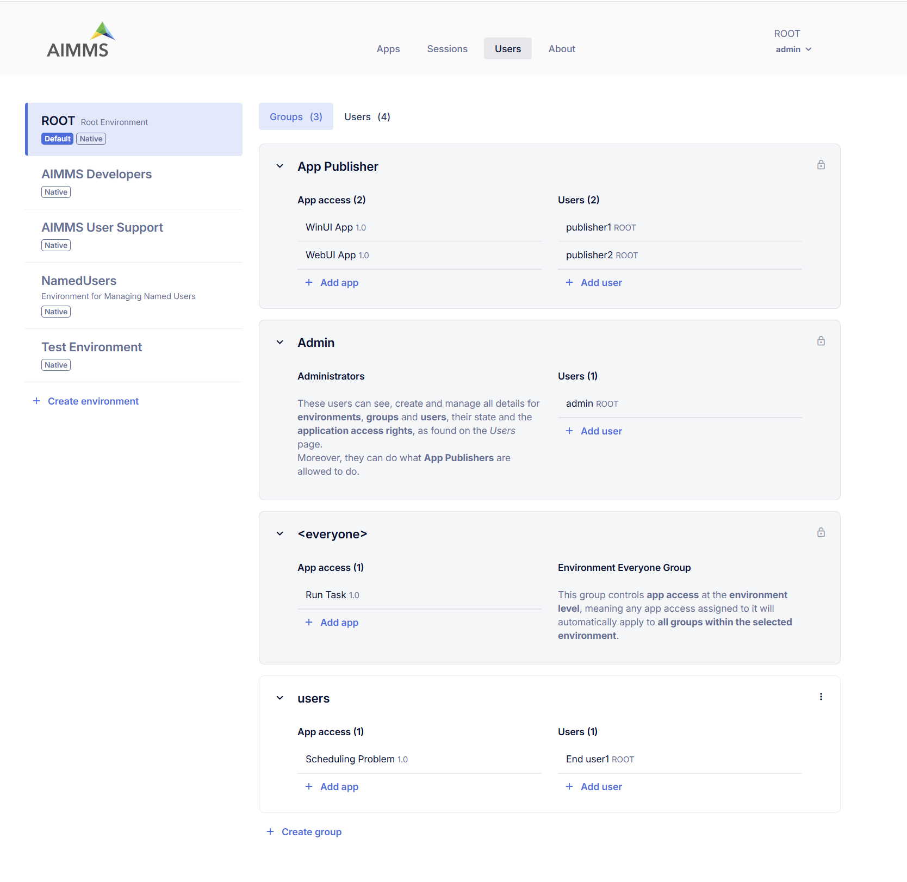
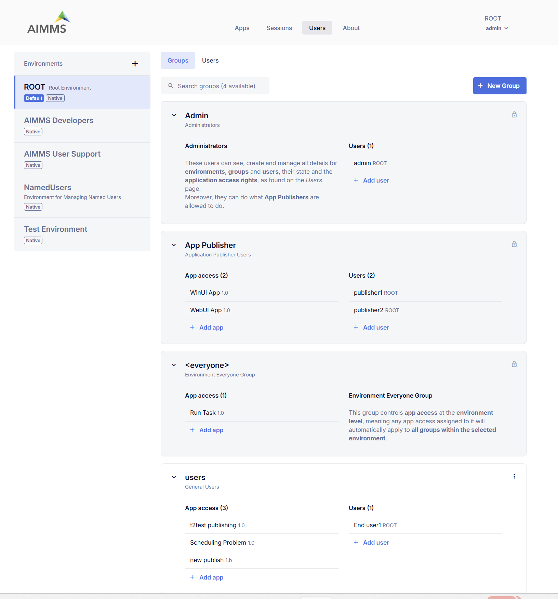
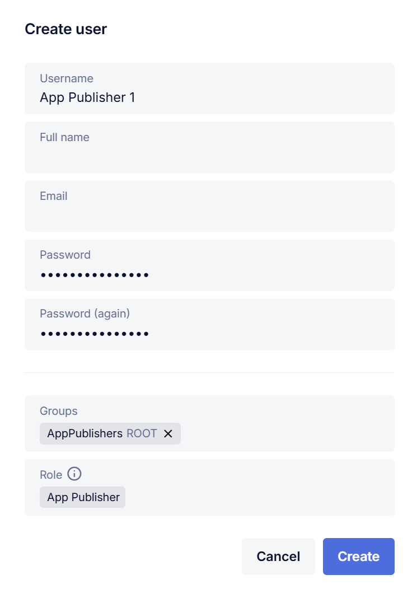

Users (User Management)
=======================

In the Users area of the portal, you can perform all user management tasks related to AIMMS PRO. The following user management concepts are supported:

* Environments
* Groups
* Users

.. note::

	As we moved from ACL (Access Control List) to RBAIC (Role-Based Access and Identity Control) which brings more simplified management with better scalability, consistency and security, a new Portal no longer supports assigning permissions directly to Environments and Users, you should use Groups instead.

Environments
------------

An environment within AIMMS PRO represents a distinct collection of users separated from users in other environments. Environments allow you to provide AIMMS applications to multiple companies or departments, and optionally delegate user administration to specific users within that environment.

* Each environment can make its own distinguishable set of AIMMS applications available to its users.
* Environments can be linked to a SAML identity provider (e.g., ADFS) for Single Sign-On (SSO).
* AIMMS PRO supports up to 127 environments.

Groups
------

Within each environment, you can define one or more user groups, to which you can assign one or more users from within the same or other environment.

* Users must belong to at least one group.
* Only Admin and App Publisher groups are system-defined under ROOT environment.
* Groups can be used to organize users and assign app access.

Users
-----

Users are individuals who access and interact with AIMMS PRO.

* Each user must belong to at least one group.
* User roles are currently limited to two system-defined roles, Admin and App Publisher. A user’s role is assigned automatically based on their membership in one of these predefined groups.
* The Roles column is read-only. Users cannot be assigned roles directly anymore.

Roles
-----

Roles determine the access and privileges a user has within the AIMMS PRO portal. User roles are currently limited to two system-defined roles — *Admin* and *App Publisher*.  A user’s role is assigned automatically based on their group membership in one of these system-defined groups. For example:

* If a user is a member of the *Admin* group, they are assigned the Admin role.
* If a user is a member of the *App Publisher* group, they are assigned the App Publisher role.

Available Roles

* **Admin**: Full access across AIMMS PRO, including user management and configuration.
* **App Publisher**: Can publish and manage their own applications. Access to apps is determined by group membership.

The ROOT Environment
--------------------

By default, AIMMS PRO includes a pre-installed ROOT environment with system-defined groups:

* **Admin**: Users with Admin group membership have full administrative privilege
* **App Publisher**: Users with App Publisher group membership can publish and manage their applications.
* **Users**: Optional non-system group, can be deleted if not needed.

Creating a New Environment
--------------------------

Admin users can create new environments. Each environment includes the <everyone> group: 

**Group <everyone>**: In the new Portal, each environment comes with a group called <everyone>. This group controls app access at the environment level, meaning any app access assigned to it will automatically apply to all groups within the selected environment that will allow you to view and assign app permissions for every group within the chosen environment. If you have arranged access to an entire environment, this will be automatically translated into permission for the <everyone> group in that environment. If you have assigned permissions to individual users, these will continue to work for existing applications in read-only mode, but for newly published applications you will have to create a separate group to collect any individual users you want to give access to an app and who do not already have access via another authorized group.

Admins can:

* Add, edit, or delete users and groups
* Assign app access

Default Environment for login
-----------------------------

* There can be only one default environment for your AIMMS PRO Portal.
* Admin user can anytime unmark or change the default environment. 
* The environment marked as 'Default' will be always selected on the login screen so that user does not need to select the environment each time when login to the portal. 

Linked Environment
------------------

AIMMS PRO allows you to link any environment to a SAML identity provider (e.g., ADFS), enabling user authentication through your own user management system. To set up a linked environment, specify the *Linked Environment URL* when creating or editing an environment.

For detailed instructions on configuring a SAML environment, please refer to the full SAML configuration documentation [link].

Creating a new Group
--------------------

Admins can create or delete groups within an environment. After creating a group, they can:

* Assign apps under **App Access**
* Add existing users to the group
* Create and add new users to the group

Creating a New User
-------------------

Any admin user can create a new user via Groups > Add User or through the Users tab within a selected environment. The Users tab provides an overview of all users in the selected environment, including the groups assigned to each user and their Role.

* User's roles are derived from group membership (Admin or App Publisher) and cannot be set manually.
* Admins can edit user details, view assigned apps, or delete the user.

.. note::

	In new portal, there is no more admin user per environment.

 

