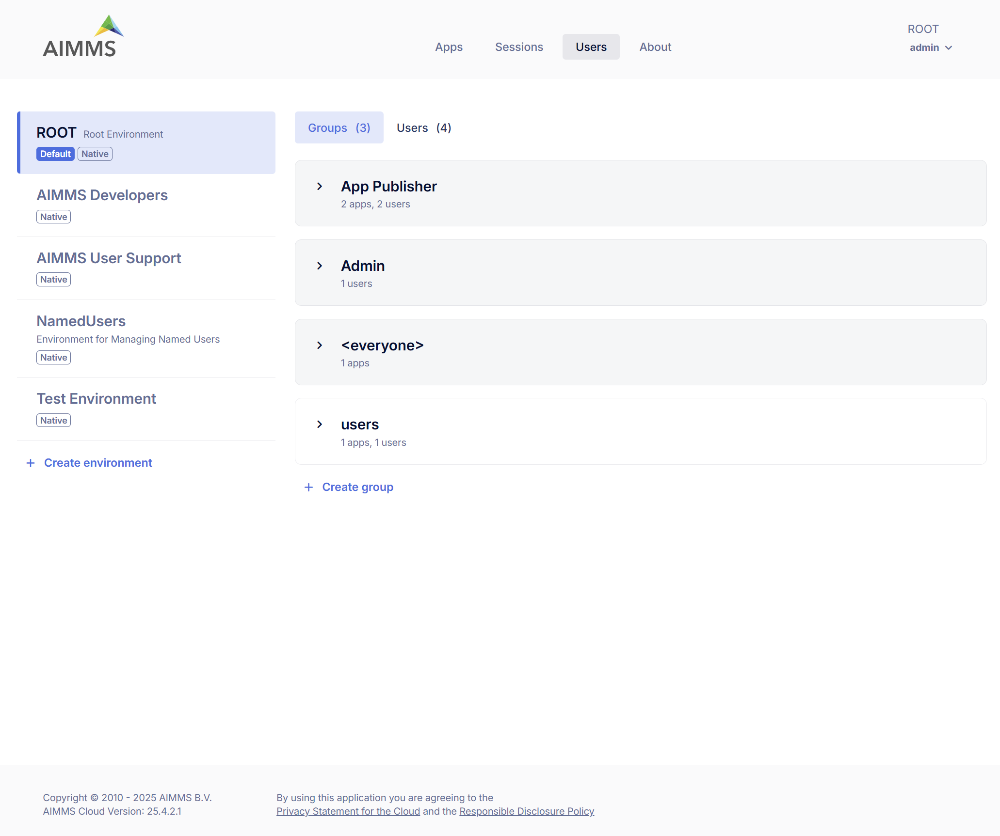
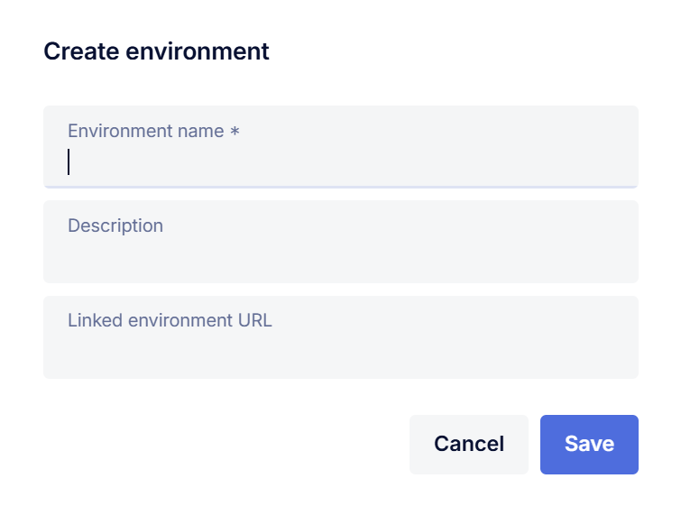
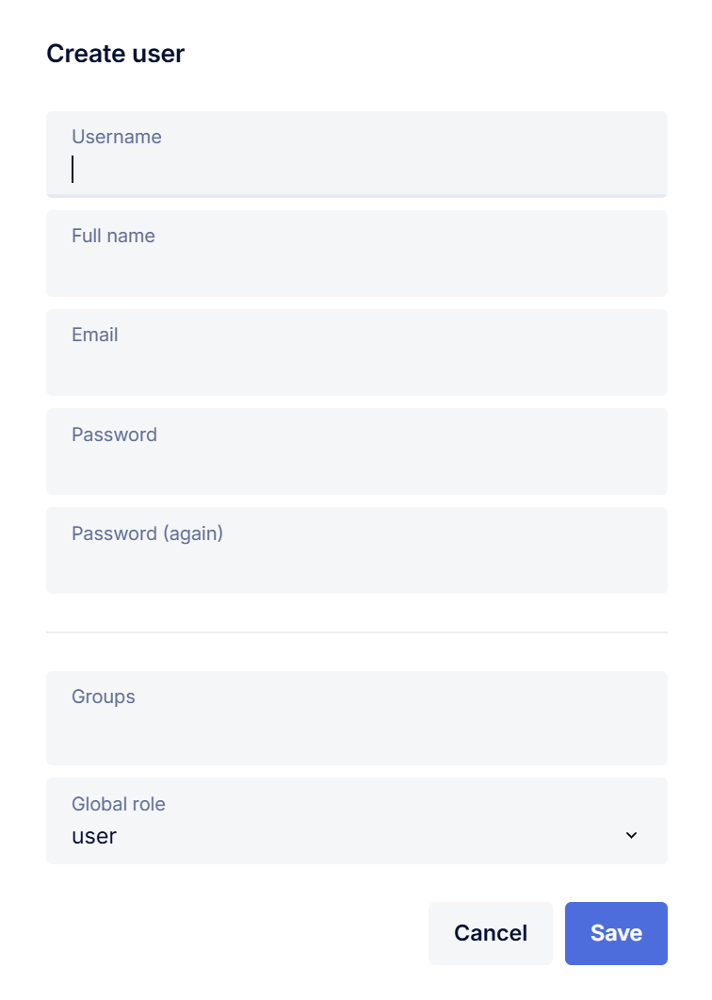

User Management
===============

In the Users area of the portal, you can perform all user management tasks related to AIMMS PRO. The following user management concepts are supported:

* Environments
* Groups
* Users

.. note::

	As we moved from ACL (Access Control List) to RBAIC (Role-Based Access and Identity Control) which brings more simplified management with better scalability, consistency and security, a new Portal no longer supports assigning permissions directly to Environments and Users, you should use Groups instead.

Environments
------------

An *environment* within AIMMS PRO denotes an entity of users which is clearly separated from the users in all other environments. For instance, through the concept of environments you may provide AIMMS applications to multiple companies or departments within a company, where you can (but need not) delegate the user administration of a particular environment to a user within that environment. Each environment can make its own distinguishable set of AIMMS applications available to its users. Each environment can be linked to a SAML identity provider (e.g. ADFS), to allow a single sign-on experience for the users of that environment. AIMMS PRO supports up to 127 environments.

Groups
------

Within each environment, you can define one or more user groups, to which you can assign one or more users from within the same or other environment. Groups allow you to introduce *role-based* authorization within AIMMS PRO, because the authorizations of all AIMMS PRO objects are defined in terms of users groups.

Users
-----

Users are individuals who access and interact with the AIMMS PRO Framework. Each user can be assigned a specific role through Global Roles, such as Admin, App Publisher, or User. Every user must belong to at least one user group. User accounts can be password-protected (for standalone environments), or authenticated via a Linked Environment to enable a single sign-on (SSO) experience.

The ROOT Environment
--------------------

By default, AIMMS PRO includes a single pre-installed environment: the ROOT environment. The Global Admin account is part of the ROOT environment, along with two system groups: **Admin** and **App Publisher**, one non-system group: **users**.

* **Admin**: Any user with the *admin* global role is automatically a member of this group and has global administrative privileges equivalent to the Global Admin account.
* **App Publisher**: Any user with the *app publisher* global role is a member of this group and is authorized to publish AIMMS applications. They also have full access to the applications published by them.

.. note::

	These system groups and global admin user are integral to the platform and cannot be deleted.

* **users**: A non-system group named users is also created by default. This group is optional and can be deleted if it is not needed.

Creating a New Environment
--------------------------

Within the portal, any user with an Admin role can create a new environment. By default, each environment includes the <everyone> group. Users with the Admin role have full administrative privileges. They can:

* Add, edit, or delete users and groups
* Assign app access

**Group <everyone>**: In the new Portal, each environment comes with a group called <everyone>. This group controls app access at the environment level, meaning any app access assigned to it will automatically apply to all groups within the selected environment that will allow you to view and assign app permissions for every group within the chosen environment. If you have arranged access to an entire environment, this will be automatically translated into permission for the <everyone> group in that environment. If you have assigned permissions to individual users, these will continue to work for existing applications in read-only mode, but for newly published applications you will have to create a separate group to collect any individual users you want to give access to an app and who do not already have access via another authorized group.

Default Environment for login
-----------------------------

* There can be only one default environment for your AIMMS PRO Portal.
* Admin user can anytime unmark or change the default environment. 
* The environment marked as 'Default' will be always selected on the login screen so that user does not need to select the environment each time when login to the portal. 

Linked Environment
------------------

AIMMS PRO allows you to link any environment to a SAML identity provider (e.g., ADFS), enabling user authentication through your own user management system. To set up a linked environment, specify the *Linked Environment URL* when creating or editing an environment.

For detailed instructions on configuring a SAML environment, please refer to the full SAML configuration documentation [link].

Creating a new Group
--------------------

Any admin user can create or delete a group. Once a group is created, the admin can:

* Add apps under **App Access**
* Add existing users to the group
* Create and add new users to the group

Creating a New User
-------------------

Any admin user can create a new user via Groups > Add User or through the Users tab within a selected environment. The Users tab provides an overview of all users in the selected environment, including the groups assigned to each user and their Global Role.

As an admin, you can also:

* Change a user's role
* Edit user details
* View the list of apps available to the selected user
* Delete a user

Global Roles
------------

AIMMS PRO defines three Global Roles, each with different levels of access and responsibility within the portal:

* **Admin**: Has full access and privileges across the AIMMS PRO Portal, including user management and configuration.
* **App Publisher**: Can publish and manage their own applications. Has full access to the apps they own but limited access (i.e. can view and launch) for the apps made available to them based on their group level app access.
* **User**: An end user who can view and launch applications made available to them, based on their group level app access.

 

