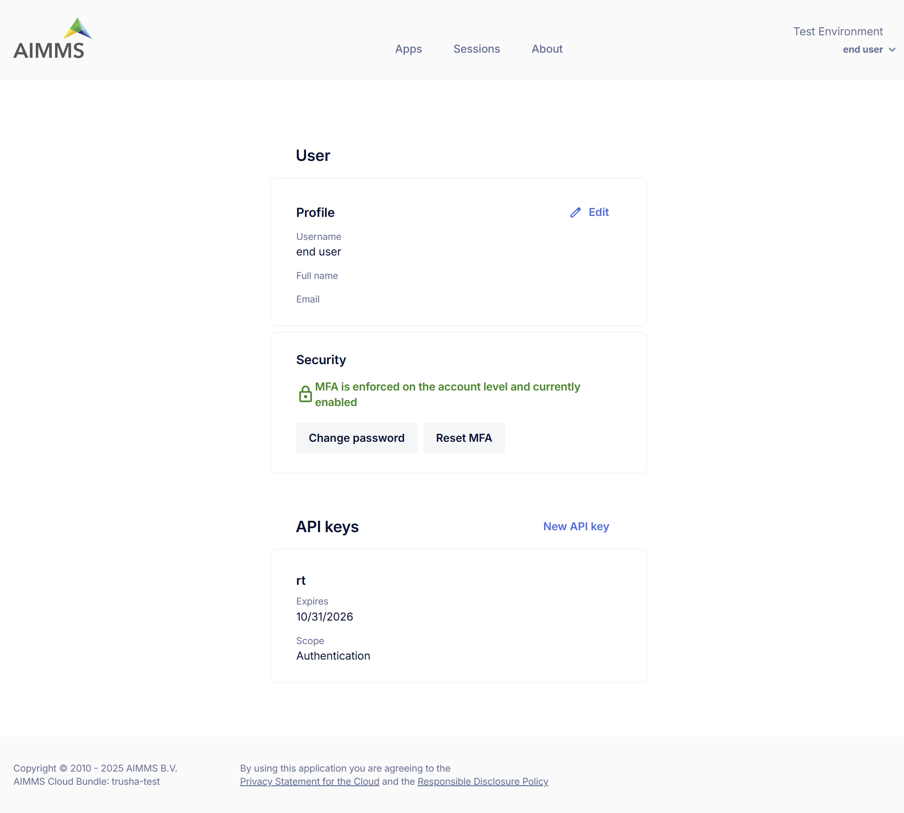

User Settings
=============

The **User Settings** page allows users to manage their *personal profile*, *security preferences*, and *API keys*.

Profile
-------

This section displays your personal user information:

* **Username** – Your username (non-editable).
* **Full Name** – Your display name.
* **Email** – Email address associated with your account.

To update your full name or set your email, click the **Edit** icon.

Security
--------

Manage your account’s security settings:

* **MFA (Multi-Factor Authentication)** – Indicates whether MFA is enabled.
* **Change Password** – Click to update your current password.
* **Enable/Disable MFA** – Click to set up multi-factor authentication for an added layer of security.

.. note::

	MFA is not available for ActiveDirectory and SAML Users(i.e. users with SSO).

API Keys
--------

Requests made to the AIMMS PRO REST API are authenticated and authorized by using API Keys. This section lists all your active API keys used for programmatic access:

* **Key Name** – The identifier of the key.
* **Expiry Date** – When the key will no longer be valid. The maximum expiration date for any API key is **1 year** from the creation date.
* **Scope** – The level of access the key provides (e.g., Authentication, PublishApp, Session, Task etc).

To create a new API key, click **New API key**.
To delete an existing API key, click the three-dot menu next to the key and select Delete.

**Available Scopes**: Scopes allow you to limit the permissions of an API key. You can assign one or more scopes to a key based on the level of access required

.. csv-table:: 
   :header: "Scope", "Description"
   :widths: 40, 40

	Authentication , Allows operations on Environments; Groups and Users                                                    
	PublishApp , "Allows management of AIMMS applications(e.g., publishing, updating, editing, deleting apps"                
	Tasks , Allows management of Tasks 
	API Key , "Permits operations on API keys themselves(e.g., creating, deleting keys)"
	Session , "Enables operations related to WebUI; Solve and Task sessions(e.g., get session information, retrieve logs, terminate, delete session)"