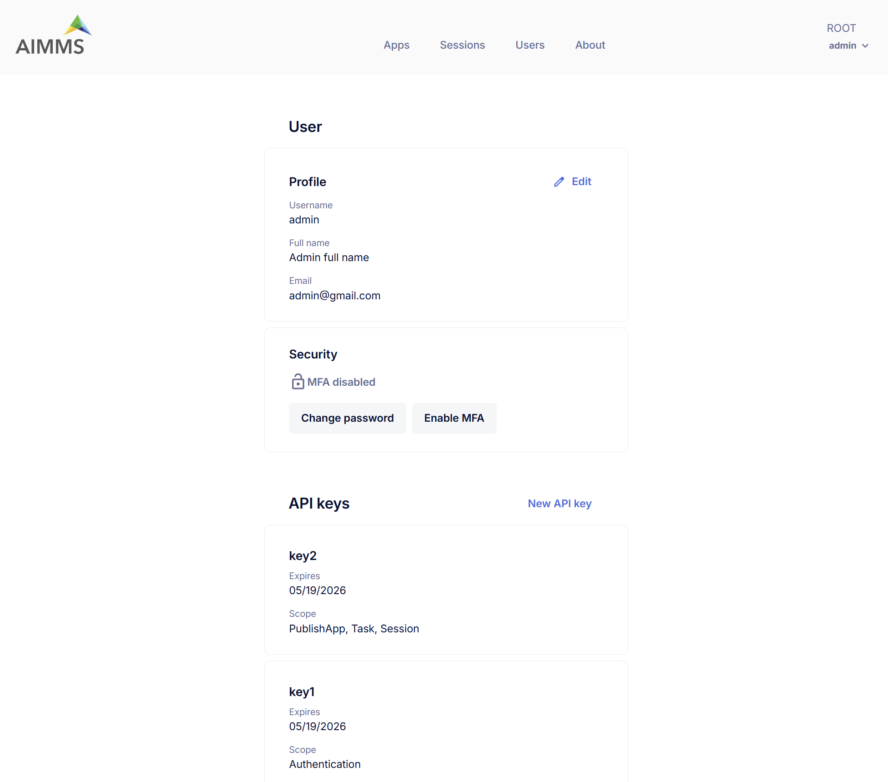

User Settings
=============

The **User Settings** page allows users to manage their *personal profile*, *security preferences*, and *API keys*.

Profile
-------

This section displays your personal user information:

* **Username** – Your username (non-editable).
* **Full Name** – Your display name.
* **Email** – Email address associated with your account.

To update your full name or set your email, click the **Edit** icon.

Security
--------

Manage your account’s security settings:

* **MFA (Multi-Factor Authentication)** – Indicates whether MFA is enforced by Admin and enabled/disabled currently.
* **Change Password** – Click to update your current password.
* **Enable/Disable/Reset MFA** – Click to enable or disable MFA when it is configured as optional at account level. If MFA is enforced by Admin, the disable option is unavailable instead Reset MFA option is available.

.. note::

	MFA is not available for ActiveDirectory and SAML Users(i.e. users with SSO).

API Keys
--------

API Keys have moved to a dedicated page in the Cloud Portal for easier access and management.

.. To manage your API keys, navigate to the User API Keys page. See `User api keys <https://documentation.aimms.com/cloud/newportal-user-api-keys.html>`_ for more information.