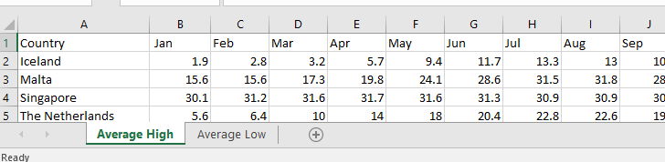

Examples
********

The data source
===============
For this example we make a data source by fetching some data from Wikipedia. For some of the smaller countries it shows a nice table with average high and low temperatures per month and year. When we copy this data for some countries into an excel spreadsheet, we can use the XLSProvider to read this data into AIMMS. A screenshot of parts of our resulting data source is shown in the picture.

    
* *Table names:* If we look at the bottom we see that we have two worksheets with the names "Average High" and "Average Low". These are the table names used in specifying the data map for DataLink. As we can see the table "Average High" is active, and it contains the average temperature value for each country per month.

* *Column names:* The top row in the picture contain the names of the columns. It starts with "Country" followed by the shortened names of months. These are the column names used in the mapping. Instead of talking about the columns in the spreadsheet way with letters 'A', 'B' ,etc., DataLink addresses each column by it's name "Country", "Jan", "Feb", etc. We can see that the values in column "Country" are strings (representing the countries), and that the month-columns all have floating point values (representing the temperature in Celsius). 

The AIMMS model
===============

In AIMMS we declared identifiers and we want to read data from the data source above into these identifiers.
Assume we have the following identifiers in our AIMMS model:

.. code::

    DeclarationSection Average_High_Declaration {
        Set Countries {
            Index: c;
        }
        Parameter January {
            IndexDomain: c;
        }
        Parameter May {
            IndexDomain: c;
        }        
    }

In this declaration section, we see that we have one set :token:`Countries` with index :token:`c`, and two parameters :token:`January` and :token:`May` that have index :token:`c` as domain. It is clear from the data source what data has to be read into which identifier. The values from column "Country" should be read into set :token:`Countries` and the columns "Jan" and "May" should be read into :token:`January` and :token:`May`. 

We can now look at what DataLink has to do in order to read data from the source into the model. For each row in the data source it has to read in the value of the domain :token:`c` (i.e. Iceland) and make sure that it exist in the AIMMS model. Then it can read in the value of the parameters (I.e for Jan 1.9), but it also has to tell that this value corresponds to domain :token:`c` that was read in just before (Iceland). In AIMMS the columns are not independent and domain values have to be send to AIMMS multiple times. DataLink can speed this up by using some clever caching such that domain values only need to be send once.
 

The data map
============

Now we have the data source and the identifiers in AIMMS, so we can define a data map that connects them. The data map itself is an identifier (string parameter) in AIMMS and the map is set by initializing it. We define the following mapping:

.. code::

     TemperatureMapping(dl::dt,dl::idn,dl::cn,dl::dn) := data { 
        ( 'Average High', 'Countries'  , 1, 1 ) : "Country",
        ( 'Average High', 'January'    , 2, 0 ) : "Jan", 
        ( 'Average High', 'May'        , 3, 0 ) : "May" 
     };

We named our string parameter :token:`TemperatureMapping` and see in the above code that it is a parameter with four domains:

* :token:`dl::dt` : This is the table name
* :token:`dl::idn` : This is the identifier name
* :token:`dl::cn` : This is the column number
* :token:`dl::dn` : This is the domain number

The string value of data map :token:`TemperatureMapping` is the column name and is initialized with the AIMMS function :token:`data`.

The first element in our mapping we specify that we are looking in table "Average High", which is the name of the work sheet in our xlsx file. Then we specify the name of the identifier in AIMMS. Note the subtle difference: the name of the set is "Countries" (plural), while the column name in the spreadsheet is "Country" (singular). 

The column number is 1 and this is lower than that of the other entries of the data map. Indeed, Set elements have to be read first. We can see it is a Set because the domain number (4:superscript:`th` column) is 1 (non-zero). The other two entries domain numbers are 0, meaning that they are parameters indexed over specified domain number(s) greater than 0. Following the same logic, in case of multi dimensional parameters the domain numbers of your different Set indices will be 1, 2, 3 etc.

The code
========

We may now write the complete procedure for reading the data:

.. code::

    StringParameter TemperatureMapping {
        IndexDomain: (dl::dt,dl::idn,dl::cn,dl::dn);
    }
    DeclarationSection Average_High_Declaration {
        ... (see above)
    }
    Procedure ReadIt {
        Body: {
          empty Countries, January, May, TemperatureMapping;
          read from file "datamapavt.txt";
          dl::RemoveDataSourceMapping("TempAvHighMap");
          dl::AddDataSourceMapping("TempAvHighMap", 
                                   TemperatureMapping, 
                                   dl::DependEmpty,  
                                   dl::TableAttributesEmpty,  
                                   dl::ColAttributeEmpty);
          ReadAttribute := { 'DataProvider' : xlsprovider::DataLink };
          dl::DataRead("DataSource.xlsx", 
                       "TempAvHighMap", 
                        ReadAttribute);
        }
        DeclarationSection Local_Declaration {
          StringParameter ReadAttribute {
            IndexDomain: dl::rwattr;
          }
        }
    }

Before we can run the code above we have to make sure that we added DataLink (with prefix dl) and the XLSProvider (with prefix ``xlsprov``) to the project. In the code we see that we declare the data map :token:`TemperatureMapping` as a string parameter, then we have the declaration section from above in which we declare the set :token:`Countries` and the two parameters :token:`January` and :token:`May`. 

The body of our :token:`ReadIt` procedure starts with clearing all our identifiers to make sure we start of with a clean slate. We do not have to do it, if we want to add data from the data source we should not clear them. 

Then we read from file the text file ``datamapavt.txt`` containing our data map specification. We could have initialized this in the declaration of string parameter :token:`TemperatureMapping`, but using a text file allows us to store the mapping next to the data source. Also with larger data sources it is more convenient to toggle between different text files than modifying the initialization all the time.

In the next step we make sure that, if a mapping ``"TempAvHighMap"`` exists, it is cleared. The string ``"TempAvHighMap"`` is the name of the mapping used by DataLink to store the mapping. DataLink can store more than one data maps so we need the name to tell it which mapping to use. In the next line of code we create our 'new' mapping ``"TempAvHighMap"`` and pass our data map :token:`TemperatureMapping` as second argument. The other three arguments are extra attributes, but in our code we use the empty defaults that are supplied by DataLink.

Then we create a string parameter :token:`ReadAttribute`, which we declared locally in our procedure. We specify the :token:`'DataProvider'` and set this to :token:`xlsprovider::DataLink`. This is an identifier supplied by the XLSProvider and contains the location of the code that has to run (the dll on windows). 

We read data with the call :js:func:`dl::DataRead` and pass the name of the data source, in this case the excel file ``DataSource.xlsx``, as first argument. In the second argument we tell DataLink to use the mapping associated with the name ``"TempAvHighMap"``. In the third argument we pass the :token:`ReadAttribute` so that Datalink knows which provider to use. After this procedure is run, the identifiers specified in ``DeclarationSection Average_High_Declaration``, will contain the data from the data source.