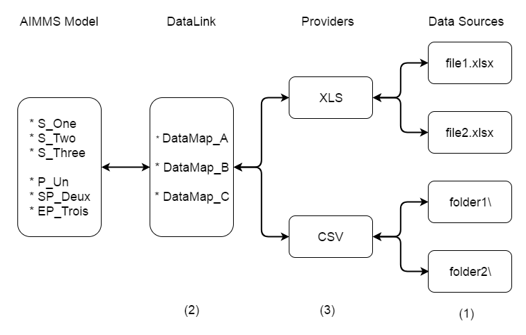

What is DataLink?
*****************

.. 
    Define the particular problem datalink is solving and give an overview on how it does this.

DataLink is a data importer/exporter library for AIMMS that assumes that the data in the source is organized into tables. 
With this library we want the AIMMS developer to be able to read and write data from different types of sources using the same approach. This can be difficult because the tables do not contain enough information to be read into AIMMS identifiers.

The problem with tables
=======================

A table is a collection of data organized in columns. All columns have a name, which are specified in the header (as convention we will always show header values in bold).

.. csv-table:: The FirstnameLastname table
   :header: "firstname", "lastname", "age"
   :widths: 20, 20, 10

   "Alice", "Smith", 40
   "Bob", "Johnson", 20

When we look at the "structure" of this table we see that we have 3 columns named "firstname", "lastname" and "age". The first two columns have string values and the last column has a numeric value. We can make another table with two string columns and one numerical column.

.. csv-table:: The NameCity table
   :header: "fullname", "city", "age"
   :widths: 20, 20, 10

   "Alice Smith", "Paris", 40
   "Bob Johnson", "London", 20

Besides the column names there are no differences between these two tables except for the data. But looking at the data and interpreting its meaning, we could see that there is still a difference. In the FirstnameLastname table we need both firstname and lastname otherwise the age would not have any meaning. The age tells us something about a person that is identified in the table with two "keys", the first name and last name. The NameCity table only needs one key, the full name, and the table gives us two pieces of information related to the corresponding person. 

AIMMS being a modeling language, this is exactly the kind of information that is important. In our AIMMS model we do need identifiers that take into account the relations between the columns of the table. We could have in AIMMS the sets :token:`S_Firstname` with index :token:`I_Firstname` and  :token:`S_Lastname` with index :token:`I_Lastname`. Also we could have a parameter :token:`P_Age(I_Firstname,I_Lastname)`. Then we could do the reading, and reading the first table would be doing in AIMMS something like:

.. code-block:: aimms

    S_Firstname += {'Alice'};     ! make sure that 'Alice' is in the set S_Firstname
    S_Lastname += {'Smith'};      ! make sure that 'Smith' is in the set S_Lastname
    P_Age('Alice','Smith') := 40; ! Assign value 40 to P_Age for 'Alice' and 'Smith'

Here we assign the values :token:`Alice` and :token:`Smith` to their sets, but technically we only have to add them if they are not in that set yet. When we are sure we can do the assignment to :token:`P_Age`.

If we look at the second table we see that it defines only one set and two parameters. Reading the first row is similar of doing:

.. code-block:: aimms

    S_Fullname             += {'Alice Smith'}; ! the set 
    SP_City('Alice Smith') := "Paris";         ! a string parameter
    P_Age2('Alice Smith')  := 40;              ! a parameter
    

Understanding the structure in the source is not enough for importing and exporting data. We also have to understand the identifiers in the model. Then we can map the columns in the table to the identifiers in the model for reading and writing the data. 

.. _TheDataLinkSolution:

The DataLink solution
=====================

The solution is to split the task of importing and exporting data into two separate libraries. One library, DataLink, deals with the identifier structure in AIMMS. There is only one DataLink library. The second library, the Provider, deals with the specific type of the data source. For each type of source there is a different provider library.

    An overview of the dataLink solution with left the AIMMS model containing identifiers. Next to it the DataLink library containing the data maps (explained later). Then we see different types of Provider libraries.  Depending on the type of provider we see that we can choose different data sources.

We have to make three choices:

Choose a source (1)
    The source is data stored on the local machine in a particular format.

Choose a data map (2)
    All the data maps in DataLink have names, and we choose a data map by its name. 

Choose a provider (3)
    This is a library (from the library repository) that "understands" the particular format of the data source.

For reading and writing we always make these three choices and the number between brackets indicate the argument of function :token:`dl::DataRead` and :token:`dl::DataRead`. The first two arguments are strings (name of the source and name of the data map), and the third argument is a :token:`dl::ReadWriteAttributes` that allows us to specify extra argument for reading and writing. It has one mandatory field, the *'DataProvider'*, which must be set to select the provider.

.. code-block:: aimms

   dl::DataRead(
        "InputFile.xlsx",       ! Choose a source (1)
        "TheDataMap",           ! Choose a data map (2)  
        ReadWriteAttributes     ! Choose a provider (3)
    );

The :token:`ReadWriteAttributes` could be defined as:

.. code-block:: aimms

    StringParameter ReadWriteAttributes {
        IndexDomain: dl::rwattr;
        Definition: data{'DataProvider': xlsprov::DataLink };
    }

Here we use :token:`xlsprov::DataLink` as value, where *"xlsprov"* is the prefix of the XLSProvider library. DataLink needs to know where the executable code of the provider (i.e. the dll file on Windows) is located. To simplify this, all providers make sure that upon initialization a string parameter called :token:`DataLink` is set with the correct location needed by DataLink. This means that we can choose the provider by using this string parameter of the provider as value for *'DataProvider'*. 

.. _LinkDataLinkInstallation:

Installation and setup
======================

The DataLink and provider libraries are made available in through the AIMMS library repository, and can be installed and added to a model using *File > Library Manager...* . Then click the button *"Add Library from Repository..."*. Now we see the *Library Repository Browser* window. Here we can click on available libraries and read in right pane the details of that library.

You need at least two libraries:

1) A provider that can handle the type of source you want to read or write. (The details pane in the Library Repository Browser has a "Depends On" property, that tells which version of DataLink it is compatible with)

2) DataLink (must be compatible with all providers)

.. tip::

    Always choose the provider first! If we choose the provider, the library manager is smart enough to figure out that it needs to install the DataLink library as well. It will automatic install DataLink with the right version (from the "Depends On" field for the provider in the Library Repository Browser).

It is possible to deal with dfferent types of data sources in the same model. This is just a matter of adding the providers for each type that is needed. However, a  model can have only one DataLink (version) installed, and so all added providers must depend on that very same DataLink version.

.. warning::

    If you select an extra provider you **MUST** select a provider that is compatible with the DataLink library already installed. The library manager is not smart enough to figure out what to do when different providers require different versions of DataLink.

