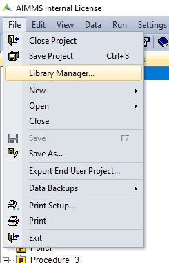
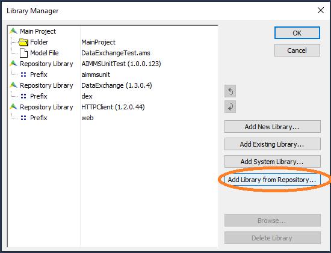
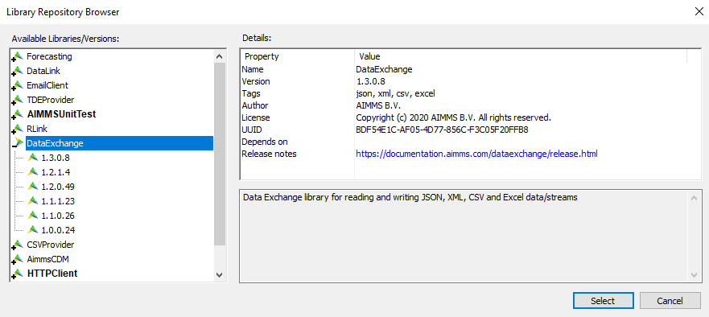
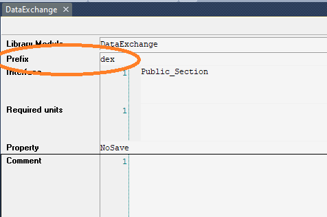
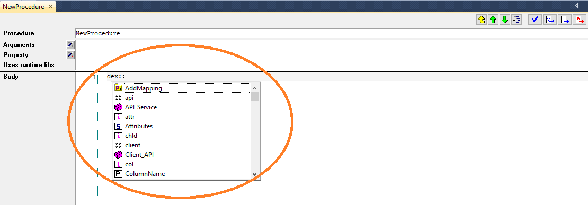
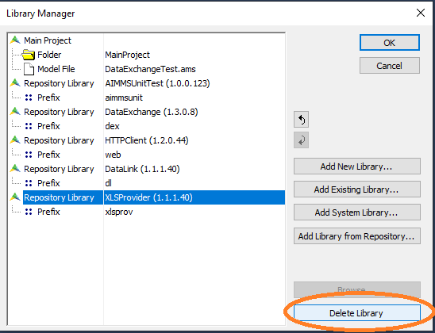

Getting started with the AIMMS Library Repositories
**************************************

How to add a library from the repository?
==========================

Adding a library from the repository to your AIMMS model is really easy. Make sure you have your model saved and pages/cases and/or editors closed before installing. With your AIMMS model open, go to File -> Library Manager:

This will open a new window, in which you can choose for 'Add Library from Repository...':

This will open a screen in which you can select and install available libraries. By default the most recent version of the library will be installed, but by double-clicking on the '+' before each library you can see all the available versions and select another version for download:

If you are replacing an existing version of the library you will be asked for confirmation. If any codependenent libraries are necessary, these will automatically be installed.

After clicking 'Ok' for confirmation you will get a notification that all currently opened pages, cases and/or editors will be closed.

The libraries you install are immediately available in your model, at the bottom of the Model Explorer. By double-clicking on the 'box' left of the library name you can read(-only) the functions and procedures that are included.

How to use a library from the repository?
==========================

Once the library is added to your model you can start using the procedures and functions that come with it. Every library has a prefix; when you start typing this prefix, the autofill will help you finding the function you need. To find the prefix of a chosen library, you can double-click on the library and see what is written under the 'prefix' item:

Once you start typing this prefix, you will automatically get the options listed:

Please note that some of the procedures require arguments (indicated by a procedure name followed by the argument(s) between brackets). You will get an error message if you have not indicated the (correct) argument(s).

For every library a documentation page and how-to's are available to provide you with more library-specific information. 
 
Deleting a library from the repository
==========================

If you want to delete a library from the repository, go to File -> Library Manager, select the library you want to delete, and press the delete button:

The library is now deleted. If you have used any of the functions from a deleted library in a procedure these will give an error during execution. 

