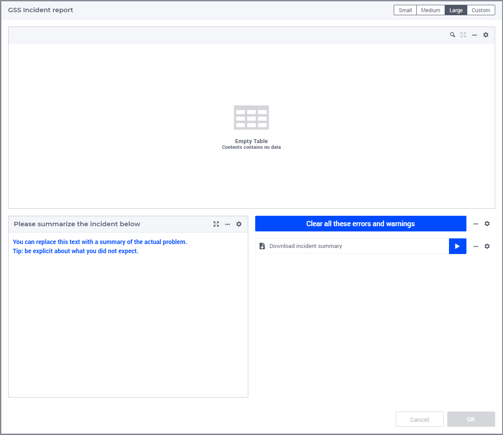

Install GSS interface for end-users
=====================================

In this article, it is explained how to create the above dialog page in which the end-user can submit an incident report.

#.  Create a dialog page, preferably below the page GSS Session History Management, named ``GSS Incident report``.
    The set ``webui::AllDialogPages`` should now contain ``gss_incident_report``.

    If not, you may want to change the ``webui.json`` file by replacing the new element you see with ``gss_incident_report``.

#.  The size of the dialog should be ``large``, and you can choose layout 2:

	.. image:: images/layout-2.png
		:align: center

#.  First create a table ``ErrorWarningTable``, titled "Errors and warnings encountered" in Area A.

    Contents:

    #.  ``gss::sp_dataSessionErrorMoments``

    #.  ``gss::ep_dataSessionErrorSeverity``

    #.  ``gss::sp_dataSessionErrorMessages``

    Pivot:

    *   Rows: ``i_dataSessionErrorMessageNumber``

    *   Columns: ``<IDENTIFIER-SET>``

#.  Create a scalar widget, named  ``IncidentSummary`` in Area B.

    #.  contents: ``gss::sp_incidentSummarySuppliedByEndUser``.

    In the miscellaneous properties tab, set:

    #.  Contents.labels.visible to 0

    #.  Enable Multi-line to 1

    #.  Title to ``gss::sp_incidentSummaryTitle``
    
#.  Add a download widget named ``downloadIncidentSummary`` in Area C.

    #.  Procedure ``gss::pr_downloadIncidentSummary``
    
    #.  Title:  ``gss::sp_titleDowloadIncidentSummary``
    
#.  Add a button named ClearDataSessionErrors in Area C.

    #.  Procedure: ``gss::pr_clearDataSessionErrors``

    #.  Title:  ``gss::sp_titleClearDataSessionErrors``
