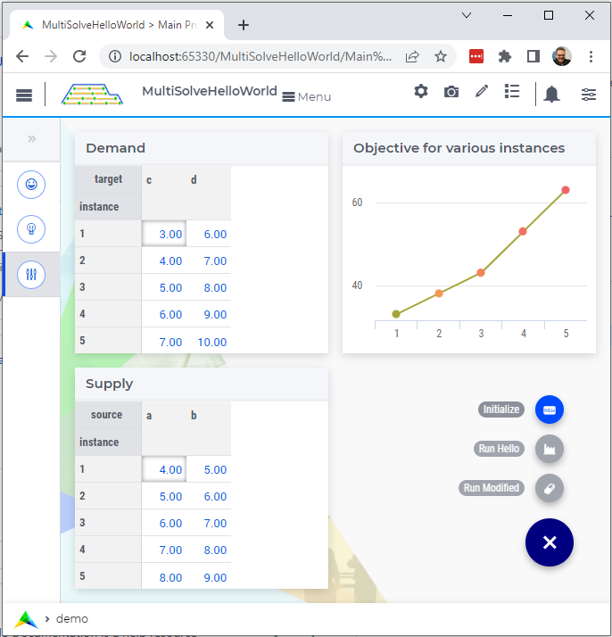

Hello 
=======================

.. meta::
   :keywords: Hello world, Transport problem, parallel solving
   :description: This AIMMS project introduces the multiSolve library.

.. image:: https://img.shields.io/badge/AIMMS_4.86-ZIP:_MultiSolveHelloWorld-blue
   :target: :download:`MultiSolveHelloWorld.zip <downloads/MultiSolveHelloWorld.zip>`

:download:`AIMMS 4.86 MultiSolveHelloWorld.zip <downloads/MultiSolveHelloWorld.zip>`

This section introduces the ``multiSolve`` library via a Hello World example.

The Story
------------

A product is transported from the two supply locations ``a`` and ``b`` 
to the two destination locations ``c`` and ``d``.  
There is a capacity limit on the transport from ``a`` to ``d``.
The transport cost is minimized.

We want to investigate how the transportation cost increases with step by step increases of both the supply and the demand.

The Results
--------------

After the page actions ``Initialize`` and ``Run``, the various instances are quickly solved. 
The results are presented in the demo page.

As expected, when the capacity limit on transport from ``a`` to ``d`` becomes binding, the cost increases more steeply.

The call
----------

The essence of the ``multiSolve`` library is the procedure: ``multiSolve::pr_multiSolve``.  
For the example at hand, it is called as follows:

.. code-block:: aimms
    :linenos:

    Procedure MainExecution {
        Body: {
            multiSolve::pr_multiSolve(
                ep_onProvideGMP           :  'pr_generateInstance', 
                ep_onRetrieveSolution     :  'pr_retrieveSolution', 
                ep_baseGMP                :  '', ! Using the Generate call back mode. 
                p_maxParallelGMPs         :  2,
                p_maxThreadsPerSolve      :  1, 
                ep_startingSolutionMethod :  multiSolve::ep_startingSolutionMethod_last);
        }
    }

Remarks about the above code fragment:

*   Lines 3-9: The entire call to the ``pr_multiSolve``.

    *   line 4 the callback for specifying a GMP. 

    *   line 5 the callback for retrieving the solution.

    *   line 6: A base GMP is not needed for this hello world example. 
        The use of this argument is explained in detail in :doc:`callback`.

    *   line 7: ``p_maxParallelGMPs``: Up to this number of solves can be executed in parallel.

    *   line 8: ``p_maxThreadsPerSolve``: The maximum number of threads available to a single solve. 

    *   line 9: ``p_startingSolutionMethod`` The method used for supplying a starting solution.

Generate the instance
-----------------------

Next, we discuss an example callback procedure to generate a GMP.

.. code-block:: aimms 
    :linenos:
    :emphasize-lines: 20,21

    Procedure pr_generateInstance {
        Arguments: (ep_gmp,ep_handle);
        Body: {
            p_iter += 1 ;
            if p_iter > p_maxNoInstances then 
                ep_handle := '' ;

                ! As there is no more data, this procedure can indicate to
                ! the multiSolve library that it can stop new solve sequences. 
                p_procedureReturnCode := 0 ; 
            else
                ! Which instance are going to solve.
                ep_handle := element( s_instances, p_iter );

                ! Update model parameters for this variation.
                p_supply(i_src)  := p_supplyInst(i_src,  ep_handle) ;
                p_demand(i_trgt) := p_demandInst(i_trgt, ep_handle) ;

                ! Create a new GMP from the new data and ensure that its name is unique.
                ep_gmp := gmp::Instance::Generate( mp_transport,
                    formatString("Instance %e of mp_transport", ep_handle ) );

                ! Indicating there is data, and a GMP is created ready to solve.
                p_procedureReturnCode := 1;
            endif ;
            return p_procedureReturnCode ;
        }
        DeclarationSection Argument_declarations {
            ElementParameter ep_gmp {
                Range: AllGeneratedMathematicalPrograms;
                Property: InOut;
            }
            ElementParameter ep_handle {
                Range: Integers;
                Property: Output;
            }
        }
        DeclarationSection Local_declarations {
            Parameter p_procedureReturnCode;
        }
    }

Remarks:

*   Line 4: A global is used to check where this procedure is in the list of work.

*   Lines 5: First it is checked whether there is any work left to be started.  
    If not, return 0; which is interpreted by the library that no more solve sequences are needed.

*   Lines 6, 13, 35: The ``ep_handle`` is a handle to the data instance.  
    Its value can be reused in the procedure to retrieve and store the solution.

*   Lines 15-17: Update the model sets and parameters from the instance data.

*   Lines 19-21: Create a GMP using :aimms:function:`GMP::Instance::Generate`.  Make sure the name of the 
    GMP generated is unique within your application.

*   Lines 10, 24, 26: The procedure return code, via parameter ``p_procedureReturnCode``, signifies to 
    the multiSolve library whether there is data for a new solve sequence; 0 indicates that there is no data.

Retrieve solution
-------------------

Just as there is a callback to specify the GMP to be solved, there is a callback to retrieve the solution.
An example is given below.

.. code-block:: aimms 
    :linenos:
    :emphasize-lines: 8

    Procedure pr_retrieveSolution {
        Arguments: (ep_gmp,ep_finishedSolverSession,ep_handle,ep_step);
        Body: {
            ! Translate the handle to index values meaningful for the business.
            ep_inst := ep_handle ;
            
            ! Copy the solution in the solver session to all the model variables.
            multiSolve::pr_storeSolutionInModelVariables(ep_finishedSolverSession);
            
            ! Store solution in the model variables in the data structures of the instance at hand.
            p_obj(ep_inst) := v_obj ;
            p_transport(i_src, i_trgt, ep_inst) := v_transport(i_src, i_trgt);
            
            ! The Operations Research problem at hand contains only one step, so that one and only step was done.
            ! To indicate there are no next steps:
            return 0 ;
        }
        DeclarationSection Argument_declarations {
            ElementParameter ep_gmp {
                Range: AllGeneratedMathematicalPrograms;
                Property: InOut;
            }
            ElementParameter ep_finishedSolverSession {
                Range: AllSolverSessions;
                Property: Input;
            }
            ElementParameter ep_handle {
                Range: Integers;
                Property: Input;
            }
            ElementParameter ep_step {
                Range: Integers;
                Property: Input;
            }
        }
        DeclarationSection Local_declarations {
            ElementParameter ep_inst {
                Range: s_instances;
            }
        }
    }

Remarks:

*   Line 8: Retrieve the solution from the solver session and store that solution in the model variables.

*   Line 11,12: Copy the solution of the model variables to the data instance.

*   Line 16: Return 0; this indicates that for this instance, no further solve steps are needed.

Summary
----------

The multiSolve library handles the program logic for solving multiple mathematical programs in parallel.
There is a clear separation between this program logic, and the business logic to 

#.  Generate GMP's from the data instances, and

#.  Retrieve solutions and put them in the data instances.

.. spelling::

    multiSolve

