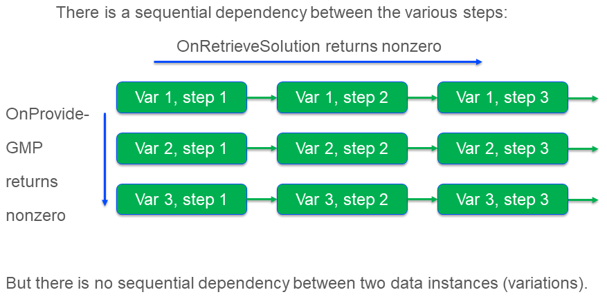

MultiSolve Introduction
=======================

Hello world
-----------

This section introduces the ``multi solve`` library via a Hello World example.
In this example five Transportation problems are solved, whereby up to 2 solves are executed in parallel.
The difference between two of these transportation problems is the amount of supply and demand.
Note that the amount of supply and demand is in balance for each of the data instances.

The ``multi solve`` library contains only one procedure: ``multiSolve::pr_multiSolve``.  
A call to this procedure may look as follows :

.. code-block:: aimms 
    :linenos:
    :emphasize-lines: 7-13

    Procedure pr_test2X2TransportProblem5TimesGenerate {
        Body: {
            ! Prep the GMP.
            rslva_ut::t001_su::pr_setupSolved();

            ! Perform test
            multiSolve::pr_multiSolve(
                ep_baseGMP                    :  '', ! Using callbacks with 'Generate' semantics.
                ep_onNextSessionInstance      :  'rslva_ut::t001::pr_onNextSessionInstanceGenerate1', 
                ep_onSessionInstanceCompleted :  'rslva_ut::t001::pr_onSessionInstanceCompletedGenerate1', 
                p_maxParallelGMPs             :  2,
                p_maxThreadsPerSolve          :  1, 
                p_startingSolutionMethod      :  1);

            aimmsunit::AssertTrue(
                descr :  "multiSolve::pr_multiSolve(): Small working run", 
                expr  :  aimmsunit::CompareEqual(t001_su::p_obj,t001_su::p_objVerified),
                cont  :  1);
        }
        aimmsunit::TestSuite: resolveAsync;
    }

Remarks about the above code fragment:

*   Line 4: Ensure data is available, etc. Not detailed here.

*   Lines 7-13: The entire call to the ``pr_multiSolve``.

    *   line 8: By not specifying a base GMP, the responsibility to generate an entire GMP is put to the callback procedures.
        This is referred to in the remainder of this document as: the callback mode is ``'generate'``. 
        The alternative callback mode is ``'modify'``, whereby the callback procedures are responsible for updating the LP matrix as needed.
        In practice, the easier callback mode for the application developer is the callback mode ``'generate'``; 
        as in this mode the AIMMS Matrix Generator will ensure a GMP is generated consistent with the data in the model identifiers.

        .. tip:: From a software engineering point of view, it makes sense to start with the callback mode ``'generate'``; 
               this mode permits the model builder to focus on adding code to update the model identifiers only.
               If it turns out that relatively significant time is spent in the generation of GMP's, 
               the alternative callback mode ``'modify'`` can be considered.

    *   line 9 and 10: The names of the callback procedures; please make sure their signatures match 
        ``multiSolve::pr_onNextResolveSessionInstanceSignature`` and ``multiSolve::pr_onResolveSessionInstanceCompletedSignature``
        respectively. Examples of such callback procedures are presented below.

    *   line 11: ``p_maxParallelGMPs``: Up to this number of solves can be executed in parallel.

    *   line 12: ``p_maxThreadsPerSolve``: The maximum number of threads available to a single solve. 
        Please ensure that ``p_maxThreadsPerSolve`` X ``p_maxThreadsPerSolve`` <= the number of cores on your computer.

    *   line 13: ``p_startingSolutionMethod`` A good starting solution can significantly speed up the solution process.
        The value 1 for the callback method ``'generate'``, indicates to use the values of the model variables.

*   Line 15-18,20: This example text is taken from the unit tests that come with the multi solve library.

Clearly, the model builder needs to provide proper callback procedures; one to generate (or modify) a GMP, 
and another one to handle the results.  Next, we discuss an example callback procedure to generate a GMP.

.. code-block:: aimms 
    :linenos:
    :emphasize-lines: 16,17

    Procedure pr_onNextSessionInstanceGenerate1 {
        Arguments: (ep_gmp,ep_handle);
        Body: {
            t001_su::p_iter += 1 ;
            if t001_su::p_iter > t001_su::p_maxNoInstances then 
                ep_handle := '' ;
                p_procedureReturnCode := 0 ; 
            else
                ep_handle := element( t001_su::s_instances, t001_su::p_iter );

                ! Update model parameters for this variation.
                t001_su::p_supply(t001_su::i_src)  += 1 ;
                t001_su::p_demand(t001_su::i_trgt) += 1 ;

                ! Create a new GMP, ensure that its name is unique.
                ep_gmp := gmp::Instance::Generate( t001_su::mp_transport,
                        formatString("Instance %s of t001_su::mp_transport", ep_handle ) );

                p_procedureReturnCode := 1;
            endif ;
            return p_procedureReturnCode ;
        }
        DeclarationSection Argument_declarations {
            ElementParameter ep_gmp {
                Range: AllGeneratedMathematicalPrograms;
                Property: InOut;
            }
            ElementParameter ep_handle {
                Range: Integers;
                Property: Output;
            }
        }
        DeclarationSection Local_declarations {
            Parameter p_procedureReturnCode;
        }
    }

Remarks:

*   Lines 5-8: First it is checked whether there is any work left to be started.  
    If not, return 0; which is interpreted by the library that no more solves are needed.

*   Lines 11-13: Update the model sets and parameters as needed.

*   Lines 15-17: Create a GMP using :aimms:function:`GMP::Instance::Generate`.  Make sure the name of the 
    GMP generated is unique within your application.

Just as there is a callback to specify the GMP to be solved, there is a callback to retrieve the results.
An example is given below.

.. code-block:: aimms 
    :linenos:
    :emphasize-lines: 7,10,13

    Procedure pr_onSessionInstanceCompletedGenerate1 {
        Arguments: (ep_gmp,ep_finishedSolverSession,ep_handle,ep_step);
        Body: {
            ! Translate the handle to index values meaningful for the business.
            ep_inst := ep_handle ;

            multiSolve::pr_storeSolutionInModelVariables(ep_finishedSolverSession);

            ! Retrieve solution, here only the objective value.
            t001_su::p_obj(ep_inst) := t001_su::v_obj ;

            ! After this solve, no further solve steps are needed to solve for the data instance at hand.
            return 0 ;
        }
        DeclarationSection Argument_declarations {
            ElementParameter ep_gmp {
                Range: AllGeneratedMathematicalPrograms;
                Property: InOut;
            }
            ElementParameter ep_finishedSolverSession {
                Range: AllSolverSessions;
                Property: Input;
            }
            ElementParameter ep_handle {
                Range: Integers;
                Property: Input;
            }
            ElementParameter ep_step {
                Range: Integers;
                Property: Input;
            }
        }
        DeclarationSection Local_declarations {
            ElementParameter ep_inst {
                Range: t001_su::s_instances;
            }
        }
    }

Remarks:

*   Line 7: Retrieve the solution from the solver session and store that solution in the model variables.

*   Line 10: Of the results retrieved, only the objective value is stored in this example.

*   Line 13: Return 0; this indicates that for this instance, no further solve steps are needed.

This ends the hello world example for the multi solve library.  We continue with detailing the library.

Callback modes
--------------

This library supports two modes, called callback modes:

*   **modify**

    In this mode, the callback procedures are responsible for modifying the coefficients of a GMP as needed.
    This mode is tuned towards efficiency; costly matrix generation steps are avoided, 
    and there is choice in starting points for efficient execution.

*   **generate**

    In this mode, the callback procedures are responsible for creating a new GMP for every solve.
    This mode is tuned towards modeling efficiency; 

The solve steps for an Operations Research problem
-----------------------------------------------------------------

Many Operations Research (OR) problems are solved by solving a single Mathematical Program (MP).
However, for some OR problems, it is needed that multiple Mathematical Programs are solved. 
Solving a single MP is then called a solve step.
A typical example is to first solve a given problem to feasibility, and then to optimality.
This library uses solve steps, or just steps, to cater for multi step OR problems.

As an aside, there are also OR problems that do not require an MP to be solved.
This library is of no use for such OR problems, and therefore these OR problems are not considered here.

Consider the following overview of multiple data instances, whereby handling a data instance requires a sequence of multiple solve steps.

Remarks:

*   As there is  a dependency between ``Var 1, step 1`` and ``Var 1, step 2``, they cannot be solved in parallel.

*   As there is no dependency between ``Var 1, step 1`` and ``Var 2, step 1``, they can be solved in parallel.

References:
------------

#.  `Implementing Advanced Algorithms for Mathematical Programs <https://documentation.aimms.com/language-reference/optimization-modeling-components/implementing-advanced-algorithms-for-mathematical-programs/index.html>`_

#.  `The GMP Library <https://documentation.aimms.com/functionreference/algorithmic-capabilities/the-gmp-library/index.html#the-gmp-library>`_

#.  `The AIMMS Unittest library <https://documentation.aimms.com/unit-test/index.html>`_

.. Part of article series:
.. ^^^^^^^^^^^^^^^^^^^^^^^^^

.. #.  :doc:`../541/541-parallel-solving`

.. #.  :doc:`../541/541-multi-job-solving`

.. #.  :doc:`../541/541-async-gmp-solving`

Alternatives
^^^^^^^^^^^^^^^^^^^^^^^^^

#.  `Stochastic programming <https://documentation.aimms.com/language-reference/optimization-modeling-components/stochastic-programming/index.html#stochastic-programming>`_ 

#.  `Robust optimization <https://documentation.aimms.com/language-reference/optimization-modeling-components/robust-optimization/index.html#robust-optimization>`_

#.  `Monte carlo: <https://www.youtube.com/watch?v=aHK8qcghPMY>`_
