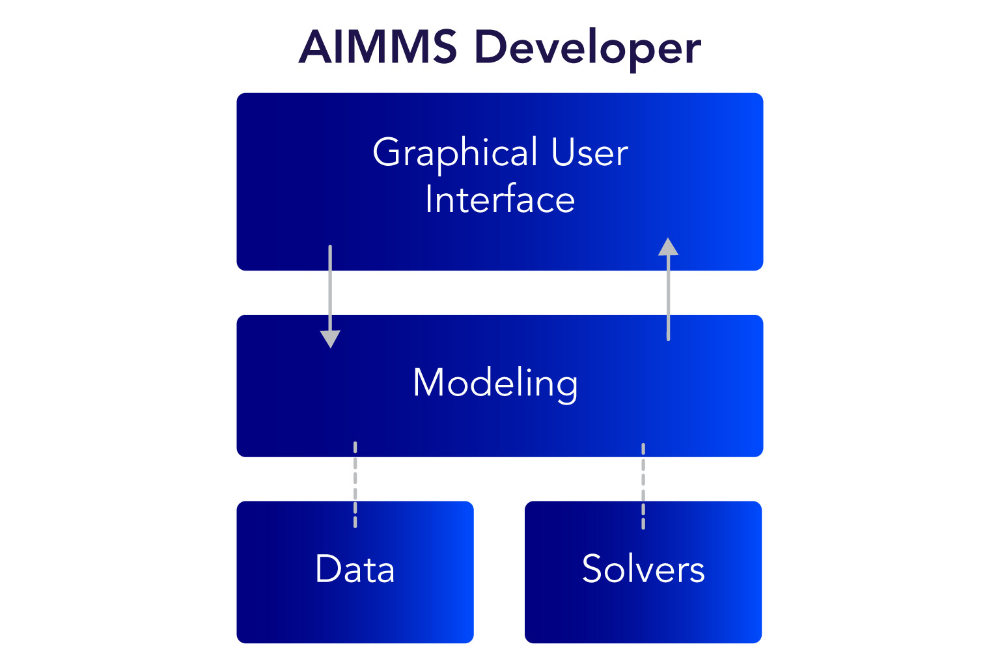
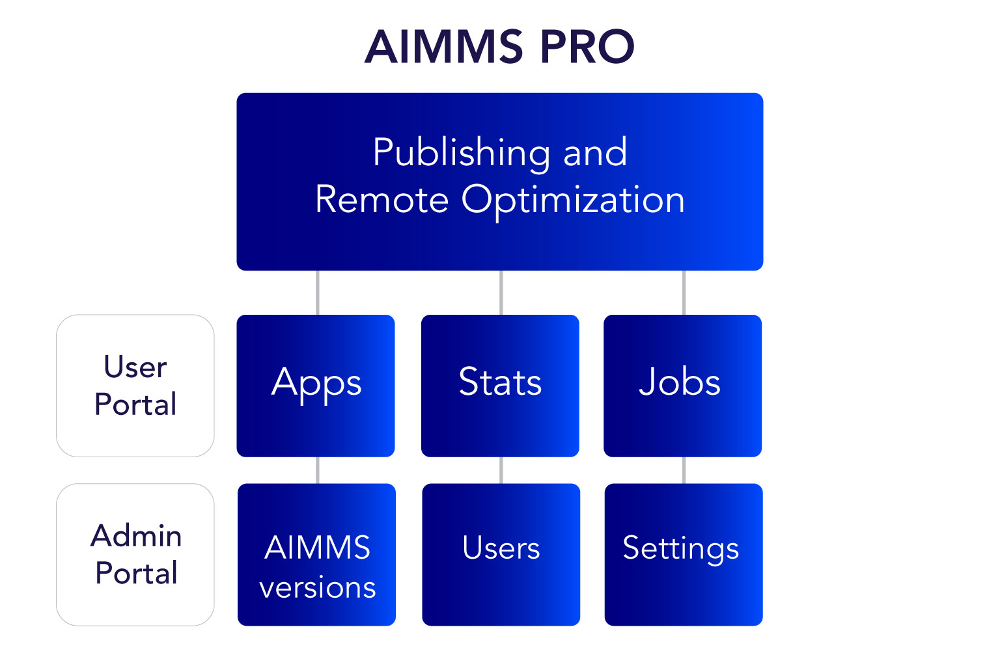

AIMMS Developer & Deployment Platform
======================================

AIMMS offers a configurable and scalable platform to build and deploy decision support applications.

The AIMMS development environment uniquely combines advanced modeling features and accessible design tools, such as the graphical model explorer, which allow you to build complex applications quickly.

AIMMS Developer
----------------
Build custom apps quickly in an intuitive IDE, including a modern WebUI builder to bring your model to life.

Robust IDE
^^^^^^^^^^

AIMMS Developer is a full-featured IDE providing everything you need to develop a high-performance optimization model and modern end-user application.

* State-of-the-art optimization engine
* Mathematical modeling language
* Access to high-performance solvers
* Intuitive development UI
* Multi-developer support
* Diagnostic and productivity tools
* Data management and connection options
* Integrated WebUI builder
* Localization of end-user interfaces
* Easy app deployment and maintenance with AIMMS PRO
* Extended functionality through links and libraries

Intuitive development UI
^^^^^^^^^^^^^^^^^^^^^^^^

Productivity tools reduce the workload of development and maintenance and speed up time to value for large-scale decision support applications.

Feature-rich code editor

* Configurable syntax highlighting
* Autocomplete and dropdown selection
* Function and procedure tooltips

Graphic model representation

* Model tree with drag and drop capability
* Form-based identifier selector

Integrated UI builder

* Component-based design
* Page and menu builders
* Page template manager

Mathematical modeling language
^^^^^^^^^^^^^^^^^^^^^^^^^^^^^^^
Intuitive multidimensional modeling language

* Model tree
* Attribute based declarations
* Procedures and definitions
* Optimization modeling

Advanced modeling language features

* Time-based modeling
* Units of measurement
* External procedures and functions
* Generated Math Programs (GMP Library)
* Parallel solver sessions
* AIMMS Outer Approximation algorithm
* Second order derivative evaluation for NLP models
* AIMMS Presolver
* Multistart NLP
* Stochastic programming
* Robust optimization
* Automatic Benders’ decomposition

For a full description of the AIMMS Mathematical Modeling Language see the :doc:`Language Reference <../../aimms_ref>`.

Integrated WebUI builder
^^^^^^^^^^^^^^^^^^^^^^^^
Create a modern UI with minimal design knowledge based on sophisticated and well-documented `UX-forward design <http://design-system.aimms.com/>`_.

* Maintain consistent :doc:`page layout </webui/quick-start>` with template managers
* Select and configure your pages using a library of components
* Style :doc:`customizable components </webui/css-styling>` and pages, and apps using basic CSS skills

Diagnostic tools
^^^^^^^^^^^^^^^^^^^
AIMMS diagnostic tools make it easy to debug logical and programming errors, reduce execution times, and isolate problems in your model.

* Debugger
* Data pages
* Profiler
* Identifier cardinalities tool
* Math Program Inspector

For a full description of the AIMMS Diagnostic Tools see the :doc:`User’s Guide </aimms_user>`.

Data management
^^^^^^^^^^^^^^^
For a full description of Data Management in AIMMS see the User’s Guide.

**Integrated Data Management**

AIMMS provides an advanced data manager.

* Create data categories holding blocks of related data (for instance topology data, or supply and demand scenarios).
* Data sets within categories can be combined and shared by multiple cases.
* Run cases in batch mode to perform an extensive what-if analysis.

**Database connectivity**

* ODBC data connectivity interfaces link your application to corporate databases and spreadsheets – Oracle, SQL, Sybase, MS Access, and others.
* Data wizards make it easy to map relations between tables.
* Built-in functions perform database specific tasks – to test the connections, to determine the underlying database table structures, or to directly execute SQL statements

**Excel connections**

Easily exchange data between an Excel spreadsheet and your AIMMS model.

The AIMMS Excel Library (AXLL) communicates with Excel files in server environments where Excel is not installed.

**Support for XML files**

AIMMS supports reading and writing XML files in almost every conceivable format.

* Mapping wizard helps map the XML schema for an XML file to multidimensional identifiers in your AIMMS model.
* Built-in functions read and write XML data according to your mapping.

Solvers
^^^^^^^^^

AIMMS gives you several high-performance solvers to work with various mathematical model types – Linear, Mixed Integer, Nonlinear, Mixed Integer Nonlinear, and others.

A standard AIMMS Developer license and installation includes:

* Rights to the world-class solver :doc:`CPLEX <solvers/cplex>`.
* Built-in links to open source `COIN-OR <http://www.coin-or.org/>`_ solvers CBC (LP/MIP) and IPOPT (NLP).
* AIMMS :doc:`Advanced Algorithms <solvers/advanced-algorithms>` – Outer Approximation, Benders Decomposition, and others.

You can also extend your license to include commercial solver add-ons.

All solvers are connected to AIMMS by using the :doc:`AIMMS Open Solver Interface <solvers/open-solver-interface>`, which links solvers through a collection of C++ interfaces.

For full listing of solver availability, see the Solvers page.

Links and libraries
^^^^^^^^^^^^^^^^^^^
Extend the core environment components with :doc:`existing libraries </library-repository>`, or make your own.

Link your AIMMS project to other data sources through our :doc:`DataLink Library </datalink/index>`.

AIMMS PRO
---------
Deploy apps to end users in your organization, with full administrative control of user access and easy-to-manage maintenance.

End user platform
^^^^^^^^^^^^^^^^^^
* End-users can start AIMMS applications through an Apps list
* End-users can watch and interact with jobs that are running on the server
* end-users can access the latest version of apps via a web browser
* end-users can view and manage data, create scenarios, and initiate optimization runs
* Statistics are available throughout the portal

More details can be found in the :doc:`AIMMS PRO platform documentation </pro/index>`.

Administrative platform
^^^^^^^^^^^^^^^^^^^^^^^^^^
The AIMMS PRO Portal provides a central control point for various users:

* Developers can upload/manage/start applications
* IT can upload/manage AIMMS versions
* IT can manage users and user rights
* IT can connect user management to Active Directory
* IT can assign special publication rights to users
* Statistics are available throughout the portal

More details can be found in the :doc:`AIMMS PRO platform documentation </pro/index>`.

Hosting
^^^^^^^^^
AIMMS PRO can be hosted by the AIMMS Cloud or on your own servers with an on-premise installation.

The AIMMS Cloud Platform is a fully managed AIMMS PRO environment. It is secure, reliable and up-to- date, and provides all the IT capacity you need within the limits of your license subscription. All you have to do is develop and publish your apps, and we take care of the rest.

More details can be found in the :doc:`AIMMS Cloud platform documentation </cloud/index>`.
