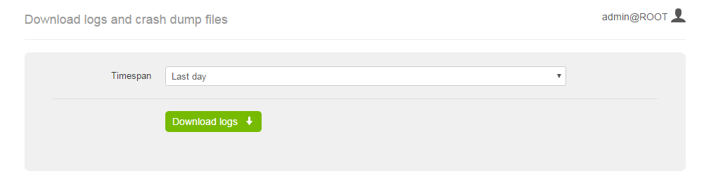
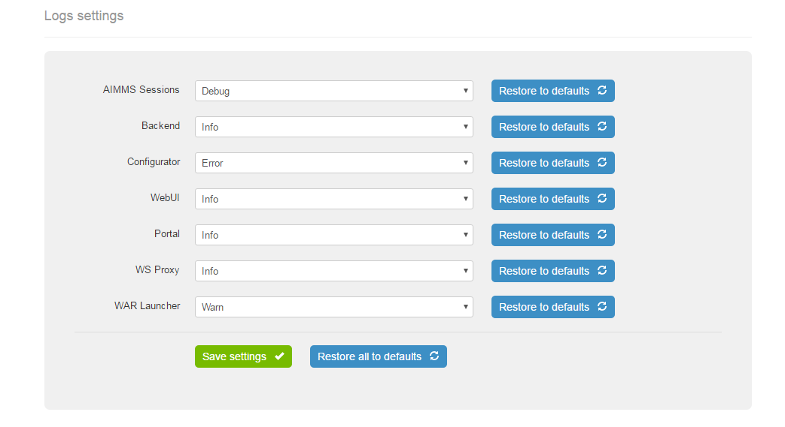

Log Management
--------------

Log Management is the page at AIMMS PRO Portal (starting from AIMMS PRO 2.11) which is available only for admin user at ROOT environment. So to access this page, you need to login as a admin user to ROOT environment, then click on menu item "Configuration" and then click "Log Management". 

This page consists of two sections.

Download logs and crash dump files
++++++++++++++++++++++++++++++++++

This section allows admin user to download log and crash dump files for this AIMMS PRO instance. User needs to select the time span for the downloaded files. By default, the time span is set to the last day, but it is possible to also download all files or files for specific period. To download files for the particular period, select "Specific dates" in the time span drop-down and then fill the start and end dates in the form that appears.

Please note that time span means "the files that were last modified in that period". So if some files were modified after the period, they would be filtered out.

After pressing the "Download logs" button, the user will get a zip archive with the files. That file will contain at least one of the following components:

* componentVersion.txt - the file with the list of AIMMS PRO components versions. That file is used by AIMMS Client Support to figure out if some issue has already been fixed in the next releases of AIMMS PRO
* Log - the folder with the log files. May not be present if there are no logs for the selected time span.
* ErrorReports - the folder with AIMMS crash dumps. May not be present if there are no crash dumps for the selected time span. Please note that AIMMS Version should be at least 4.22 in order crash dumps to be available.

Logs settings
+++++++++++++

In this section an admin user may change log level for different components of AIMMS PRO. To change the log level, select new value in the dropdown and press "Save Settings". Please take into account that the settings won't be applied immediately, it may take up to 10 seconds before logs are written with the new settings.

The components are the following:

* AIMMS Sessions - change this setting if you need more logs about the state of your solver or data sessions.
* Backend - change this setting if you need more information about the behaviour of the AIMMS PRO itself. For example, if you experience problems with permissions for an application.
* Configurator - setting for AIMMS PRO Configurator log level.
* WebUI - corresponds to the WebUI logs. Change it if you need to understand better what is happening within your WebUI application.
* Portal - change this setting if you need more (or less) logs for PRO Portal itself. Please note, that WebUI logs and logs for WS-Proxy have separate settings.
* WS Proxy - log setting for websockets proxy. Change this setting to figure out issues with tunnels or connections to the license server.
* WAR Launcher - generic web part of AIMMS PRO log setting. Probably, you almost never will need to change this setting.

.. note::
    
    In case of an issue, it makes sense to increase log level for several components. For example, if you have issues with a WebUI app, you may want to set log level for AIMMS Sessions, Backend and WebUI to trace. In case of general problems with a desktop app set log level to trace for Backend and WS Proxy. And if you have issue with a solver session, change log settings for Backend, AIMMS Sessions and WS Proxy. And, finally, you may just set all setting to the trace level, reproduce an issue and then restore settings to defaults. The latter would be the advised approach.

The log levels influence the amount of information you get in the logs. It goes from top to down: trace level gives you a lot of information, error level gives you very little information. It does not make sense to have log settings at trace level, because not only your disk space will be eaten very fast, but AIMMS PRO will also work slower, especially solver and data sessions. So after reproducing an issue with log level set to trace, we advice you to set it back to info level.

If the settings for a particular component cannot be read (e.g. you have very old installation), you will see a message saying "Could not parse config file. Please restore it to defaults.". In this case the logs are still written, you just cannot change the settings for that component from the portal. In order to be able to change them, restore settings for that component to defaults.

User can reset settings for a particular component or for all components at once to defaults using corresponding buttons. This may be useful in case of upgrade from an old AIMMS PRO version or when logs settings were changed in order to track a specific issue and now log levels may return to their default values.
