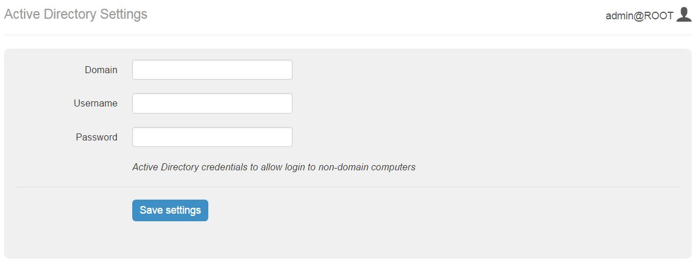
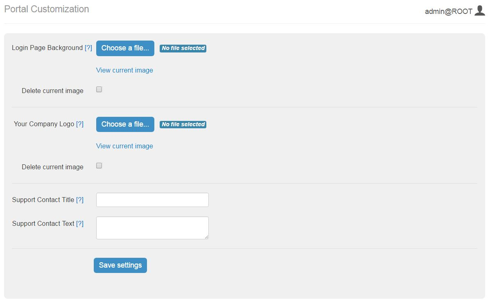
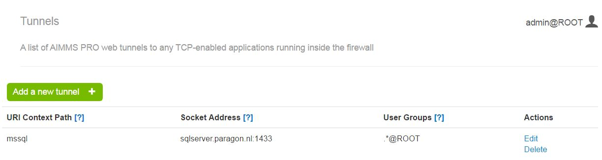
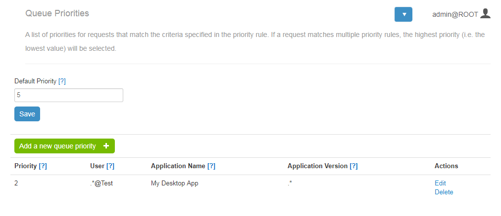
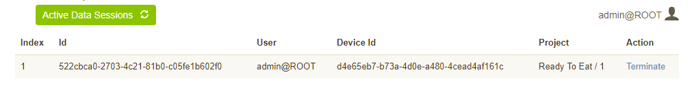
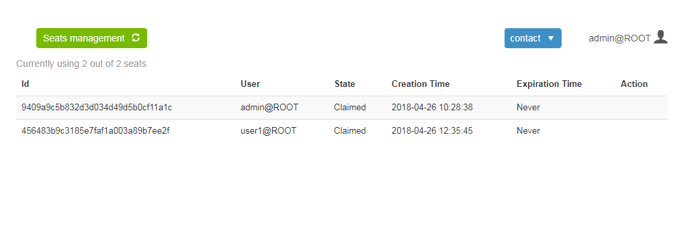

Configuration
=============

Starting with AIMMS PRO 2.16, in the PRO Portal, all the members of the admin group in the ROOT environment have a new menu available in the top horizontal navigation bar: **Configuration**. Using this menu AIMMS PRO administrator can configure several settings of AIMMS PRO like Active Directory, Retention Time settings, Portal customization and Tunnels. It also contains Log Management and Link to open AIMMS PRO Configurator.

AD Settings
-----------

This subsection allows you to specify the Active Directory credentials to allow loging in to non-domain computers

Retention Settings
------------------

This section allows you to set retention time (in days) after which a job will be removed from the list.

.. image:: images/retention-time-settings-new.jpg
    :align: center

Portal Customization
--------------------

These settings allows you to customise you AIMMS PRO Portal where you can upload Image for Login page and your Company logo. You can also specify in-house support contact details which will be displayed on all Portal Pages. (see below).

You need to specify following fields.

* Login Page Background - Background Image for the left-hand side of the login screen (JPEG, PNG or GIF). Image width should be between 640 and 2500 and image height should be between 800 and 2500.
* Your Company Logo - Logo for all portal pages except login page (JPEG, PNG or GIF). Image width should be between 10 and 120 and image height should be between 10 and 80.
 

You can view this image by "view current image" link and can delete current image by selecting "Delete current image" check box.
 
* Support Contact Title - The title for the support contact block (plain text).
* Support Contact Text - The text for the support contact block. This can contain any HTML.
 

The button Save Settings validates and save the settings. You must restart the services in order to see these changes on Portal.

Tunnels
-------

AIMMS PRO allows the AIMMS PRO Client to connect to the AIMMS license server and the AIMMS PRO backend via a websockets proxy running on the web port of PRO (the only port that needs to be opened in case PRO is running behind a firewall, by default 8080). By using the PRO Configurator to enable the tunneling functionality, any port and host reachable by PRO (but not by the client) can be made available via the websockets proxy.

Queue Priorities
----------------

A list of priorities for PRO jobs that match the criteria specified in the priority rule.

If a request matches multiple priority rules, the highest priority (i.e. the lowest value) will be selected. Here you need to enter the Default priority – the priority for all requests that have no other matching priorities. You may also add as many specific priorities as needed. For each of them you need to specify the following:

* Priority: a lower number means a higher priority.
* User: the user that runs the application. Use *.\** for all users of all environments, *.\*@* for all users of a specific environment, or *@* for a specific user and a specific environment.
* Application name: the name of an application. Use *.\** for all applications. Application names are case sensitive.
* Application version: the version of an application. Use *.\** for all application versions. Application versions are case sensitive.

Log Management
--------------

Log Management is the page at AIMMS PRO Portal (starting from AIMMS PRO 2.11) which is available only for admin user at ROOT environment. So to access this page, you need to login as a admin user to ROOT environment, then click on menu item "Configuration" and then click "Log Management". 

This page consists of two sections.

Download logs and crash dump files
++++++++++++++++++++++++++++++++++

.. image:: images/download-logs-and-crash-dump-files_v1.png
    :align: center

This section allows admin user to download log and crash dump files for this AIMMS PRO instance. User needs to select the time span for the downloaded files. By default, the time span is set to the last day, but it is possible to also download all files or files for specific period. To download files for the particular period, select "Specific dates" in the time span drop-down and then fill the start and end dates in the form that appears.

Please note that time span means "the files that were last modified in that period". So if some files were modified after the period, they would be filtered out.

After pressing the "Download logs" button, the user will get a zip archive with the files. That file will contain at least one of the following components:
* componentVersion.txt - the file with the list of AIMMS PRO components versions. That file is used by AIMMS Client Support to figure out if some issue has already been fixed in the next releases of AIMMS PRO
* Log - the folder with the log files. May not be present if there are no logs for the selected time span.
* ErrorReports - the folder with AIMMS crash dumps. May not be present if there are no crash dumps for the selected time span. Please note that AIMMS Version should be at least 4.22 in order crash dumps to be available.

Logs settings
+++++++++++++

.. image:: images/log-settings.png
    :align: center

In this section an admin user may change log level for different components of AIMMS PRO. To change the log level, select new value in the dropdown and press "Save Settings". Please take into account that the settings won't be applied immediately, it may take up to 10 seconds before logs are written with the new settings.

The components are the following:

* AIMMS Sessions - change this setting if you need more logs about the state of your solver or data sessions.
* Backend - change this setting if you need more information about the behaviour of the AIMMS PRO itself. For example, if you experience problems with permissions for an application.
* Configurator - setting for AIMMS PRO Configurator log level.
* WebUI - corresponds to the WebUI logs. Change it if you need to understand better what is happening within your WebUI application.
* Portal - change this setting if you need more (or less) logs for PRO Portal itself. Please note, that WebUI logs and logs for WS-Proxy have separate settings.
* WS Proxy - log setting for websockets proxy. Change this setting to figure out issues with tunnels or connections to the license server.
* WAR Launcher - generic web part of AIMMS PRO log setting. Probably, you almost never will need to change this setting.

Please note that in case of the issues it makes sense to increase log level for several components. For example, if you have issues with a WebUI app, you may want to set log level for AIMMS Sessions, Backend and WebUI to trace. In case of general problems with a desktop app set log level to trace for Backend and WS Proxy. And if you have issue with a solver session, change log settings for Backend, AIMMS Sessions and WS Proxy. And, of course, you may just set all setting to the trace level, reproduce an issue and then restore settings to defaults. Actually, that's the advised approach.

The log levels influence the amount of information you get in the logs. It goes from top to down: trace level gives you a lot of information, error level gives you very little information. It does not make sense to have log settings at trace level, because not only your disk space will be eaten very fast, but AIMMS PRO will also work slower, especially solver and data sessions. So after reproducing an issue with log level set to trace, we advice you to set it back to info level.

If the settings for a particular component cannot be read (e.g. you have very old installation), you will see a message saying "Could not parse config file. Please restore it to defaults.". In this case the logs are still written, you just cannot change the settings for that component from the portal. In order to be able to change them, restore settings for that component to defaults.

User can reset settings for a particular component or for all components at once to defaults using corresponding buttons. This may be useful in case of upgrade from an old AIMMS PRO version or when logs settings were changed in order to track a specific issue and now log levels may return to their default values.

Active Data Sessions
--------------------

Starting with AIMMS PRO 2.17.1, this page is added to the 'Configuration' menu. It displays the details of all active data sessions and ability to terminate the data session in order to release a seat(license). 

Please note that this functionality was already available through 'View details' link of the 'Cluster Setup' page under 'Monitoring' menu in AIMMS PRO versions lower than 2.17.1.

Seats Management
----------------

Starting with AIMMS PRO 2.23.0, this page is added back to the 'Configuration' menu. It displays detailed information about the usage of the client licenses and ability to 'Delete' reserved seats for WinUI apps. Client License sessions are counted per user per device combination, instead of per session meaning that one user can run multiple apps whilst only occupying one session.

