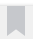
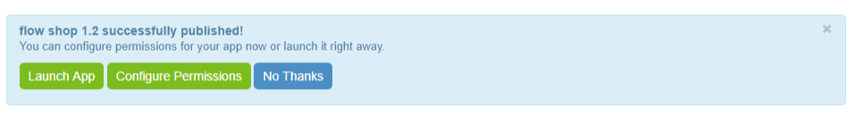
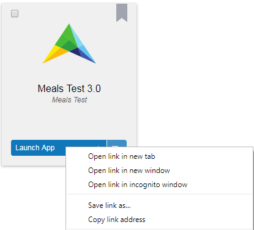
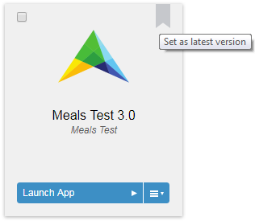
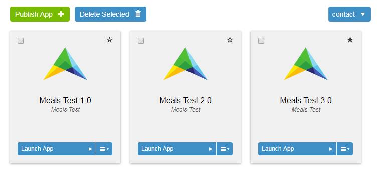

AIMMS Application Management
============================

Publishing Applications
-----------------------

Any PRO-enabled AIMMS project can be published onto an AIMMS PRO Server. PRO-enabled projects must be made available in the form of a .aimmspack file, and can be published through the **Apps** area of the portal. All members of the admin and the *AppPublishers* groups will have a **publish** button available in the **Apps** area, through which they can publish PRO-enabled .aimmspack files. After selecting a .aimmspack file and an (optional) application icon to be used in the portal, you have to provide some additional information about the application:
 
* Application name: the name by which the application will be identified within the AIMMS PRO Framework.
* Application version: the application version. The combination of the name and version should be unique.
* Description: a descriptive text to be displayed in the portal.
* AIMMS version: the published AIMMS version used to deploy the AIMMS application.
* License profile: the license profile to be used for server-side optimization sessions of this application.  
* Category: using this you can categorized your AIMMS PRO applications. This field is available only when you have added categories through Manage Categories. Please note that this feature is available starting with AIMMS PRO 2.25.

Starting with AIMMS PRO 2.30, it is possible to quickly launch your app right after publishing using 'Launch App' button on top of the Apps page.

	

.. note::

	Starting with **AIMMS PRO 2.28.3**, 'License profile' is no longer shown when there is only single profile for your AIMMS PRO.

Direct App Launch
-----------------

Starting with **AIMMS PRO 2.24**, it is possible to directly launch an application (desktop/WebUI) without first going to Portal's apps page after login. Any AIMMS application on your AIMMS PRO Portal is accessible by direct launch link i.e. *https://aimmsproserver/launch/AppName/AppVersion*

By default it will open default start page of an App. It is also possible to open a specific page by adding  */Main%20Project/Pagename*  to this link. i.e.  *https://aimmsproserver/launch/AppName/AppVersion/Main%20Project/Pagename*. 

.. note::

	This URL is case sensitive. i.e. MainProject(folder name), pagename specified in the link should match in case sensitive manner with the folder name, pagename inside your App for AIMMS PRO to recognize it correctly.

You can get this direct app link by right clicking the App icon or 'Launch App' and use options like Copy link address, add to favorites etc. Once you have bookmarked this link or created a desktop shortcut then you can directly open an app. This means AD/SAML users can start an AIMMS application in a single click (as login would be automatic for them) and other users will be first redirected to login page and after successful login it will directly load that particular app. 

	

Tag as latest
-------------

Starting from **AIMMS PRO 2.24**, if you have write access to the application, you can tag application as 'latest' by clicking |star-latest| icon (when you hover on any App). The idea behind this is, an AppPublishers or AppDevelopers can assign the 'latest' tag to the application when they publish a newer version of the same application so that end users can always have the newer(latest) version of the app available through direct app launch. 

* It's a unique tag, meaning only 1 version of the same app can be tagged as 'latest'. When you assign the 'latest' tag to other version of the app then it removes the tag from previous one.
* When you update the 'latest' App and use option 'Update and hide old version' then 'latest' tag will be assigned to new App.
* End users can always launch the latest version of the application using direct App link i.e. *https://aimmsproserver/launch/AppName/tag/latest* 
* To launch a specific page of latest App, you can append  *?page=Main%20Project/pagename*  to above link. For example, if you want to open 'Production Planning' page of latest 'Meals Test' App then link will be *https://aimmsproserver/launch/Meals%20test/tag/latest?page=Main%20Project/Production%20Planning* 

.. note::

	This URL is case sensitive. i.e. MainProject(folder name), pagename specified in the link should match in case sensitive manner with the folder name, pagename inside your App for AIMMS PRO to recognize it correctly. 

	

	

Manage Categories
-----------------

Starting with **AIMMS PRO 2.25**, it is possible to categorized your AIMMS PRO applications. Members of the admin group in the ROOT environment can add/edit/delete categories using 'Manage Categories' on the applications page. There is always one default category 'other'. Once you have added some categories to your portal, category field is available while publishing, updating or editing the application. If you do not assign any category to your application then by default it has 'other' category. Also on the applications page apps are shown in the alphabetic order of categories, applications with the 'other' category comes last on the page. 
	

Configuring User Access
-----------------------

After supplying the application details, you will get the possibility of setting the user access rights for this application. In the screen that follows, you will see a block for each environment, user group, and user.

Different Rights
----------------

In the blocks you will see three different rights:

* **r**: This stands for read access. If a user has read access for an application, it means that the user will see this application in his application list on his app screen.
* **w**: This stands for write access. If a user has write access for an application, it means that the user is able to modify the properties and access rights of the application. Furthermore, the user is also allowed to delete and update the application.
* **x**: This stands for execute access. If a user has execute access for an application, it means that the user is able to run the application.

For ordinary application access, you need to enable read and execute access.

Hierarchy of Rights
-------------------

Next to each of the rights indicators, you will see a color. If the circle is gray, it means that this user, or user group has the same rights as its parent (i.e. a user will inherit the rights from the user groups it is in and a user group will inherit the rights from its parent environment). For the particular case of environments, if permissions have not been defined yet (i.e. are gray), the users of that environment will not have any kind of access to that application. If the circle is green, it means that the user has this particular right, while the color red indicates that the user, user group or environment has been denied this particular access right. Deny will always take precedence over any other permissions in the Hierarchy of rights (e.g.: setting a red execute permission for an app at the environment level will prevent anyone in that environment from executing the app, even if that user or group have explicitly set green execute permission for the app; this same rule applies for users that are part of different environments, deny will always take precedence).

Changing Permissions
--------------------

After you have published the application, you can always change the access rights of the application through the **permissions** link in the info box of the application. You will only see this link if you have write access to the application.

Update and Delete Applications
------------------------------

If you have write and execute access to the application, you may also update and delete the application. When updating an application, after uploading a new .aimmspack file, the AIMMS PRO server will already copy all the settings and access rights of the application version you wish to upgrade, allowing you to change only those values that really need to be changed. You have the option to keep or to hide the previous version of the application. If you hide it, it will become invisible to all users, except those with global administrative privileges, but existing queued jobs will still be able to access it. If you delete an application, queued jobs may fail altogether. You are therefore strongly advised to select the option to hide the previous version, and only delete it after all queued requests have been completed successfully.

Starting from PRO 2.16, you can delete multiple Apps together by using 'Delete selected' button. This will also delete the application from PRO storage. 

Edit Applications
-----------------

Starting with **AIMMS PRO 2.25**, if you have write access to the application, you may also edit the application. This allows you to edit App description, icon and category (if you have any categories for your portal) after App publishing, which reduces the need to republish an app.

Windows 8 support
-----------------

In case your users use Windows 8 or above, only the applications published with an AIMMS version higher than 3.13.2.370 will work on their machines.
