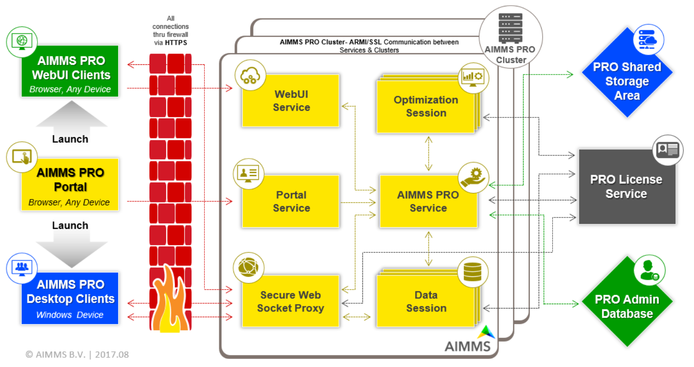

General Architecture
====================

.. note::

    This section of the AIMMS PRO documentation does *not* apply to the `AIMMS Cloud Platform <../cloud/index.html>`_. See `here <../cloud/architecture.html>`_ for AIMMS Cloud Platform specific architecture.

To provide you with a better understanding of what's going on in an AIMMS PRO setup in terms of communication between the various components, we created the following schema. Please click on it to see a larger version.

* `Overview from left to right <#overview-from-left-to-right>`_
* `Left: the users view <#the-users-view>`_
* `Mid: the provisions given <#the-provisions-given>`_
* `Right: the resources <#the-resources>`_
* `High availability and failover <#high-availability-and-failover>`_

Overview from left to right
---------------------------

This discuss this overview as it corresponds by going from the user view to the realization view.

1.	On the left we have the AIMMS PRO PORTAL in a browser.  Via this portal, a user can logon and subsequently launch either a WebUI data session or a Desktop client session.  
2.	In the middle we have the enterprise firewall which is passed thru, always, via HTTPS. As you know, HTTPS bases its encryption on SSL.
3.	On the right we have the PRO Cluster consisting of one or more PRO servers running Windows. Each server has three processes at the front: “WebUI Service”, “Portal Service”, and “Secure Websocket Proxy”. These three processes are serviced by a Jetty Application Server.  The central service at the backend is the “PRO Service”. The PRO service invokes zero, one or more data sessions and zero, one or more optimization sessions. The communication between these four services, data sessions and optimization sessions is via ARMI/SSL.
4.	On the far right we have three resources shared by the servers: the PRO Storage, the PRO Administrative database, and the license service. The PRO Storage stores the AIMMS packages, the apps, and the cases and is only accessed via the PRO Service.  Here SMB or CIFS is used to communicate. The PRO Admin Database is a PostgreSQL database storing information about users and apps, and is only accessed by the PRO Service via a secure database connection. The License Service is a service that connects to the other services via a binary proprietary protocol. 

The users view
--------------

Let’s zoom in to the left and detail the user requirements met.

The user starts with the PRO portal via a browser such as Chrome or Internet Explorer 8+. At this portal, the following actions are supported:

*	Uploading an AIMMS version. These versions are signed by AIMMS B.V.   
*	Uploading an AIMMS end-user application, a so-called app.  An app is created from within the AIMMS development environment from an AIMMS project by using SSL based encryption of the project.  
*	Launch a desktop application. Here a Windows computer is required.  We support Windows 7 and later. A desktop application runs its own data session. This is still a viable route when only Internet Explorer is available.
*	Launch a WebUI application. Here a Chrome browser is required. Since AIMMS 4.31.1 we also support IE 11 and Microsoft Edge.
*	Finally, the packages, apps, and running jobs are managed via this portal.

The provisions given
--------------------

Let’s zoom in on the middle and detail provisions given:

Each PRO server in the PRO cluster can handle each of the following tasks:

*	WebUI service
*	Portal
*	Secure Web-socket proxy
*	PRO Service
*	Zero, one, or more data sessions
*	Zero, one, or more optimization sessions

Together, the WebUI service, Portal, PRO Service and Secure web-socket service realize the PRO environment.

The most important tasks run on PRO are the data session and 0, 1 or more optimization sessions per data session.  There are two important distinctions between a data session and an optimization session:

*	A data session is solver-less.  The data session is actually run on the client computer when running the desktop client, and run on a PRO Server when running a WebUI app.
*	An optimization session supports solving mathematical programs and is always run on a PRO server.

The resources
-------------

Third let’s zoom in to the far right and detail the resources.

The PRO Servers in the PRO cluster make use of three unique resources:
*	The PRO Storage: disk space where the AIMMS packages, the apps, and cases (binary compressed data snapshots) are stored.
*	The PRO Admin database, this is a PostgreSQL databases where administrative data concerning, users, apps, access rights and so forth are stored.
*	The License service, this is a tool that allows you to monitor AIMMS usage.

High availability and failover
------------------------------

Let's aim for high availability and failover.

The PRO Cluster itself is designed for high availability and failover. There is a master, which is self-elected, spreading the tasks over the available servers in the cluster. Every minute, via the PRO Admin Database, all available servers check whether the master and its peers are still running. The incomplete jobs that ran on a server that went down are queued again for a maximum of three times.

Up to a point you can improve the availability of the entire system by improving the availability of the resources:

* You can improve the availability of the PRO Shared Storage Area by using a SAN, NAS or like storage device.
* There is no means yet to improve the availability of the License Service.
* You can improve the availability of the PRO Admin Database by replicating this database.

