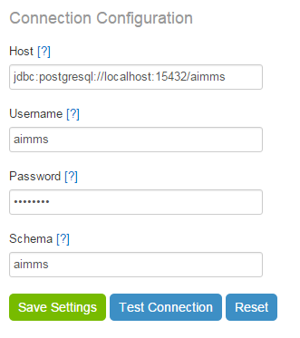
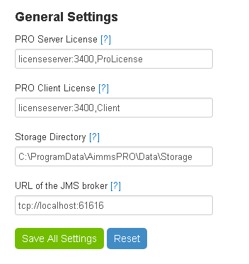
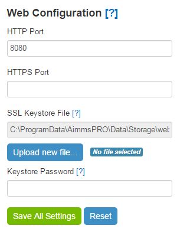
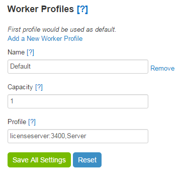
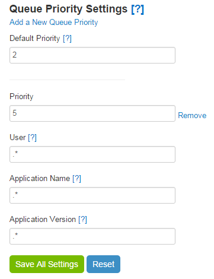
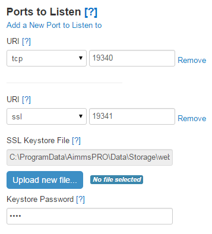
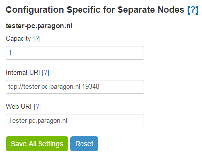
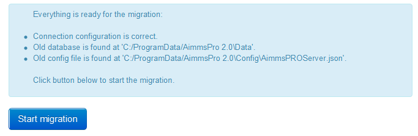
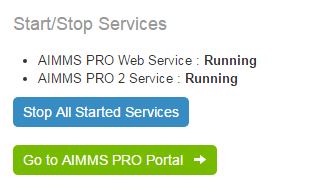
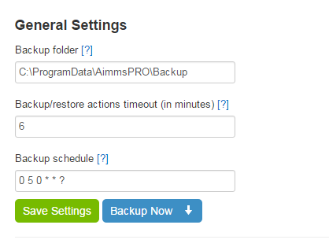

Various sections of the configurator
====================================

Connection configuration
------------------------

In the Connection configuration section, you can configure the PostgreSQL database that AIMMS PRO connects to for storing its internal data. PostgreSQL comes bundled with the AIMMS PRO installation, so there is no need to set it up separately. The bundled PostgreSQL installation works out of the box. You need to enter the host (in JDBC format). You may also need to change the username, the password and the schema name in the corresponding fields.

You can use the buttons at the bottom of the window to either save your database connection settings, to test them **(without saving)** or to reset the changes that you have made to the settings without saving. If the connection cannot be established with the settings you provided, you will see an error message describing what went wrong. **If you want your PRO to work in a cluster setup, you need to make sure that all your cluster nodes are connecting to the same database.** Please refer to the section `Setting up a cluster <cluster.html>`_ for further information.

PRO configuration
-----------------

In this section, you can change all settings related to your PRO instance(s). This includes both settings that are common for all nodes in a cluster (if you have one) and settings for any particular node in your cluster. This section contains the settings that were available in the AimmsPROServer.json file in AIMMS PRO 1.0. If you've performed a migration as described below, these settings will appear in this section; you will just need to make sure that they are correct. Some of the settings can be changed while running PRO; these will be applied immediately. If your changes however require a restart of all your nodes, you will get a message telling you so. The PRO configuration section consists of several subsections, each of which is explained in detail below.

.. note::

    Please note that after the fresh installation of AIMMS PRO, PRO configuration page is pre-loaded with some default information. Hence as an Administrator it is required to check this information and click "Save" before starting PRO services.

General settings
++++++++++++++++

These are the general settings that the whole of your PRO setup is using, i.e. all nodes in a cluster setup (if you have one), not just the machine on which you run the AIMMS PRO Configurator.

Here you may change the following settings:

* PRO server license: URI for the PRO server license on your license server. Format: :,
* Client license server: URI for your client-side AIMMS session license. Format: :,
* Storage directory: directory in which files are stored. **Should be shared between all nodes** (i.e. a shared directory on a network drive).
* Job retention time (days): time (in days) after which a job will be removed from the jobs list.
* URL of the JMS broker: URI of the server where JMS broker is running. Change this value only if your JMS broker is on a separate server when using AIMMS PRO Cluster functionality.

Please note that the last field 'URL of the JMS broker' is available in AIMMS PRO 2.17.1 or higher.

Web configuration
+++++++++++++++++

Here you can specify HTTP and/or HTTPS ports on which the AIMMS PRO portal will listen.

For HTTPS connectivity, you must specify an SSL Key store file (optionally with a password) containing the server certificate and the private key to be used by the portal server.

Worker profiles
+++++++++++++++

This section denotes which license profiles are available for server-side AIMMS worker sessions to perform server-based optimization tasks. Please note that the first (top) profile will be used as the default.

For each worker profile, you need to specify the following settings:

* Name: a name for the profile. Please give it some meaningful name, as it will appear on the publishing screen for a new app, where you will need to select the profile based on the name. **Please note** that if you change this value or remove this profile, then all projects that are already using this worker profile will be using the default (first) worker profile.
* Capacity: this value denotes how many sessions this license profile can handle at the same time. The capacity should match (be less than or equal to) the amount of licenses available through this license profile in the AIMMS Network License Server.
* Profile: server-side AIMMS session license. Format: :,

Queue priority settings
+++++++++++++++++++++++

A list of priorities for PRO jobs that match the criteria specified in the priority rule.

If a request matches multiple priority rules, the highest priority (i.e. the lowest value) will be selected. Here you need to enter the Default priority – the priority for all requests that have no other matching priorities. You may also add as many specific priorities as needed. For each of them you need to specify the following:

* Priority: a lower number means a higher priority.
* User: the user that runs the application. Use *.\** for all users of all environments, *.\*@* for all users of a specific environment, or *@* for a specific user and a specific environment.
* Application name: the name of an application. Use *.\** for all applications. Application names are case sensitive.
* Application version: the version of an application. Use *.\** for all application versions. Application versions are case sensitive.

.. note::
    
    Starting with AIMMS PRO 2.17.2, this section has been moved to the `Configuration <admin-config.html#queue-priorities>`_ menu of the AIMMS PRO Portal.

Queue rules
+++++++++++

A configurable list of rules that are applied to any request matching criteria specified for a particular rule. With these rules you can limit the number of jobs that can be run simultaneously by a particular user and/or a particular application on a particular node.

.. image:: images/queue-rules.png
    :align: center

If you want to introduce such a limit for each rule, you need to specify the following:

* Capacity: the maximum capacity that may be used for the jobs for this rule.
* User: the user that runs the application. Use *.\** for all users of all environments, *.\*@* for all users of a specific environment, or *@* for a specific user and a specific environment.
* Application name: the application name for the rule. Use *.\** for all applications. Application names are case sensitive.
* Application version: the application version for the rule. Use *.\** for all application versions. Application versions are case sensitive.
* Node name: the name of the node for the rule. Please keep in mind that nodes have their own capacity (see below), so the smaller capacity will be used to decide whether a node can process a particular job.

.. note::

    Starting from AIMMS PRO 2.17.1 or higher, this functionality is removed as the concept of AIMMS PRO Cluster has been changed from this version and now the jobs will be distributed randomly to the nodes of the cluster.

Ports to listen
+++++++++++++++

Port(s) on which the AIMMS PRO server will listen.

You may specify several ports – separate for internal and external connections (see External URI and Internal URI below). There must be at least one port to listen on, otherwise AIMMS PRO will not be able to operate. All nodes in your cluster will be listening to the same ports that you specify in this section. For SSL connections, you must specify an SSL Key store file that contains the certificate and private key to be used for the server, along with the password (if any) by which the SSL Key store file is protected. Each listening port has the following fields:

* URI: a protocol with a port to listen to. Format: *://:* (e.g. tcp://:19340).
* SSL Key store file: the file or URL of the SSL Key store (if needed)
* Key store password: the password (if any) by which the SSL Key store file is protected.

Configuration specific for separate nodes
+++++++++++++++++++++++++++++++++++++++++

A list of settings for the servers that can be used by the AIMMS PRO server to dispatch server-side AIMMS sessions to. Each node automatically appears in this list when you are `adding it to your cluster <cluster.html>`_. You cannot add or remove server nodes from within the AIMMS PRO Configurator.

For each node you can change the following settings:

* Capacity: the number of parallel sessions that this node can handle at a time.
* Internal URI: The host to which AIMMS PRO web server will connect to the backend server. The value entered here should have a matching 'ports to listen' configuration. Format: *://:* (e.g. ``tcp://myhost:19340``).
* Web URI: The host (without schema or port) by which AIMMS PRO web server will be available in user's browser. Usually, the default value is correct. Change this if the PRO host has a different hostname on the external network (the one that users are on). Format: *://:* (e.g. ``myhost``).

.. note::

    Starting from AIMMS PRO 2.17.1 or higher, this functionality is removed as the concept of AIMMS PRO Cluster has been changed from this version.

Migration from AIMMS PRO 1.0.x
------------------------------

The migration from AIMMS PRO 1.0.x is facilitated by the `AIMMS PRO Configurator <configurator.html>`_.

In order to perform a successful migration from AIMMS PRO 1.0.x to AIMMS PRO 2.0, you need to make sure that the following criteria are met:

* The Connection configuration should be correct. This means that the database that you have configured in the 'Connection configuration' section is available with the settings you have provided there.
* Your new installation should be using the same data folder as PRO 1.0. By default, it is 'C:\ProgramData\AimmsPRO'.
* The old database can be found at the 'Data' subfolder of your data folder from previous the criterion above. Look for the *AimmsPRO.db3* file, which contains the configuration information of your AIMMS PRO 1.0.x installation.
* The old configuration file can be found at the 'Config' subfolder of your data folder. Look for the *AimmsPROServer.json* file.

The AIMMS PRO configurator will check these criteria for you and will show an error message if they are not met. Otherwise, you can start the data migration using the corresponding button on the screen. 

..  note::

    Starting with AIMMS PRO Version 2.19.0 (2.19.0.303), Migration tab has been removed from the AIMMS PRO Configurator. If you need to migrate from PRO 1 to PRO 2, please migrate first to AIMMS PRO 2.0 and then upgrade to the latest version.

Start/stop services
-------------------

In this section you may start or stop AIMMS PRO 2.0 services and view service statuses.

You will not be able to start or stop services if your PRO configuration is not valid. If so, you will get a message telling you what is wrong.

Backup management
-----------------

AIMMS PRO Configurator has a section called “Backup management” that allows to manage backups of the AIMMS PRO database and configuration (but **not** the **storage folder**). Using this section PRO Administrator may manually make backups or schedule automatic backups (see below).

This section consists of three sections.

General settings
++++++++++++++++

These are the general setting for AIMMS PRO backups.

You may change here the following settings:

* Backup folder - path to the folder where the backups are stored on this server. By default the value is **%AIMMS_PRO_DATA%\Backup** (e.g. C:\ProgramData\AimmsPRO\Backup)
* Actions timeout (in minutes) - timeout for all backup-restore actions (in minutes). 0 means indefinite timeout. Change this value if you have a large PRO database and backup (or restore) of the database takes a long time.
* Backup schedule – a cron expression for running backups automatically. This cron expression is represented by six fields: second, minute, hour, day of month, month, day(s) of week where

- (\*) means match any
- \*/X means "every X"
- ? means no specific value.

Leave this field blank to disable automatic backups. Default value is :token:`0 5 0 * * ?` which means that backups will be created every day 5 minutes after midnight.

The button “Save settings” validates and saves backup settings.

The button “Backup now” immediately creates a backup.

Backups from current version of AIMMS PRO suite
+++++++++++++++++++++++++++++++++++++++++++++++

This section shows backups that were made from the current major version of your AIMMS PRO Suite. So if you had version **2.5.1003.100** installed, made some backups there, then installed **2.6.1001.200**, made some backups and later on upgraded to **2.6.1003.300** then you will see backups from **2.6.1001.200** and **2.6.1003.300** in this section. Backups from **2.5.1003.100** will go to “Backups from other versions of AIMMS PRO suite” section (see below).

.. image:: images/backup-currentversion.png
    :align: center

Each backup name contains the following:

* Version of the AIMMS PRO installation on which it was created
* Name of the node on which it was created
* Date and time of the creation

You may select several backups and delete them if needed. You may select one backup and revert your database and configuration to the state that backup presents. Of course, that would mean that you will lose all applications published after that backup point. But if you restore to backup that contains those applications they will be available again.

Backups from other versions of AIMMS PRO suite
++++++++++++++++++++++++++++++++++++++++++++++

This section shows backups that were made from the versions different from the current major version of your AIMMS PRO Suite. See explanation about current major version concept in “Backups from current version of AIMMS PRO suite” section above.

.. image:: images/backup-previousversion.png
    :align: center

You may select several backups and delete them if needed. You may not restore any backup from this section.

.. note::
    
    This backup section provides only possibility to backup AIMMS PRO database and its configuration files (that are located in **%AIMMS_PRO_DATA%\Config** folder, e.g. C:\\ProgramData\\AimmsPRO\\Config\\). PRO administrator needs to backup the **storage folder** using some external tools if that is needed (for example, `this way <https://technet.microsoft.com/en-us/library/dd851825.aspx>`_). There are lot of tools available for incremental backups.

.. spelling:word-list::

    cron