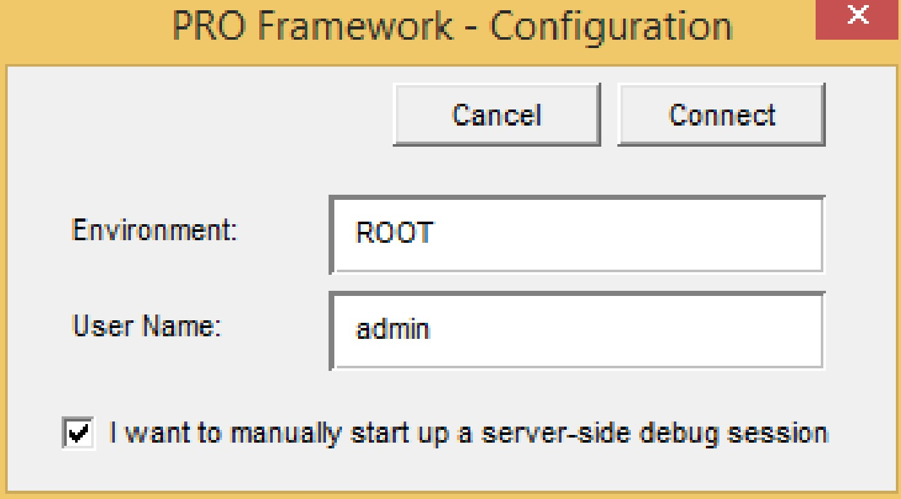
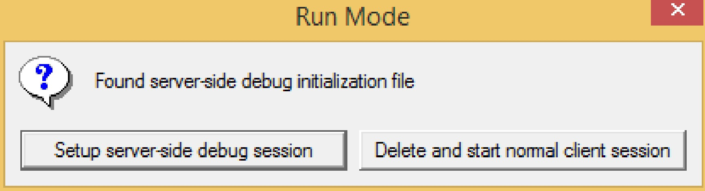
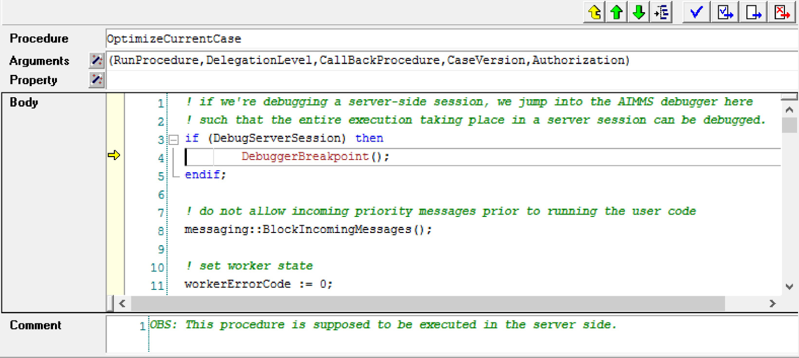

Debugging PRO-enabled Projects
==============================

When you start an application via the portal, the AIMMS PRO AppLauncher will download the .aimmspack file from the server, extract the contents, and start the installation-free PRO client version of AIMMS with an end-user license obtained from the AIMMS PRO server. Because a PRO client uses an end-user license, you are not able to use any of the AIMMS debugging tools to see what is going on in the client-side of the project in case of problems. To debug a PRO-enabled AIMMS project, you should start using the development version of your project, using the AIMMS developer version.

Connecting With the PRO Server
------------------------------

To connect a developer version of your project with the PRO server, a number of conditions need to be met:

* The PRO library version included in the development version of your project needs to match the version provided by the PRO server you are connecting to.
* Your development folder needs to contain a file "pro_arguments.txt" containing
    
  .. code::
    
        pro::ReadArguments(pro::CL) := data
        { _pro-modelname : "MyModel",
        _pro-modelversion : "1.0",
        _pro-dll-directory : "C:\\Users\\<user>\\AppData\\Local\\AIMMS\\PRO\\<Pro Server>\\AimmsPROLibrary-2.0\\vc120",
        _pro-environment : "ROOT",
        _pro-username : "admin",
        _pro-tmpfolder : "PROTemp",
        _pro-endpoint : "tcp://MyPROServer.mydomain.com:19340",
        _pro-language : "1" } ;
        
where the various fields should match the model name and version published on the server, with the PRO environment and user name you want to authenticate with, and with the endpoint through which your PRO server can be reached.

.. tip::
    
    Please note that debugging a project in combination with AIMMS WebUI is not supported.

Opening the Project
-------------------

When you open the project with an AIMMS developer license in the presence of a "pro arguments.txt" file, this file will define all the relevant command-line arguments necessary to setup the project's connection with the server. When such a file is present, opening the project with a developer license will cause the PRO library to use the contents of this file to properly initialize the project, as if it were started through the portal.

Logging on
----------

The first time the PRO library actually tries to connect to the PRO server, you will be asked to provide your logon information, as displayed in the figure below. The username and environment will be preset to the username through which you logged on to the portal. When you click **Connect**, you will be asked for your password, after which the connection to the PRO server is made. When you log on via Active Directory, you do not need to retype your password.

Debugging the Client Session
----------------------------

After this step has completed, you can use the AIMMS debugger to walk through the AIMMS code of your model and of the PRO library, to actually follow the flow of execution within a client session of your project, and to detect any errors that may occur at this stage of your project.

Server-side Session Debugging is Hard
-------------------------------------

When you initiate a server-side session from within your client session, it is nearly impossible to verify what is going on in such a server-side session when it is started by the PRO server. The only way to get information from such a session would be by adding lots of log statements, which you can analyze after the run to detect any problems during the run.

Server-side Debugging in Developer Mode
---------------------------------------

By checking the additional flag "I want to manually start up a server-side debug session" in the PRO Logon dialog box, however, the PRO framework will allow you to debug a server-side session within an AIMMS developer session. By checking the debug option, calls to pro::DelegateToServer will prepare a server-side session, but will not actually queue it for execution at the PRO server. Instead, it will create an additional file "debug arguments.txt" in the project folder. If you startup the project again, the dialog box below will appear. Here you can select whether you want to debug the server-side session you just created, or want to return to a regular client session.

.. warning::

    When the argument ``waitForCompletion`` of ``pro::DelegateToServer`` is set to 1, during the setup of the debug session, AIMMS will not return. Therefore you will need to set this argument to 0 when you setup a server side debug session.

Debugging a Server-side Session
-------------------------------

If you requested to debug the server-side session you just prepared, the project will start up in exactly the same way as it would when it would have been started by the PRO server. At the beginning of the procedure that will be called by the PRO framework to initiate the server-side session, the AIMMS execution will stop at the breakpoint illustrated in the figure below.

Debugging Your Model
--------------------

From here on, you can use the AIMMS debugger to track any problems that may occur in your model due to it being run in a server-side session. You can see what input cases will be read, you can examine whether all data that you expect to be present actually is, and how running your project under PRO will influence the optimization tasks that you want to be executed.