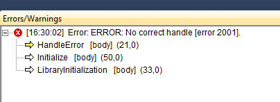

Commonly Encountered Errors
===========================

This section presents the most common errors that can be encountered during the use of an AIMMS PRO application.

Job finished with errors
------------------------

* **Error message**: Too many retries for starting 
* **Possible cause**: could appear because a free server license was not available when AIMMS PRO tried to start the application. AIMMS PRO attempts to start a job three times before showing this error.
* **Solution**: Make sure that you have enough licenses defined under the 'Worker profiles' section in the AIMMS PRO Configurator. Also, make sure that the AIMMS Network License Manager is reachable by AIMMS PRO.

Did not get a valid ticket from the server during Active Directory logons
-------------------------------------------------------------------------

* **Error message**: Did not get a valid ticket from the server during Active Directory logon, you may possibly not be a member of any AD-linked PRO group, and therefore be refused access. Please contact your application or AIMMS PRO administrator.
* **Possible cause**: As the message suggests, none of the AD groups that the user is part of exists as a user group in the environment that was linked to AD.
* **Solution**: The environment administrator needs to create a group in the AD linked environment with the same name as one of the AD groups that the user is part of.

Empty AllIdentifiers
--------------------

* **Observed behavior**: your AIMMS PRO-enabled model will start displaying undefined behavior when you have a statement to empty the pre-defined AIMMS set AllIdentifiers in your model. The cause is that this pre-defined set also includes all identifiers that are in the PRO library. As the correct functioning of the PRO library relies on these identfiers, your model will start to behave incorrectly if these are emptied.

* **Solution**: Don't use this statement. If you still want to empty 'all' of your identifiers (but not those in the PRO library), please create a subset of AllIdentifiers first which doesn't include the identifiers in the PRO library.

The icon for the application does not appear on the portal
----------------------------------------------------------

* **Observed behavior**: you've provided an icon for the application but when opening the list of the applications on the portal from another host the icon is not displayed

* **Possible cause**: this may happen if you have a cluster of several nodes. Each of the nodes would be running PRO Portal. The icon for the application will appear only on the portal on which you've uploaded the application. The application would work fine though.

* **Solution 1**: open the portal on the node on which the applications were originally uploaded.
* **Solution 2**: Ignore missing icons. The applications are still fully functional.

The jobs page on the portal is very slow
----------------------------------------

* **Observed behavior**: you have hundreds of jobs that you've run or still running. Now you're trying to open the jobs page on the portal and it takes a lot of time (e.g. 10 seconds) for that page to be fully loaded.

* **Solution**: Delete some jobs that you're not interested in anymore.

Jobs deletion is slow
---------------------

* **Observed behavior**: you have thousands of jobs that you've run. Now you're trying to delete them all on the portal and it makes your browser freeze for some time or even crash.

* **Solution**: Delete jobs in smaller batches (i.e. select a hundred of jobs, click 'Delete' button, wait until they are deleted and then delete another hundred.

Using ScheduledAt argument with wrong value leads to 'created' job
------------------------------------------------------------------

* **Observed behavior**: you've used the ScheduledAt argument of the pro::DelegateToServer function. For some reason you've used a string with the wrong format.The job is scheduled (i.e. launched), you don't get any error, but the job gets a 'Created' status and never gets out of that status.

* **Solution**: Delete the job, correct the ScheduledAt argument and launch the job again.

Error in model after launching an AIMMS client application
----------------------------------------------------------

* **Observed behavior**: the error could come in many forms, but it generally manifests after the application has started loading. However, the process will throw an error (most likely in the body of LibraryInitialization) and the application will not be usable (an example of error message can be found below).

* **Solution**: The most probable cause for this is that you are using an outdated version of the AIMMS PRO Library in your model. Update the library to the latest available version (note that since AIMMS 4.6 the AIMMS PRO Library is available as a system library; we recommend that you use this approach).
