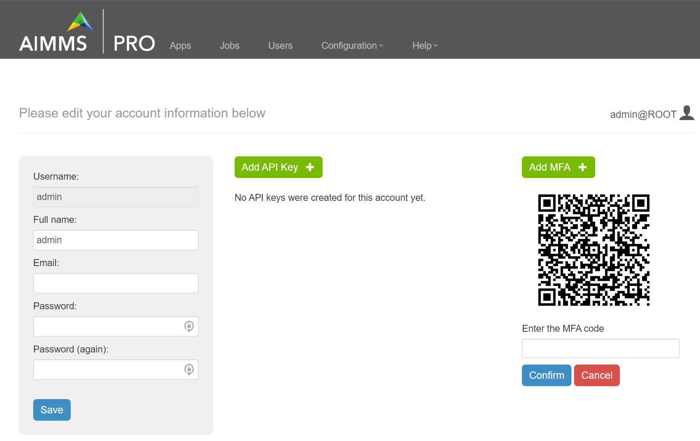
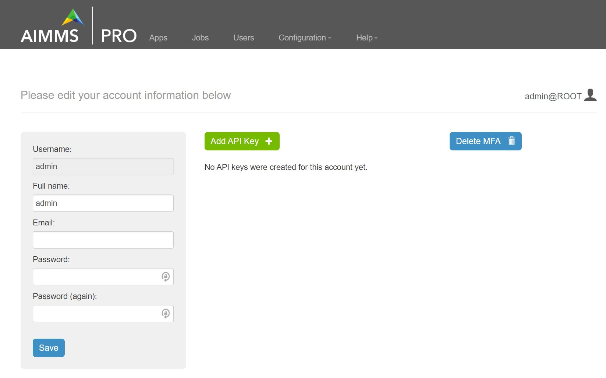

MFA for AIMMS PRO Portal 
************************

Starting with **AIMMS PRO 2.47.1** each user can enable MFA for his/her AIMMS PRO user account. It is not yet possible to enforce MFA for all user accounts in a customer account. We decided not to add that complexity as we will be replacing the entire user management component in the foreseeable future.

Enable MFA
==========

Users can enable MFA from their PRO Portal Account settings page by clicking the **Add MFA** button:

* When you click on Add MFA it will display the QR code.
* Please scan this QR code with your authenticator app on your mobile, enter the MFA code and click Confirm.
* Once you click on confirm MFA is enabled for your PRO Portal account. 
* When you login next time, after entering your login credentials you will be prompted to enter MFA.

	
	
Disable MFA
===========	

If you want to disable MFA then click the **Delete MFA** button on your Account settings page.

Note: MFA is not available for ActiveDirectory and SAML Users(i.e. users with SSO). 

.. spelling:word-list::

    authenticator
