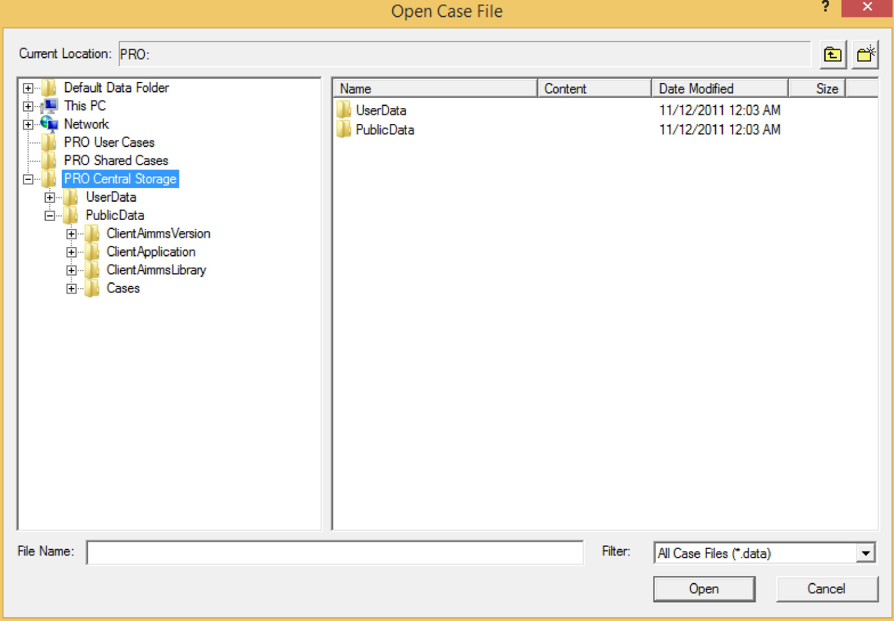

AIMMS PRO and Data Management
=============================

Where to Locate Data
--------------------

You can read data from files that are contained in the same directory as the published model, or in any of its subdirectories, if such files are exported as part of the .aimmspack file as well. You should, however, never write persistent data to such files, as a next session may be run from a different location, or even on a different server. If you need to write persistent data to disk, you should locate such files on e.g. a network share that can be reached from any server on which your server sessions are running.

PRO Central Data Management
---------------------------

Alternatively, when using the new data management style of AIMMS 3.12 or newer, using **Disk Files and Folders**, you will also be able to store case files directly on the PRO server. Whenever you open the AIMMS Case Manager dialog box from within a PRO client session, three new locations for saving and loading cases will become visible, as shown in the figure below.

PRO User Cases
--------------

The *PRO User Cases* area in the AIMMS Case Manager refers to an application-specific central storage location on the PRO server that is private to you. The storage location is the same for all published versions of the same application, so if the published application is upgraded, the data from previous versions is still available to you. You can access the cases stored in this location, from wherever you start the application. The data you store here, is not accessible for other users except those that are part of the admin group.

PRO Shared Cases
----------------

The *PRO Shared Cases* area in the AIMMS Case Manager refers to an application specific central storage location on the PRO server that is accessible for all users that have permission to run the application. The storage location is the same for all published versions of the same application, so if the published application is upgraded, the data from previous versions is still available to all allowed users of the application. All users allowed to use the application can also access the cases stored in this location, from wherever they start the application. The shared case area for a published PRO application is created and assigned the appropriate access rights when the application gets published. Please note that if any new or existing user has been assign the permission to run the application, then shared cases which where already created will not be available to this user. If user wants to access these cases then user must be added to some User Group which has the permission to run the application.

PRO Central Storage
-------------------

The *PRO Central Storage* area in the AIMMS Case Manager provides you with a full overview of the complete central storage area available on the PRO server. Each folder and file in this storage area can have read, write and execute access rights assigned to specific users and groups within PRO. These access rights determine whether specific folders or files will be visible to you in the AIMMS Case Manager, or whether you can write in certain locations. The Case Manager will automatically filter out all files and folders to which you have no access.

Central Case URL's
------------------

You can also programmatically load cases to or save cases from the PRO Central Storage area through existing AIMMS data management functions such as `CaseFileLoad` and `CaseFileSave`. The case URL for cases stored in the PRO Central Storage area consists of the prefix "PRO:" (to indicate to the AIMMS Case Manager that the case should be saved in the PRO Central Storage area), followed by the path in the central storage area.

User and Shared Case Shortcuts
------------------------------

The PRO User Cases and PRO Shared Cases are just shortcuts to folders into the central storage area:

* PRO User Cases is a shortcut to the path `/UserData/environment/user-name/Cases/project-name`
* PRO Shared Cases is a shortcut to the path `/PublicData/Cases/`

Checking folders or files exists in the PRO Storage
---------------------------------------------------

* :token:`pro::storage::ExistsBucket(path, bucketExists)` -  checks whether a folder exists in the PRO Storage, where :token:`path` is input string parameter and :token:`bucketExists` is output parameter, which determines the status whether bucket(folder) exists(1) or not(0).

    
* :token:`pro::storage::ExistsObject(path, objectExists)` -  checks whether a file exists in the PRO Storage, where :token:`path` is input string parameter and :token:`objectExists` is output parameter, which determines the status whether object(File) exists(1) or not(0).
	  
.. note:: The return value of these functions indicates whether there was an error; this is typically the case when you do not have the appropriate access rights to those buckets/objects. Suppose the bucket exists, but you're not allowed to access it's parent bucket it will return an error, but also leave the output argument to 0 (false). So you should check the return value and retrieve the last PRO error if applicable prior to evaluating the return value. These functions are available starting with **AIMMS PRO 2.33.1** and **AIMMS 4.69.1**.
 
Transferring Files
------------------

Besides centrally saving cases in the PRO Central Storage area through the Case Manager, you can also manually transfer files between your local disk and the PRO Central Storage area through the functions
 
* :token:`pro::SaveFileToCentralStorage`
* :token:`pro::RetrieveFileFromCentralStorage`

You can use these functions if your project depends on private files that need to be kept in sync from wherever you run a client session to the project, or depends on shared files that need to be kept in sync for all users from all locations. Both functions require a local path as well as a path in the PRO Central Storage area.

Manipulating PRO Files and Folders
----------------------------------

To manipulate files and folders in the PRO Central Storage area, you can use the following functions:
 
* :token:`pro::CreateStorageFolder`
* :token:`pro::DeleteStorageFolder`
* :token:`pro::DeleteStorageFile`

Access Rights
-------------

The functions :token:`pro::SaveFileToCentralStorage` and :token:`pro::CreateCentralStorageFolder` have an Access rights optional permissions string argument through which you can specify the access rights for the files and folders you create with these functions. When you do not explicitly specify access rights to the files and folders you create in the central storage area, PRO will automatically only give access to the currently logged on user.

Specifying Access Rights
------------------------

To select which users and/or groups should have which access rights, you can call the function :token:`progui::EditAuthorization` which is part of the PRO GUI library. This function will open the Authorization Manager dialog, through which you can modify a new or existing permissions string. You can then pass this string as the permissions argument to the functions above.

Using a Database
----------------

For communicating the data between the client and the server session, or between multiple server sessions, you also have the possibility to use a common database that both instances can access. If you do want to use a common database for data communication, ensure that you have the required ODBC drivers on both the server and client side installed. With regards to the server side, keep in mind that most drivers must be installed separately for the 32-and 64-bit version of ODBC.