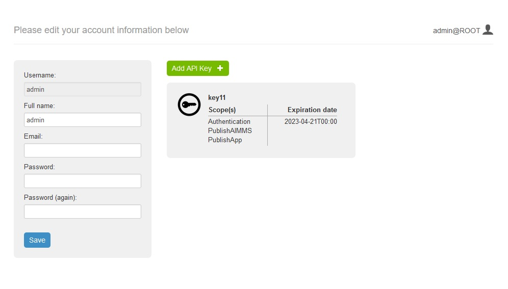
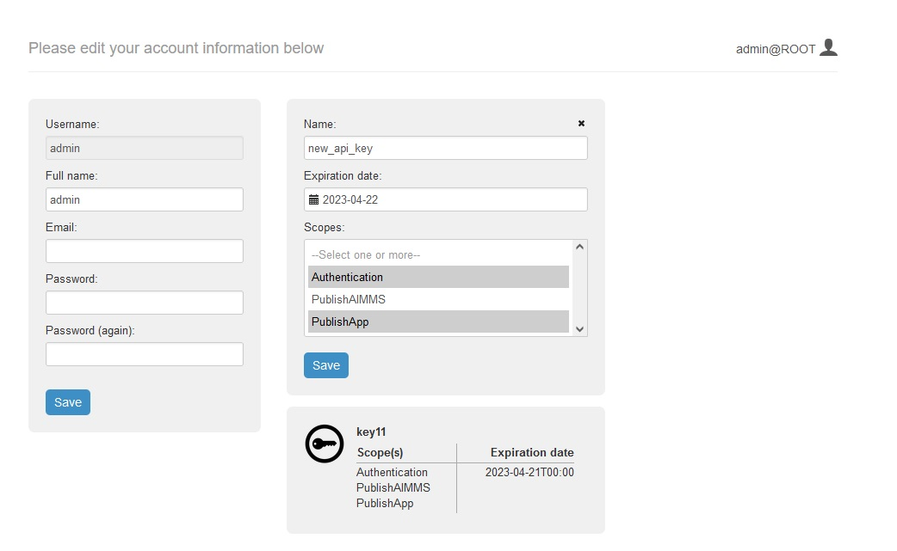
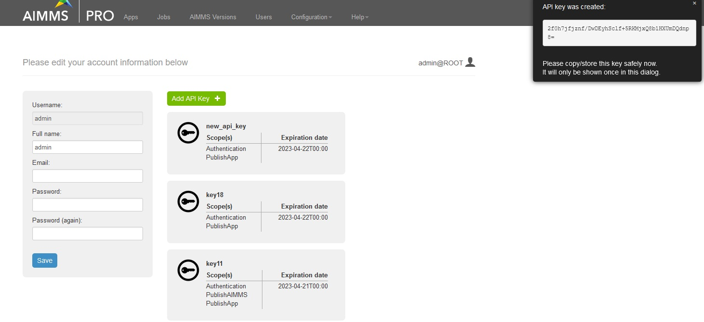
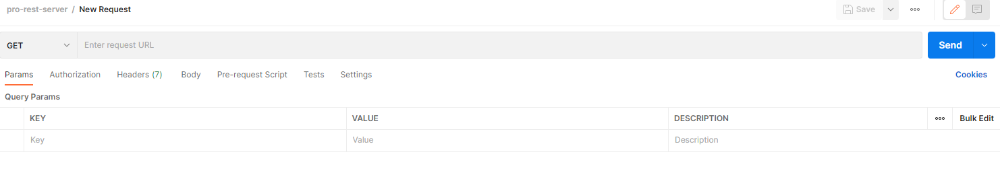
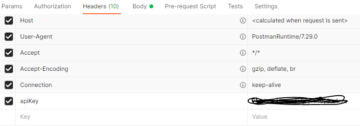
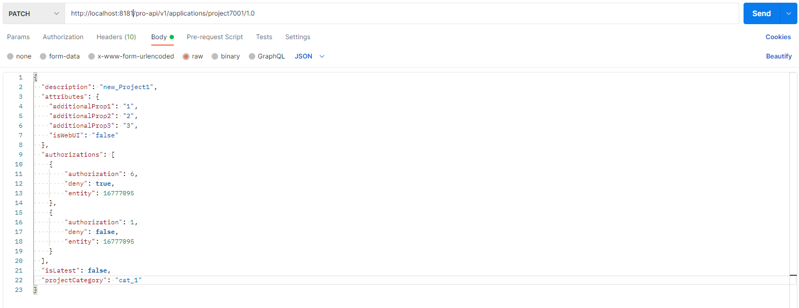
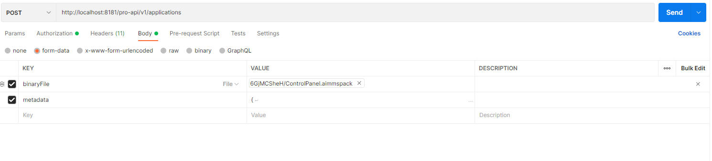

AIMMS PRO REST API
==================

The AIMMS PRO REST API allows users to securely interact with the AIMMS PRO cloud
platform via a REST interface. This API is designed following the
`OpenAPI Specification <https://swagger.io/specification/>`_ . The API itself can be downloaded in
YAML/JSON format from the link ``https://[account-name].aimms.cloud/pro-api/v1/``. The PRO REST API is
only available for the PRO Platform running in the Azure Cloud.

Security
--------

Requests made to the PRO REST API are authenticated/authorized by means of *API Keys*.
Users can generate *API Keys* from their PRO Portal *Account settings* page by clicking
the *Add API Key* button:

Pressing this button will open a new *API Key* editor, where the user can fill in
details regarding the key they want to create. The user should specify a key name,
an expiration date, as well as the *Scopes* for that key. Scopes are the
mechanism by which the user can restrict privileges for a given API key to
subsets of the PRO REST API:

1. The *Authentication* scope allows CRUD operations on Users/Groups
2. The *PublishAIMMS* scope allows operations on AIMMS Versions.
3. The *PublishApp* scope allows CRUD operations on AIMMS apps.

Pressing the *Save* button will generate a new API key with the properties selected by the user.
The new key is shown to the user in a pop-up window:

The key will only be shown in plain text once (for security reasons) - so the user
is advised to copy it ans store it securely. This key should be sent in the *apikey*
header for every REST call the user want to make using this key for
authentication/authorization.

Example: Using Postman to Publish an App
-----------------------------------------
This is an example on how to use `Postman <https://www.postman.com/>`_ in order
to perform CRUD operations an AIMMS applications (.aimmspack) using the PRO REST API:

1. Start in the Postman request view:

2. Based on the API method to be tested, select the GET/PATCH/POST/DELETE/etc
command from the drop down menu.

3. The request URL depends on the API spec. In some cases, request parameters are present in the URL.
Examples of the URL:

``https://[account-name].aimms.cloud/pro-api/v1/applications``

``https://[account-name].aimms.cloud/pro-api/v1/applications/{projectName}/{projectVersionId}``

To know what URL should be used, check the corresponding API spec.

4. Headers: within the scope of CRUD on applications, add an "apikey" header with the api key value.
Note that the header name must correspond to what is defined in the api spec. Make sure to tick the checkbox
after adding the "apikey" field. The rest of the header fields remain unchanged.

5. When updating an application, it is necessary to provide the body (in JSON) format. Do not forget to select
the "raw" format.

For an application update, the following arguments can be used (if an argument is not provided, then it wont be changed):

5.1 Project description ("description")

5.2 Project category ("projectCategory")

5.3 Latest app tag ("isLatest")

5.4 Project attributes ("attributes"): project attributes represent a list of key-value pairs that allow to store additional information about the project. Note that "isWebUI" entry is a reserved keyword which reflects if a project is a web UI or a win UI project.

5.5 Project authorizations ("authorizations"): project authorizations represent a list of entries, where each entry consists of three fields. See an example of an authorization entry below:

.. code-block:: php

        {
            "authorization": 1,
            "deny": false,
            "entity": 16777095
        }

The "entity" field is a unique ID of either environment, group or user. The "authorization" value varies from 1 to 7 is directly related to read ("authorization": 4), write ("authorization": 2) and execute ("authorization": 1) access. In order to enable multiple authorizations, add up the respective numbers. For example, ""authorization": 5" corresponds to read and execute access. The "deny" field is "true" or "false" when authorization is not, or is permitted.
It is also possible to grand the read permission and restrict the write permission for the same entity ID. This would look like the following:

.. code-block:: php

        {
            "authorization": 4,
            "deny": false,
            "entity": 16777095
        }

        {
            "authorization": 2,
            "deny": true,
            "entity": 16777095
        }

6. When publishing an application it is necessary to provide two fields: ``metadata`` and ``binaryFile``.
The field ``metadata`` needs to be provided in json format. The ``binaryFile`` field is a file upload that
requires to point to a specific location. Example: ``(C:\Users\UserName\Postman\files)``.
Insert the desired *.aimmspack* in files directory and point to this directory when uploading a ``binaryFile``.
Dont forget to select ``form-data`` format. Also note that both ``metadata`` and ``binaryFile`` names correspond
to ones defined in the API spec.

The ``metadata`` example is provided below:

.. code-block:: php

        {
            "name": "project7003",
            "description": "my_project",
            "projectVersionId": "3.0",
            "aimmsVersionId": "4.84.1.5-linux64-x64-vc141",
            "attributes": {
                "additionalProp1": "prop_1",
                "additionalProp2": "prop_2",
                "additionalProp3": "prop_3",
                "isWebUI": false
            },
            "isLatest": "true",
            "projectCategory": "cat_1"
        }       

Example: Using Postman to Activate an AIMMS Version
---------------------------------------------------
Postman can also be used to activate an AIMMS version via the REST API. The same basic one to four steps should be
followed as in the previous example. The last step is to perform the actual activation. This is done by performing
a ``PATCH`` operation on the ``https://[account-name].aimms.cloud/pro-api/v1/aimms-versions`` endpoint using the
body described in ``AimmsVersion.yaml`` in the API schema:

.. code-block:: aimms

        {
            "activated": true,
            "authorization": [],
            "id": "4.82.9.1-linux64-x86-vc141"
        }

.. spelling::

    projectCategory
	isLatest
    isWebUI

