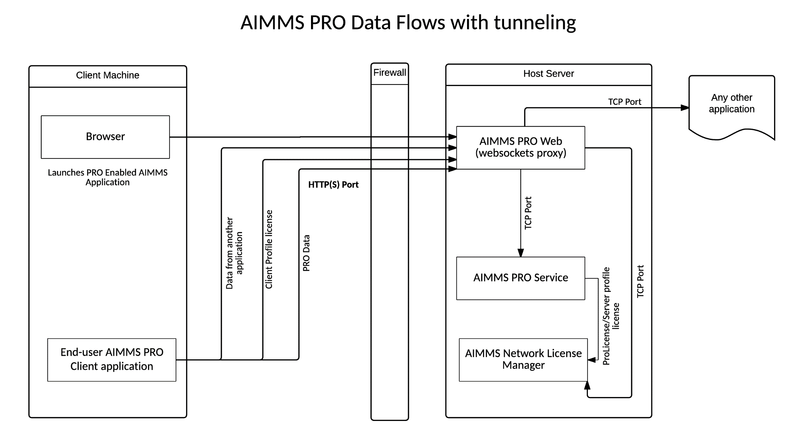
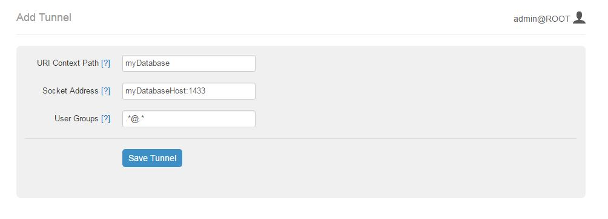

Tunneling support
=================

AIMMS PRO allows the AIMMS PRO Client to connect to the AIMMS license server and the AIMMS PRO backend via a websockets proxy running on the web port of PRO (the only port that needs to be opened in case PRO is running behind a firewall, by default 8080). By using the PRO Configurator to enable the tunneling functionality, any port and host reachable by PRO (but not by the client) can be made available via the websockets proxy.

General Design
--------------

AIMMS PRO consists of four components: 

* License Server,
* Backend,
* Web and
* Configurator
 

Only the Web component has a port that needs to be exposed to the outside world. It’s an HTTP(S) port in Web component. AIMMS PRO allows traffic to any TCP socket behind the firewall to be proxied via the HTTP(S) port.
AIMMS PRO Configurator allows administrator to change all needed configuration required for running AIMMS PRO. AIMMS PRO Configurator has a section called “Tunneling”. For configuration workflow see Configuration section of this document.

Based on the configuration provided in Tunnel Configuration, the Web component has a mapping of websocket URIs to TCP sockets. When the websocket connection is opened, a security check (details are below) is performed and the connection to the specified TCP socket is opened and all traffic goes through the websocket to and from that TCP socket.

The Client application (e.g. AIMMS Model) needs to be changed in order to support tunneling through websockets proxy. The changes that need to be made are described in Changes to AIMMS model section.

Tunnel configuration
--------------------

Starting from AIMMS PRO 2.16, PRO Portal allows Admin users (users who are member of admin group under ROOT environment) to configure tunnels to any TCP-enabled applications running inside the firewall. The look of this section can be found below.

Note: In lower AIMMS PRO versions (< 2.16), tunnels can be configured through AIMMS PRO Configurator. 

The proposed workflow for adding a new tunnel is the following:

* Administrator opens AIMMS PRO Portal in a browser (by default that would be http://myProHost:8080)
* He or she navigates to configuration menu and then to a section Tunnels
* In that section administrator clicks “Add a new tunnel” link and an input form appears (see the image above).
* Administrator inputs all three required parameters – URI context path, Socket address and User Groups (see the detailed information about parameters below).
* Administrator saves the configuration and PRO Portal validates the input.
* If the input is correct the tunnel can be accessed immediately. Otherwise administrator sees validation errors and needs to fix the configuration to make it valid.

Existing tunnel can be modified or deleted using the same section in PRO Portal.

The configuration parameters for the tunnel are the following:

* **URI context path** – path in the URI of the AIMMS PRO Web sockets proxy to which this tunnel will be mapped. URI context paths are case-insensitive (so “Context” and “context” point to the same path).
* **Socket address (TCP)** – the combination of an IP address (or a host name) and a port number for the proxied application.
* **User Groups** – semicolon (;) separated list of AIMMS PRO users that can use this tunnel (Do not use *spaces* in the list i.e. *group1@ROOT; group2@Test* is not valid).
 
    * The default is .*@.* meaning all PRO users are authorized to use this tunnel. 
    * Specific groups go in the form Group@Environment. 
    * .*@Environment means that any user with permissions to access that environment can use that tunnel. 
    * Group@.* means that user belonging to that group on any environment can use that tunnel.
 
Example scenario
++++++++++++++++

PRO administrator wants to create a tunnel with the following parameters:

* Tunnel works for a database that is available on host *myDatabaseHost* at port *1433*
* It is accessible for users that belong to the group *AppPublishers from environment MyEnv or AppUsers from environment AnotherEnv*
* Proxy can be accessed via URI *ws://myProSHost:8080/ws-proxy/myDatabase*

In order to configure such a tunnel PRO administrator does the following:

* Opens PRO Portal, navigates to Configuration menu and then to a Tunnels
* Clicks “Add a new tunnel” and then inputs the following parameters:

    * URI context path - *myDatabase*,
    * Socket address – *myDatabaseHost:1433*,
    * User Groups – *AppPublishers@MyEnv;AppUsers@AnotherEnv*.

* Clicks “Save” and then after validation new configuration is saved and the proxy is available.

Please note that in order to work with the proxy you also need to modify your client application so that it connects via web sockets, simply pointing application to  *ws://myProSHost:8080/ws-proxy/myDatabase* instead of *myDatabaseHost:1433* won’t work. The required changes are described in Changes to AIMMS model.

Validation rules
++++++++++++++++

The validation rules for the tunnel configuration are the following:

* URI context is unique. Please not that context paths “backend” and “license” are used internally by AIMMS PRO so those paths are reserved.
* Socket address should be in the form ipAddress:port (e.g. 127.0.0.1:1433) or host:port (e.g. localhost:1433).
* User Groups and Environments should be present in the list of user groups and environments that can be viewed/configured on PRO Portal.

Security
--------

AIMMS PRO provides the security in the following way:

* You can configure all your connections to go via HTTPS instead of HTTP.
* For every request you need to provide a PRO Ticket that can be obtained from AIMMS PRO Backend by providing username and password or using Active Directory. Ticket has expiration date and needs to be periodically renewed.
* PRO Ticket contains user ID so that PRO backend can check permissions. Every user and/or user group may have different permissions. User may belong to one or more user groups.

The AIMMS PRO Tunneling uses the existing security model:

* All connections to websockets proxy can go via HTTPS
* For every connection to websockets proxy a PRO Ticket needs to be provided.
* Administrator can restrict usage of websockets proxy only to some PRO user groups and/or some environments as described in Configuration.

What ports need to open to the external world?
++++++++++++++++++++++++++++++++++++++++++++++

If your application uses AIMMS PRO Tunneling then the only port that needs to be exposed is HTTP(S) for AIMMS PRO Portal. All other application may stay behind the firewall.

How to setup HTTPS connection to AIMMS PRO Portal/AIMMS PRO Configurator
++++++++++++++++++++++++++++++++++++++++++++++++++++++++++++++++++++++++

Refer to `this section <config-config.html#web-configuration>`_ of the AIMMS PRO manual for information on HTTP/HTTPS setup for AIMMS PRO Portal.
If you also want to secure access to AIMMS PRO Configurator then change configurator.properties file in Config subfolder of your AIMMS PRO data folder (by default that would be C:\\ProgramData\\AimmsPro\\Config\) and restart AIMMS PRO Configurator Service.

How to make sure that tunnels configuration is not altered
++++++++++++++++++++++++++++++++++++++++++++++++++++++++++

AIMMS PRO reads tunnels configuration from AimmsPROWeb.json that is located file in Config subfolder of your AIMMS PRO data folder (by default that would be C:\\ProgramData\\AimmsPro\\Config\\). You may use some tool to parse that JSON file and make sure that the following section is correct:

.. code::

    {
      "server": {
        ...
           "webSocketsProxy": {
          "socketBufferSize": "262144",
          "tunnels": [
            {
              "context": "context",
              "socketHost": "someSocketHost",
              "socketPort": "234",
              "userGroups": "admin@ROOT;users@ROOT"
            }
          ]
        },
        ...
      },
     ...
    }

Please note that this file should be secured in such a way that nobody from the outside can modify it.

Who can change tunnels configuration
++++++++++++++++++++++++++++++++++++

AIMMS PRO Configurator requires login using username and password for admin user at ROOT environment on PRO server. It means that only that user may configure AIMMS PRO. Password for that user can be changed in PRO Portal.

Monitoring the PRO Configurator logs
++++++++++++++++++++++++++++++++++++

AIMMS PRO Configurator logs all changes to PRO configuration at debug level. In your log file (by default that would be C:\\ProgramData\\AimmsPRO\\Log\\ AimmsPROConfigurator.log, see corresponding `Server-side Logging <logging.html>`_ section of the PRO manual for details) you will see messages similar to this one:

.. code::

    10:10:14.441 [qtp1169794610-21] DEBUG c.a.p.c.s.config.ConfigServiceImpl.saveConfig():62 - Saving config PROConfig{authenticationConfig=AuthenticationConfig{ticketExpirationTime=86400}, publishingConfig=PublishingConfig{, clientLicenseProfile='licenseserver:3400,Client'}, serverConfig=ServerConfig{proLicenseProfile=' licenseserver:3400,ProLicense', listenPorts=[com.aimms.pro.configurator.dto.config.ListenPortConfig@ce00a2a6], tunnels=[TunnelConfig{context='mssql', socketAddress='sqlserver:1433', userGroups='Domain Users@PDT'}]}, serverNodes=[ServerNodeConfig{host='proHost', capacity=1, internalUri='tcp://proHost:19340', webUri=’proHost'}], storageConfig=StorageConfig{storageDirectory='C:/ProgramData/AimmsPro\Data\Storage'}, portalConfig=PortalConfig{httpPort='8080', httpsPort='null', pkcs12File='', keystorePassword=''}, adConfig=ADConfig{domain='', username='', password=''}, sessionConfig=SessionConfig{jobRetentionInDays=30, defaultLevel=5, queuePriorities=[QueuePriority{priority=5, user='.*', appName='.*', appVersion='.*'}], queueRules=[]}, workerProfiles=[WorkerProfile{capacity=1, name='Default', profile='licenseserver:3400,Server'}]}

As mentioned above only one user – admin@ROOT may access the Configurator so you always know the user who changed the configuration.

You may change logging settings for com.aimms.pro.configurator.service.config.ConfigServiceImpl  so that it outputs log to a separate file (or a database). Please refer to `logback documentation <http://logback.qos.ch/documentation.html>`_ for further details.

Changes to AIMMS model
----------------------

As mentioned above in order to work with the websockets tunnel you also need to modify your AIMMS model:

1.	The tunnel needs to be created; a socket on localhost is opened and the AIMMS PRO library will tunnel this to the websocket endpoint.
2.	The original code that connects to the target server needs to be modified to connect to the localhost/port instead.
3.	The tunnel should be closed to free up resources when it is no longer necessary.

Important things to check when setting up a database tunnel
+++++++++++++++++++++++++++++++++++++++++++++++++++++++++++

* The correct driver should be installed on the server
* The correct driver should be specified in the connection string (as it is available on server).
* When running multiple SQL Server instances on the same machine, only one of those instances is running on the default port, others run on different ports.
* Try to create the correct connection string (using the ODBC dialogs etc or DB4) on the server before testing with AIMMS.
* Make a small AIMMS model that just connects, no other complex stuff.

Tunnel creation
+++++++++++++++

Use the following AIMMS PRO Library procedure:

.. code::

    tunnel::TunnelStart( contextPath : string )

Calling the start procedure will effectively connect to *ws://myProSHost:8080/ws-proxy/* and open up a listen socket on the localhost and return the portNumber. Under the hood, the server will verify ticket validity, etc. and potentially raise an error to indicate starting the tunnel failed. 

Change the target server endpoint
+++++++++++++++++++++++++++++++++

We will take as a first example an AIMMS model with an ODBC connection string like this:

.. code::

    DBConnectString:="Driver=SQL Server;Server=sqlserver.example.com,1433;Database=testDB;Uid=tester;Pwd=test123;"

It needs to be altered such that it connects to the local tunnel entry-point like this:

.. code::

    DBConnectString:=FormatString("Driver=SQL Server;Server=localhost,%i;Database=testDB;Uid=tester;Pwd=test123;", tunnelPortNumber);

As a second example:

.. code::

    DBConnectString:="DRIVER=Oracle in OraDB12Home1;dbq=oracle.example.com;UID=tester;DSN=OracleTestDB;Pwd=test123;" ;"

It needs to be altered such that it connects to the local tunnel entry-point like this:

.. code::

    DBConnectString:=FormatString("DRIVER=Oracle in OraDB12Home1;dbq=localhost:%1;UID=tester;DSN=OracleTestDB;Pwd=test123;", tunnelPortNumber);

Note the differences between these examples; the connection string should be built according to the specifications of the database vendor.

Tunnel shutdown
+++++++++++++++

Use the following AIMMS PRO Library procedure:

.. code::

    tunnel::TunnelStop( portNumber : parameter )
    
Known issues
------------

The current state of AIMMS PRO Tunneling is that the so called *happy flow* works. It means that it is possible to develop AIMMS models that use this functionality but error handling is not user-friendly yet and you need to close the tunnel implicitly.

Known bugs/things not yet operational:
++++++++++++++++++++++++++++++++++++++
 
* The actual tunnel is setup upon first connect from the client; if an error occurs on pro-level, e.g. not allowed to use tunnel, no proper error message is given, instead the socket is just closed and the client connecting (e.g. the ODBC SQL driver) will give an error, saying it is not able to connect
* When you have started a tunnel, you must close it as well, otherwise this will cause a hang when trying to exit AIMMS. It is possible to circumvent this by calling pro::tunnel:TunnelStopAll() in pro::LibraryTermination.
