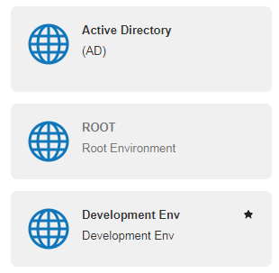

User Management
===============

In the Users area of the portal, you can perform all user management tasks related to AIMMS PRO. The following user management concepts are supported:

* Environments
* Groups
* Users

Environments
------------

An *environment* within AIMMS PRO denotes an entity of users which is clearly separated from the users in all other environments. For instance, through the concept of environments you may provide AIMMS applications to multiple companies or departments within a company, where you can (but need not) delegate the user administration of a particular environment to a user within that environment. Each environment can make its own distinguishable set of AIMMS applications available to its users. Each environment can be linked to a separate Active Directory domain, to allow a single sign-on experience for the users of that environment. AIMMS PRO supports up to 127 environments.

Groups
------

Within each environment, you can define one or more user groups, to which you can assign one or more users from within the same environment (but, if you see the need, also from other environments). Groups allow you to introduce *role-based* authorization within AIMMS PRO, because the authorizations of all AIMMS PRO objects are defined in terms of users groups as well as individual users.

Users
-----

*Users* represent the users of the AIMMS PRO Framework. You can assign particular roles to a user by associating that user with a user group corresponding to the intended role. For each user, you can specify such information as their full name and email address. Any user must be part of at least one user group. User accounts are either password protected for standalone environments, or are authenticated against a linked Active Directory domain to provide a single sign-on experience.

Starting with AIMMS PRO 2.23.0, strong passwords are enforced when you change the existing password or create new user. Your password must be at least 12 characters long, must contain at least 1 letter, 1 digit and 1 special symbol.

The ROOT Environment
--------------------

By default, AIMMS PRO comes with a single environment installed, the ROOT environment. The global admin account is part of the ROOT environment, as well as a number of system groups. These associations cannot be changed and the permissions cannot be revoked for this user through the AIMMS PRO permission mechanism.

* The admin group: all users in the admin group have global administrative privileges equal to the admin account.
* The AIMMSPublishers group: all users in this group are allowed to publish AIMMS versions. These AIMMS versions can be used to run published AIMMS applications.
* The AppPublishers group: all users in this group are allowed to publish AIMMS applications.

Please note that these system accounts and groups cannot be deleted.

Creating a New Environment
--------------------------

Within the portal, any user with global administrative privileges can create new environments. Each environment is created by default with an admin group and user within that environment. The admin user of a particular environment (with default password admin), and members of its admin group, have full administrative privileges within that environment:

* they can add, delete and modify users and groups within the environment,
* they inherit the same access rights to objects in- and outside of the environment as assigned to any of the environment's users or user groups,
* they can link an environment to an Active Directory domain.

The admin group and user associated with an environment cannot be deleted.

Default Environment for login
-----------------------------

Starting with **AIMMS PRO 2.24**, members of the admin group in the ROOT environment can mark any environment as the 'Default' environment for login to the AIMMS PRO Portal by clicking the 'star' icon |star-environment| on the right side of the environment box. 

* Default environment is always marked with  |star-environment| icon.
* There can be only one default environment for your AIMMS PRO Portal.
* Administrator can anytime unmark or change the default environment. 
* The environment marked as 'Default' will be always selected on the login screen so that user does not need to select the environment each time when login to the portal. 

	
	

Hierarchy
---------

Within an environment, user groups and users have a hierarchical relation: if you click on an environment, you will see all the user groups in the environment. Similarly, if you click on a user group, you will get to see all of the users that are in the selected user group.

Adding New Entities
-------------------

Above the column of each type, there is an add link that allows you to **add** a new item of the type of that column. This way you can add new environments, add new user groups to the currently selected environment or create new users within the current user group.

Adding a New User
-----------------

By clicking on the **add** link in the column of the users, you will create a new user. When you create a new user, you will be presented with a list of properties to be filled in for the new user like the username, password, full name, and email address. By default, the newly created user will only be in the last selected user group.

Group Membership
----------------

You can add an existing user to another group simply by dragging the user onto that group. You can remove a user from a group by first clicking on the group you want to remove the user from. After that, you can click the unlink icon of the user to remove. Note that each user must be member of at least one group.

A user can login only login to an environment where that user was created. Even if that user is a member in a group in another environment, he/she may only login to their original environment. 

Editing and Deleting Users and Groups
-------------------------------------

If you hover over a user or user group, you will see two icons appear. These two icons will allow you to either edit or delete that entity. In case of users, you will also get the aforementioned third icon to unlink the user from the currently selected user group.

.. spelling::

    unmark