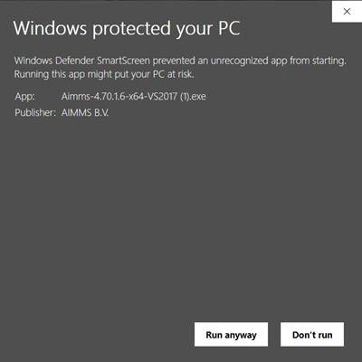

AIMMS Release Notes
=====================

.. topic:: Hotfix Releases

   We release hotfixes for severe bugs as soon as possible after internal testing. For less severe bugs, we may combine several fixes into a single release.

This page provides details of changes made in each AIMMS version. For an overview of our feature releases, see `New Features <https://www.aimms.com/english/developers/downloads/product-information/new-features/>`__.

#############
AIMMS 4.74
#############

AIMMS 4.74.7 Release (August 14, 2020 - build 4.74.7.8)
------------------------------------------------------------------------------------------

Resolved AIMMS Issues
+++++++++++++++++++++++++

-  When the value of a datasource was very long, AIMMS disappeared after some of the wizards of the database table.

Resolved WebUI Issues
+++++++++++++++++++++++++

-  The WebUI did not use annotations that were specified on the parent nodes of a symbol in the model tree.

Resolved Security Issues
+++++++++++++++++++++++++

-  No security-related changes were made in this AIMMS version.

--------------

AIMMS 4.74.6 Release (August 10, 2020 - build 4.74.6.3)
------------------------------------------------------------------------------------------

Resolved AIMMS Issues
+++++++++++++++++++++++++

-  When the connection with the database was broken during the execution of a read statement, a misleading error message "Function Sequence Error" could be reported.
-  In recent AIMMS versions, variables with a domain condition that uses a sub expression like (i IN {'a','b'}) were not always generated correctly.
-  In recent AIMMS versions, the construct (i IN { 1..5 }) did not always work when used inside the body of a function.

Resolved WebUI Issues
+++++++++++++++++++++++++

-  The search functionality in the widgets has been updated to search based on 'Element Text Identifier' values if configured.
-  Map nodes were not getting deleted from the map widget after emptying the node-set data.

--------------

AIMMS 4.74.5 Release (August 4, 2020 - build 4.74.5.2)
------------------------------------------------------------------------------------------

Resolved AIMMS Issues
+++++++++++++++++++++++++

-  There was a problem that sometimes occurred when modifying values on a WebUI page that also contained references to a calendar set. The bug resulted in a crash of AIMMS.
-  Models with a complex definition structure could suffer from long or even infinite compilation duration since 4.73.
-  We addressed various issues in the new definition evaluation handling that was introduced in 4.73.
-  There was a performance issue in the generation of a mathematical program.

Resolved WebUI Issues
+++++++++++++++++++++++++

-  Upon editing a Table cell, the "reload" icon could appear, after which the cell would stay on busy mode endlessly.
-  Side panels content did not align well on a workflow page.

--------------

AIMMS 4.74.4 Release (July 21, 2020 - build 4.74.4.5)
------------------------------------------------------------------------------------------

Resolved WebUI Issues
+++++++++++++++++++++++++
-  Warnings raised from within the model are now correctly communicated to the end user if the `communicate_warnings_to_end_users` option has been set.
-  Handling of name changes for widget properties that incorrectly contained an index specification has been improved.
-  Improved handling of the redrawing of (changed) arcs and nodes results in better Map performance.
-  For line charts that contain multiple lines, annotations are now correctly applied to all involved lines and their elements.

--------------

AIMMS 4.74.3 Release (July 6, 2020 - build 4.74.3.2)
------------------------------------------------------------------------------------------

Resolved AIMMS Issues
+++++++++++++++++++++++++

-  Renaming an identifier while a library has an index or element parameter with that same name, could accidentally rename the identifier in the library as well.
-  We added an error message for an unsupported combination of a defining procedure and a domain condition expression.

--------------

AIMMS 4.74.2 Release (July 1, 2020 - build 4.74.2.8)
------------------------------------------------------------------------------------------

Resolved AIMMS Issues
+++++++++++++++++++++++++

-  In specific cases publishing an AIMMS model on PRO yielded a 'unable to publish model' error.
-  For some datatypes, Unicode characters were not sent correctly to the database.
-  When a Halt statement was executed, in a next definition evaluation that uses a procedure, only the first statement in that defining procedure was executed.

Resolved WebUI Issues
+++++++++++++++++++++++++

-  A warning will be shown if a valid page contains an invalid redirectPageId and some error messages related to workflow have been improved.
-  When a bubble was highlighted in a Bubble Chart widget and then an X bubble-point was selected, the previously selected bubble was no longer highlighted.

--------------

AIMMS 4.74.1 Release (June 23, 2020 - build 4.74.1.0)
-----------------------------------------------------

AIMMS Improvements
+++++++++++++++++++++++++
-  **IMPORTANT:** When the .ams file is written to disk, AIMMS itself now uses tabs instead of 4 spaces. This reduces the size of the .ams file up to 30%. Because AIMMS versions before 4.73 do not expect tabs as indentation, models saved in AIMMS 4.74 may introduce unexpected issues when opening them in versions older than 4.73. You can prevent this by first opening and saving the model in 4.73. After that, the model will be compatible with older versions again. When the .ams file is managed by a versioning system (such as git), .ams files will have changes on all lines.
-  The CPLEX, Gurobi and ODH-CPLEX options related to heuristics have been placed in the new MIP Heuristic category.
-  The math program suffix BestBound and the GMP functions for retrieving the best bound can now also be used to obtain the best bound for a continuous problem (NLP, QP or QCP) solved with BARON and for non-convex quadratic problems solved with CPLEX or Gurobi.
-  The solver ODH-CPLEX 5.0 is now available. ODH-CPLEX 5.0 uses CPLEX 12.10 underneath. Whereas, ODH-CPLEX 4.0 uses CPLEX 12.8. Therefore, the new options for ODH-CPLEX 5.0 stem from the CPLEX part. For some MIP cases, the results obtained by ODH-CPLEX 4.0 are not deterministic. This behavior is fixed in the ODH-CPLEX 5.0.
-  A scaling tool has been added to the Math Program Inspector. It can be used to scale linear optimization models by selecting the Scale Model action. The tool will determine scaling factors for all (symbolic) variables and constraints which can be viewed in the Scaling Factors tab. By selecting the Resolve action in the Math Program Inspector you can resolve the model which will then automatically use the new scaling factors.
-  The logical iterative operators Atleast, Atmost, Exactly are now handled by the new compiler and execution engine. AIMMS took the opportunity to make their behavior more consistent: their second argument now has a restriction to be a non-negative integer (there were no restrictions before). An error will be issued if this is not the case. Furthermore, when the Atleast and Exactly operators have an empty domain as their first argument and zero as their second, the return value is 1 (this was not the case before, which was incorrect).
-  When requesting help on a function in the model editor using the right mouse menu command Help-On, you are now re-directed to a help topic in the online Function Reference.
-  When writing data to a database via the ODBC Driver, parameters can be used for each row, but for some vendors and ODBC drivers this can be slow. Therefore, AIMMS offers an alternative flat-string technique for a few vendors. This alternative was already available (and the default) for MySQL databases and is now also implemented for MS SQLServer and PostgreSQL. There is a new option `Database insert as flatstring` (under AIMMS\Database interface) with which one can control whether this technique is used for the mentioned vendors. Based on performance experiments, the default for MySQL and PostgreSQL is to use this flat-string technique, and for MS SQL Server not to use it.
-  The default value of the option 'Database String Valued Foreign Keys' has changed from 'Check' to 'Ignore'. See also the help documentation on this option. The default is changed because checking the foreign key information can be very expensive (depending on database vendor) whilst for most models this is not relevant. **IMPORTANT:** When your model writes to a database table which has string valued foreign key columns to another table, you may need to consider the best value for this option. When the value is 'Ignore' (now the default) and an empty string would be written to such a column, a runtime error will be reported.
-  From now on, in new models only, Aimms interprets reference dates as UTC times by default i.s.o. local-no-DST times.

	What is affected:
	Functions that use default-timezone reference dates. (StringToMoment and MomentToString)
	The begin and end date of calendars that have granularity smaller than a day.
	The storage in cases of such calendars and element parameters pointing into them.

	Why this change:
	Until now, the meaning of times changed when the model was opened in another timezone. 2 o'clock in the US was still shown as 2 o'clock in China. When building a multi timezone/multi user application in Aimms, this is probably not what you want. This may already occur when running Aimms in the cloud, as the server may be in a different timezone, and thus lead to unexpected results even if the model is to be used for only one location.
	Though the convertReferenceDate function can be used to work around this problem within the model, times in cases were also stored in local time. Any attempt to load a case created in another timezone would lead to incorrect data when trying to work with nonlocal timezones.  

	Notes:
	
	-  This change is only applied to new models: Since the meaning of strings signifying reference dates is changed, automatic conversion of old models is not possible 
	-  In timeslot formats, always using a timezone explicitly is advisable. Even if display in every user's local time is intended, DST should be taken into account, and thus 'localDST' should be used. Timeslot formats that do not specify a timezone are still using 'local' time. 
	-  When using an hourly calendar, specifying minutes in the timeslot formats is advisable. It is uncertain if at some point the calendar will be shifted off the full hour, esp. when timeszones get to be used in timeslot formats.

Resolved AIMMS Issues
+++++++++++++++++++++++++

-  There was a situation in which renaming an identifier 's' in the main model also changed the unit [s] in the WebUI library.
-  If the CPLEX option 'print presolve status' was switched on, any action in the Math Program Inspector that triggered a solve (e.g., Resolve) would result in a crash. This bug was introduced in AIMMS version 4.71.1.
-  The warning "The maximum of 20 warnings reached, further warnings suppressed. See also option maximal_number_of_warnings_reported" was not shown in the error window of AIMMS.
-  The properties ElementsAreNumerical and ElementsAreLabels did not always have the intended effect when the logical value of a corresponding element was checked as part of an OR/AND/XOR expression.
-  Clicking a checkbox in the WinUI Pivot Table while having the WebUI open could lead to a crash.

 
WebUI Improvements
+++++++++++++++++++++++++
-  Item Actions are now available for the Table, Scalar, Gantt, Bar, Line, Bubble, Pie, and Treemap charts as well.
-  The list widget is now an official feature and is removed from the experimental features.
-  Previously, whenever a column on which you sorted, contained an element parameter over a calendar, the string representation of the date was used to sort upon, alphabetically, leading to an unexpected ordering. Now, such a column is sorted according the order of the dates in the underlying calendar.
-  The formula for calculating the bubble size is updated and improved. Sizes are calculated based on the area, same as the map. Also, Added maximum reference size to size the bubbles based on a fixed value.

Resolved WebUI Issues
+++++++++++++++++++++++++
-  The Pivot Tab in the options of the Bubble chart widget was broken.
-  Console errors were displayed while opening the option editor for Table widget contents and adding/removing identifiers from the Bubble chart widget.
-  The WebUI will now actually make use of your browser's configuration for preferred languages and thus also of any provided translations for that language, when available. See https://documentation.aimms.com/webui/multi-language.html#multi-language-support for details.

--------------

#############
AIMMS 4.73
#############

AIMMS 4.73.5 Release (June 08, 2020 (build 4.73.5.7)
-----------------------------------------------------------------

 Changes made in this release are listed below. A high level overview can be found at the `AIMMS New Features Page <https://www.aimms.com/english/developers/downloads/product-information/new-features/>`__.

Looking for best practices on how to use AIMMS? Check out the `AIMMS Knowledge Center <https://how-to.aimms.com/>`__.

Resolved AIMMS Issues
+++++++++++++++++++++++++

-  In some cases, execution of a statement locally overriding units could be slow.
-  When re-compiling the entire project, initial data of sets was reinitialized, while it should have happened only for sets where the initial data attribute was actually edited.
-  If a multi-dimensional identifier only contained one very small value (smaller than 1e-8), its data was not correctly stored in a case file.
-  Using a color scheme in the WinUI 2D Chart did not work correctly if the scheme was linked to a subset of AllColors with a definition.
-  We made some changes to the function axll::FillList: (1) The argument DataRange is no longer optional, (2) the default values in the tooltip were not correct, and (3) the comment referred to the wrong function.
-  From various similar crash reports that were sent in recently, we did improve a weak spot in the code of version 4.73. Most reported crashes occurred during the saving of a case.

Resolved Security Issues
+++++++++++++++++++++++++

-  No security-related changes were made in this AIMMS version.

--------------

AIMMS 4.73.4 Release (May 28, 2020)
-----------------------------------

Build 4.73.4.11

Resolved AIMMS Issues
+++++++++++++++++++++++++

-  In some situations, an identifier with a definition did not have the correct value after loading a case file. This was an error only in previous 4.73 versions.
-  If a definition contained a call to function A and if in the body of that function A another function B was called, the definition was not always triggered when the parameters used in the function B were modified. This error only happened in earlier 4.73 versions.

Resolved WebUI Issues
+++++++++++++++++++++++++

-  The ``webui::FlagsIdentifier`` annotation was not always taken correctly into account in widgets with multiple identifiers, some of which having indices that were used during aggregation.
-  In rare situations, the webui.json could miss a specific line. If so, not all webui pages were available for navigation using the ``webui::OpenPage`` procedure.
-  'Totals on top' were moved to the bottom when a Table column (or row) was sorted. Now, they correctly stick to the top.
-  Item actions work on touch devices as well now.

--------------

AIMMS 4.73.3 Release (May 25, 2020)
-----------------------------------

 Build 4.73.3.8 

Resolved AIMMS Issues
+++++++++++++++++++++++

-  In just created procedures, sometimes a local parameter retained the value from the previous procedure call. The problem disappeared after closing and reopening the model.
-  In some cases when WebUI was using data slicing over a literal (fixed) element, an error about this fixed element could be wrongly triggered. This incorrect behavior was introduced in the 4.73.1 release.
-  We fixed an error in a recent implementation of the model editing functions. It could result in various problems, one of which was that profiler results disappeared unexpectedly.
-  The profiler data in definitions of sets or parameters was not visible. This bug was only in the early 4.73 versions.
-  The styles of inactive secondary page actions were broken.

Resolved WebUI Issues
+++++++++++++++++++++++

-  There were some duplicate Gantt chart setting attributes in the miscellaneous tab of its options editor.
-  Creating data widgets with invalid 'literal' contents (i.e. no AIMMS identifier) could result in a crash. Now, an empty widget will be shown in such cases and you can use the UI to fix the contents of your widget.

--------------

AIMMS 4.73.2 Release (May 8, 2020)
------------------------------------

 Build 4.73.2.8

Resolved AIMMS Issues
+++++++++++++++++++++++

-  (Only) in the previous `AIMMS 4.73.1 Release (April 29, 2020)`_ , a definition of a set or parameter via a 'defining procedure' was not always triggered correctly. It resulted in a faulty cyclic definition detection and/or data not being calculated.
-  Because of multiply declared time quantities (in different libraries), it could happen that data read from a case was not correct.

Resolved WebUI Issues
+++++++++++++++++++++++

-  The secondary page action is now center-aligned when there is only one action icon.

--------------

AIMMS 4.73.1 Release (April 29, 2020)
-----------------------------------------

 Build 4.73.1.3

AIMMS Improvements
++++++++++++++++++++

The Irreducible Inconsistent System (IIS) will from now on be retrieved from the solver, by default, if this action is selected in the Math Program Inspector. Before an algorithm implemented in AIMMS was used. Using the IIS from the solver has several advantages: it is faster and for models with integer variables it also finds an IIS if the infeasibility is triggered by the integrality of some of the variables. (The new option `Use IIS from solver` controls which approach is used to calculate an IIS.).
The mechanism to determine when a definition should be re-evaluated has been completely replaced. This has been done to better support the new compiler but also to clear the path for some upcoming new features. Because of these changes you may notice some differences in your model:

-  definitions are sometimes evaluated in a different order than before.
-  certain uses of the orderBy attribute are now detected as a 'cyclic dependency'.
-  the ordering of elements in a set that does not have an orderBy attribute specified can be different.

We tested the new version thoroughly, but it can still be that something in your model is not working correctly because of this change. Please let us know as soon as possible.

-  AIMMS now reads its timezone names from a supplied JSON file, generated from the static time zone information of Windows during deployment of the AIMMS release. Making this list independent of locale, OS and time-of-use should increase stability when using time zones explicitly in calendars. As a consequence, time zone names are now always in English. If really needed, the file can be adapted to match locale or changed policies.

Resolved AIMMS Issues
+++++++++++++++++++++++

-  If the CPLEX option `print presolve status` was switched on, any action in the Math Program Inspector that triggered a solve (e.g., Resolve) would result in a crash. This bug was introduced in AIMMS version 4.71.1.
-  In previous AIMMS versions it was allowed to use the function :any:`ElementRange` to specify the initial data of a set. For the new compiler and execution engine, this turned out to be a serious problem as it does not expect function calls in a constant data expression. If you use this construct in your model, you will get an error on it now and you need to either change it to a DATA statement or move the initialization to the MainInitialization procedure. Please note that 

      .. code:: 
          
          ElementRange(1,10,prefix:"element-") 
     
      can also be specified as:
      
      .. code:: 
      
          DATA { element-01 .. element-10 }.

-  Assigning elements to a set within a for loop could lead to errors.
-  An ordered local set in a procedure could give unexpected warnings when used in a for loop.
-  Although not specific for this release, please be informed that during the last two years one of the things that has been modernized is the code to handle iterative operators. While doing that it was not recognized that the old implementation had a bug: older AIMMS versions moved conditions on the data to the index domain, which is only correct if zeros have no effect on the result (like in sum, count, first). For example, with zero's in A, prod(i, A(i)|A(i)) would return a nonzero result. It now correctly returns zero, but when using the construct it is likely prod(i|A(i), A(i)) was intended. Especially when you upgrade to the latest AIMMS from a rather old AIMMS version, be aware of this.
-  There was an error in the wizard of the Source File attribute to write a section to a new separate .ams file. This resulted in the problem that in subsequent actions files were not found or were written to incorrect folders.
-  When saving the database structure with the function :any:`SaveDatabaseStructure`, column information on foreign keys was not stored, and also the password for the database was not stored if the function :any:`SQLCreateConnectionString` was used. The effects of these issues were that even when a recently created file was loaded with `LoadDatabaseStructure`, it could still happen that foreign key column information was retrieved from the database (which can take a while, depending on the database vendor), and that a user was prompted for a password. These issues are resolved. To benefit from these fixes, the model developer needs to call the function :any:`SaveDatabaseStructure` on a fully initialized model once, and use the thus newly obtained structure file in the function :any:`LoadDatabaseStructure` in production.
-  A syntax error in the SQL query could occur when writing to a database table that uses other quotes than '"' for its column names if the database structure was loaded from a file.
-  A nodelock license could give an error (error code 104) when a laptop awakes from a sleep/hibernate state while the AIMMS session was still active.
-  Help was missing for the option ``Database string valued foreign keys``.
-  **IMPORTANT:** A few months later than originally announced, AIMMS does no longer accept compound set constructs in your model and now flags these as an error. Please take measures to reformulate your model to not use compound sets anymore. See also `Deprecation of Compound Sets <https://how-to.aimms.com/C_Language/109-deprecate-compound-sets-overview.html>`__.
-  When the .ams source file was edited in an other editor and tabs were used instead of spaces for the indentation of the model tree, in the attribute windows in AIMMS the code was indented too far. Now both spaces and tabs are recognized as indentation.

WebUI Improvements
++++++++++++++++++++

-  The Map widget has been extended with many exciting new features. For a complete overview of all that is new, please see `New Features (Map V3) <https://www.aimms.com/english/developers/downloads/product-information/new-features#MapV3>`__.

.. Warning::

    Because of the map upgrade, we needed to make a change in the CSS selectors for the arcs: arcs used to be **polyline**, now they are **path**. The labels on the arcs used to be **rect**, now they are **div**. If you are using these selectors in your custom CSS, you will need to make the appropriate changes. Please note that the custom style changes on arcs were not officially supported by AIMMS. We will now support some of the CSS properties for arcs that are mentioned in the CSS styling section of the manual.

-  You can now use a wizard to select a ``webui::UponChangeProcedure``. Please, make sure you select a procedure with the right prototype: the UponChange procedure can have 0, 1 or 2 arguments. For details on this, please see `the documentation <https://documentation.aimms.com/webui/widget-options.html#additional-identifier-properties>`__.

Resolved WebUI Issues
+++++++++++++++++++++++

-  When having an active case and a comparison case open in the WebUI, the data from the active case was not editable anymore.
-  Removing the ``webui::AnnotationsIdentifier`` from a set did not have any effect on an open WebUI page. Now it does.
-  A scalar value now gets updated correctly if a user double-clicks on a cell having units, followed by another single click and a changing of the value and then a click outside of the widget.

--------------

#############
AIMMS 4.72
#############

AIMMS 4.72.3 Release (April 9, 2020)
------------------------------------

 Build 4.72.3.2

Resolved WebUI Issues
+++++++++++++++++++++++

-  Scrolling using the mouse wheel in Multiselect widget in a sidepanel did not function properly.
-  Editing a value in a Scalar widget displaying a unit now works as expected.

--------------

AIMMS 4.72.2 Release (March 31, 2020)
--------------------------------------

 Build 4.72.2.5

Resolved AIMMS Issues
+++++++++++++++++++++++

-  The DataChangeMonitor did not work for sets with an order by attribute value other than 'user'.
-  When compiling a model with a lot of errors, for example during a big change in domains and sets, AIMMS could crash because of collateral damage while trying to continue compiling as far as possible.

Resolved WebUI Issues
+++++++++++++++++++++++

-  Removing the 'webui::AnnotationsIdentifier' from a set did not have any effect on an open WebUI page. Now it does.
-  The ``pro::sessionmanager::FinishSession()`` procedure will no longer produce the connection.txt dialog with logging information as this info has become obsolete and the dialog is a nuisance when executing this function. Now the ``pro::sessionmanager::FinishSession()`` procedure will gracefully close the App and release the seat (in case you have no other Apps open).
-  After selecting the check box for customization of the table widget, it was not always possible to move it to a new position within the WebUI window.

--------------

AIMMS 4.72.1 Release (March 19, 2020)
--------------------------------------

 Build 4.72.1.1

AIMMS Improvements
++++++++++++++++++++

-  CP Optimizer 12.10 has been added.
-  Knitro 12.1 has been added.
-  The "Jose" support package for the BoxR library was added to AIMMS.
-  The "Caret" package has been put on the cloud.
-  There is a new option `display_elements_with_quotes` that can be used to indicate whether element names that are printed during a Display statement should be surrounded with single quotes.
-  The option `Repeat postsolve` has been added which can be used to instruct the postsolve step to find a solution that is inside the variable bounds.

Resolved AIMMS Issues
+++++++++++++++++++++++

-  The Math Program Inspector did not calculate the slack and surplus values correctly for greater-than-or-equal constraints and ranged constraints.
-  AIMMS no longer prints unnecessary line breaks in the CPLEX status file.
-  FileCopy in a Linux environment did not work when the destination file already existed.
-  The model solved during the postsolve step would almost always be marked as infeasible after a user interrupt. (Please note that the postsolve will only be triggered after an interrupt if the option `Do postsolve after interrupt` is switched on.).
-  During the postsolve of a MIP model with the option `Postsolve Continuous Variables` set to 'Round to nearest bound and resolve LP', continuous variables were not always fixed on the nearest bound if the level value was outside the bounds.

WebUI Improvements
++++++++++++++++++++

-  We added the new List Widget to the WebUI as an experimental feature.
-  UponChange procedures for the WebUI can now be specified through AIMMS annotations, instead of using prefixed procedure names.
-  As another experimental feature, we now offer support in the WebUI Library for determining the currently open tab/page in the browser.

Resolved WebUI Issues
+++++++++++++++++++++++

-  The wizard to add new widgets has been improved wrt. validity checking. Furthermore, some annoying behavior has been addressed, such as losing changes already made when clicking OK before having entered a widget name.
-  In some cases, the 'Busy' message was not being displayed in the WebUI when the WebUI/AIMMS was actually busy, possibly leading to confusion for the user. For example, widgets could (still) show as empty.
-  WebUI will show a busy veil whenever AIMMS does not respond for whatever reason (e.g. a dialog being open, some procedure run being triggered from outside WebUI).
-  There is now an explicit message in the WebUI that Internet Explorer 11 was deprecated.

--------------

#############
AIMMS 4.71
#############

AIMMS 4.71.7 Release (March 13, 2020)
-------------------------------------

 Build 4.71.7.3

Resolved AIMMS Issues
+++++++++++++++++++++++

-  SQLCreateConnectionString did not work correctly when the provided password contained a ';' character.
-  Assigning to an output string argument of an external procedure (from within C++ code) could make AIMMS crash.

Resolved WebUI Issues
+++++++++++++++++++++++

-  The busy screen could be flickering when a dialog page was open in the WebUI.
-  The webui::GetAllPages procedure failed to execute sometimes after creating a new page.

--------------

AIMMS 4.71.6 Release (February 28, 2020)
-----------------------------------------

 Build 4.71.6.8

Resolved AIMMS Issues
+++++++++++++++++++++++

-  On the cloud, the newest MS SQL ODBC Driver is used and this new version introduces a new underlying datatype for the TIME datatype that was not yet supported.
-  Using SetElementAdd within a procedure was no longer working correctly when the passed set was part of a pure union set. A pure union set is a set that is defined as the union of a number of subsets.
-  When applying the suffix .unit on an index of AllIdentifiers sometimes the unit parameter was returned instead of the actual unit value.
-  When reading multiple cases in sequence, the time to read a case sometimes became unexpectedly long. AIMMS now uses a different memory allocation algorithm during the case read and this can drastically improve the performance.
-  The profiler values that are shown in the margin of the model editor were not updating correctly when the line numbers were also displayed.
-  If the option `matrix block sizes` was switched on, any action in the Math Program Inspector that triggered a solve (e.g., Substructure Causing Infeasibility) would result in a crash. This bug was introduced in AIMMS version 4.71.1.

Resolved WebUI Issues
+++++++++++++++++++++++

-  Sometimes, starting up the WebUI in a recent version of AIMMS would display an incorrect 'Compatibility Issue' dialog.
-  We improved the error message (when opening WebUI) in case the 'webui.json' project file is invalid (e.g. as a result of a source control merge conflict being resolved in a faulty way).
-  Element parameters in (a subset of) the set AllCases will now, in the WebUI, be displayed by the filename of the corresponding case file (instead of as an integer in the set AllIntegers).

--------------

AIMMS 4.71.5 Release (February 14, 2020)
----------------------------------------

 Build 4.71.5.5

Resolved AIMMS Issues
+++++++++++++++++++++++

-  The SolverStatus of a Math Program was not correctly restored from a case file. This was especially noticeable when solving via a PRO solver session.

Resolved WebUI Issues
+++++++++++++++++++++++

-  We addressed a number of issues with the multiline Scalar widget. The empty space on the top has been removed, such that the multiline Scalar looks similar again as in AIMMS 4.69 and before. The font size has been modified and tooltips will not be shown on multiline Scalar widgets anymore.
-  In AIMMS 4.71, filtered data in the WebUI was sometimes updated incorrectly. An additional issue noticed in Gantt charts, that was missed in the fix made in 4.71.3, has been addressed now.
-  As we have deprecated the support for Internet Explorer, the AIMMS IDE no longer offers it as a browser of choice for starting the WebUI. The only choices offered now are Chrome and Edge.

--------------

AIMMS 4.71.4 Release (February 7, 2020)
---------------------------------------

 Build 4.71.4.2

Resolved WebUI Issues
+++++++++++++++++++++++

-  The Gantt chart used to group resources when the ``ElementTextIdentifier`` translation was the same for 2 or more resources. This has been corrected: no resources are grouped anymore even when the translation is the same.
-  Users can now drag and change the duration of jobs when the end time of one job and start time of the next job are the same. Earlier it was difficult to change the duration of the job that had the end time the same as the start time of the next job.
-  The WebUI could crash when using it on a model using a procedure with more than 32 arguments. Now the WebUI will not support models using procedures with more than 64 arguments.

--------------

AIMMS 4.71.3 Release (February 6, 2020)
----------------------------------------

 Build 4.71.3.5

Resolved AIMMS Issues
+++++++++++++++++++++++

-  In rare cases, using the 'unordered' specifier on a for loop could lead to errors/data corruption.
-  When the connection to a database was lost, a crash could occur when trying to reestablish the connection.
-  There was a regression issue where an empty element in a set enumeration (such as ``{'a', ''}``) caused a crash during compilation.

Resolved WebUI Issues
+++++++++++++++++++++++

-  Filtered data in the WebUI was sometimes updated incorrectly, which could lead to errors.
-  On cloud, message dialogs used to open in front of a dialog page, which caused the application to freeze.

--------------

AIMMS 4.71.2 Release (February 4, 2020)
---------------------------------------

 Build 4.71.2.2

Resolved WebUI Issues
+++++++++++++++++++++++

-  Sometimes when editing a value in a widget on a page with a scrollbar, the page could unexpectedly scroll to a different position after doing so.
-  The Gantt chart could get frozen when resizing a job.

--------------

AIMMS 4.71.1 Release (January 30, 2020)
---------------------------------------

 Build 4.71.1.0

AIMMS Improvements
++++++++++++++++++++

-  From this AIMMS version onwards, we are not releasing the 32-bit versions of the software anymore.
-  The Math Program Inspector is now using GMP functionality underneath. This makes it easier for us to maintain the code and add new functionality in the future. The Math Program Inspector can now be used to inspect stochastic programming models, that is, math programs generated with the function GMP::Instance::GenerateStochasticProgram. Several minor bugs have been fixed, including a bug that caused the action Substructure Causing Infeasibility to sometimes fail for nonlinear models, and another bug that caused the action Irreducible Inconsistent System to fail for models with SOS constraints.
-  The menu bar from the Math Program Inspector now has the menu command 'Stop' (and thus it responds to CTRL+SHIFT+S).
-  R-packages have been upgraded.
-  CPLEX 12.10 has been added.
-  Gurobi 9.0 has been added. Gurobi 9.0 can be used to solve non-convex quadratic programming problems (QP, QCP, MIQP and MIQCP) by setting the new option `Nonconvex strategy`.
-  There is a new property 'No Implicit Mapping' added to the 'database table'. When executing a read or write statement on the table, implicit mapping occurs by comparing the column names in the table which are not already bound by the explicit mapping with identifier names in the model. This is not always the desired behavior, so now this implicit mapping can be turned off.
-  We added a new option `Warning comparing elements different sets` to control the warning that you get on an expression that compares two elements of different sets. If you know how the comparison works in that situation there is no harm in leaving it as is and hence that you ignore this warning. See the help on this new warning for more information.

WebUI Improvements
++++++++++++++++++++

-  It is now possible to hide the navigation menu from the application settings.
-  The Workflow and Status bar features are now available as regular features. Both have been removed from the experimental features configuration.
-  The existing methods of adding Flags, Tooltips, Annotations and Text annotations have been deprecated. We now offer a more elegant solution to achieve the same result, which requires some changes to existing models that make use of these features. The former specification by _flags, _tooltips, _annotations and _text will be removed in a future release and we therefore advise you to adjust your models as soon as possible. For details, see the documentation.

Resolved AIMMS Issues
+++++++++++++++++++++++

-  In previous versions, AIMMS accepted that the Initial Data attribute of a set contained references to other sets in the model. This was not according to what the Language Reference stated and it also was not always working as expected. From now on this incorrect specification will be gradually deprecated, starting with giving a warning when it is encountered in a model. In a future version this usage will become just an error, so you are advised to spend some time fixing it. Fixing means that you either change the Initial Data in a Definition, or that you move the initialization of the set to one the initialization procedures in your model.
-  The missing options 'Sifting algorithm' and 'Benders worker algorithm' have been added for CPLEX 12.9 and 12.10.
-  The missing option `MIP priority order type` has been added for CPLEX 12.10. The option `Use order` has been renamed to 'MIP priority order switch' in CPLEX 12.10.
-  The irreducible infeasibility set (IIS) was sometimes not printed in the listing file when running a project on PRO. (Printing of the IIS is controlled by the option `Infeasibility Finder`.)
-  The "Index Domain Wizard" was made a bit larger, to accommodate for more text to be visible.
-  If a large value (> 1000) was assigned to the option `solver workspace`, no extra memory was allocated for MINOS.
-  The AIMMS API now uses the local time of the convention, if specified, when translating dates to calendar elements.

Resolved WebUI Issues
+++++++++++++++++++++++

-  Custom tooltips were not always displayed for Scalar widgets.

--------------

#############
AIMMS 4.70
#############

AIMMS 4.70.4 Release
----------------------------------

 January 24, 2020 Build 4.70.4.20

AIMMS Improvements
++++++++++++++++++++

-  Four new functions have been added to the AIMMSXLLibrary to determine the boundaries of the data in a sheet: FirstUsedRowNumber, LastUsedRowNumber, FirstUsedColumnNumber and LastUsedColumnNumber.

Resolved AIMMS Issues
+++++++++++++++++++++++

-  An error in the function DateDifferenceDays was not reported at the correct location and popped up during a later stage in the execution.
-  In the WinUI, displaying a large number in scientific notation was not always working correctly.
-  There was a problem with the function SetElementAdd when used inside a procedure where the set was passed as an argument.

Resolved WebUI Issues
+++++++++++++++++++++++

-  Text entered in the Title field in the widget options is now properly editable, without removing the previous content.
-  In AIMMS 4.70, changes in element parameters were sometimes not shown in the WebUI.
-  When using a display domain in a widget, such that the display domain depends on identifiers present in the same widget, did not update the display domain immediately when it should, leading to unexpected behavior.
-  Single-clicking on the drop down arrow icon on element-valued cells in Table or Scalar widgets did not work as expected anymore: it incorrectly required a double-click.
-  It was not possible to add/change widgets to/on pages with hidden visibility due to internal webui.json validation.
-  When having a Totals column in a WebUI table (by using the Totals section in the table's options editor), it was impossible to change the width of this column.
-  While updating/redrawing secondary page actions, the page actions menu was flickering.
-  The WebUI would not start up when running the x86 (i.e. Windows 32-bit) version of AIMMS.
-  Configured annotation text was not displaying anymore in the scalar widget.

--------------

AIMMS 4.70.3 Release (January 3, 2020)
--------------------------------------

 Build 4.70.3.4

Resolved AIMMS Issues
+++++++++++++++++++++++

-  The AIMMSXLLibrary now provides a proper error if you try to write outside the row/column limits of an Excel sheet. For a .xlsx file the maximum number of rows is 1,048,576 and the maximum number of columns is 16,384. For a .xls file these limits are 65,536 rows and 256 columns.

Resolved WebUI Issues
+++++++++++++++++++++++

-  Adding a page to your WebUI with a name that was (internally) reserved, like for example "Properties", led to the page name not being displayed with a capital in the page menu of the WebUI.
-  Sometimes clicking just outside of a checkbox in a WebUI table, made the value change in the WebUI, but did not communicate this change to AIMMS.

--------------

AIMMS 4.70.2 Release (December 19, 2019)
---------------------------------------------

 Build 4.70.2.4

Resolved AIMMS Issues
+++++++++++++++++++++++

-  There was still a problem with the fix in 4.69.6 with the database mappings running over a subset of the declaration domain of the identifier.
-  When using a sparsity modifier on an iterative operator, empty domains were not handled correctly, leading to an incorrect error message.

Resolved WebUI Issues
+++++++++++++++++++++++

-  Sometimes the WebUI displayed (unexpectedly) empty selection widgets.
-  In some cases, when changing WebUI options, you could get an error about not being able to write the webui.json file.
-  There were some tooltip alignment issues in the Scalar widget.

--------------

AIMMS 4.70.1 Release (December 12, 2019)
----------------------------------------

 Build 4.70.1.6

**IMPORTANT!**

For this AIMMS 4.70 release, we had to update our signing certificate. However, on some machines this may lead to the following warning dialog from Windows Defender Smartscreen popping up:

 

Should this happen on your machine as well, please click on 'More info'. Then you will be presented with the following dialog:

 

Here, it is safe to click on 'Run anyway'. From then onwards, AIMMS will execute normally. We apologize for this inconvenience.

 

AIMMS Improvements
++++++++++++++++++++

-  The TSA ("Time Series Analysis") R-library has been added to AIMMS.

WebUI Improvements
++++++++++++++++++++

-  We added new aggregator types to the WebUI widgets. For example, you can now distinguish between aggregators for the total data covered by a widget, or for only the data currently displayed. For details, see the `documentation <https://manual.aimms.com/webui/widget-options.html#totals>`__.
-  In the multiselect widget, we added the possibility to translate the phrases 'SELECT ALL' AND 'SELECT NONE' (using a standard language translation (i.e. -'properties') file.
-  In the application settings, the Workflow Panel section that contained Workflows and Workflow Steps has been moved under Application Extensions section along with the Status Bar setting. The Application Extensions section will contain all features that will work across the application.
-  In the page settings, the Workflow Items section that contained Side Panels, Primary Page Action and Secondary Page Actions has been renamed to Page Extensions. Page Extensions are features that are specific to pages.

**Be aware: changed behavior/CSS classes in the WebUI**

-  We have made the alignment of scalar widgets more consistent. String parameters, element parameters and numbers are now all displayed centered when displayed as a single scalar.
-  Previously, when an element parameter was displayed as a dropdown (in a Table or Scalar widget), the user had to click once to activate the dropdown. Now either a specific click on the small 'down arrow' on the right is needed, or a double-click on the value.
-  Some CSS classes for the Scalar widget have changed: .boolean-value-editor changed into .boolean-cell-editor-contents, .string-value-editor changed into .string-cell-editor-contents and .dropdown-value-editor changed into .dropdown-cell-editor-contents. These changes will be quite evident when using switches for binary values, for example, as these will display as checkboxes now. In this case, you would need to use the new class names in your CSS in order to get your switches back.

Resolved AIMMS Issues
+++++++++++++++++++++++

-  During the read/write statement, AIMMS now gives an execution error when you try to reference an indexed database table via an element parameter.
-  Some usages of iterative operators as index expression in a scalar statement could crash.
-  A statement like `MySet+='4';` triggered an error about the element not being an element in the set. Of course this is an incorrect error message because adding the element to the set is the purpose of this statement. This is a regression issue that was introduced in version 4.68.
-  The handling of enumerated sets (like: { 'label1', 'label2', 'label3' }) is now mostly done by the new compiler and new execution engine. Because of that you may get different warnings and/or errors whenever an individual element in an enumerated set cannot be added or is not an element in the corresponding (root) set. This is especially the case when referring to non existing identifiers in a subset of the predeclared set AllSymbols.
-  In the function Card, the second (optional) argument should now really be an element in the set AllSuffixNames. This means that the very old and deprecated suffix names like for example "l", "lo" and "up", will now give an error.
-  While implementing the new compiler we found two language constructs that were accepted by the old compiler, but are actually incorrect. These two constructs now give an error: 1. An element range specified as { 1 .. element-valued-expression } where the range of the element valued expression is not a subset of Integers. This is incorrect syntax and should be written as { '1' .. element-valued-expression }. 2. In some situations the compiler accepted a construct like (index in StringToElement(set,"element")). This is wrong syntax because the IN operator expects a set at the right hand side and not an element. The correct way to write this is (index = StringToElement(set,"element")).
-  AIMMS is gradually replacing its compiler by a new version. In this release, the new compiler can handle a number of statements that involve units. While running our tests, we noticed that when a model contains a unit and an index with the same name, the new compiler gets confused. We have been able to resolve all confusions that our tests covered but your model may contain constructions that we did not foresee. We would like to hear back from you to better our implementation and in most cases we will be able to provide you a workaround.
-  It was possible to assign a value to a subset which had a definition.
-  The program and solver status were incorrect if CPLEX hit a time limit while solving a multi-objective optimization problem.
-  The solver status returned by CONOPT 4.0 was incorrect if the iteration limit was set to 0.
-  The postsolve step could fail if CPLEX was used to solve a multi-objective optimization problem for which no objective was specified in the corresponding mathematical program.

Resolved WebUI Issues
+++++++++++++++++++++++

-  Widget and Page entries in the webui.json file are now internally sorted, which results in a much lower chance of merge conflicts arising when having your WebUI project under version control.
-  On the identifier selection dialog (used for the Map widget, for example), the details from the 'your selection' section could only be reached by using a scroll bar.

--------------

#############
AIMMS 4.69
#############

AIMMS 4.69.7 Release (November 14, 2019)
----------------------------------------

 Build 4.69.7.9

WebUI Improvements
++++++++++++++++++++

-  The user can now add translations for menu items.

Resolved AIMMS Issues
+++++++++++++++++++++++

-  AIMMS now always gives a compilation error if you declare the same index in a separate Index declaration and as index attribute of a set. Like in this example:

Index i { Range: S; }

Set S { Index: i; }

In previous versions this seemed to work okay, but it could lead to serious crashes during further model edit actions.

-  A problem was caused by an Empty statement where the identifier to be emptied was specified over subsets of the declaration domain. This resulted in a problem with the sorting of a set, which left the execution structures in an erroneous state.

Resolved WebUI Issues
+++++++++++++++++++++++

-  When a widget is displayed in fullscreen mode, it occupies the full screen, even if the maximum column size has a non-default setting for the current page.
-  The Upload and the Download widget did not respect the translation file (i.e. the text(s) on these widgets was non-alterable).
-  The label text in Gantt Charts is now also visible when there is whitespace before or after the text.
-  It was possible that by clicking slightly outside of the primary action button, the primary action was triggered.
-  Some transitions between widget types resulted in an empty 'Pivot' section of the options editor of the widget.

--------------

AIMMS 4.69.6 Release (October 25, 2019)
---------------------------------------

 Build 4.69.6.10

Resolved AIMMS Issues
+++++++++++++++++++++++

-  When in a database mapping an index is used that runs over a subset of the declaration domain of the identifier, this implicit filter was not respected during a write to a database.
-  If the definition of a set is calculated via a procedure call, an incorrect error about a cyclic dependency could be triggered.
-  When a database table had a column that matched an identifier in the model that does not contain storable data (such as a section), writing or reading from the database would give an error because of the implicit mapping feature. Now these kinds of matches are ignored by the implicit mapping feature.

Resolved WebUI Issues
+++++++++++++++++++++++

-  Adding any special character to your job titles (using the _text suffix) made all the text appear in the first bar of the Gantt Chart widget and moving the bars was not possible anymore.

--------------

AIMMS 4.69.5 Release (October 14, 2019)
-----------------------------------------

 Build 4.69.5.9

Resolved AIMMS Issues
+++++++++++++++++++++++

-  In the Identifier Selector tool of the IDE a node of type NodeSelector ignored all procedures and functions that were part of the selected model node.
-  Reading back a calendar from a case file could fail if some of the parameters that define the calendar were not included in the case file as well.
-  In some rare cases calendar attribute "Timeslot format" required specifier for week number, when in fact it was not necessary.

Resolved WebUI Issues
+++++++++++++++++++++++

-  When trying to specify a slicing for an identifier in the identifier selector dialog, it was sometimes impossible to select the required fixed element value from the list. This happened when the set from which you wanted to select it, contained more elements than fitted the list.
-  It could happen that by changing the set order of an identifier displayed in the Table widget when running in the cloud, the Table widget could become empty, only to repopulate after a manual browser refresh.

--------------

AIMMS 4.69.4 Release (October 7, 2019)
------------------------------------------

 Build 4.69.4.1

Resolved WebUI Issues
+++++++++++++++++++++++

-  When deleting a row in the Table widget which was located around the center of the Table, it could happen that after the deletion the Table would be scrolled to a completely different part of the Table. Now the row(s) around the deleted one will remain in the center of the Table.
-  When having a specific Table row in focus and scrolling that row out of view and then clicking somewhere in a column header, would cause this previous focus row to appear on the top of the Table, hence losing your current scrolling position.

--------------

AIMMS 4.69.3 Release (September 26, 2019)
-------------------------------------------

 Build 4.69.3.2

Resolved WebUI Issues
+++++++++++++++++++++++

-  Due to browser storage problems, it could happen that WebUI apps only showed an empty WebUI on specific browsers.
-  (Very) old WebUI projects sometimes failed to open, because their internal structure was not perfectly converted into the new webui.json file. We have improved the backward compatibility.

--------------

AIMMS 4.69.2 Release (September 24, 2019)
-----------------------------------------

 Build 4.69.2.1

Resolved AIMMS Issues
+++++++++++++++++++++++

-  If a numeric value is converted to a string representation (either via FormatString or via an implicit conversion), the value according to the actual unit should be used. This was not the case in all situations. Additionally, when this is used in a definition, the definition is now re-evaluated when the current convention of the model changes.
-  When reading from a database table into a parameter with a definition, no error was raised. Now this will correctly show an execution error.
-  When reading from a database table and filtering on a column which was not in the index domain of the identifier, the identifier got incorrect data. This situation now issues an execution error.

Resolved WebUI Issues
+++++++++++++++++++++++

-  In AIMMS 4.69.1, the WebUI did not load anymore when the workflow flag was enabled and the workflows identifier was not configured.
-  It could happen that both the HTML and the textual tooltip were displayed in the Table widget.

--------------

AIMMS 4.69.1 Release (September 17, 2019)
-------------------------------------------

 Build 4.69.1.0

AIMMS Improvements
++++++++++++++++++++

Multi-objective optimization problems can now also be solved with Gurobi 8.0 and higher.
The *incumbent* callback procedure has been renamed to *candidate*, and the *new incumbent* callback procedure has been renamed to *incumbent*. Note that the functionality of the *incumbent* callback procedure has changed as it now can no longer be used to reject candidate incumbent solutions (use the new *candidate* callback for that). The math program suffix *.CallbackNewIncumbent* has been renamed to *.CallbackIncumbent*. The procedure GMP::Instance::SetCallbackIncumbent has been renamed to GMP::Instance::SetCallbackCandidate, and the procedure GMP::Instance::SetCallbackNewIncumbent has been renamed to GMP::Instance::SetCallbackIncumbent. (The math program suffix *.CallbackNewIncumbent* and the procedure GMP::Instance::SetCallbackNewIncumbent are now hidden.)
In rare cases, CPLEX 12.9 could incorrectly return a zero-solution inside an incumbent callback procedure (previously known as new incumbent; see the previous note) if the CPLEX option `Use generic callbacks` was at its default setting.
During the execution of certain statements, AIMMS now responds quicker on an attempt to interrupt the execution via the AIMMS interrupt tool.
AIMMS is gradually replacing its compiler by a new version. In the old compiler, the precedence of the $-operator was not always consistent and in many cases different from what the language reference says. In the new compiler the precedence of the dollar operator is always as stated in the language reference, taking precedence over all other binary operators. This can cause a different interpretation of your expressionm, and therefor a warning is now reported when the new compiler encounters an expression in which this may be an issue: The precedence of the $ operator has in some situations changed in the new compiler. Use parentheses to make your intention clear. In some cases, the changed interpretation can lead to compile errors, which may be puzzling. In other situations, the result may be different. To correct these warnings there are multiple solutions:

-  add the parentheses around the operands of the in-operator in an expression: P $ i IN setI -> P $ (i IN setI)
-  replace the $-operator by a \|-operator for a domain condition: sum( i $ i <> EP, P(i)) -> sum( i | i <> EP, P)
-  remove the 1 $ for expressions that are already binary valued: 1 $ P(i) > 7 -> P(i) > 7

Please note that the 'onlyif' operator is also treated as a $-operator.

-  During the creation of an .aimmspack file, you can now indicate that you want to include a copy of each repository library that is part of your project. The end user can then run the project without the need to have access to the on-line library repository.
-  It is no longer allowed to assign a set with only one element to a non-scalar element valued parameter. For example: myElemPar(i) := { i }; This has never been part of the official AIMMS syntax and should now be rewritten as myElemPar(i) := i;
-  The Intrinsic Database Functions TestDataSource, TestTable and TestColumn now set the CurrentErrorMessage with the available information if they return 0.

WebUI Improvements
++++++++++++++++++++

-  Visible licenseinfo text above Menu and Settings (LicenseInfo, sessions.default.id, sessions.default.id.private, widget.visibility.greyout) on the Miscellaneous tab under Application Settings are now hidden so users can't (easily) use it. They are still present under the Advanced tab, though.
-  When opening a WebUI model containing a Map V1 widget or Page Actions V1 functionality, you now get a deprecation warning. The dialog contains a link explaining why this is and what you can do to make your WebUI future-proof in this respect.
-  App developers now have the control to hide/show the download CSV data button in a table widget with the option "Hide Download data" in the Table widget settings.
-  When UI Editable is set to false, the end user now cannot change the values for showing/hiding the data manager in the Application settings and for showing/hiding the CSV download button in Table widgets.
-  The Data Manager can be shown/hidden now from the application settings.
-  The settings cog-wheel for several smaller widgets (such as button, label, upload, download and selection box) has been changed, such that it no longer floats outside the widget but stays inside so users can actually find it easily and have no overlap or out of viewport issues.
-  Widget actions are now also available for Scalar, Legend and Slider widgets.

Resolved AIMMS Issues
+++++++++++++++++++++++

-  When calling AIMMS procedures from the WebUI, local parameters were not reset.
-  CPLEX 12.9 could hang in a callback procedure.
-  A chapter on SessionArgument has been added to the Function Reference.
-  Referencing a defined parameter that has a domain condition from within an expression could sometimes lead to a strange and incorrect compilation error.
-  The number of nodes shown in the progress window after a solve was not correct if CPLEX was used.

Resolved WebUI Issues
+++++++++++++++++++++++

-  The Busy bar is back when any execution is triggered from a dialog window.
-  When a _text parameter is added to the Gantt Chart for inline text in the jobs, on moving the job out of the Gantt Chart viewport, the text was also going outside of the viewport.
-  On deleting a widget, we now immediately remove its reference from the WebUI.json file.

--------------

#############
AIMMS 4.68
#############

AIMMS 4.68.6 Release (September 16, 2019)
------------------------------------------

 Build 4.68.6.11

Resolved AIMMS Issues
+++++++++++++++++++++++

-  When the AIMMS IDE Message Window and the WebUI browser window are open at the same time, two threads might be reading and modifying the same information, which could lead to an AIMMS crash.
-  When scheduling multiple procedures via the call to ScheduleAt, the procedures were not always executed at the correct moments in time.
-  A solve with ODH-CPLEX could hang if a time callback procedure was installed.
-  A parameter with an indexed unit parameter as unit and with one of its domain sets being empty took a really long time to display in the WinUI Pivot Table.

Resolved WebUI Issues
+++++++++++++++++++++++

-  The tooltips on hover of widget headers and table identifier headers was not displayed.
-  The WebUI was broken in Internet Explorer 11 on the latest released version (AIMMS 4.68.5).
-  Especially in Internet Explorer 11 and Microsoft Edge, the '+' button on the bottom of the options editor for the Map widget disappeared for a few seconds after clicking it.
-  A Gantt Chart job would move when it was only clicked and not dragged.
-  Widget tooltips could overlap message dialogs in the WebUI.
-  Gantt Chart job texts could be placed outside of the associated job.

--------------

AIMMS 4.68.5 Release (August 29, 2019)
-----------------------------------------

 Build 4.68.5.13

WebUI Improvements
++++++++++++++++++++

-  We have added an experimental feature "Highlight" for widgets in the WebUI. This features enables you to add additional css classes to specific tuples in widgets. It allows for more responsive synchronization between widgets. Currently the Gantt Chart and the Table widgets support this. For details on how to enable this experimental feature, please contact `AIMMS support <mailto:suppport@aimms.com>`__. For more details, see `the documentation <https://manual.aimms.com/webui/folder.html#highlighting-experimental>`__.

Resolved WebUI Issues
+++++++++++++++++++++++

-  In the search list of the Contents options editor, you would see a '+' icon in the results. This has been removed, as it served no purpose.
-  In the Bubble Chart widget, the Pivot options editor did not work correctly.
-  Read-only flags were not always immediately updated in the WebUI upon changing.
-  Tooltips were sometimes shown outside the intended area.
-  Single-page webui apps were converted to the new webui.json format incorrectly in AIMMS 4.68.

--------------

AIMMS 4.68.4 Release (August 22, 2019)
----------------------------------------

 Build 4.68.4.4

Resolved AIMMS Issues
+++++++++++++++++++++++

-  Due to a performance degradation, in release 4.68.2 the fix for 'When runtime identifiers are added or deleted (by another thread) the Model Explorer now updates its tree accordingly' was reverted. Now we have fixed this issue in a much nicer way.
-  There was a problem during case I/O for parameters for which the stochastic data was still available, while the 'Stochastic' property had been removed.

Resolved WebUI Issues
+++++++++++++++++++++++

-  In some cases, clicking on a row in a Table widget, immediately followed by a scroll up or down, was too slow.
-  In some cases, just scrolling in a Table widget was too slow.
-  Editing values in the Table widget could be slower than in earlier versions.
-  The rendering time of the Gantt Chart widget has been improved.

--------------

AIMMS 4.68.3 Release (August 20, 2019)
--------------------------------------

 Build 4.68.3.18

Resolved AIMMS Issues
+++++++++++++++++++++++

-  In rare cases, solving a math program for a second time could result in an error if the first solve was using a callback procedure in which another math program was solved. This only occurred if the solver used multiple threads (e.g., if CPLEX was solving a MIP).
-  A crash could occur when deleting specific libraries from within the Library Manager dialog.
-  Moving a node in the model tree from global to local procedure scope (or vice versa) could lead to a crash during subsequent model editor actions.
-  In a runtime library, moving a node into a procedure or function incorrectly marked the complete application as 'edited'.
-  The default value of the option `Warning_empty_iterative_domain` is changed from 'Error in develop else off' to 'Off'. Although not mathematically correct, in most of the existing AIMMS models the fact that the Mean over an empty iterative domain set results in 0.0 is accepted behavior.
-  The SolutionTime suffix of a math program would contain a negative value (after a solve) if the solver used multiple threads (e.g., if CPLEX used the concurrent optimizer).

Resolved WebUI Issues
+++++++++++++++++++++++

-  There was a misalignment of widgets in dialog pages.
-  There was a problem in the page menu, if a folder had the same name as the app name. In that case, pages listed below it were failing when accessed through the menu.
-  Using double quotes in HTML-tooltip text could lead to problems in displaying the tooltips.
-  The Show or hide Widget controls button was not displayed on tablets.
-  In the Ganttchart widget, a job was not displayed if its start time was 0 (but had a duration), while the previous or the next job did have a start time but no duration.
-  The application of name changes is now restricted to only the identifier names that cannot be resolved within the current model context.

--------------

AIMMS 4.68.2 Release (July 29, 2019)
-------------------------------------

 Build 4.68.2.4

Resolved WebUI Issues
+++++++++++++++++++++++

-  In 4.68.1 an issue was introduced that made some actions in WebUI very slow when AIMMS Developer was also open. This issue was introduced by the fix for *When runtime identifiers are added or deleted (by another thread) the Model Explorer now updates its tree accordingly.* This fix is now reverted.
-  The widget option editor can now be scrolled upon changing the zoom level.
-  A delay (similar to tooltips) has been added to elements in all charts including map nodes, to avoid flickering.

--------------

AIMMS 4.68.1 Release (July 19, 2019)
-------------------------------------

 Build 4.68.1.6

AIMMS Improvements
++++++++++++++++++++

-  The new procedure ProfilerCollectAllData allows you to retrieve the profiling measurements of statements that are executed on the server and thus display this data in the WebUI.
-  Knitro 12.0 has been added.
-  The AIMMSXLLibrary has a new option axll::TrimLeadingAndTrailingSpaces. If you set this option to 1, any leading or trailing spaces in a cell value will be removed before passing it to AIMMS.

WebUI Improvements
++++++++++++++++++++

-  The WebUI now supports name changes in the AIMMS model. Before this version, using identifiers in the WebUI that had their name changed in the AIMMS model, required you to re-select the changed identifier(s) where used in the WebUI. From now on, model name changes are propagated to the WebUI.
-  AIMMS has been extended with a procedure 'webui::SetProgressMessage' which allows you to replace the text of the 'busy' message in the WebUI with something more suitable to your specific situation. You can update/change this message multiple times during execution. For details, see `the documentation <https://manual.aimms.com/webui/library.html#setprogressmessage>`__.
-  We added Page Actions to the WebUI, which help your users to get quick access to actions that are needed often, while at the same time reducing unnecessary clutter on their WebUI pages. For details, see `the documentation <https://manual.aimms.com/webui/page-settings.html#page-actions>`__.
-  WebUI now offers, similar to the Page Open Procedure, a Page Leave procedure, which is called upon leaving the page for which it is specified. For details, see `the documentation <https://manual.aimms.com/webui/page-settings.html#procedure-for-restricting-page-navigation>`__.
-  We are currently working on our Workflow support feature in the WebUI. For more details and information on how to get access to this experimental feature, see the `AIMMS New Features Page <https://www.aimms.com/english/developers/downloads/product-information/new-features/>`__.
-  When selecting a widget in the widget manager that is not in view on the current page, the page is now scrolled such that the widget will be in view, in order to be highlighted properly.

Resolved AIMMS Issues
+++++++++++++++++++++++

-  There was a problem related to the resolution of identifier names that contain both a library prefix and a suffix. This, a.o., could lead to unexpected errors when using case comparison in WebUI of identifiers that were declared in a library.
-  The postsolve step did not always work correctly for models with SOS constraints containing continuous variables.
-  When runtime identifiers are added or deleted (by another thread) the Model Explorer now updates its tree accordingly.
-  In functions with both an iterative and a regular signature (such as first and last), compile warnings were suppressed and compile errors were misleading.
-  During the first compilation at startup of a project, annotation identifiers that resided in a library were not always resolved correctly.
-  In rare cases, solving the same math program for a second time could result in a crash or an incorrect objective being passed to the solver, if the solver used multiple threads (e.g., if CPLEX was solving a MIP or using the barrier optimizer).

Resolved WebUI Issues
+++++++++++++++++++++++

-  When resetting the Minimum Resource Height in the Gantt Chart, the chart did not react immediately.
-  On the IE 11 browser, when the Gantt Chart with the Minimum Resource Height specified opens, all resources were loaded within the viewport first and only then the vertical scroll appeared.
-  If a Gantt Chart showed the resolution error message, and you adjusted the Minimum Resource Height in order to tackle that, you would still get the error, only now with a scrollbar added to the widget.
-  When having a Table widget of which the data depends on another widget and selecting a value in that Table, this could lead to the Table data jumping to its first row again after making a change in the widget on which it depended, thus losing the highlight on the value that you previously selected.
-  Sorting a Table widget did not work when the Table was displayed on a Dialog Page.
-  Widget actions will now close when the focus is lost(i.e. the user clicked on an other widget).
-  On a WebUI page that has a PageLeaveProcedure with a requestid, executing a WebUI::OpenPage procedure would throw a "WebUI cannot run nested dialogs" message.
-  Text inside Gantt Chart bars on pages with multiple Gantt Charts are now shown properly.
-  Not all buttons were visible when placed in a Group Widget.
-  When running under PRO/Cloud, the value of the project option `WebUI_maximum_number_of_entries_in_widget` was not correctly initialized.

--------------

#############
AIMMS 4.67
#############

AIMMS 4.67.8 Release (July 4, 2019)
-----------------------------------

 Build 4.67.8.0

Resolved AIMMS Issues
+++++++++++++++++++++++

-  A For-loop using Loopcount and an additional check, would only work correctly on every second run.

Resolved WebUI Issues
+++++++++++++++++++++++

-  Sometimes, Dialog pages would only show a small part when being displayed for the first time.

--------------

AIMMS 4.67.7 Release (June 28, 2019)
------------------------------------

 Build 4.67.7.0

WebUI Improvements
++++++++++++++++++++

-  The widget actions feature is now also available for the Multiselect widget.

Resolved AIMMS Issues
+++++++++++++++++++++++

-  Case references followed by a dot and referring to an identifier with a specified namespace, could in some rare cases incorrectly trigger a compile time error.

Resolved WebUI Issues
+++++++++++++++++++++++

-  Sometimes you could get an unexpected "WebUI cannot run nested dialogs" message upon showing a dialog.
-  Because in older versions of AIMMS, some internal errors were silently ignored, it sometimes happened that when using the latest AIMMS version, some widgets might not populate anymore.

--------------

AIMMS 4.67.6 Release (June 20, 2019)
-------------------------------------

 Build 4.67.6.1

Resolved AIMMS Issues
+++++++++++++++++++++++

-  On Linux, the function CurrentToString was incorrectly taking daylight saving time into account when local time was set to UTC.
-  Moving a set with a definition to a local set did not always properly clean up the definition.
-  A statement like sD := { IndexIdentifiers in mySection } would not result in the right results (i.e. only the identifiers that are defined in the section called mySection).

Resolved WebUI Issues
+++++++++++++++++++++++

-  Widgets were sometimes not displayed at all on dialog pages.
-  A scalar in compact mode sometimes required a reset in order to display its contents.
-  The displayed name in a Table widget of a subset which comes from an AIMMS library, did not display its namespace prefix. This had the effect that if it was used in a translation file WITH the namespace, no translation would take place.
-  When using a Scalar widget in compact mode, it would jump back to non-compact mode when opening either a dialog page or a side panel.
-  An identifier for which the unit was specified using a unit parameter with a definition, was not updated correctly in the WebUI when the unit parameter got another value.

--------------

AIMMS 4.67.5 Release (June 7, 2019)
------------------------------------

 Build 4.67.5.0

Resolved AIMMS Issues
+++++++++++++++++++++++

-  Set ordering was not taken into account when calling an external function.

--------------

AIMMS 4.67.4 Release (June 5, 2019)
-----------------------------------

 Build 4.67.4.0

Resolved AIMMS Issues
+++++++++++++++++++++++

-  Using an element of a Calendar in the function Val or FormatString could lead to a crash when the calendar was using a string parameter for its time format.
-  The two-arguments version of the function Ord could lead to a crash when the ordering of the set that is specified as the second argument was still out-of-date.

--------------

AIMMS 4.67.3 Release (June 4, 2019)
-------------------------------------

Build 4.67.3.0

Resolved AIMMS Issues
+++++++++++++++++++++++

-  Sensitivity ranges were not calculated for LP problems if the barrier algorithm with multiple threads was used.

--------------

AIMMS 4.67.2 Release (May 29, 2019)
-----------------------------------

 Build 4.67.2.0

Resolved AIMMS Issues
+++++++++++++++++++++++

-  A so-called GUI-expression in the WinUI could cause a serious bug when the compilation of that expression was triggering two or more warnings (for example warnings on non-initialized identifiers). AIMMS ended up in an endless loop that was just consuming more and more memory.
-  The syntax highlighting could give some unexpected coloring in deeply nested language constructs.
-  Having a domain condition which resulted in an empty domain, could sometimes lead to a severe internal error when used in the left hand side of an assignment statement when assigning to an indexed set.

Resolved WebUI Issues
+++++++++++++++++++++++

-  It could happen that incorrect expressions used for the Display Domain option of a widget did not lead to an error message (and, as a result, to unexpected data being displayed in the widget).

--------------

AIMMS 4.67.1 Release (May 27, 2019)
-----------------------------------

Build 4.67.1.0

AIMMS Improvements
++++++++++++++++++++

-  A new intrinsic procedure GarbageCollectStrings has been added to AIMMS. Calling this procedure may help in reducing the memory in use by AIMMS, when somehow the automatic garbage collect of unused strings does not seem to be triggered. See also the documentation in the Function Reference.
-  The function CopyRange has been added to the AIMMSXLLibrary.
-  The release notes of the Autolibs of AIMMS are now published on the website (see for example `here <https://documentation.aimms.com/rlink/release.html>`__). In addition, a link to these release notes is now present in the Library Repository Browser in AIMMS.

WebUI Improvements
++++++++++++++++++++

-  We made a fundamental change in the storage of WebUI pages and widgets. For details, see the `New Features page <https://www.aimms.com/english/developers/downloads/product-information/new-features/#SingleJSON>`__. **IMPORTANT:** if you plan to publish your existing AIMMS app(s) using AIMMS 4.67, you first need to re-export your model using AIMMS 4.67. This step creates the expected webui.json file. If you omit this step, you will get an error message upon publishing.
-  Minimum and Maximum Resource Height have been introduced for the Gantt Chart. The Minimum Resource Height option adjusts the resource height such that when the height of all resources exceeds the height of the Gantt Chart widget, a vertical scroll bar appears on the right and the user can scroll down in order to see the resources below. When a batch is dragged down, the chart automatically scrolls to reveal the resources below. The Maximum Resource Height option will condense the resources to the set value such that the batches are not spread to fit the size of the Gantt Chart.
-  As of this release, Gantt Chart jobs can now also be resized from the left side in case the duration of the job is editable (i.e. changing the start time while keeping the end time the same). A special cursor will appear if you hover on the sides of the job to signal that you can adjust its duration.
-  There is a new option that allows developers to automatically open the WebUI upon project startup. It can be found in the AIMMS Options dialog in the category Project - Startup & Authorization, and is called Open_WebUI_on_startup.

Resolved AIMMS Issues
+++++++++++++++++++++++

-  In a statement like MySet += myElementParameter, the set MySet could incorrectly be modified if myElementParameter contained inactive data. This could happen if myElementParameter had been assigned a certain element but that same element was later removed from the range set of myElementParameter. When using such an element parameter with inactive data in any expression, the element parameter should behave as if it is empty.
-  When running a procedure from the WinUI that ended in a Halt statement, a strange empty error message dialog box popped up.
-  CPLEX errors could be generated if the model contained indicator constraints and the CPLEX option `Check solution` was switched on.
-  AIMMS crashed if the ShadowPriceRange property was specified for a constraint in a multi-objective optimization model. (Note: sensitivity information is not available for multi-objective optimization models.)
-  The (deprecated) Math Program suffices modelstat and solverstat were no longer updated.

Resolved WebUI Issues
+++++++++++++++++++++++

-  If no value was set for the procedure column in the WidgetActions string parameter identifier, none of the widget actions were listed in the widget.
-  Widget actions, bar chart settings, line chart settings and store focus options were not displayed in the Options editor when running a WebUI app on an iPad.
-  After editing a cell in a Table involving a vertical scrollbar, the focus on the current element could be lost (i.e. on a row which scrolled out of focus as a result of the edit).
-  It could happen that after using the search box in a Multiselect widget was used, it disappeared. Related, when having 2 Multiselect widgets depending on each other, selecting a value in one could lead to the disappearance of the search box in the other.

--------------

#############
AIMMS 4.66
#############

AIMMS 4.66.2 Release (May 17, 2019)
-----------------------------------

 Build 4.66.2.6

Resolved AIMMS Issues
+++++++++++++++++++++++

-  Sometimes an incorrect unit analysis warning was triggered, when the units involved unit parameters.
-  Using the loopcount in the condition of a For statement could lead to a severe compilation error.
-  The specification ">t8i" in the FormatString caused an error when the actual value to display was equal to 0.
-  When a multi-dimensional identifier was written without parentheses where that was not expected, AIMMS would sometimes crash instead of raising a compilation error.
-  In rare cases, when the WebUI was open, AIMMS would hang during compilation (showing the 'Scanning' status).
-  High dimensional identifiers leaked memory when closing the model (but not AIMMS).

Resolved WebUI Issues
+++++++++++++++++++++++

-  Sometimes identifiers which should display were hidden on a page.
-  Zooming in the map widget using the mouse would sometimes also scroll the whole page.
-  Earlier, if the node size for a set of nodes was the same, the map would consider the value in the set with node radius ranging from 3 to 10, i.e any value 3 and below would take node radius as 3, 10 and above as 10 and the rest the absolute value 4-9. We have now increased the max size to 21.25, so node size 3 and below will be radius 3, 4 to 21 that absolute value and 21 and above radius 21.25.
-  Having a domain condition which only involved an element parameter, could lead to the associated identifier not being displayed in the WebUI.
-  Using custom widget positions could lead to unexpected rendering of your WebUI when resizing the screen.
-  In the Selection box widget, the order of the elements displayed in the selection list was not always as expected.
-  When running a procedure (by pressing a button on the WebUI) and having the Data Manager still open, could lead to a message stating that 'another procedure is already running'.

--------------

AIMMS 4.66.1 Release (May 3, 2019)
----------------------------------

 Build 4.66.1.1

**Please note:** This is the last AIMMS version which is also released in its VS2013 version. Going forward, only VS2017 versions will be released. When using PRO, you will need AIMMS PRO version 2.28 or higher to be able to run the VS2017 versions.

Looking for best practices on how to use AIMMS? Check out the `AIMMS Knowledge Center <https://how-to.aimms.com/>`__.

AIMMS Improvements
++++++++++++++++++++

-  CP Optimizer 12.9 has been added. CP Optimizer 12.9 is only available for 64-bit Windows (VS2017) and Linux.
-  Gurobi 8.1 has been upgraded to version 8.1.1.
-  BARON 19 has been added. BARON 19 is only available for 64-bit Windows (VS2017).

WebUI Improvements
++++++++++++++++++++

-  We have introduced so-called 'Widget Actions'. This allows you to add a short menu to individual widgets, which you can populate with relevant actions. For more details, please see `the documentation <https://manual.aimms.com/webui/widget-options.html#widget-actions>`__.

Resolved AIMMS Issues
+++++++++++++++++++++++

-  The names of the branching variables displayed in the CPLEX status file could be incorrect. (Branching variables are displayed if the CPLEX option `MIP display` is set to 'Display each nth node', the CPLEX option `MIP Search Strategy` to 'Apply branch-and-cut' and the Solvers General option Solver Listing Messages to 'All'.)
-  We fixed an error where the iterative operators First and Last weres accepted by the compiler when having two arguments, like in First(i, condition(i)). The compiler did not raise an error and the second argument was just ignored. The correct way to write this is: First(i | condition(i)). If your model now gives an error on this, please correct the syntax and be aware that the expression was never evaluated in the way you probably intended.
-  In very specific circumstances, the current working folder that AIMMS works with could change unexpectedly, leading to error messages about files not being found. Now the proper working folder is re-initialized more often, minimizing the chance that this problem shows up.
-  An unexpected message like 'The local set local set "S" is passed implicitly and therefore it cannot be modified' could occur when running a procedure.
-  Since Aimms 4.63, index expressions at the left hand side of an assignment statement were not always handled correctly.
-  In certain circumstances, publishing Apps using the R-link on the cloud could fail.
-  The function pro::management::_IsRunningOnCloud now returns a correct value in all situations.
-  AIMMS showed an incorrect error about an index mismatch for a runtime identifier that was generated by the WebUI.

Resolved WebUI Issues
+++++++++++++++++++++++

-  When using HTML tooptips, the 'normal' tooltip would flash on the screen for a split-second before actually showing the HTML tooltip.
-  The positioning of tooltips has improved for all chart types. Previously, tooltips could be positioned too far to the top of the screen to be read properly, for example.
-  After calling the OpenExternalURL procedure In IE 11 and Edge browsers, calling another OpenExternalURL would result in an error.
-  There could be problems with not displaying inactive AIMMS data in widgets.
-  The custom HTML tooltip for the Bubble Chart widget with a data element with a size of 0 was not displaying correctly.
-  The filtering of widgets, using the filter tab of a widget, did not always work correctly. Since we introduced slicing on identifiers in the WebUI quite a while ago, which is the preferred way of filtering, we decided to remove the filter tab from th widgets. If you have apps which rely on this functionality, they will continue to run as they did. Only if you want to make changes to the filtering, you should do so by either using the advanced options or by opening the model with an older AIMMS version which still has the filter tabs. We do recommend to consider using slicing on identifiers, though.
-  When using the WebUI in the Chrome browser, on a touch-enabled device, sometimes the widget options icon on the widgets would not show.
-  Some Table widgets would show empty columns in the row header area, with just a dash ('-') as their header.

--------------

#############
AIMMS 4.65
#############

AIMMS 4.65.1 Release (April 11, 2019)
-------------------------------------

Build 4.65.1.0

AIMMS Improvements
++++++++++++++++++++

-  CPLEX 12.9 has been added. CPLEX 12.9 comes with performance improvements and with support for multi-objective optimization. CPLEX 12.9 is only available for 64-bit Windows (VS2017) and Linux.
-  AIMMS now supports multi-objective optimization which deals with mathematical optimization problems involving more than one objective function that have to be optimized simultaneously. Solving multi-objective optimization problems requires the usage of GMP functionality, in particular the new procedure GMP::Column::SetAsMultiObjective. Multi-objective optimization problems can be solved with CPLEX 12.9.
-  (See also the release note about the iterative operators mentioned for the 4.64.1 release). This version of AIMMS handles some of the First and Last expressions with the new compiler. These expressions can be interpreted as iterative operators (see the Language Reference, section 5.2.2) or intrinsic functions (see the Function Reference, chapter 2). The new compiler is more strict in the usage of '$' versus '|': Only '|' can be used to define a domain. If you have used the iterative operators 'First' or 'Last' in combination with a '$' to indicate a domain, this can now lead to a confusing compilation error, because the compiler does not recognize it as an iterative operator anymore. For example: First( t $ t in Set_T) will now result in the compilation error: The scope of index "t" has not been specified. You can easily resolve this compilation error by changing the '$' into a '|': First( t | t in Set_T) The compiler will recognize this as the intended iterative operator and no compilation error will be issued as a result.
-  The functions axll::FillList and axll::FillTable now have a new optional argument: clearExistingContent. If set to 0, the function will not clear the existing content of a cell if there is no data for it in the AIMMS identifier. This argument is ignored if the optional argument WriteZeros is set to 1.

WebUI Improvements
++++++++++++++++++++

-  The WebUI has been extended with the possibility to create Dialog Pages. Furthermore, we added some AIMMS procedures to handle the opening of pages and side panels from within your model.
-  The design for the tooltip has changed to match the aesthetics of the WebUI theme. The font and background color has been changed to the default WebUI theme font and Grey (#505767), respectively.
-  It is now possible to hide the tooltip for data you do not want to show tooltips for. When you use an _tooltip identifier and empty the value for the data point you do not want to show the tooltip for, the tooltip will not appear for that respective data item. If you leave the _tooltip identifier data completely empty, the tooltip will not show for the entire widget.

Resolved AIMMS Issues
+++++++++++++++++++++++

-  Writing in dense mode was never supported for writing to files (only to databases), but did not give a compile error and it could have unexpected results. Using this construction now this gives a compile error. The Language Reference is also more explicit on this than before.
-  Running Knitro's multistart algorithm or multi-algorithm could result in a solver failure or a crash if parallel threads were used. This issue has been fixed for Knitro version 11.0 and higher.
-  The AIMMS Language Reference file was damaged in version 4.64.4.
-  The tooltip for string manipulation intrinsic functions (like FindString) was corrected. The caseSensitive optional argument default value is displayed in the tooltip (which depends on the 'case_sensitive_string_comparison' project option).
-  There was a problem when using an indexed function with an ordered set as the result.
-  The Linux version of AIMMS would do many needless calls to a memory function, which in some cases had a negative impact on the performance.

Resolved WebUI Issues
+++++++++++++++++++++++

-  When the screen was blocked by a dialog, the WebUI status bar incorrectly showed the message 'Undefined'.
-  Widgets present on a Side Panel were available for selecting as filter widgets in widgets on a regular WebUI page. This behavior is not as intended and has been removed.
-  A 'Cubeview mismatch' error could occur when running your WebUI app on the cloud sometimes.
-  The refreshing of widgets, when then updatability of contents identifiers changes, has been improved.
-  The rendering of the Map widget has been made more efficient in terms of performance.
-  Combining a filter widget with a Table widget using slicing could lead to a freezing app when deselecting all items in the filter widget.
-  Tooltips on widgets were displayed immediately after hovering a data item with your mouse. This could be annoying, so we now leave a short delay before a tooltip appears.

--------------

#############
AIMMS 4.64
#############

AIMMS 4.64.4.21 Release (April 9, 2019)
---------------------------------------

Build 4.64.4.21

For technical reasons, this release is not called 4.64.5.

Looking for best practices on how to use AIMMS? Check out the `AIMMS Knowledge Center <https://how-to.aimms.com/>`__.

Resolved AIMMS Issues
+++++++++++++++++++++++

-  On Linux, the RTLD_DEEPBIND flag is now used when opening .so files in order to load dependencies correctly.
-  If during a case load an error occurs that can be linked to a specific location in the model, the error is not only shown in the error dialog box but also in the Errors/Warnings window. This allows a developer to easily jump to the location of the error.

--------------

AIMMS 4.64.4.0 Release (March 21, 2019)
---------------------------------------

 Build 4.64.4.0

Resolved AIMMS Issues
+++++++++++++++++++++++

-  In some cases, AIMMS could crash when opening the data page of a parameter.
-  Loading a case by using 'CaseFileLoad' could lead to errors which would not occur when loading the same case through the menu.

Resolved WebUI Issues
+++++++++++++++++++++++

-  For invisible pages, the 'Visible' option on the 'Miscellaneous' tab of the options editor would still show as 'True'.
-  A specific sequence of actions in the WebUI could lead to AIMMS hanging.
-  Displaying an element parameter with range 'AllConventions' in a dropdown widget did not show any data anymore.
-  Displaying a scalar widget in a side panel showed a different styling than the same scalar widget outside of a side panel.
-  When specifying a value in the Contents tab of the options editor of a Map widget, the Map would disappear. As setting contents for a Map, a Group and a Text widget makes no sense anyway, the Contents tab has been removed for these three widget types.
-  Having one or more side panels in the WebUI led to open lines being displayed in the Page Menu on top of your application.

--------------

AIMMS 4.64.3 Release (March 15, 2019)
--------------------------------------

Build 4.64.3.22

Resolved WebUI Issues
+++++++++++++++++++++++

-  When slicing an index to a subset in the Table widget, your pivoting changes could get reset when refreshing the page.
-  Changing options in the options editor of a widget could get forgotten when refreshing the page.
-  In some situations, pivoting a line chart did not show the intended result.
-  When pressing the DEL key, data in a Table cell was not reverted to the default value anymore.
-  When using dots in the names of Table widgets, editing values in such a Table would not be propagated to AIMMS.
-  The WebUI library function 'requestPerformWebUIDialog' required you to close your project when you specified an empty set for the 'actions' argument. Now you get a proper error message to prevent this situation.
-  The first page of a Wizard would always be displayed as a blank page, even if it contained widgets.

--------------

AIMMS 4.64.2 Release (March 6, 2019)
-------------------------------------

Build 4.64.2.4

WebUI Improvements
++++++++++++++++++++

-  Some improvements have been made to the code related to the Store Focus functionality for Table widgets. This could lead to some performance improvements when re-opening pages.

Resolved AIMMS Issues
+++++++++++++++++++++++

-  Sometimes you could encounter an "Unknown error" when opening an AIMMS application on AIMMS Pro.
-  Some warnings that were triggered in an end-user project could lead to a crash, also when running on PRO.

Resolved WebUI Issues
+++++++++++++++++++++++

-  Identifiers with an indexed unit parameter were not always displayed correctly in the WebUI.
-  An error on a missing CubeEngineLink.dll could occur when opening your app.
-  The Bubblechart axis labels were sometimes displayed as "object ..." instead of the intended text.

--------------

AIMMS 4.64.1 Release (February 28, 2019)
-----------------------------------------

Build 4.64.1.0

AIMMS Improvements
++++++++++++++++++++

Knitro 11.1 has been added. Knitro 11.1 is only available for 64-bit Windows (VS2017) and Linux.
For inefficient use of iterative operators, where not all of the indices introduced were actually referenced in the data, AIMMS used to issue a warning. For the Count, Exist, and numeric Sum, Max and Min operators, AIMMS now automatically replaces this expression by a more efficient one. In such cases, the warning will no longer be issued. Furthermore, these inefficient expressions could also be generated by the WebUI library under the hood. These expressions will now also run faster, and widgets depending on them will load faster as a result.
In this release the implementation of the error handling system as described in the Language Reference, has been rebuilt. This has been done because the previous implementation had some problems that sometimes resulted in errors or warnings not being presented to the user. Although in most situations the new error handling works exactly the same, you might notice some differences in how errors or warnings are handled. If you think that this handling is incorrect, please let us know. Known changes/bugfixes:

-  An error in constraint evaluations during a solve did not stop the execution.
-  An Assertion with a specified Action attribute that does not contain a Halt statement, triggered a Halt anyway. This implicit Halt should only occur when the Action attribute is empty.
-  Changes in the legacy function handling (see Language Reference 8.4.3). The described options intrinsice_procedure_error_handling and external_procedure_error_handling now only have an effect on the errors for which the procedure sets the CurrentErrorMessage. If the procedure (also) uses the more modern style of raising warnings and errors then these raised warnings and errors will just be handled like any other warning or error that is raised during execution.
-  If a new error is raised during the handling of warnings and errors in a local error handler (like in the OnError clause of the Block statement, or inside the global_erroror_handler procedure) then the handling of the remaining warnings and errors is skipped and these warnings and errors are marked as handled.
-  If an external procedure (like for example the axll:: spreadsheet procedures) only raises warnings, these warnings are now correctly reported. In previous AIMMS versions these warnings sometimes just disappeared.
-  The WebUI now only displays errors and warnings that are not handled by any local or global error handler. Besides that, the various warning control options (like 'communicate warnings to end users') now also have an effect on the warnings shown in the WebUI. In general, this change will lead to a lot less warnings being displayed.

WebUI Improvements
++++++++++++++++++++

-  In the WebUI, you can now also add Side Panels to your pages. Side Panels allow you to put 'controlling' widgets to a panel on the right side of the screen, which can be opened and closed. This gives you the benefit of not having to clutter your pages with all kinds of selection widgets, allowing your users to focus better on the widgets that present your data. For more details, see `the documentation <https://manual.aimms.com/webui/page-manager.html#id6>`__.
-  See note on inefficient use of iterative operators in the section above.
-  Errors and warnings that are reported in WebUI now listen to the error and warnings options that have been specified in your AIMMS project. In addition, errors that are caught and handled by the model, will not appear in the WebUI anymore. See the note(s) on error handling in the section above.

Resolved AIMMS Issues
+++++++++++++++++++++++

-  In the AIMMSXLLibrary the functions axll::WriteTable, axll::WriteTableQuick and axll::WriteCompositeTable now write the row and column headers according to the specified ordering of the underlying set(s).
-  Indicator constraints were not always generated correctly in stochastic models
-  Sometimes, opening the start page of AIMMS showed a dialog with a (harmless) error. This is corrected, but it could be that you need to clear your Internet Explorer cache in order not to experience it anymore. This is because the start page internally relies on Internet Explorer.

Resolved WebUI Issues
+++++++++++++++++++++++

-  In the Contents tab of the widget options editor, it was not possible anymore to use the scrollbar in case a long list of identifiers was present.
-  Not all possible pages were being shown in the PageLink dropdown in the action option editor and in the drop down to select pages in the Wizard creator addon.
-  The default index order (in a widget) now reflects the order of the indices that were used to declare the identifier. This problem could, for example, lead to arrows in the Map widget being drawn the wrong way around.

--------------

#############
AIMMS 4.63
#############

AIMMS 4.63.2 Release (February 15, 2019)
------------------------------------------

Build 4.63.2.5

Resolved AIMMS Issues
+++++++++++++++++++++++

-  Exotic characters in the value of a string parameter could lead to problems when saved to and loaded from a case file.
-  Erroneous parameter definitions using an iterative operator, where an argument of this iterative operator is referencing the parameter itself, could crash.
-  When copying a newly created procedure or function, the index domain of locally declared identifiers were not always copied.

Resolved WebUI Issues
+++++++++++++++++++++++

-  When multiple Gantt Chart widgets were present on the same page, support lines would be displayed on the first Gantt Chart when actions were done on the second one.
-  After a data change in the Gantt Chart widget, the X and Y axis labels would sometimes flicker.
-  The Gantt Chart widget would also flicker when the job duration was changed without selecting the job first.
-  It was not possible to increase the length of a job in a Gantt Chart widget, when the Viewport Start date and End date were identical and the resolution was set to 1 hour.
-  Sometimes, when starting your WebUI app on the cloud, this did not work correctly. That could result in the app getting corrupted, needing a re-publish. Now in these situations, you are offered a dialog with a clear error message and a 'Reload' button, preventing this corruption or the need to re-publish.

--------------

AIMMS 4.63.1 Release (February 11, 2019)
----------------------------------------

Build 4.63.1.27

 

AIMMS Improvements
++++++++++++++++++++

-  The Help menu and the Startup page now contain a link to the `AIMMS Knowledge Center <https://how-to.aimms.com/>`__.

WebUI Improvements
++++++++++++++++++++

-  We have implemented an authority mechanism, which allows you to fully control which of your model identifiers will be readable, writable or executable in your WebUI app. For details, see the `documentation <https://manual.aimms.com/webui/creating.html>`__.
-  Under the hood, we have done a lot of work on the WebUI code in this version. This should help us in our goal to make the WebUI more robust. Functionally, there should not be any difference. In terms of performance you may experience a slight gain in specific scenarios.

Resolved AIMMS Issues
+++++++++++++++++++++++

-  The check whether a value was an integer according to the tolerances was not always returning the correct result.
-  The warning "The use of a for around these statement(s) is unnecessary and probably inefficient" was not always issued when possible due to a bug. This bug is now resolved. Depending on the setting of the option "warning efficient for", you may now get some warnings or errors.
-  AIMMS did not always give a compilation error when a procedure was called within a numerical expression in a statement in a for loop (see the language reference chapter 10.3, "Using the return value"). This has been corrected. If you have used a procedure within a numerical expression and you get a compile error now, you may consider whether the called procedure should actually be a function.
-  A crash could occur when the binary Ord operator was used with a numeric parameter as the first argument.
-  When copying a newly created procedure or function, the index domains of locally declared identifiers were not always copied.
-  Some ill formed statements let Aimms crash instead of giving a compile error.
-  When the WebUI tried to access the data of an index domain restriction expression, an error message was generated and the data was not correct.

Resolved WebUI Issues
+++++++++++++++++++++++

-  The behavior of drop-downs displaying element parameters defined over an indexed set has been improved. When selecting a value that is not in the range for the specific entry, the table will correctly display the initial value.
-  Indexed sets (and multidimensional relations) have been removed from the list of identifiers when populating the contents of a widget. This should prevent error messages that are incorrect and confusing to the app  Builder, since we do not support indexed sets/multidimensional relations yet in the WebUI.
-  When showing more than one Selectionbox widget on a page, showing element parameters defined over the same range set, you could get "Empty selectionbox" messages or non-responding selection boxes.

--------------

#############
AIMMS 4.62
#############

AIMMS 4.62.1 Release (January 25, 2019)
---------------------------------------

Build 4.62.1.4 

.

AIMMS Improvements
++++++++++++++++++++

-  **IMPORTANT:**  AIMMS 4.62 has been built using an updated version of the Visual Studio compiler (version 2017). Internally and code-wise, this brings us a number of benefits. However, please be aware that some older versions of the repository libraries may not be compatible with AIMMS 4.62 and higher. When you have an existing project that uses a version of a repository library that is not compatible with VS2017, then during startup this library will automatically be upgraded to the nearest newer version that is compatible. In developer mode you will be notified about this upgrade such that you can save the project with this new library references.
-  **IMPORTANT:** Because of this, AIMMS now comes in 2 'flavors': VS2017 and VS2013. PLEASE USE THE VS2017 VERSION!, as the other version will be phased out end of April. For now, we still offer this version in our download section, but only if you experience problems using the VS2017 version, use the VS2013 version instead and let us know what went wrong.
-  The really old option `using legacy mode` of the 'read from file' statement has been removed entirely. If your model still uses it, you will get a compilation error on it.
-  CP Optimizer 12.8 has been added. It comes with performance improvements for constraint programming problems. CP Optimizer 12.8 provides a bound on the objective (that is, a lower bound for minimization problems and an upper bound for maximization problems). CP Optimizer 12.8 is only available in the VS2017 version of AIMMS (and in the Linux version).
-  ODH-CPLEX 4.0 has been added. ODH-CPLEX 4.0 is only available in the VS2017 version of AIMMS (and in the Linux version).
-  Gurobi 8.1 has been added. It comes with performance improvements especially for MIQP problems.

WebUI Improvements
++++++++++++++++++++

-  The Scalar widget and the Table widget now support custom HTML tooltips. The user can override the default tooltip on these widgets to achieve the same effect as those on the charts. Please note that n characters should be replaced by the 'br' tag, and t by using HTML tables. **IMPORTANT:** In order to implement this change, we had to rename the former 'title' attribute to 'data-old-title'. This can result in custom CSS not behaving as expected, if it targets this attribute. In such cases, please do the same rename in your CSS code.
-  The Gantt chart now has support lines/backdrop OR indicators when a job is being dragged or resized. This will be a default feature for the Gantt chart. When you drag or resize a job, there will be a background that helps the user drag the job with reference to other jobs. This makes it easier for the user to either line up jobs from different tasks/resources, or schedule jobs one after the other.
-  The Gantt chart now offers an indication using Today and Now lines, that helps the user identify the exact day and time on the Gantt chart.
-  In addition to the identifier slicing that is common through all of AIMMS and the WebUI, you can now also expand indices in the WebUI. So, in addition to slicing an index to (for example) a subset, you can now also expand it to a SUPERset. This allows you to match indexes of different identifiers displayed in the same widget. For example, you can make the displaying of related identifiers in a Table much more concise and intuitive. For details and examples, please refer to the `documentation <https://manual.aimms.com/webui/widget-options.html#identifier-settings>`__.

Resolved AIMMS Issues
+++++++++++++++++++++++

-  Unhandled errors in a block-onerror are now re-raised at the end of the block statement. This means that any statement after such a block without a call to errh::MarkAsHandhled are not executed anymore.
-  Identifiers with a domain restriction could lead to strange errors when an identifier with the same name existed in another namespace.

Resolved WebUI Issues
+++++++++++++++++++++++

-  The value of the center longitude and latitude of the Map V2 widget was reset at some point, when just navigating through the pages.
-  Using the compact Scalar widget displaying an element parameter made it hard to open the dropdown, because the icons for the dropdown and the options editor were too close to another.
-  In Bar chart and Line chart widgets, the Y-axis annotation now also listens to the number of decimals specified for the widget.
-  When having a full row or column of EMPTY binary variables in a Table widget, the widget would show empty checkboxes. Now the row/column is not displayed at all, consistent with the idea that empty rows and columns should not be displayed. Of course, by using a display domain you can still overrule this behavior.

--------------

#############
AIMMS 4.61
#############

AIMMS 4.61.7 Release (January 16, 2019)
-----------------------------------------

Build 4.61.7.0

Resolved AIMMS Issues
+++++++++++++++++++++++

-  A 2D chart in the WinUI where both the Y-axes were specified and the X-axis was specified via a string parameter, did not always rescale the data points correctly when the number of points on the X-axis decreased.

Resolved WebUI Issues
+++++++++++++++++++++++

-  In certain situations, the performance of the Map V2 widget has been significantly improved.

--------------

AIMMS 4.61.6 Release (January 11, 2019)
---------------------------------------

 Build 4.61.6.2). 

Resolved AIMMS Issues
+++++++++++++++++++++++

-  In specific uses of the FormatString function, you could run into an incorrect 'Unknown exception error' from AIMMS 4.61.2 onwards.
-  The Autolib mechanism of AIMMS downloaded its libraries into the Windows temporary folder. This could lead to problems when at some point this folder was emptied or deleted.

Resolved WebUI Issues
+++++++++++++++++++++++

-  The '+' button on the bottom of the Arc sets options editor of the Map V2 widget was not rendered properly when more than 1 arc set was present.

--------------

**We skipped version 4.61.5 for technical reasons.**

--------------

AIMMS 4.61.4 Release (December 19, 2018)
------------------------------------------

 Build 4.61.4.0 

Resolved WebUI Issues
+++++++++++++++++++++++

-  Sometimes incorrect 'Domain violation errors' were raised by the WebUI, leading to unwanted behaviour like empty Tables or data not being editable.
-  In case comparison mode, data for the current case is now editable if and only if the corresponding model identifier is editable. Data for 'compared cases' is always read-only.
-  In some cases, modifiable data could not be edited.
-  In some cases, data would not be displayed, despite an explicit display domain of 1.

--------------

AIMMS 4.61.3 Release  (November 30, 2018)
--------------------------------------------

Build 4.61.3.0 

Resolved AIMMS Issues
+++++++++++++++++++++++

-  It could happen that the name and path of a local case file was mentioned in error messages you get when running AIMMS on the PRO system.
-  A definition that was using the .ProgramStatus suffix of a math program was not always updated after solving the math program.

Resolved WebUI Issues
+++++++++++++++++++++++

-  In a Table widget using slicing on a subset with an OrderBy attribute specified, the Table was not updated when the ordering of this subset changed.
-  Dropdown boxes in Scalar and Table widgets displayed the dropdown activation icon when they were read-only too.
-  Under some circumstances, the search list that pops up when opening a dropdown showed an infinite hourglass instead of the search results.
-  Deleting a value in a Table widget, displaying an identifier with a default different than 0, still put the value 0 in the cell instead of the real default.
-  The visibility option of a WebUI page, as set in the page navigation menu, was not always respected, possibly resulting in invisible pages being displayed or the other way around.

--------------

AIMMS 4.61.2 Release (November 23, 2018)
----------------------------------------

 Build 4.61.2.2 

Resolved AIMMS Issues
+++++++++++++++++++++++

-  In the AIMMS API, AIMMS could crash when the undeclared arguments of a procedure were requested.
-  When solving mathematical models, inactive data was not correctly filtered, which could lead to errors since version 4.57.2.

Resolved WebUI Issues
+++++++++++++++++++++++

-  Running WebUI apps on the cloud using Internet Explorer 11 did not work anymore (since AIMMS 4.59.1).

--------------

AIMMS 4.61.1 Release (November 21, 2018)
------------------------------------------

Build 4.61.1.6 

AIMMS Improvements
++++++++++++++++++++

A number of changes have been made to the **FormatString** function:

-  Passing a quoted element to the %e specifier is no longer allowed (example: FormatString("element %e", 'myLabel')). This is because the new compiler cannot determine to which set 'myLabel' belongs and thus it is treated as just a string. A valid alternative is to use the %s specifier. Of course, you can argue why to use FormatString for this at all. A much more efficient way of writing this is just "element myLabel" without a call to FormatString.
-  The new implementation is more strict in the order in which the modification flags are specified. They must appear in the order as described in the Language Reference, so this is the correct order: FormatString("%<>+0t12.3f",val) or FormatString("%<> 0t12.3f",val).
-  The new implementation will give warnings on invalid combinations of flags and format specifiers.
-  The conversion specifier %l is no longer available, it should be replaced by %e.

There is a new option called 'Database string valued foreign keys'. When AIMMS writes to a database table, whenever there is no value for a string valued column, the default value ("") is written. However, if that string valued column is a foreign key, this should be a NULL. In earlier versions, and when this option is set to 'Check' (default), AIMMS automatically determines during database write actions, whether the written columns are foreign keys. This determination itself may be expensive in terms of performance. The option allows you to skip this test. If the value is 'Assume', AIMMS will insert a NULL instead of a "" for every string valued column without a value. When the value is 'Ignore', AIMMS will insert a "" for these columns. This, however, may cause errors when the column is a foreign key.
WebUI Improvements
++++++++++++++++++++

-  The Map widget has undergone a major overhaul. Now it is possible to use multiple arc sets and multiple node sets, you can hide the labels on the arcs or display the arcs as straight lines instead of curved ones. When creating a new map widget, you will automatically get the new version. Existing Map widgets in your apps will remain the old style. In order to use the new functionality, you should redo the existing maps using a newly created Map widget.
-  The Pie Chart and the Tree Map widgets now have Store Focus support.

Resolved AIMMS Issues
+++++++++++++++++++++++

-  There was an issue introduced in 4.59 where a statement with a complex scalar subexpression crashed upon first execution. This has now been addressed.
-  If the argument types of FormatString do not match with the conversion specifiers (for example a string valued argument is passed to a %f specifier) the error is now triggered at compile time (instead of run time).
-  In a subexpression binding an index with the IN operator, no indexed expression was expected within an indexed set. The following gave a syntax error on the '(' after ep: A(i IN setJ(ep(k))). Now it does not anymore.

Resolved WebUI Issues
+++++++++++++++++++++++

-  The blue border around the currently selected widget when having the Widget Manager or the widget's options editor open was not displayed anymore.
-  Using the zoom functionality of the browser could have an effect on the centering of Map widgets in your application.
-  When resizing a Bubble chart widget, the currently selected Bubble was not retained.
-  When pivoting a widget with the store focus property set, in such a way that no data is displayed for the data point(s) of the store focus element parameters, these would be cleared. This is not done anymore.
-  Typing literal element names in a dropdown box in a Table widget still required you to select the typed item from a list. Now just hitting ENTER is sufficient once there is exactly one element left which satisfies the text in the search box.

--------------

#############
AIMMS 4.60
#############

AIMMS 4.60.5 Release (November 15, 2018)
-------------------------------------------

  Build 4.60.5.1

Resolved AIMMS Issues
+++++++++++++++++++++++

-  Repeatedly changing the value of an element parameter could sometimes lead to a crash.
-  An execution error in the index binding domain of a For statement could either vanish or be reported at a later statement or definition update. This is corrected: the error will now be reported at the For statement header.
-  An execution error in the logical expression of a While statement was reported at the last statement within the while statement. This is corrected: the error will now be reported at the While statement header.

Resolved WebUI Issues
+++++++++++++++++++++++

-  Opening WebUI pages generally goes faster, because of addressing an inefficiency in the underlying code.
-  The line which allows you to resize the row header columns in the Table widget was only displayed when hovering over the row headers themselves. Now it is also activated when hovering over the identifier headers on top of the row headers.
-  Having a set element named 'aggregated' displayed as a column or row header in the Table widget, automatically translated this to 'totals'.
-  The WebUI library has been slightly changed to prevent unintentionally emptying data which is needed for the proper displaying of dialogs using the requestPerformWebUIDialog function.
-  In some cases, WebUI pop-up dialogs were not displayed and the WebUI freezed when pages got reloaded as a result.
-  In some cases, read-only element parameters in a Scalar widget were displayed blue instead of grey.
-  In the Pie chart widget, the percentage displayed when hovering over an inner wedge of the chart was only the percentage of the first of its direct outer wedges. Now the percentage is the sum of all its direct outer wedges, as it should be.

--------------

**AIMMS version 4.60.4 was skipped for technical reasons.**

--------------

AIMMS 4.60.3 Release (November 5, 2018)
------------------------------------------

  Build 4.60.3.2

Resolved AIMMS Issues
+++++++++++++++++++++++

-  For an annotation of an identifier in your model that requires an identifier as a value, it is now allowed to add a comment.
-  In rare cases, calling CaseFileLoad from within your model could lead to situations that afterwards a set with a definition did not have the correct content.
-  The pre-defined sets AllMonths, AllWeekdays (and alike) were not marked as read-only, which made it possible to accidentally modify their content.

Resolved WebUI Issues
+++++++++++++++++++++++

-  When specifying the annotation webui::ElementTextIdentifier for a subset in your model, it is now allowed that the specified identifier is declared over a superset.
-  Changing the column sizes of a Table widget did not always work anymore.
-  When pivotting a Table widget containing identifiers that have an associated WebUI annotation, such that the identfier ends up in the Totals area, you could get an incorrect error message. Now this is allowed.
-  Annotations did not work in combination with the Pie chart widget.
-  AIMMS procedures with output arguments, when called (implicitly) from the WebUI, for example using the wizard mechanism, did not reset their output arguments. So, if you did not explicitly assign a value to them, they passed their previously known value instead of an empty value. In the aforementioned wizard example, this could lead to a previously valid status message, which was no longer valid.
-  In the Table widget, the width of the dropdown list for element parameter values was too small sometimes.
-  In some situations, there would be an extra (empty) row displayed in the identifier header of a Table widget.

--------------

AIMMS 4.60.2 Release (October 31, 2018)
---------------------------------------

Build 4.60.2.3 

AIMMS Improvements
++++++++++++++++++++

-  The Conversions wizard for creating derived units of a Quantity now supports scalar identifiers next to literal constants. 

--------------

AIMMS 4.60.1 Release (October 15, 2018)
------------------------------------------

Build 4.60.1.2 

AIMMS Improvements
++++++++++++++++++++

-  The axll::WriteSet Excel function has been extended with the option to allow range overflows.
-  The IDE in AIMMS has been extended with 'Find All' functionality. It allows you to look for a text in the whole model and getting an overview of all the locations where it was found.
-  The IDE now also allows you to create so-called Bookmarks in your model, to allow for quick navigation to certain places in the model when developing.

WebUI Improvements
++++++++++++++++++++

-  The Bar Chart and the Line Chart widgets now also support store focus functionality.
-  The Gantt Chart widget now more clearly highlights the job which is currently hovered over or selected.
-  The WebUI will now show a warning (upon page refresh) when you are using a display-domain identifier with a non-zero default. This is not supported by the WebUI and, as a result, the display-domain will be ignored in this case.

Resolved AIMMS Issues
+++++++++++++++++++++++

-  When calling an external function from AIMMS and accidentally mixing up input and output parameters, such that the function would end up passing back some value into an AIMMS input parameter, AIMMS would disappear. Now you get a proper warning if such a situation occurs.
-  Opening a wizard in AIMMS could sometimes lead to a crash.

Resolved WebUI Issues
+++++++++++++++++++++++

-  Sometimes, when deleting entries from the Table widget really quickly, this could lead to a crash, whereas the same actions performed less quickly went just fine.
-  A linechart showing horizontal line segments at exactly the maximum Y-axis value, did not show this line. Nor were the dots fully visible when displayed at the maximum Y-axis value.
-  The top of wizard pages was sometimes displayed as an empty space, with the top of the upper widget(s) hidden by it.
-  In the Bubble chart, sometimes the value 'NaN' was displayed on the axes.
-  We took the opportunity to address a number of minor issues with the new WebUI look-and-feel.

--------------

**AIMMS Email Client Library**

On October 4, 2018 we released the AIMMS Email Client Library. This library offers you the possibility to send emails directly from your AIMMS application. This way, you can for example send the results of your optimization model to other users in your organization. More information can be found on the `AIMMS New Features Page <https://www.aimms.com/english/developers/downloads/product-information/new-features/>`__.

--------------

#############
AIMMS 4.59
#############

AIMMS 4.59.4 Release (October 4, 2018)
---------------------------------------

 Build 4.59.4.1 

Resolved AIMMS Issues
+++++++++++++++++++++++

-  In specific situations, deleting a number of AIMMS identifiers simultaneously could lead to a crash.
-  In resize edit mode, adding a resize line failed when doing it for the first time.
-  There was an issue in which the Network Object's GIS-background was not correctly displayed (i.e. in most cases as an empty map) on print pages.

Resolved WebUI Issues
+++++++++++++++++++++++

-  When using a minimum bound for the Y-axis of the Linechart widget, the number of decimals used for the Y-axis annotation was far too much.
-  Moving jobs in the Gantt Chart widget did not always respect the combination of reference time and time resolution when 'snapping' the job back to the chart.
-  When selecting an already selected element in a dropdown cell in a Table widget, you could get either an empty element or a non-existing 'number element' displayed.
-  A Barchart widget using a display domain was not updated automatically upon data changes. This required an explicit page refresh.
-  When sorting a Table widget which displayed set elements which coincided with aggregator names (such as 'Count', 'Average', ...), the Table would become empty.

--------------

AIMMS 4.59.3 Release (September 24, 2018)
---------------------------------------------

Build 4.59.3.6 
 
Resolved AIMMS Issues
+++++++++++++++++++++++

-  In specific circumstances, AIMMS could crash when a breakpoint in the code was reached. This was already addressed in the previous release, but did not always work.

Resolved WebUI Issues
+++++++++++++++++++++++

-  In the downloaded .csv file from a Table widget showing a more-dimensional parameter, 'Undefined' was displayed in the empty column/row header fields.
-  Showing two or more unrelated identifiers in a Table widget and using annotations to color them, could lead to superfluous cells being colored too.
-  The determination of user annotations (and flags) has been improved, in case a cell (in a widget) corresponds to an aggregated value over an index that is not in the domain of the corresponding value identifier.
-  The WebUI could sometimes hang, if selecting the already selected value from a dropdown cell in the Table Widget.
-  A Scalar widget displaying multiple scalar values, some of them read-only and some not, colored all entries black instead of just the read-only values.
-  When displaying small negative values on the axes of a Bubble Chart widget, they were sometimes rounded off wrongly, leading to very long entries like '-1.10000000000001', etc.

--------------

AIMMS 4.59.2 Release (September 18, 2018)
-------------------------------------------

Build 4.59.2.1

Resolved AIMMS Issues
+++++++++++++++++++++++

-  In specific circumstances, AIMMS could crash when a breakpoint in the code was reached.
-  When getting a (correct) error message about a type mismatch in an if-then-else statement, you were taken to the wrong position in the model when clicking on the error message.
-  When reading from a database table, under certain circumstances a temporary table is created in the database. This could give problems when the read statement was executed in multiple sessions at approximately the same moment.
-  The function SQLCreateConnectionString was not working properly for connections to Oracle databases.
-  As of AIMMS 4.59.2, it is possible to specify the identifiers in the set *pro::ManagedSessionRemoveFromCaseIdentifierSet*, which you want to remove from the case when saving case on AIMMS PRO. For more details please see the `documentation <https://manual.aimms.com/pro/appl-state.html>`__.

Resolved WebUI Issues
+++++++++++++++++++++++

-  When displaying subset data in a Table widget, the identifier header(s) did not display this.
-  When slicing the indexes of an n-dimensional parameter to element parameters, such that the result was a scalar parameter, you would still see the original indices mentioned in the Pivoting options editor of a Scalar widget.
-  The coloring of editable numerical parameters in Scalar widgets could be black instead of blue.

--------------

AIMMS 4.59.1 Release (September 12, 2018)
-----------------------------------------

Build 4.59.1.3

AIMMS Improvements
++++++++++++++++++++

-  Knitro 11.0 has been added.
-  The usage of the operator '|' as sparsity operator is now deprecated (for example: "A :=| B;"), and will give a warning in developer mode.

Resolved AIMMS Issues
+++++++++++++++++++++++

-  In some situations, active data could erroneously be reported as inactive in the Identifier Cardinality tool.
-  There was a problem in the AIMMS PRO Library, where defined sets could not be saved while saving an input/output case.
-  The Spreadsheet::SetOption function has been documented.
-  A Find in the model text could lead to a crash when a very long line was being searched.
-  Before writing to a database, the foreign key information was always retrieved, once per table per session. For some databases this is an expensive action. Now this is skipped when writing in insert mode.
-  Indicator constraints were not handled correctly if the binary variable in the activating condition was not generated (e.g., because it was fixed using the .NonVar suffix).
-  The bulk update functionality of the AIMMS API could generate high fragmentation within the AIMMS memory manager.

WebUI Improvements
++++++++++++++++++++

-  The WebUI now has a fresh new theme, making your WebUI apps look good right from the start. When opening existing models with AIMMS 4.59, you will be asked whether you want to try out the new theme, with the possibility to go back if you need more time. New WebUI apps will automatically get the new theme.
-  The Barchart and the Linechart widget now offer the possibility to specify a minimum bound, a maximum bound and the step size for the Y-axis. This allows you to provide the end-user of your WebUI apps with more focus on specific parts of your data.
-  We offer a new option `WebUI maximum number of entries in widget` in the AIMMS project options, to specify how many values will be displayed in a WebUI widget. The default value is 50.000, which has always been the default behind the scenes. In cases of extreme data, you might want to increase this limit. Be aware though that performance may be lower when doing so.
-  The Map-V2 widget (which is still behind a feature toggle) now offers Store Focus support.
-  The new option `Save webUI state` controls whether the WebUI state is saved when run under PRO. See the help in the options dialog in AIMMS for details.
-  When hovering over one of the chart widgets in the WebUI, the hovered over item is now displayed more prominently and the other elements are rendered more light, in order to add even more focus on the current one.
-  When using the spacebar or a mouse-click to change the value of a checkbox in a Table widget, the focus is not set to the cell below anymore.

Resolved WebUI Issues
+++++++++++++++++++++++

-  When opening the sorting dialog in the Table widget, the dialog could pop-up at unexpected places.
-  In some cases, displaying a maximized table and scrolling through it on a page by page basis, an occasional 0 value was displayed, instead of the real value.
-  Adding a string parameter to a table containing numbers, while having your "IDENTIFIER" in the "totals", you would run into an 'N/A' error and your string parameter addition would fail.

--------------

#############
AIMMS 4.58
#############

AIMMS 4.58.3 Release (August 31, 2018)
--------------------------------------

Build 4.58.3.3 

Resolved AIMMS Issues
+++++++++++++++++++++++

-  The .level values of binary variables with the default input were not correctly displayed in data pages after running an optimization model.
-  Opening a DialogPage in the WinUI could sometimes lead to a crash.
-  There is a new option for the index page object in the WinUI: "Always Hide Scrollbars". In specific cases, using the object could cause some unexpected flickering of the screen. By using this new option, this is prevented.

Resolved WebUI Issues
+++++++++++++++++++++++

-  Sometimes, the line spacing in the Table widget was off, especially when combined with zooming in the browser. We changed some code to mitigate this phenomenon.
-  The alignment of the buttons in the WebUI menu bar was a bit off sometimes.

--------------

AIMMS 4.58.2 Release (August 24, 2018)
--------------------------------------

 Build 4.58.2.7

AIMMS Improvements
++++++++++++++++++++

-  There is a new option axll::KeepExistingCellFormats in the AIMMSXLLibrary. When you set this option to 1 prior to calling any write method, the existing formats in your spreadsheet will remain unchanged.
-  The function Axll::ReadSet has been extended with a new value for the ExtendSuperSets argument: -1. It means that elements which are not in the parent set are skipped.

Resolved AIMMS Issues
+++++++++++++++++++++++

-  The function SQLCreateConnectionString did not work correctly for the HANA ODBC Driver.
-  When causing a range violation during communication with Excel, you got an error message telling you about the range violation, but not in which specific tuple this occurred.
-  Using the option `intrinsic procedure error handling` not always led to the expected errors/warnings to be listed in the Message window (and thus also in the PRO logs).

Resolved WebUI Issues
+++++++++++++++++++++++

-  Annotations used for coloring the dots on a Line Chart widget now also color the actual lines of the chart. More precisely: a line on the chart gets the color of its first dot.
-  When still using the old-style unit support in your WebUI model, you get a warning upon starting the WebUI. The button there, promising to take you to the Manual page on this topic, was pointing to a non-existing location.
-  In some cases, the Identifier slicing dialog listed incompatible identifiers.
-  If the node size was the same for all the nodes in a Map widget, the nodes were rendered at the maximum size. They are now rendered at the minimum size.
-  Sometimes, the spacing between the Y-axis header and the Y-axis itself in the Bubble Chart widget was wrong.
-  If the Min and Max value of a Slider widget were the same, you got an error message. Now this situation is allowed.
-  The 'Use search box for more results' text could be 'selected' as an identifier in the Identifier slicing dialog. This is not possible anymore.
-  The default node size in the Map widget has been made slightly smaller.
-  The warning about Unit inconsistency that you can (correctly) get in the WebUI, did not list the identifier(s)/line number(s) involved.

--------------

AIMMS 4.58.1 Release (August 7, 2018)
-------------------------------------

Build 4.58.1.3

Resolved AIMMS Issues
+++++++++++++++++++++++

-  Some changes with unforeseen consequences have made compilation slower in 4.54 and again in 4.56. These resulted in slower startup times of models and also slower execution if the model contains a lot of model editing statements. This has been fixed.

WebUI Improvements
++++++++++++++++++++

-  Tasks in a Gantt chart in the WebUI can now have additional text displayed in the associated bars. The duration identifier needs an _text identifier annotation. See the `Gantt Chart documentation <https://manual.aimms.com/webui/gantt-chart-widget.html#features>`__ for details.
-  There is a new and more clear dialog to set the sorting of a Table row or column. Furthermore, there is now a clear indicator to show you which row or column is sorted and in what direction.

Resolved WebUI Issues
+++++++++++++++++++++++

-  The new UponChange feature did not work correctly in case you specified the 'hasChanged' argument (i.e. the first argument of the UponChange procedure) to have the binary range.
-  The Store Focus functionality in the Gantt chart has been made more robust in combination with making changes to jobs.
-  An error could occure while scrolling in a sorted table for which totals had been specified on some index other than the first index in a part.
-  An execution error in webui::DataChangeMonitorUpdate has been fixed.

--------------

#############
AIMMS 4.57
#############

AIMMS 4.57.2 Release (July 31, 2018)
------------------------------------

Build 4.57.2.0

**Improvement**

-  There is now an MS SQL Server ODBC driver available on the AIMMS Cloud Platform.

**Resolved AIMMS Issue**

-  When solving mathematical models, set ordering is now taken into account. Setting the 'order by' attribute to the underlying sets can now make mathematical models with multiple valid solutions deterministic.

--------------

AIMMS 4.57.1 Release (July 27, 2018)
------------------------------------

Build 4.57.1.0

AIMMS Improvements
++++++++++++++++++++

-  For each subset of Integers you can now specify either of the two properties 'ElementsAreNumerical' or 'ElementsAreLabels' to have full control on how elements of these sets behave in an expression. See the Language Reference for more information on this, or read the `tech blog <https://techblog.aimms.com/2018/07/27/integer-set-expressions-2-new-properties/>`__ about it.

WebUI Improvements
++++++++++++++++++++

-  The UponChange procedures for the WebUI have been extended with 2 arguments which tell you what tuples of the related identifier have changed and what their original values were.
-  The delete and backspace keys can now be used in the Table widget to quickly delete the present value (the delete key), or to delete it and immediately open the cell editor (the backspace key).
-  It is now possible to put HTML formatting into WebUI tooltips.

Resolved WebUI Issues
+++++++++++++++++++++++

-  When displaying a number of overlapping bars in the Gantt Chart widget, it could happen that the lower ones were rendered on top of the row below the row to which they belonged.
-  If the Table was in a not-up-to-date state, binary cells which should not be editable anymore could give the false impression that they still were.

--------------

#############
AIMMS 4.56
#############

AIMMS 4.56.3 Release (July 24, 2018)
------------------------------------

Build 4.56.3.0

Resolved AIMMS Issues
+++++++++++++++++++++++

-  When writing data to Excel sheets using the AIMMS Excel Library, sometimes the formatting of the cells written to got reset. Now, as long as you write compatible types to the cells (e.g. string parameters to General or Text cells), the formatting remains untouched.
-  In some cases, you could get a 'License file not found' error message.
-  There was an error in the evaluation of an indexed set with both a definition and a domain condition.
-  Assigning an expression to an option in a 'block where' statement did not work correctly.

Resolved WebUI Issues
+++++++++++++++++++++++

-  The new column and row header feature, introduced in AIMMS 4.56.1, did not write these additional headers to the .csv file which can be downloaded from the Table widget.
-  When using the visibility option of the Bubblechart widget, the Bubblechart was sometimes rendered far too small.
-  Bar heights in the Gantt chart widget were sometimes calculated wrongly.

--------------

AIMMS 4.56.2 Release (July 12, 2018)
------------------------------------

Build 4.56.2.1 

Resolved WebUI Issues
+++++++++++++++++++++++

-  The newly introduced identifier header text feature did not work well yet with identifiers in Libraries.
-  In specific cases, a dropdown list for element parameters displayed in a scalar widget with multiple scalars in it, displayed in the top left corner of the screen.

--------------

AIMMS 4.56.1 Release (July 10, 2018)
------------------------------------

Build 4.56.1.8

WebUI Improvements
++++++++++++++++++++

-  The WebUI now has a 'health check' facility. Should you run into a 'Data Session Lost' situation in your app, the WebUI will, after a few seconds, automatically perform some connectivity checks. When this is done, it offers you the possibility to download a small report to your local machine. If the problem persists, you can provide this report to AIMMS support for analysis, which will provide us with more insight into the problem.
-  The identifier columns/rows in the Table widget now display the set name(s) of the identifier(s) which are in the table. This makes it easier to understand what the listed tuples are about. Please be aware that this does not work yet for sets which are defined in libraries.

Resolved AIMMS Issues
+++++++++++++++++++++++

-  Running the CleanDependents statement could cause a superfluous message about the empty element not being part of the set.
-  In a newly created project, the WebUI annotations were not available, unless you re-opened the project.
-  In rare cases an infeasible robust counterpart was generated as a feasible model.

Resolved WebUI Issues
+++++++++++++++++++++++

-  The localization of the thousand separator/decimal point was not supported for all the common (browser) languages yet. We added support for Arabic, German, Spanish, French, Hungarian, Italian, Japanese, Russian and Chinese.
-  In some cases, the Map widget could display a number of pink blocks instead of (parts of) the actual map.
-  Double-clicking on a button (instead of a single click) showed the message 'some procedure is already running'. Now a double-click is treated as a single click.
-  When having the UI Editable option set to 0, the end-user could still center and scroll the map, but after a refresh of the page (either implicit or explicit), the map was restored to the original position and zoom level.

--------------

#############
AIMMS 4.55
#############

AIMMS 4.55.1 Release (June 22, 2018)
-------------------------------------

 Build 4.55.1.0 (Hotfix release)

Resolved AIMMS Issues
+++++++++++++++++++++++

-  The function GMP::Instance::Delete did not release memory allocated by the solver CP Optimizer.

Resolved WebUI Issues
+++++++++++++++++++++++

-  In some cases, you could get an error message about 'awf.persistence' upon opening a WebUI page.
-  When the OpenStreetMap map service, which underlies the WebUI Map widget, is not functioning well, you see big pink tiles in your Map widget. Now the WebUI shows a message telling your users what is wrong.
-  The font used in the Option Editors was more blurry than the one in previous releases. This has been corrected.
-  If a Table cell still had the focus when using a scalar widget to cause a structural change in the Table, the Table would not update automatically.
-  When clicking in a Table cell, waiting a short while and clicking again, you got a blinking cursor, suggesting that you could edit the value. In reality, you got stuck then, because editing is only triggered by a double-click, just starting to type or using the Enter key.
-  In the background, the Selection widgets generated a lot of superfluous network calls.
-  Having big tooltips in the top part of the screen, could lead to the tooltips being hidden behind the WebUI menu bar.
-  In certain scenarios, your application could hang when run on PRO.

--------------

#############
AIMMS 4.54
#############

AIMMS 4.54.2 Release (June 18, 2018)
------------------------------------

 Build 4.54.2.16)

Resolved AIMMS Issues
+++++++++++++++++++++++

-  There was a regression issue in the WinUI Gantt chart, where moving a bar went wrong.
-  A double click in the header of the WinUI Pivot Table could lead to a crash.
-  The width of an aggregator column in the WinUI Pivot Table was determined by the last visible aggregator column, which could result in a situation where the column was too small to show the current values.
-  When completely emptying the index domain of an identifier, you could still get compilation errors based on the old index domain.
-  Preparing the postsolve step for a model with many indicator constraints could be unnecessarily time consuming.

Resolved WebUI Issues
+++++++++++++++++++++++

-  On non-touchscreen devices, element parameters with a definition were coloured blue, as if they were editable.
-  Dragged bars did not get their Stored Focus element parameters set as expected. Instead, they remained set to the last job that was clicked on.
-  The Table widget was not showing data if a parameter had domain conditions containing an element parameter.
-  Doing a lot of moves from one row to another in the Gantt Chart widget, could lead to an unresponsive AIMMS in combination with an UponChange procedure.
-  Having a job with start time of 0 in the Gantt Chart widget would always set this job to read-only.
-  Sometimes, after having created a new Button widget, a crash could occur when clicking the button.
-  If you tried to resize a bar in the Gantt Chart widget such that it became smaller than its default time, the 'Busy' screen would not go away anymore.

--------------

AIMMS 4.54.1 Release (June 7, 2018)
-----------------------------------

 Build 4.54.1.2

AIMMS Improvements
++++++++++++++++++++

-  Gurobi version 8.0 has been added. Gurobi 8.0 is not available for Windows 32-bit.
-  A time limit can now be specified for (the GMP version of) AOA.

WebUI Improvements
++++++++++++++++++++

-  Editing in the Table widget has been made a lot faster than before.

Resolved AIMMS Issues
+++++++++++++++++++++++

-  In some cases, explicit element values were incorrectly matched with the set instead of the rootset and treated as empty when outside the set. E.g. the expression "ep = 'rootsetelement'" might return true if ep was empty.

Resolved WebUI Issues
+++++++++++++++++++++++

-  When an ordered set changed the ordering of its contents, but the contents themselves remained the same, a Table Widget based on that set was not automatically redrawn to reflect the new ordering.
-  Sometimes, in the Options Editor, the list of possible aggregators to add to a Table widget would disappear after a second or so, making it impossible to add any.
-  The Stored Focus option overruled the setting of specific element parameter values by the UponChange procedure.
-  When scrolling in a Table widget, such that the originally selected value was not in view anymore, removed the focus from that value. When returning to it, it was hard to locate anymore because of this.

--------------

#############
AIMMS 4.53
#############

AIMMS 4.53.5 Release (June 1, 2018 Build 4.53.5.8)
--------------------------------------------------

 

Resolved AIMMS Issues
+++++++++++++++++++++++

-  If a parameter does not have the stochastic property set, any stochastic data for that parameter that is encountered in a case file will not be read in anymore.
-  Nested index expressions with an element parameter with a non-default default value gave an internal error in the new compiler. This is prevented for now by turning off the new compiler for such expressions.
-  Since AIMMS 4.53.1, in some cases no solution was shown in AIMMS after a user interrupt, even though the solver did find a solution.

Resolved WebUI Issues
+++++++++++++++++++++++

-  The Upload widget and the Download widget were not working correctly when AIMMS was used in PRO Debugger Mode.
-  In some cases, the Gantt Chart widget would not take the display domain into account.
-  Overlapping nodes in a zoomed-out Map widget, with the Store Focus specified, did not always put the right value in the element parameter specified when clicking them.
-  The text description of an element parameter was not applied in a scalar widget and with the text description, the legend did not highlight the value.
-  When dragging a bar in the Gantt Chart widget, this bar was not put in the Store Focus identifier.
-  The default tooltip for cells in the Table widget did only show text until the first whitespace character of a string value. Now it will show the entire content.
-  The scrollbar in the Contents section in the options editor of the Table Widget did not work correctly anymore.

--------------

AIMMS 4.53.4 Release (May 24, 2018 Build 4.53.4.1)
---------------------------------------------------

 

Resolved AIMMS Issues
+++++++++++++++++++++++

-  Pressing buttons in the WinUI while the WebUI was active as well, could lead to crashes.
-  When communicating identifiers with a non-default default value and a non-base unit unit to or from a database, the unit conversion was applied twice to the default.

Resolved WebUI Issues
+++++++++++++++++++++++

-  An empty element in a subset of Integers was displayed as '0' in the WebUI, instead of as the empty element.
-  Element names that contain spaces will always result in a single annotation in WebUI. For example, the element 'the hague' will result in the 'annotation-the-hague' class being present on the corresponding DOM element in your browser.

--------------

AIMMS 4.53.3 Release (May 18, 2018 Build 4.53.3.1)
---------------------------------------------------

 

Resolved AIMMS Issues
+++++++++++++++++++++++

-  When writing strings to a MySQL database, in some situations the '' character was not escaped, leading to errors or strange data.

Resolved WebUI Issues
+++++++++++++++++++++++

-  Empty elements in the set AllIntegers are now displayed as an empty string instead of 0.
-  The ElementText was not used when displaying an element parameter which was defined over a subset of AllIntegers.
-  The ElementText was also not used when downloading a .csv file from a Table widget.
-  Using specific combinations of Windows text sizing and browser zoom levels, text in scalar widgets could get an unexpected 'fade out' effect.
-  A read-only sliced parameter in a Scalar widget was displayed in blue instead of black, suggesting that it could be edited.
-  Two selection boxes on the same page, with the same identifier as their contents, would be rendered incorrectly as empty selection boxes.
-  The internal Application Name setting was inadvertently available to the WebUI developer. Specifying this setting could lead to the WebUI not displaying in a PRO environment. The setting has been removed.
-  The first letter of a widget was always automatically translated to uppercase, which could lead to unexpected behaviour in your custom CSS when targeting specific widget names.
-  Jobs in a Gantt chart with a start time of 0, became 'read-only', in the sense that they could not be dragged anymore.

--------------

AIMMS 4.53.2 Release (May 8, 2018 Build 4.53.2.1)
---------------------------------------------------------------------------------------------------------

 

Resolved AIMMS Issues
+++++++++++++++++++++++

-  If the function FileRead returned with an error, the file was not properly closed, which prevented it from being moved or deleted later on.
-  In the AIMMSXLLibrary, values were not checked against the binary range of a parameter.
-  When moving a task vertically in the WinUI Gantt chart, the corresponding procedure upon change was not always triggered.
-  Opening the PRO Progress Window (through the request manager) just after a solve started could result in the solve being aborted.
-  axll::WriteTable did not change the cell format to a numeric format when writing numeric values.
-  An empty element as the default value of an element parameter in a subset of integers could give an incorrect compilation error.
-  Removing previously specified attributes of an identifier did not always completely empty the attribute text in the Attribute window or the written .ams file.
-  The compiler could give an incorrect warning on 'inefficient directly nested for statements' when the FOR and the DO were not on the same line.
-  Running axll::CreateNewWorkBook on Linux or in the cloud could result in a crash.
-  Using SQLCreateConnectionString without a username or password could result in a crash since version 4.52.2.

Resolved WebUI Issues
+++++++++++++++++++++++

-  When having a Scalar widget set to multi-line and moving from one field to the next using tab (or shift+tab to the above field), the data entered into the first field was automatically populated in the second field.
-  Bar Chart rendering performance when the underlying identifier data is (very) sparse has improved significantly.
-  Sometimes, selection boxes would be incorrectly rendered as 'Empty Selectionbox'.

--------------

AIMMS 4.53.1 Release (April 24, 2018 Build 4.53.1.8)
---------------------------------------------------------------------------------------------------------

 

WebUI Improvements
++++++++++++++++++++

-  As part of our new user experience improvement project called UX 2.0, to drastically improve the usability of AIMMS applications, a new Navigation Menu has been added to the WebUI. This menu should help users find their way around AIMMS Apps and get a general overview much more easily. As this new menu will become the new default, your existing Apps will change automatically. Please see the `documentation <http://manual.aimms.com/webui/aimms4/en/topic/page-menu>`__ for more details.

Resolved WebUI Issues
+++++++++++++++++++++++

-  When running on Internet Explorer, the maximum number of columns on a page was not respected, possibly leading to odd looking WebUI apps.

--------------

#############
AIMMS 4.52
#############

AIMMS 4.52.5 Release (April 18, 2018 Build 4.52.5.1272)
---------------------------------------------------------------------------------------------------------

 

Resolved WebUI Issues
+++++++++++++++++++++++

-  In some cases, when opening a WebUI page, you could get the error message 'The character ':' is not allowed in an identifier name. Only letters, digits and underscores are allowed in an identifier name, and an identifier name should start with a letter or underscore.'. This has been addressed.

--------------

**AIMMS CDM (Collaborative Data Management)**

On April 18, 2018 we released the AIMMS CDM library. CDM implements version control on AIMMS model data, very similar to the functionality offered by modern version control systems such as git. It offers a version control repository for AIMMS data within a regular relational database, with all data being stored in a tree of branches (or revision sequences). This allows you to effectively collaborate with other users and review each other's changes. An overview can be found at the `AIMMS New Features Page <https://www.aimms.com/english/developers/downloads/product-information/new-features/>`__.

--------------

AIMMS 4.52.4 Release (The AIMMS 4.52.4 Release was also released on April 13, 2018 Build 4.52.4.1271)
---------------------------------------------------------------------------------------------------------

 

Resolved WebUI Issues
+++++++++++++++++++++++

-  In rare cases the data structures of the WebUI became corrupted.

--------------

AIMMS 4.52.3 Release (April 13, 2018 Build 4.52.3.1270)
---------------------------------------------------------------------------------------------------------

 

Resolved AIMMS Issues
+++++++++++++++++++++++

-  A performance issue in the execution engine with the operators > and < has been fixed.

Resolved WebUI Issues
+++++++++++++++++++++++

-  In some cases, line charts showing a parameter having a unit did not show the chart anymore.
-  Strings in the Table widget were right-aligned instead of left-aligned.

--------------

AIMMS 4.52.2 Release (April 6, 2018 Build 4.52.2.1268)
---------------------------------------------------------------------------------------------------------

 

Resolved AIMMS Issues
+++++++++++++++++++++++

-  The function WebUI::CreateAnnotation now also allows numerical characters.

Resolved WebUI Issues
+++++++++++++++++++++++

-  AIMMS could crash after moving around a number of bars in the Gantt Chart widget.
-  Hidden widgets within a Group widget could sometimes become visible after resizing the browser window.
-  Using the Store Focus feature on Table Widgets did not always lead to the linked element parameters being filled with the expected value.
-  In Internet Explorer, using a link from within the Text widget led to a new tab being opened.

--------------

AIMMS 4.52.1 Release (March 27, 2018 Build 4.52.1.1265)
---------------------------------------------------------------------------------------------------------

 

Resolved AIMMS Issues
+++++++++++++++++++++++

-  In the AIMMS debugger, after pressing 'Finish (ignoring breakpoints)' breakpoints were no longer hit when running other procedures via the WebUI.

Resolved WebUI Issues
+++++++++++++++++++++++

-  In the AIMMS debugger, after pressing 'Finish (ignoring breakpoints)' breakpoints were no longer hit when running other procedures via the WebUI.
-  Sometimes, the scroll bar in a Table widget could be moved a bit outside of the Table widget.
-  The Gantt Chart widget always displayed bars based on numerical set elements first, irrespective of any specified sort order.
-  As a result of the abovementioned Gantt Chart bug, trying to move jobs from one resource into another could also fail.
-  When having an UponChange procedure connected to a parameter in your WebUI, and changing that same parameter in the UponChange procedure, this was not reflected in the WebUI.
-  In certain circumstances, an UponChange procedure in the AIMMS model could be triggered twice instead of once, leading to unexpected results.
-  Instead of a human readable date label on the X-axis of WebUI charts (like "Month" or "Year"), a label like "!_gen_lab_Year_Month" could erroneously be displayed.
-  Sometimes, data changes were communicated too late to the WebUI, making the WebUI "miss" some.
-  In rare cases, some of the data displayed in the WebUI did not reflect the data in AIMMS.

--------------

#############
AIMMS 4.51
#############

AIMMS 4.51.1 Release (March 16, 2018 Build 4.51.1.1258)
---------------------------------------------------------------------------------------------------------

 

AIMMS Improvements
++++++++++++++++++++

-  We implemented some performance improvements in the parallel execution of AIMMS.
-  The procedure GMP::Instance::CalculateSubGradient is now also supported by Gurobi.
-  The option `Lazy constraint mode` has been added for Gurobi. It can be used to specify how lazy constraints are handled by Gurobi. A new optional parameter has been added to the procedure GMP::Row::SetPoolType for the same purpose.

WebUI Improvements
++++++++++++++++++++

-  The unit support in the WebUI has improved over previous versions. For details, see the `documentation <http://manual.aimms.com/webui/aimms4/en/topic/unit-support>`__.

Resolved AIMMS Issues
+++++++++++++++++++++++

-  The function IdentifierGetUsedInformation did not find references in menus of a library.
-  The Cross Library References tool did not work correctly for an index in a Calendar.
-  AIMMS could crash if the objective variable was used in an indicator constraint.

Resolved WebUI Issues
+++++++++++++++++++++++

-  Sometimes, there would be an infinite spinner displayed in Selectionbox widgets.
-  Using dropdowns in a Scalar widget sometimes led to the actual dropdown menu to display in the top left of the page, sometimes with an empty list of choices.
-  When drawing a Map widget with varying node sizes and/or node colours, the Map was first briefly displayed with equal node sizes and/or colours. Now the Map immediately renders correctly.
-  Using links in a Text widget could lead to a "Page Not Found" message.
-  When zooming in or out in a Map widget, the value that was set for Store Focus was not retained.
-  The scalar widget is designed to show individual numbers, including 0's. This is why the data selection behaviour has changed from sparse to dense for the scalar widget, thus now also showing by default the individual numbers with value 0. Note that this data selection behaviour can be overriden in the display domain property of the identifier at hand in the scalar widget.

--------------

**AIMMS R-Link Release**

Today, March 14, 2018, we released the new R-link for AIMMS. This feature allows app developers to leverage the power of R, including R libraries, to add statistical and other specialized number-crunching features to their AIMMS apps. Data can easily be passed from the AIMMS model to R. R scripts can then be triggered from the AIMMS model. The results will be returned to the AIMMS model. The R-link will be released as an AIMMS library, using our new Auto-lib function. Check the `manual <http://manual.aimms.com/rlink/>`__ or contact our `Customer Support <mailto:CustomerSupport@aimms.com>`__ to learn more.

---------------

#############
AIMMS 4.50
#############

AIMMS 4.50.5 Release (March 8, 2018 Build 4.50.5.1250)
---------------------------------------------------------------------------------------------------------

 

**Please note that for technical reasons we skipped version AIMMS 4.50.4.**

Resolved AIMMS Issues
+++++++++++++++++++++++

-  A crash could occur if empty (or trivial) cuts or lazy constraints were generated in a callback procedure.
-  Database exception errors were not logged.

Resolved WebUI Issues
+++++++++++++++++++++++

-  Opening pages in certain situations could be much slower than before. This has been addressed.
-  When sorting in a Table widget which contained two or more identifiers with a different domain, the non-sorted identifier(s) would disappear from the table, only to reappear when resetting the sorting.
-  Sometimes the dropdown menu from the Widget manager appeared randomly on a WebUI page of end-users.
-  The Table widget could get stuck after resizing a column displaying an index.
-  In the underlying text files of a WebUI project, changes could occur after just opening your WebUI pages. This made it harder to manage your WebUI project with a version control system.

--------------

AIMMS 4.50.3 Release (February 28, 2018 Build 4.50.3.1241)
---------------------------------------------------------------------------------------------------------

 

Resolved AIMMS Issues
+++++++++++++++++++++++

-  AIMMS could crash upon a lost database connection.
-  In rare cases, the solution of a math program was not stored correctly.
-  There could be an incorrect warning about non-commensurate units on an assignment when the left hand side identifier contained element parameters as index expressions.

Resolved WebUI Issues
+++++++++++++++++++++++

-  WebUI annotations were not removed from the widget(s) when you emptied the corresponding annotation string parameter in the AIMMS model.
-  When using a Text widget on a page, the page would scroll to the position of this widget upon opening, even when the Text widget was at the bottom of the page.
-  In rare cases, using an element parameter to slice an identifier displayed in a Table widget would not show any value of that identifier.

--------------

AIMMS 4.50.2 Release (February 26, 2018 Build 4.50.2.1238)
---------------------------------------------------------------------------------------------------------

 

Resolved AIMMS Issues
+++++++++++++++++++++++

-  When reading data statements with '+=' from a file, in case of string- and element parameters there was an issue which resulted in strange values or errors.
-  A potential crash in the Pivot Table object was fixed.
-  axll::WriteSet, axll::ClearActiveSheet and axll::ClearRange did not mark the workbook as dirty, so changes were not saved.

Resolved WebUI Issues
+++++++++++++++++++++++

-  The annotation text in a Scalar widget could be displayed twice.
-  In Internet Explorer, the LineChart widget only used around half of the available space for displaying the actual chart.

--------------

AIMMS 4.50.1 Release (February 16, 2018 Build 4.50.1.1234)
---------------------------------------------------------------------------------------------------------

 

WebUI Improvements
++++++++++++++++++++

-  To add annotations to your WebUI, it is no longer needed to create an '_annotations' suffix to the relevant model identifiers. Instead, you can use the annotations attribute of them now and specify a 'webui::AnnotationsIdentifier' annotations attribute.
-  The above also means that you can now annotate the nodes in your Map widgets, by specifying an annotation on the set that defines the nodes.
-  The arcs in a Map widget can now dynamically show the relative sizes of the flows they represent by drawing the arcs thinner or fatter.
-  The Map widget now also offers reverse links/focus support.

AIMMS Improvements
++++++++++++++++++++

-  The function axll::WriteCompositeTable now supports parameters with an integer or binary range.
-  Several optional arguments have been added to the procedure GMP::Solver::InitializeEnvironment.
-  The performance of the saving and loading of cases when having published AIMMS models on the PRO environment, was improved.

Resolved AIMMS Issues
+++++++++++++++++++++++

-  A crash could occur when applying a new index filter in the WinUI Pivot Table.
-  If CPLEX or Gurobi was using multiple threads, the solution was read back in replace mode, although merge mode was specified.

Resolved WebUI Issues
+++++++++++++++++++++++

-  When having both a numerical and a string parameter in one scalar widget, where the numerical one had a unit associated with it, the WebUI inadvertently also added the unit to the string parameter displayed.
-  When using extreme scaling in a Bubble chart (i.e. having a huge difference between the size of the largest and the smallest bubble), the Bubble sizes could get messed up.
-  Previously, it was allowed to use widget names ending in one or more spaces. When having your model under source control, this could lead to problems. Now such widget names are trimmed.
-  If you had the zoom level in a Map widget defined by an AIMMS parameter, the parameter was accidentally replaced by the literal value if you applied a zoom action on the widget.

--------------

#############
AIMMS 4.49
#############

AIMMS 4.49.2 Release (February 1, 2018 Build 4.49.2.1226)
---------------------------------------------------------------------------------------------------------

 

Resolved AIMMS Issues
+++++++++++++++++++++++

-  A possible crash in the Pivot Table was fixed.
-  There was a problem in the WinUI Table when 'Element Description' was specified in combination with the multiple case view.
-  Specifying the InitialData attribute of a scalar element parameter without the attribute 'Range' being set, resulted in an error.

Resolved WebUI Issues
+++++++++++++++++++++++

-  When slicing over an element parameter that has a definition, the WebUI did not immediately update the sliced identifier when this element parameter was updated.
-  Changing a value in a Table widget based on an underlying ordered set, caused the focus to jump to the top left position of the table after the edit was made.

--------------

AIMMS 4.49.1 Release (January 30, 2018 Build 4.49.1.1219)
---------------------------------------------------------------------------------------------------------

 

**Where is AIMMS 4.48?**  you may wonder... Due to technical reasons, we skipped this number. Furthermore, this AIMMS 4.49 release is actually not a Feature Release, but provides a number of bugfixes.

Resolved AIMMS Issues
+++++++++++++++++++++++

-  Using index expressions on the left-hand side of a statement or expression, could lead to crashes or (in rare cases) to wrong results.

Resolved WebUI Issues
+++++++++++++++++++++++

-  The WebUI library now listens to the option `Default_data_folder`, in order to determine the name of the data folder on disk. Previously, there have been problems with this folder being called either 'data' or 'Data', which led to problems when deploying on the (Linux) cloud.
-  Adding or removing parameters from the predeclared CurrentInputs set when they were at their default value, did not have the expected effect on their read-only status in the WebUI.
-  It could happen that a unit was displayed more than once for the same value in the WebUI (for example: '5 % %' instead of just '5 %'), when having specified the unit in the relevant .js file.
-  Tooltips were not displayed anymore when displaying a widget in full screen mode.
-  Editing a numerical value with more decimals than were displayed in the WebUI, could lead to the actual AIMMS-value being rounded unintentionally.
-  The Table widget could 'flicker' when the user entered data and used the mouse to click on another cell.
-  When using the horizontal scrollbar, sometimes the last column was not visible at once.
-  Sometimes it was impossible to select a value in a Table widget with the mouse in order to edit it from a specific position.

--------------

#############
AIMMS 4.47
#############

AIMMS 4.47.1 Release (January 22, 2018 Build 4.47.1.1213)
---------------------------------------------------------------------------------------------------------

 

AIMMS Improvements
++++++++++++++++++++

-  CPLEX 12.8 has been added. It comes with performance improvements for MIP problems.

WebUI Improvements
++++++++++++++++++++

-  The options editors are now more limited to PRO users of your WebUI apps. This means that they only see/can change the relevant options for widgets in PRO mode.

Resolved AIMMS Issues
+++++++++++++++++++++++

-  When during an axll function call, the same element tuple is written more than once with different values, you now get a warning each time this happens, instead of just one warning at the first occurrence.
-  When compiling procedures that have more than 32 different index names in their arguments, AIMMS could crash.
-  Reading a date cell into a string parameter via the AIMMSXLLibrary did not work correctly in the latest AIMMS version.
-  When trying to read from a non-existing file with the option `Max errors during file read` set to a value higher than 1, AIMMS ran into an error. This is fixed, the error on the non-existing file is now reported.

Resolved WebUI Issues
+++++++++++++++++++++++

-  The more widgets you already had in your application, the slower the creation of new ones would become. This has been addressed.
-  An index domain over a compound set could lead to no data being displayed in the webUI.

--------------

#############
AIMMS 4.46
#############

AIMMS 4.46.4 Release (January 11, 2018 Build 4.46.4.1201)
---------------------------------------------------------------------------------------------------------

 

AIMMS Improvements
++++++++++++++++++++

-  The argument ModeForUnknownElements in both axll::ReadTable and axll::ReadList has a new allowed value of 3, which skips unknown elements but does produce a warning on it.

Resolved AIMMS Issues
+++++++++++++++++++++++

-  The AIMMSXLLibrary was sometimes not able to read in an .xlsx file.
-  On Windows, CBC was writing to standard output if its option `Status File` was switched off (which it is by default).
-  Gurobi 7.5 has been upgraded to version 7.5.2.
-  When closing and re-opening a project (without exiting AIMMS), name change information was parsed incorrectly.
-  A crash could occur in the AIMMSXLLibrary when warning_duplicate_elements was set to 'Error'.
-  The AIMMSXLLibrary inadvertedly changed the format of cells to Text.

--------------

AIMMS 4.46.3 Release (January 8, 2018 Build 4.46.3.1197)
---------------------------------------------------------------------------------------------------------

 

Resolved AIMMS Issues
+++++++++++++++++++++++

-  The timestamp of entries in the .nch (name change) files were not read back correctly, possibly leading to problems in your model.
-  In the Pivot Table of the WinUI, the calculated column width was sometimes too wide.
-  Fixed a crash that could occur when creating (and deleting) a large amount of runtime identifiers that have the unit attribute specified.

--------------

AIMMS 4.46.2 Release (January 3, 2018 Build 4.46.2.1189)
---------------------------------------------------------------------------------------------------------

 

Resolved AIMMS Issues
+++++++++++++++++++++++

-  When trying to open a project that was already opened for editing, the AIMMS session that had it open for editing could no longer save its changes.

Resolved WebUI Issues
+++++++++++++++++++++++

-  In some cases, you could get an unexpected error message about some implicit set of which it was not clear what it was about. This message is not raised anymore.
-  It was not possible to add an _annotations identifier to Bubble Chart identifiers in your model, to allow for custom CSS-styling.
-  After pressing the escape button in a pop-up dialog in the WebUI, subsequent pop-up dialogs did not appear anymore.

--------------

AIMMS 4.46.1 Release (December 20, 2017 Build 4.46.1.1184)
---------------------------------------------------------------------------------------------------------

 

**IMPORTANT:**  This AIMMS version handles more definitions with the new compiler (and, as a result, with the parallel engine). This means that some definitions are evaluated more strictly than in older AIMMS versions. For example, the '|' operator is evaluated more strictly than before and this could lead to different results! For example, the expression 1 + 2 | 4 - 4 was always (incorrectly) interpreted as 1 + (2 | 4) - 4 instead of (1 + 2) | (4 - 4), clearly leading to a different result. In order to safeguard you, this AIMMS version has a number of new warnings built in, which will point you to lines in your model where such situations can happen. Please do not ignore these warnings, but try to address them. In the Language Reference, in table 6.13, you can find the operator precedences in AIMMS, which you can use as a guideline here.

AIMMS Improvements
++++++++++++++++++++

-  The new solver ODH-CPLEX, designed to run on modern multiprocessor machines, has been added.
-  The procedures GMP::Solver::InitializeEnvironment and GMP::Solver::FreeEnvironment have been added. These procedures can be used to connect and disconnect to a remote server or cloud server multiple times during one AIMMS session.
-  CONOPT 4.0 has been added. It comes with performance improvements for large nonlinear models. CONOPT 4.0 is less likely to end up in a locally infeasible solution.

WebUI Improvements
++++++++++++++++++++

-  We introduced a new, more elegant, way to add element text to your WebUI. This used to be done by specifying a .js file. Now it's done from within the AIMMS model and it allows you to replace element names with any alternative text that you like. Furthermore, it includes an inheritance mechanism between sets and subsets, for even more flexibility. When your app still uses the .js file mechanism, you will get a warning message upon startup.
-  The WebUI Button widget can now, apart from executing procedures, also be used to jump to another WebUI page or to an external web page.
-  In the Table widget, only the header cells associated with the cell currently hovered over/active will now be highlighted. This gives a much 'cleaner' visual effect.
-  Using the UI Editable application option now disallows end-users to open the options editors of the widgets in your WebUI app.
-  On touch devices, there is now a 'Page Edit Mode' switch. With this switch, you can disallow end-users to open the option editors in your WebUI app.

Resolved AIMMS Issues
+++++++++++++++++++++++

-  Making attribute changes to stored procedures could result in a crash.

Resolved WebUI Issues
+++++++++++++++++++++++

-  In some situations, when using a non-scalar display-domain identifier with an index domain that is a strict subset of the domain of the contents identifier, the data was not rendered correctly in the widget.
-  There was no 'do you want to save' pop-up message anymore after you changed the data in your current case in the WebUI when you wanted to load an other case.
-  In some cases, you had to explicitly refresh your WebUI page in order to see updates to your data, if the data depended on selections in other widgets on your page.
-  When editing a table and moving your mouse away from the table, you lost your focus on the cell in which you were typing. Now this focus remains and you can just continue to type.
-  When editing a value in the Table widget and double-clicking on another cell in order to edit that one, the focus kept coming back to the original cell.

--------------

#############
AIMMS 4.45
#############

AIMMS 4.45.5 Release (December 11, 2017 Build 4.45.5.1175)
---------------------------------------------------------------------------------------------------------

 

AIMMS Improvements
++++++++++++++++++++

-  The Excel functions axll::WriteTable and axll::WriteTableQuick now have optional arguments to include empty rows and/or empty columns separately.

Resolved AIMMS Issues
+++++++++++++++++++++++

-  Specifying the raw flag using the AimmsAttributeFlagsSet API function did not always result in faster retrieving of data.
-  Some attributes of a calendar were saved without their library or module prefix, making it hard, for instance, to define a timeslot format when the format was stored in a module.
-  Spreadsheet::RetrieveValue did not check the bounds if the referenced identifier was not a scalar.
-  Assigning empty data to an indexed compound set would cause an incorrect error about its dimension. This error is now suppressed.

Resolved WebUI Issues
+++++++++++++++++++++++

-  On Internet Explorer 11, the Download widget was showing its labels on top of each other.
-  In some cases, especially when typing really fast, a multiline scalar widget was not quick enough to save its contents. This could lead to an outdated underlying value being used in, for example, a procedure run from a button on the same WebUI page.
-  The content of the CurrentInputs set in AIMMS was not always communicated immediately to the WebUI when being changed. This could lead to identifiers being displayed as editable in the WebUI, whereas in reality there were not, or vice versa.
-  You could get an incorrect warning message about an identifier not being declared, but only being declared with a certain prefix.
-  In some cases, when showing a Gantt Chart widget in full-screen mode, an unexpected white window popped up.

--------------

AIMMS 4.45.4 Release (December 1, 2017 Build 4.45.4.1163)
---------------------------------------------------------------------------------------------------------

 

Resolved AIMMS Issues
+++++++++++++++++++++++

-  In an assignment statement, the comparison of elements in an ordered set sometimes gave incorrect results.

Resolved WebUI Issues
+++++++++++++++++++++++

-  The WebUI has been made more robust against a crash in the underlying AIMMS process.

--------------

AIMMS 4.45.3 Release (November 29, 2017 Build 4.45.3.1161)
---------------------------------------------------------------------------------------------------------

 

Resolved WebUI Issues
+++++++++++++++++++++++

-  In the past, checking or unchecking the WebUI folder when creating an .aimmspack file determined whether a project was published as WebUI or WinUI. In the last few AIMMS versions, this did not work anymore. Now it does again.
-  Sometimes, opening the search box in a scalar selection box widget, led to an infinite spinner being displayed.
-  Sometimes, a selection box widget with an element parameter as its contents, incorrectly showed 'Empty Selectionbox'.
-  Pressing 'Cancel' in the 'Busy/Cancel' area when running a more time-consuming AIMMS procedure, did not always cancel the run.

--------------

AIMMS 4.45.2 Release (November 27, 2017 Build 4.45.2.1158)
---------------------------------------------------------------------------------------------------------

 

Resolved WebUI Issues
+++++++++++++++++++++++

-  When deleting a procedure in your AIMMS model, which is still used in a WebUI button widget, now gives you a proper error message stating that the procedure does not exist.
-  Before actually drawing a widget, the WebUI first displayed a white outline of it, resulting in a less smooth user experience.
-  Sometimes, the dropdown belonging to the 'Add Widget' dialog popped up in the WebUI.
-  Sometimes, when trying to add a widget to a Group widget, the 'Add Widget' dialog would disappear.
-  In some cases, the partial data that makes up a 'Sum' column in a Table Widget was not shown; only the total sum itself was displayed.
-  Using a row height of 1 in a Table widget, sometimes caused the vertical alignment of the rows in the Table to be off a bit. This was especially likely when using long element names in dropdown cells.
-  If you have a Table widget which does not show any data (because of slicing, for example), it will now display an 'Empty Table' message, which is consistent with the other widgets.

--------------

AIMMS 4.45.1 Release (November 22, 2017 Build 4.45.1.1156)
---------------------------------------------------------------------------------------------------------

 

AIMMS Improvements
++++++++++++++++++++

-  A library repository browser was added to the Library Manager that will allow AIMMS to make extra libraries available that can easily be included in projects (note that libraries with a version number starting with 0 are for internal testing and should not be used it in any serious project).
-  The Excel functions axll::WriteTable and axll::WriteTableQuick have a new optional argument called IncludeEmptyRowsColumns. It allows you to write a one or two dimensional identifier in 'dense' mode, writing also the rows and columns that only have values equal to 0.
-  The Excel function axll::WriteTable can now be used also to write an identifier in a list format, where all indices appear in the row header and there is only one column with values. This makes it possible to also write a one-dimensional identifier using axll::WriteTable.
-  The AIMMS DataLink library was added. This is a library that allows different types of data sources to read and write data from and into AIMMS, using a common interface.

WebUI Improvements
++++++++++++++++++++

-  When you add a new identifier to your AIMMS model, you do not have to restart your model anymore in order to use this new identifier in the WebUI, making the development process a lot more convenient.
-  The Page Manager can now also be used in PRO mode, to let end-users of your WebUI apps more easily navigate the pages in their app and get an overview of the current page tree.
-  The Slider widget now also has a Visibility option.

Resolved AIMMS Issues
+++++++++++++++++++++++

-  There was a performance issue with specific cases of the iterative Max operation and with the For loop.
-  AIMMS would sometimes raise an incorrect error when changing units of an identifier back and forth.
-  When writing an empty string to a column in a database table that refers to another table as a foreign key, this will now result in the NULL value instead of the empty string.

Resolved WebUI Issues
+++++++++++++++++++++++

-  On PRO, the dragging of widgets has been disabled for the end-user, to prevent widgets moving around unexpectedly, which could lead to confusion.
-  Sometimes, the scroll bar in a Table widget was displayed outside of the widget boundary.
-  When using a .properties file for translations in your WebUI, any library prefixes were not taken into account. This has been addressed, but has the side-effect that if you use library identifiers in your widgets, this prefix is now also visible. You might want to use a .properties file, or adjust your existing one to include any library prefixes, in order to correct this.
-  When displaying element parameters defined over a subset of Integers in a Table widget and sorting them, they used to be interpreted as string values rather than numerical values. This led to, for example, the value 20 preceding the value 3. Now such element parameters are interpreted as numerical values.
-  If you combined a Sum (or Count, etc.) column/row in a Table widget with an indexed mentioned in an 'elementText.js' file, the word 'Sum' (or 'Count', etc.) was not displayed in the header.
-  Using Totals in widgets for identifiers that were defined in a library, did not work properly.
-  Checkboxes in the Table widget, for boolean values, already changed value when clicking anywhere in the table cell, instead of on the checkbox itself.
-  Using units of measurement in your WebUI could in some specific cases cause the browser to crash.
-  The Gantt chart did not display anything if the index used in the Resources group contained less than 3 elements.
-  The Gantt chart showed 'flickering' data when using 3 indices in the Resources group.

--------------

#############
AIMMS 4.44
#############

AIMMS 4.44.4 Release (November 3, 2017 Build 4.44.4.1142)
---------------------------------------------------------------------------------------------------------

 

Resolved AIMMS Issues
+++++++++++++++++++++++

-  Writing to a database table always counted the number of rows before writing, in order to determine the best strategy to use. For the Insert mode, this information is not used and so the counting is skipped. This can improve the performance of writing in Insert mode to huge tables.
-  There was a problem in the AIMMSApi function AimmsProjectClose, that could cause the calling program to hang.

Resolved WebUI Issues
+++++++++++++++++++++++

-  When selecting filters for a WebUI widget, only the first 6 available filters were displayed in the Filters options editor, even if there was room to show more. You had to use the search functionality to access filters other than these first 6.

--------------

AIMMS 4.44.3 Release (October 31, 2017 Build 4.44.3.1139)
---------------------------------------------------------------------------------------------------------

 

**AIMMS Improvement**

-  A new function HistogramAddObservations (pay attention to the last 's') was added to help users avoid calling the existing function HistogramAddObservation in a loop and thus save time in execution.

Resolved AIMMS Issues
+++++++++++++++++++++++

-  AIMMS could crash during the `re-ordering` of a set if the OrderBy attribute of that set referenced another set that also needed to be re-ordered.

Resolved WebUI Issues
+++++++++++++++++++++++

-  When running a procedure that resulted in an error, the WebUI turned into a 'Busy' status which did not disappear anymore.
-  Sometimes, using the requestPerformWebUIDialog function, you could get duplicate dialogs popping up unexpectedly.

--------------

AIMMS 4.44.2 Release (October 30, 2017 Build 4.44.2.1134)
---------------------------------------------------------------------------------------------------------

 

Resolved AIMMS Issues
+++++++++++++++++++++++

-  In the WinUI Pivot Table, the unit of an expression was not always shown.

Resolved WebUI Issues
+++++++++++++++++++++++

-  In some cases, widgets with the exact same name as an existing widget on your WebUI page would be created out of nothing. Furthermore, when adding a widget manually, duplicate names were (incorrectly) allowed.
-  When using a Selectionbox widget in a Group widget, the small diagonal cross to the right of the text was slightly too close to the actual text.

--------------

AIMMS 4.44.1 Release (October 25, 2017 Build 4.44.1.1129)
---------------------------------------------------------------------------------------------------------

 

Resolved AIMMS Issues
+++++++++++++++++++++++

-  The menu option `Export End User Project` did not work correctly when the project was located in a folder with a long path name.

WebUI Improvements
++++++++++++++++++++

-  In the Map widget, it is now possible to specify the sizes of the displayed nodes. This enables you to visualize a certain property of your locations on top of your Map widget. For example, you could use city populations here, where the bigger cities will be drawn as a bigger node.
-  Some improvements have been made on (re)using the browser cache. This is beneficial for the page reloading performance of the WebUI.
-  The animation displayed when widgets are drawn on a newly loaded page has been removed, leading to a snappier feeling when loading a page.

Resolved WebUI Issues
+++++++++++++++++++++++

-  When 3 or more users of your WebUI app on PRO would execute long(er) running AIMMS procedures at the same time, PRO would conclude after a while that the sessions were dead, leading to PRO actually killing the sessions.
-  When having a Table widget with a scroll bar and dragging it, there were times that the widget duplicated itself resulting in 2 displayed instances of the same widget.

--------------

#############
AIMMS 4.43
#############

AIMMS 4.43.2 Release (October 18, 2017 Build 4.43.2.1123)
---------------------------------------------------------------------------------------------------------

 

Resolved AIMMS Issues
+++++++++++++++++++++++

-  A compatibility issue was introduced in cases created in the latest AIMMS versions (4.42 and 4.43.1). Cases created with these versions could not always be read back in AIMMS 4.40 or earlier. From AIMMS 4.43.2 onwards, all is fine again.
-  The Forall statement could sometimes return incorrect results.
-  The new compiler warning 'warning lag lead on subset of integers' was not stored at saving a project.
-  In case the filter of a database read statement only contains 1 element per column, internally the WHERE clause is now filled in directly instead of using a parameter. The usage of a parameter is slow when using some specific ODBC drivers.

WebUI Improvements
++++++++++++++++++++

-  You can now specify a default Row Height value in the Table widget (on the Misc. tab in the options editor). This allows you to create more compact tables (or less compact ones, if you want). The default value of the option leads to the same row height as in existing AIMMS versions.

Resolved WebUI Issues
+++++++++++++++++++++++

-  An UponChange procedure on an element parameter was incorrectly run twice (once for the empty element, once for the actual value).
-  The WebUI incorrectly showed the message "awf.data.aimms.session: MainExecution:Identifier does not contain data. (status code: 400)" when adding a procedure name to a Button widget upon creating the widget.
-  In the Identifier Settings options editor, long identifier names were not fully readable. A tooltip has been added now.
-  When having hidden widgets on a WebUI page and scrolling in one of the visible widgets, the visible widget would move around.
-  Sometimes the dropdown dialog (for Selectionbox widgets) incorrectly opened in the top left corner of the WebUI page.
-  Sometimes, when typing really quickly in a Multi-line Scalar widget, especially on slow network connections, some keypresses were not registered correctly, leading to missing characters in your typed text.

--------------

AIMMS 4.43.1 Release (October 11, 2017 Build 4.43.1.1113)
---------------------------------------------------------------------------------------------------------

 

AIMMS Improvements
++++++++++++++++++++

-  We added the new function PageCopyTableToSpreadsheet that allows you to specify separately whether row and/or column headers should be included.

Resolved AIMMS Issues
+++++++++++++++++++++++

-  Making a 'block-edit' in a WinUI table now triggers only one refresh of all other page objects that are on the currently opened page.
-  The new 'warning_lag_lead_on_subset_of_integers' error message triggered several superfluous warnings in the standard Forecasting Library. This has been corrected.

WebUI Improvements
++++++++++++++++++++

-  The caching of WebUI objects was improved, in order to allow quicker reloading of WebUI pages (i.e. pressing F5 in the browser).
-  The rendering of widgets is now more smooth.

--------------

#############
AIMMS 4.42
#############

AIMMS 4.42.2 Release (October 4, 2017 Build 4.42.2.1106)
---------------------------------------------------------------------------------------------------------

 

Resolved AIMMS Issues
+++++++++++++++++++++++

-  When creating a new project, accessing the Page Manager could result in a crash.
-  Using ordered sets could sometimes lead to a crash.
-  Creating an end user project (.aimmspack) with a library located in a parent folder, did not work correctly.
-  The file name specified for the Application Help File was not always found.
-  References to library projects were not stored correctly in the .aimms file.

--------------

AIMMS 4.42.1 Release (September 27, 2017 Build 4.42.1.1096)
---------------------------------------------------------------------------------------------------------

**Please note:**  You may have noticed that the version number of this release has skipped 4.41. This is because of internal changes that we made to our  Build system. This 4.42 version should be considered as a bugfix release, not as a release containing new features. From here on, the numbering will follow the regular schedule again.

AIMMS Improvements
++++++++++++++++++++

-  The compilation time has been improved.

Resolved AIMMS Issues
+++++++++++++++++++++++

-  If the base unit of a Quantity was the euro symbol, writing a case file could result in an error.
-  A statement with a Lag or Lead operator could result in a crash if the element parameter on the left-hand side did not contain data.
-  Using compound aggregators in the WinUI Pivot Table did not show any results.
-  A warning was added on the usage of the Lag or Lead operator on a subset of Integers. This may give results other than expected.

Resolved WebUI Issues
+++++++++++++++++++++++

-  The WebUI cannot handle Activity and Resources well yet. This has been made more explicit.
-  The performance when loading pages containing widgets which use display domains has been improved significantly.
-  Error messages about using special values could include an unexpected random GUID value.
-  If something was wrong in an underlying file of the WebUI mechanism, this could lead to an empty page being rendered instead of the page that you expect. The WebUI has been made more robust against this problem.
-  In slow networking scenarios, single key values entered into table cells were not picked up sometimes.

--------------

#############
AIMMS 4.40
#############

AIMMS 4.40.2 Release (September 13, 2017 Build 4.40.2.1080)
---------------------------------------------------------------------------------------------------------

 

AIMMS Improvements
++++++++++++++++++++

-  Both sets of functions to write to Excel (the spreadsheet:: functions and the axll:: functions) now have an option to write calendar dates as strings (instead of dates).
-  Two new conversion functions to translate columns from name to sequence number and vice versa have been added to the Excel library. They are called axll::ColumnName and axll::ColumnNumber.
-  When writing to Excel you now have the option to write the value INF as the string "INF" (instead of using the underlying numerical value of 1E+150).

Resolved AIMMS Issues
+++++++++++++++++++++++

-  When using the Ord function in combination with an ordered set, AIMMS could crash.

--------------

AIMMS 4.40.1 Release (September 8, 2017 Build 4.40.1.1075)
---------------------------------------------------------------------------------------------------------

 

**Important 1:**  From this AIMMS version onwards, a new structure of the underlying WebUI files and folders is used. This means that upon startup the WebUI of your existing applications, you'll get a warning message telling you so. You are strongly advised to first make a backup of your project before performing the conversion. Furthermore, if your project contains many pages, the conversion may take several minutes.

**Important 2:**  Please make sure that your WebUI project is converted, before publishing it on PRO with this AIMMS version and use the most recent PRO version. In PRO 2.16.4 a bug was introduced that results into a 'dangling' app which cannot be deleted anymore when non-admin users try to publish an invalid app (like an unconverted WebUI app in combination with AIMMS 4.40). Furthermore, you will get write access errors upon trying to republish the app. This bug has been fixed in PRO 2.16.5.

AIMMS Improvements
++++++++++++++++++++

-  BARON can now also handle the expression x^y where x and y are variables.
-  The AIMMS WebUI can now more easily be accessed from the AIMMS IDE.
-  The WebUI has been made more prominent in AIMMS. Upon creating a new project, you get the choice to use either WebUI or WinUI, with WebUI being the default.
-  For inserting data into a MySQL database, we added an alternative implementation which speeds up write statements with many rows.

WebUI Improvements
++++++++++++++++++++

-  The Scalar widget now offers the possibility to display multiple lines for long string values.
-  There is a new Page Manager available, which you can use to easily organize all your WebUI pages.
-  Based on the page structure in the Page Manager, a clear Page Menu is now offered for your WebUI applications.
-  You can now set up so-called Wizards by using the new Wizard Editor. This allows you to guide end-users through a series of pages in a fixed sequence.

Resolved WebUI Issues
+++++++++++++++++++++++

-  The Button widget sometimes did not respond correctly to the visibility setting in its options editor.

--------------

#############
AIMMS 4.39
#############

AIMMS 4.39.2 Release (August 29, 2017 Build 4.39.2.1069)
---------------------------------------------------------------------------------------------------------

 

Resolved AIMMS Issues
+++++++++++++++++++++++

-  If a calendar has a unit larger than 'day', writing the calendar to a spreadsheet resulted in incorrect dates being written.
-  A crash could occur while AIMMS created an error message during a call to GMP::Column::FreezeMulti or GMP::Column::UnfreezeMulti because a column was not in the model.
-  If in the WinUI Gantt chart multiple tasks were located exaclty at the same position, navigating between these tasks using the arrow keys sometimes did not work correctly.
-  Using iterative operators like sum, exists, count, ... in a definition could lead to very slow performance in some cases.

--------------

AIMMS 4.39.1 Release (August 23, 2017 Build 4.39.1.1063)
---------------------------------------------------------------------------------------------------------

 

AIMMS Improvements
++++++++++++++++++++

-  Knitro 10.3 has been added.
-  A new option for Data Pages was added: 'Show Stochastic Data if Available'. If set, a data page automatically shows the stochastic data of the variable and/or parameter.
-  A new option is added under AIMMS/Progress, errors & warnings/Warnings/Compilation: Warning deprecated constructs, with possible values "Error in develop else off" and "Warning in develop else off". The former is the default. With this option, you can toggle whether the constructs that will no longer be available in the new AIMMS compiler will now issue a warning or an error in developer mode.

Resolved WebUI Issues
+++++++++++++++++++++++

-  Element text parameters from model libraries are now supported.
-  Sum/Mean/Count/... values were incorrectly taken into account when sorting in the Table widget.

Resolved AIMMS Issues
+++++++++++++++++++++++

-  Fixed performance issues concerning iterative operators (sum, count, exists).
-  When integer valued columns were used in a database, the decimals of the double value in AIMMS were just removed instead of undergoing a proper rounding. This issue could also be triggered when a parameter with integer values but with a unit defined over non-base unit components was written to the database. Now a proper rounding is applied.
-  WebUI will now start even if a 'pro_arguments.txt' file (with reference to an invalid local PRO server) is present.
-  The error message for 'The maximum of execution errors reached' was not properly constructed.
-  When an error occurred in the definition of a variable, the error location was not properly determined.
-  The function libxl::WriteCompositeTable now always writes identifier values according to the specified units.
-  In rare cases passing a model to BARON could fail.

--------------

#############
AIMMS 4.38
#############

AIMMS 4.38.3 Release (August 3, 2017 Build 4.38.3.1048)
---------------------------------------------------------------------------------------------------------

 

Resolved WebUI Issues
+++++++++++++++++++++++

-  When running WebUI apps from AIMMS PRO, cases could not be shared.
-  Data changes in identifier domain conditions were not applied correctly.

Resolved AIMMS Issues
+++++++++++++++++++++++

-  Compiling or executing a statement with nested indexed element parameters could lead to a crash.

**Note:**  `Click here <http://download.aimms.com/aimms/download/data/AIMMSLauncher/AIMMSLauncher-1.0.0.54.exe>`__ to download the new AIMMS Launcher, which fixes the issue of missing AIMMS Versions inside AIMMS Launcher when running AIMMS as an Administrator (elevated rights).

--------------

AIMMS 4.38.2 Release (July 21, 2017 Build 4.38.2.1041)
---------------------------------------------------------------------------------------------------------

 

AIMMS Improvements
++++++++++++++++++++

-  The function ReadRawValues has been added to the AimmsXLLibrary. This function allows you to read values from a spreadsheet wihout an explicit mapping to domain elements.

Resolved WebUI Issues
+++++++++++++++++++++++

-  When showing a multiselect widget using the default row height, it did not use all available space anymore.

Resolved AIMMS Issues
+++++++++++++++++++++++

-  An element expression including the sum operator could put AIMMS into an infinite loop.
-  If the AimmsXLLibrary encounters cells that are in the 'ERROR' state, a warning is raised, but reading continues.
-  If a Quantity was located in a library, the wizard for the Conversions attribute resulted in incorrect data.
-  The postsolve could fail with CPLEX if the model contained indicator constraints.
-  When declaring a Quantity in a library and when option `Singleton_unit_namespace` was set to 'On', sometimes the name of a unit was incorrectly prepended with a double colon.

--------------

AIMMS 4.38.1 Release (July 19, 2017 Build 4.38.1.1035)
---------------------------------------------------------------------------------------------------------

 

**New WebUI feature**

-  The Slider widget has been added to the set of widget types.

**New Solver**

-  Gurobi 7.5 has been added. Gurobi 7.5 includes performance improvements on real-world models, both LP and MIP.

**Compiler upgrading**

-  As you may be less or more aware, we are gradually upgrading our compiler. Until now, whenever a compilation error was encountered by our new compiler, the statement would be recompiled by the old compiler and the error message was shown like you were used to. In this release, whenever the new compiler encounters a compilation error, it will report it. You may notice that sometimes an error or warning message is different. Also, there are a few constructs ( all of which not described by our language reference, but for legacy reasons still working) that will not be supported in the new compiler. These constructs will be reported as deprecated warnings in developer mode. We advise you to resolve these issues, to be sure that your model keeps compiling in all future versions of AIMMS. As we keep extending the new compiler, it may well be that you encounter more deprecated warnings with every update of AIMMS.

**Resolved AIMMS/WebUI issues**

-  Starting from 4.35.1, in some cases the condition on the binding domain of iterative dense operators was not taken into account.
-  In rare cases, pivoting to the Aggregated field in a Widget, could lead to a memory overflow in AIMMS, leading to an unresponsive system.
-  The level values of deterministic variables in a stochastic program can now be stored in the .level suffix (instead of the .stochastic suffix) by switching off the new option `Store deterministic solution as stochastic`.
-  In the interface definition of a library, when expanding all identifiers in a section, now also the implicit subsets of AllIdentifiers that are associated with the contained sub sections or named declarations sections are added.
-  AIMMS should have generated an error if the objective variable was used (as the 'row') in the procedure GMP::Row::SetRightHandSide.

--------------

#############
AIMMS 4.37
#############

AIMMS 4.37.4 Release (July 12, 2017 Build 4.37.4.1024)
---------------------------------------------------------------------------------------------------------

 

Resolved WebUI Issues
+++++++++++++++++++++++

-  The procedure webui::requestPerformWebUIDialog did not work properly anymore. When called, it displayed an error message about the index webui::rq not being present.

Resolved AIMMS Issues
+++++++++++++++++++++++

-  The AimmsXLLibrary now supports reading cells of type Boolean into numeric parameters. TRUE is read as 1.0, FALSE is read as 0.0.
-  In the WinUI Pivot Table, the combination of the option `Initially Collapsed` and 'Show Subheaders' was not working correctly.
-  The final information in the progress window and the CPLEX status file were not correct if CPLEX exceeded the solution limit.
-  In rare cases, AIMMS would hang in the 'Scanning...' part before the compilation of a model.

--------------

AIMMS 4.37.3 Release (June 30, 2017 Build 4.37.3.1016)
---------------------------------------------------------------------------------------------------------

 

Resolved WebUI Issues
+++++++++++++++++++++++

-  Sometimes, using the DisplayDomain feature in a Table widget led to an extra empty row in your Table.
-  In some cases, having a high number of identifiers displayed in a widget could lead to a dramatic performance drop.
-  Sometimes, clicks on a WebUI button were not registered properly, leading to the procedure that was behind it not being executed.
-  Scrolling either horizontally or vertically in a Table widget, could lead to a change in the layout of the current WebUI page.

Resolved AIMMS Issues
+++++++++++++++++++++++

-  In the Pivot Table, a combination of artifical indices and multiple cases did not always show all the relevant data present in the cases.
-  Cuts inside a cut or lazy constraint callback procedure could be generated incorrectly which could result in a crash.

--------------

AIMMS 4.37.2 Release (June 23, 2017 Build 4.37.2.1007)
---------------------------------------------------------------------------------------------------------

 

AIMMS Improvements
++++++++++++++++++++

-  In the function OptionSetString you can now pass a keyword value that contains either spaces or underscores: so both OptionSetString("Constraint_Listing", "At_every_solve") and OptionSetString("Constraint Listing", "At every solve") are now accepted.

Resolved AIMMS Issues
+++++++++++++++++++++++

-  In the previous AIMMS version, a bug was introduced which resulted in the expression elemParam(i) = '' not being evaluated correctly anymore.

--------------

AIMMS 4.37.1 Release (June 22, 2017 Build 4.37.1.1001)
---------------------------------------------------------------------------------------------------------

 

WebUI Improvements
++++++++++++++++++++

-  We introduced the possibility to use slicing of your identifiers in your widgets. With this very powerful mechanism, that you may know of the WinUI, you can let your widgets show only parts of the data of multi-dimensional identifiers, without having to introduce additional identifiers in your model.

Resolved WebUI Issues
+++++++++++++++++++++++

-  The Gantt chart widget still required the words 'Start' and 'Duration' in the relevant identifier names, despite the documentation stating otherwise. Now these terms are not needed anymore.
-  The width of columns in the Table widget containing a sum/mean/average/... was not adjustable.

Resolved AIMMS Issues
+++++++++++++++++++++++

-  Passing a model to Gurobi could be time-consuming if the model contained lazy (pool) constraints or indicator constraints.
-  Case I/O involving unit parameters that contain values with the Euro symbol did not work correctly.

--------------

#############
AIMMS 4.36
#############

AIMMS 4.36.1 Release (June 12, 2017 Build 4.36.1.983)
---------------------------------------------------------------------------------------------------------

 

WebUI Improvements
++++++++++++++++++++

-  The Table widget now offers the possibility to navigate it with the keyboard too.
-  The Table widget now has the 'Reverse Link' functionality in place (as you may know from the WinUI). With this, you can specify which element parameters should be updated automatically when the focus cell of the Table widget changes. It can be set on the 'Store Focus' tab on the Table widget options editor.

Resolved WebUI Issues
+++++++++++++++++++++++

-  A Treemap widget showing an identifier which only contains 0-values, now shows an 'Empty Treemap' message.

AIMMS Improvements
++++++++++++++++++++

There is a new option `Warning_Explicit_Element_Not_In_Set`. This option addresses the situation in which an explicit quoted element in an expression is not in the associated set at the time the expression is evaluated.
The options that control the handling of specific warnings in AIMMS (for example the option `Warning_Domain_Violation`), now have three new allowed values:

-  Error_in_develop_else_warning
-  Error_in_develop_else_off
-  Warning_in_develop_else_off

These values allow you to make a difference in how warnings are handled based on whether you are a developer or are using the model in deployment mode.

--------------

#############
AIMMS 4.35
#############

AIMMS 4.35.1 Release (June 7, 2017 Build 4.35.1.977)
---------------------------------------------------------------------------------------------------------

 

AIMMS Improvements
++++++++++++++++++++

-  CPLEX 12.7.1 has been added to AIMMS.
-  The option `round coefficients` has been added for CPLEX 12.7 and higher. This option can be used to round matrix coefficients to a nearby integer value which, in rare cases, can improve the performance of CPLEX.
-  The latest version of PATH, a solver for mixed complementarity problems, has been added. PATH 4.7 is also available for 64-bit Windows and Linux.

Resolved WebUI Issues
+++++++++++++++++++++++

-  Pinned widgets did not stay at the specified position after a page refresh.

Resolved AIMMS Issues
+++++++++++++++++++++++

-  Adding identifiers to the contents of a Table object caused a crash if the table was linked to a Floating Index object.
-  In rare cases, reading data from Excel could lead to a crash in AIMMS.
-  Writing in replace mode to SQL Server database tables in combination with foreign keys, could lead to an internal error in the database communication layer of AIMMS.
-  CPLEX no longer stops after 2^31 iterations (by default).
-  In rare cases AIMMS could crash after detecting an infeasibility during the generation of a math program.

--------------

#############
AIMMS 4.34
#############

AIMMS 4.34.9 Release (May 23, 2017 Build 4.34.9.963)
---------------------------------------------------------------------------------------------------------

 

Resolved AIMMS Issues
+++++++++++++++++++++++

-  In the For statement, an index was not recognized as a loop index anymore.
-  A Halt statement with a message containing a % character could lead to a crash.

--------------

AIMMS 4.34.8 Release (May 19, 2017 Build 4.34.8.960)
---------------------------------------------------------------------------------------------------------

 

Resolved AIMMS Issues
+++++++++++++++++++++++

-  Clicking a checkbox in the composite table could lead to a crash when another thread was accessing AIMMS as well.

--------------

AIMMS 4.34.7 Release (May 16, 2017 Build 4.34.7.955)
---------------------------------------------------------------------------------------------------------

 

AIMMS Improvements
++++++++++++++++++++

-  The AimmsXLLibrary axll::WriteCompositeTable procedure now has a new optional argument: WriteIndexNames. If set to 1, the index names will appear in the top-left area of the written table.

Resolved AIMMS Issues
+++++++++++++++++++++++

-  The axll::WriteCompositeTable procedure did not handle empty identifiers correctly.
-  Indexed unit parameters without a specific Quantity set, could lead to a crash during a case load.
-  A run with CPLEX that used multiple threads and callback procedures could deadlock when AIMMS was called from an external program.

--------------

AIMMS 4.34.6 Release (May 11, 2017 Build 4.34.6.948)
---------------------------------------------------------------------------------------------------------

 

Resolved AIMMS Issues
+++++++++++++++++++++++

-  Problems with the distribution functions have been addressed.
-  Some database related error messages showed the data source, which, in case of a literal connection string, could contain a password. In end user mode, the data source is now shown as "*****" in error messages.

Resolved WebUI Issues
+++++++++++++++++++++++

-  Predeclared AIMMS identifiers are now accessible from the WebUI.
-  When setting the statusDescription output argument of the procedure specified in a Download widget to the string "OK", this raised an error message.
-  The SelectionBox widget did not always update the elements to select after a data change. This could result in an eternal "Searching..." message in the widget.

--------------

AIMMS 4.34.5 Release (May 3, 2017 Build 4.34.5.938)
---------------------------------------------------------------------------------------------------------

 

Resolved AIMMS Issues
+++++++++++++++++++++++

-  The function axll::WriteCompositeTable gave unexpected errors on identifiers that do not contain any data.

--------------

AIMMS 4.34.4 Release (May 2, 2017 Build 4.34.4.933)
---------------------------------------------------------------------------------------------------------

 

Resolved AIMMS Issues
+++++++++++++++++++++++

-  A warning on a non-existing unit that is used in the WinUI could lead to unexpected errors during later execution.
-  Added support for the latest versions of Acrobat Reader.

--------------

AIMMS 4.34.3 Release (April 24, 2017 Build 4.34.3.927)
---------------------------------------------------------------------------------------------------------

 

Resolved AIMMS Issues
+++++++++++++++++++++++

-  Deleting variables that were still referenced in the definition of stochastic constraints could lead to a crash during compilation.

--------------

AIMMS 4.34.2 Release (April 19, 2017 Build 4.34.2.922)
---------------------------------------------------------------------------------------------------------

 

Resolved AIMMS Issues
+++++++++++++++++++++++

-  Having the word "Data" (either uppercase or lowercase) in identifier attribute forms, caused the function ReferencedIdentifiers to malfunction.
-  In some cases, the PRO logging was switched off.

Resolved WebUI Issues
+++++++++++++++++++++++

-  When having the "IDENTIFIERS-NAME" in the Totals group of the Pivot Options Editor in the Table widget, changed values in the table were not passed to AIMMS anymore.

--------------

AIMMS 4.34.1 Release (April 7, 2017 Build 4.34.1.910)
---------------------------------------------------------------------------------------------------------

 

Resolved AIMMS Issues
+++++++++++++++++++++++

-  Sometimes, evaluation errors occurred for tuples that should not be evaluated according to the given domain condition.

WebUI Improvements
++++++++++++++++++++

-  Editing values in the Table widget feels much more 'snappy' now.

Resolved WebUI Issues
+++++++++++++++++++++++

-  A string displayed in a Table widget, containing double quotes, was cut off at the position of the first quote.

--------------

#############
AIMMS 4.33
#############

AIMMS 4.33.3 Release (March 29, 2017 Build 4.33.3.898)
---------------------------------------------------------------------------------------------------------

 

Resolved AIMMS Issues
+++++++++++++++++++++++

-  In the Pivot Table, a subset of integers is now sorted numerically (instead of alphabetically) or the defined set order is used.

Resolved WebUI Issues
+++++++++++++++++++++++

-  The WebUI could hang in certain situations when triggering a solve of an infeasible AIMMS model.

--------------

AIMMS 4.33.2 Release (March 23, 2017 Build 4.33.2.893)
---------------------------------------------------------------------------------------------------------

 

Resolved AIMMS Issues
+++++++++++++++++++++++

-  AIMMS now gives a compilation error if the parameter that is used as the Violation Penalty of a Mathematical Program has a default value other than 0.
-  In the WinUI, when specifying a unit parameter as alternative unit of a displayed identifier, sometimes some values were not expressed in that unit.
-  When writing a multi-dimensional string value using axll::WriteTable, the written strings were cut off unexpectedly.

Resolved WebUI Issues
+++++++++++++++++++++++

-  Widgets which displayed dense data (e.g. the Multiselect widget) were not updated automatically anymore after making a data change in them.

--------------

AIMMS 4.33.1 Release (March 22, 2017 Build 4.33.1.887)
---------------------------------------------------------------------------------------------------------

 

Resolved AIMMS Issues
+++++++++++++++++++++++

-  CP Optimizer could consume a large amount of memory to provide progress information, which could result in a crash.
-  Handle arguments of an external procedure that were not referenced in the body call resulted in a crash.
-  A literal string passed in the body call of an external procedure was not converted with the given character encoding.

Resolved WebUI Issues
+++++++++++++++++++++++

-  When displaying long element names in a scalar widget, the element names were not abbreviated anymore (with '...'), leading to a horizontal scrollbar in the widget. This made it harder to have a quick overview of the data displayed in the widget.
-  Sometimes, when changing data in a WebUI form, a message about cubeview version mismatches could pop up.
-  The order of the entries on the Contents tab of widgets was not retained correctly after you changed it.
-  Calendar elements that are displayed in the WebUI use the format as specified in the model.
-  Sometimes, when changing values in the Table widget, the data in the table would scroll upwards at irregular intervals.

--------------

#############
AIMMS 4.32
#############

AIMMS 4.32.6 Release (March 20, 2017 Build 4.32.6.884)
---------------------------------------------------------------------------------------------------------

 

Resolved AIMMS Issues
+++++++++++++++++++++++

-  The performance of the function GMP::Row::Generate could be poor if many empty columns had to be removed.
-  MIP starts marked by the procedure GMP::Solution::SetMIPStartFlag were not passed to CPLEX if a time callback procedure was installed.

Resolved WebUI Issues
+++++++++++++++++++++++

-  Using the search box of the MultiSelect widget could stop filtering the values after 2 consecutive searches.
-  Opening a WebUI page with a hidden widget on it, and then making the widget visible, could crash the browser.

--------------

AIMMS 4.32.5 Release (March 10, 2017 Build 4.32.5.881)
---------------------------------------------------------------------------------------------------------

 

Resolved AIMMS Issues
+++++++++++++++++++++++

-  When using the tunnelling functionality on PRO, sometimes, during long data transfers, the connection would be lost, resulting in a non-responsive AIMMS.

--------------

AIMMS 4.32.4 Release (March 10, 2017 Build 4.32.4.880)
---------------------------------------------------------------------------------------------------------

 

Resolved AIMMS Issues
+++++++++++++++++++++++

-  A definition evaluation error while writing a case file no longer makes the case file inaccessible.
-  The menu command 'View-Save Object State' now also works when the Pivot Table is displayed within a Tabbed Page object or within an Indexed Page object.
-  Passing matrix updates to CPLEX could be very slow because the updates were passed in small batches. The default batch size has been increased and can now be controlled using the new CPLEX option `Updates batch size`.
-  The AIMMS Presolver did not handle models with semi-continuous variables correctly.
-  The AIMMS Presolver was not called if the solver used multiple threads and a callback procedure was installed.
-  Non-default values of logical switch options were not passed correctly to CONOPT.

Resolved WebUI Issues
+++++++++++++++++++++++

-  Identifiers with a parameterized unit specification could result in a crash in the WebUI.

--------------

AIMMS 4.32.3 Release (March 6, 2017 Build 4.32.3.872)
---------------------------------------------------------------------------------------------------------

 

Resolved AIMMS Issues
+++++++++++++++++++++++

-  In the Pivot Table, there was still an error when moving indices between outer indices, row area and/or column area, potentially leading to a crash of AIMMS.

--------------

AIMMS 4.32.2 Release (March 3, 2017 Build 4.32.2.870)
---------------------------------------------------------------------------------------------------------

 

Resolved AIMMS Issues
+++++++++++++++++++++++

-  The iODBC manager under Linux is not supported (only the unixODBC manager is), yet if the iODBC manager was installed on the system, AIMMS would still try to use it and failed while connecting to the configured ODBC driver. Now, having the iODBC manager installed does not affect your AIMMS/database connectivity anymore.
-  There is now ODBC support for the Firebird database.
-  When selecting another identifier via an 'outer' drop down list in the WinUI Pivot Table, AIMMS sometimes crashed.
-  A unit in the row area of the WinUI Pivot Table was not always visible.

Resolved WebUI Issues
+++++++++++++++++++++++

-  The button on the Upload widget didn't always change back from 'Add' to 'Start', especially when trying to upload the same file twice in a row.
-  Calendar elements that are displayed in the WebUI now use the format as specified in the model.

--------------

AIMMS 4.32.1 Release (February 27, 2017 Build 4.32.1.862)
---------------------------------------------------------------------------------------------------------

 

AIMMS Improvements
++++++++++++++++++++

-  Logging to the CPLEX status file has been improved.

WebUI Improvements
++++++++++++++++++++

-  There is a new option for all widgets, with which you can control the sparsity domain of the identfier(s) displayed in the widgets.

Resolved AIMMS Issues
+++++++++++++++++++++++

-  The wizard for specifying the Body Call attribute of an external procedure or external function could lead to a crash.
-  The method axll::WorkBookIsOpen did not return the correct result in Linux.

Resolved WebUI Issues
+++++++++++++++++++++++

-  Scalar widgets could not be added to the Group widget anymore.
-  The Upload and Download widgets only allowed you to select a procedure with 0 arguments for it, whereas they actually need a procedure with 3 arguments.
-  When not in edit mode, the Text widget had spell checking enabled. In case you did not have any spelling mistakes, but were running your browser with a different language than the text in the widget, this led to a lot of incorrect red lines in the widget.
-  In the Bubble chart, when displaying axis values between -1 and 1, annotations like '900m' were used instead of the more intuitive '0.9'.
-  Images in Text widgets didn't always display when running your WebUI project under PRO.
-  When using Internet Explorer 11 as your browser, the [ENTER] key did not always submit the value in a Scalar widget.
-  When using Internet Explorer 11 as your browser, selecting a value from the dropdown list displayed in a Scalar widget did not make the dropdown list disappear again.

--------------

#############
AIMMS 4.31
#############

AIMMS 4.31.4 Release (February 22, 2017 Build 4.31.4.856)
---------------------------------------------------------------------------------------------------------

 

Resolved AIMMS Issues
+++++++++++++++++++++++

-  The Option statement did not update any of the identifiers at the right-hand side before assigning the value to the option.
-  The body call wizard has an improved mechanism to retrieve the function names from a DLL. The wizard now also gives a warning when the DLL is 32 bit and AIMMS itself is 64 bit (or vice versa).

Resolved WebUI Issues
+++++++++++++++++++++++

-  Widgets which displayed dense data (e.g. the Multiselect widget) were not updated automatically anymore after making a data change in them.
-  The Upload and Download widgets didn't let you select procedures with 3 arguments anymore, while they do expect procedures with 3 arguments.

--------------

AIMMS 4.31.3 Release (February 10, 2017 Build 4.31.3.841)
---------------------------------------------------------------------------------------------------------

 

AIMMS Improvements
++++++++++++++++++++

-  If you have many missing semicolons in your model, AIMMS can now try to insert them automatically. You get the option to do this when you do a 'goto error' on any of the warnings about missing semicolons in the error window.

Resolved AIMMS Issues
+++++++++++++++++++++++

-  The Excel function axll::WorkBookIsOpen did not return the correct result in Linux.
-  When deleting Project User Files from a subfolder in the dialog box, the files were not really deleted after re-opening the project.

Resolved WebUI Issues
+++++++++++++++++++++++

-  Using incorrect identifier names in the element-text-map.js file made AIMMS crash upon opening the WebUI.
-  In some situations, values were missing from the Table widget.

--------------

AIMMS 4.31.1.831 Release (The AIMMS 4.31.1.831 Release was released on February 3, 2017 Build 4.31.1.831)
---------------------------------------------------------------------------------------------------------

 

AIMMS Improvements
++++++++++++++++++++

-  The option `suppress listing file encrypted project` has been added, which can be used to enable printing of the constraint and/or solution listing in AIMMS PRO.

Resolved AIMMS Issues
+++++++++++++++++++++++

-  Pivoting the headers of a WinUI Pivot table that contained multiple identifiers could result in a crash.
-  In the WinUI Pivot Table, the unit was sometimes not visible in the column header.
-  The function FindReplaceStrings now handles situations better, where the search string has overlapping occurrences of the string that must be replaced.
-  If you switch between apps while AIMMS is starting up, it could lead to a situation where the AIMMS window is not displayed at all. This fix tries to recognize this situation and restores the window to a normal state.
-  When opening a .aimmspack file, solver options changed in the Option Tree were not set correctly.

--------------

AIMMS 4.31.1.825 Release (The AIMMS 4.31.1.825 Release was released on January 25, 2017 Build 4.31.1.825)
---------------------------------------------------------------------------------------------------------

 

**PLEASE NOTE:** From this version onwards, it is not possible anymore to open encrypted projects or .aimmspack files using a developer license of AIMMS. The reason is that encrypted projects or .aimmspack files are aimed at model deployment, while development licenses are not for that purpose. Those projects/files can still be opened using deployment licenses.

WebUI Improvements
++++++++++++++++++++

-  Both Internet Explorer 11 and Microsoft Edge can now be used with the WebUI. Please note that we are still in the beta phase. So, if you find anything not working as expected, please let us know. Furthermore, Google Chrome remains the preferred browser for the AIMMS WebUI, as it performs better than either IE11 or Edge.
-  Bubbles with a size of 0 were not displayed in the Bubble Chart widget. Now, they are displayed as a small diagonal cross.

Resolved WebUI Issues
+++++++++++++++++++++++

-  When horizontally scrolling in a Table Widget, after having scrolled the whole WebUI page down, the scrollbar was sometimes drawn too high.
-  The dividing lines for resizing the row header columns is now correctly not drawn in the area above the row header columns.
-  Sometimes, an empty Legend Widget was rendered incorrectly.
-  Creating a Button widget without immediately assigning a procedure to it, was not possible anymore.
-  In the Line Chart widget, horizontal and vertical gridlines were not drawn consistently on the foreground or the background of the lines.
-  When adding a new widget and closing the 'Add Widget' dialog with the enter key instead of the mouse, a dropdown was left open after closing the dialog.
-  Stability improvements in certain WebUI components.

AIMMS Improvements
++++++++++++++++++++

-  The generation of the robust counterpart has been improved further by creating less artificial variables and constraints.
-  XA 16 has been added, fixing an issue with previous XA versions on Windows 8 and 10 (64 bits).
-  Knitro 10.2 has been added.
-  CP Optimizer 12.7 has been added, offering significant performance improvements for scheduling problems. Note: CP Optimizer 12.7 is not available for 32 bits Windows.
-  Some statements in the body of a procedure are now handled by a new version of the compiler. It should not result in noticeable differences.
-  You now get a warning on missing semicolons in the body of procedures. Although not correct according to the Language Reference, AIMMS did accept a missing semicolon for the last statement in a statement list. A future version of the AIMMS compiler will be more strict on this, so please start adding the missing semicolons. Currently, this warning only appears in develop versions of AIMMS, so end-users are not experiencing this warning.

Resolved AIMMS Issues
+++++++++++++++++++++++

-  There was a problem with how the AIMMS API handled Japanese characters in some situations.
-  In a Pivot Table with more than 2 levels in the column header, the width of the columns was not always calculated correctly.
-  Writing an identifier with a domain condition to a database didn't always go right.
-  Internal errors were displayed in the Messages Window after closing the solver configuration on the Start Page.
-  The functions GMP::Column::GetUpperBound and GMP::Column::GetLowerBound could return an incorrect (scaled) value for a GMP created by GMP::Instance::CreatePresolved.
-  A fixed element as argument of an indexed set at the right-hand side of an IN condition could lead to an error.
-  The dynamic multistart algorithm did not handle an infeasible model correctly, if the infeasibility was detected by the AIMMS Presolver.
-  The progress window was not updated during a BARON solve.
-  An assignment statement no longer gives an error if the expression results in a tuple where any of the elements is not in the current declaration domain of the identifier at the left-hand side.
-  In the WinUI Pivot Table, the pivoting of indices in a table with multiple identifiers has been improved. In a previous version, after a pivot action, it could happen that in the header of the table the order of indices was not consistent.

--------------

#############
AIMMS 4.30
#############

AIMMS 4.30.5 Release (January 13, 2017 Build 4.30.5.814)
---------------------------------------------------------------------------------------------------------

 

**IMPORTANT: If you are going to use this AIMMS version with PRO on a Linux server, you will need to make sure that you are using PRO version 2.13 or higher.**

WebUI Improvements
++++++++++++++++++++

-  The license information, when available for the license that you're using, will be displayed in the top bar of any WebUI page.

Resolved AIMMS Issues
+++++++++++++++++++++++

-  Using the Find function to search for strings in the AIMMS model, could crash AIMMS when you were using long lines of code.
-  On the AIMMS start page, you were confronted with a security dialog. This has been removed.
-  The procedure AimmsGetVersionNumber returned an incorrect minor version number.

--------------

AIMMS 4.30.4 Release (December 22, 2016 Build 4.30.4.807)
---------------------------------------------------------------------------------------------------------

 

**IMPORTANT: If you are going to use this AIMMS version with PRO on a Linux server, you will need to make sure that you are using PRO version 2.13 or higher.**

Resolved AIMMS Issues
+++++++++++++++++++++++

-  The AimmsXLLibrary was improved with respect to recognizing empty cells in a spreadsheet. This addresses the problem of an unexpected "No numerical content" error.
-  If the unit of measurement of the Gantt chart is not the same as the (time) unit of the underlying identifier, a unit conversion is applied now.
-  The command line option --export-to did not work anymore because of the locking of the .aimms file itself.

Resolved WebUI Issues
+++++++++++++++++++++++

-  In rare cases, opening a WebUI page could crash AIMMS.

--------------

AIMMS 4.30.3 Release (December 15, 2016 Build 4.30.3.803)
---------------------------------------------------------------------------------------------------------

 

**IMPORTANT: If you are going to use this AIMMS version with PRO on a Linux server, you will need to make sure that you are using PRO version 2.13 or higher.**

Resolved AIMMS Issues
+++++++++++++++++++++++

-  In the AimmsXLLibrary, large numerical values where not retrieved correctly as a string value.
-  In the AimmsXLLibrary, the function ReadSet has been extended with an optional argument to allow you to skip empty cells in the given range.

Resolved WebUI Issues
+++++++++++++++++++++++

-  Identifiers declared over a compound set were no longer displayed correctly in WebUI.
-  It was not possible anymore to create a button widget without having specified a procedure in the 'Add Widget' dialog already.

--------------

AIMMS 4.30.2 Release (December 14, 2016 Build 4.30.2.801)
---------------------------------------------------------------------------------------------------------

 

**IMPORTANT: If you are going to use this AIMMS version with PRO on a Linux server, you will need to make sure that you are using PRO version 2.13 or higher.**

Resolved AIMMS Issues
+++++++++++++++++++++++

-  The performance of the postsolve step for an LP problem, as controlled by the option `Postsolve continuous variables`, has been improved.
-  A fixed element as argument of an indexed set at the right-hand side of an IN condition could lead to an error.

--------------

AIMMS 4.30.1 Release (December 9, 2016 Build 4.30.1.798)
---------------------------------------------------------------------------------------------------------

 

**IMPORTANT: If you are going to use this AIMMS version with PRO on a Linux server, you will need to make sure that you are using PRO version 2.13 or higher.**

AIMMS Improvements
++++++++++++++++++++

-  CPLEX 12.7 has been added, offering significant performance improvements. CPLEX 12.7 features a Benders decomposition algorithm. It also offers modeling assistance in the form of warnings regarding performance degradation or numerical stability. Note: CPLEX 12.7 is not available for 32 bits Windows.

WebUI Improvements
++++++++++++++++++++

-  You are now free to choose any name that you like upon creating a new widget, in any character set. In addition, the WebUI will automatically generate a unique name, should you enter a duplicate name.

Resolved AIMMS Issues
+++++++++++++++++++++++

-  The multistart algorithm now checks whether the model type of the math program is correct.
-  The progress window was not updated during a BARON solve.

--------------

#############
AIMMS 4.29
#############

AIMMS 4.29.2 Release (December 2, 2016 Build 4.29.2.790)
---------------------------------------------------------------------------------------------------------

**IMPORTANT: If you are going to use this AIMMS version with PRO on a Linux server, you will need to make sure that you are using PRO version 2.13 or higher.**

Resolved AIMMS Issues
+++++++++++++++++++++++

-  A switch statement inside a for loop did not work anymore.

Resolved WebUI Issues
+++++++++++++++++++++++

-  Since AIMMS 4.25, the 'Connecting...' message upon opening your WebUI showed a lot longer than before. This has been addressed.

--------------

AIMMS 4.29.1 Release (November 30, 2016 Build 4.29.1.787)
---------------------------------------------------------------------------------------------------------

 

**IMPORTANT: If you are going to use this AIMMS version with PRO on a Linux server, you will need to make sure that you are using PRO version 2.13 or higher.**

AIMMS Improvements
++++++++++++++++++++

-  The (branching) priorities of variables have been changed: the highest priority value will be considered first now (previously the smallest nonzero priority value was considered first). If you were using priorities in your project then you will have to adjust your project. The following solvers can use (branching) priorities: BARON, CPLEX, CP Optimizer, Gurobi, Knitro and XA.

WebUI Improvements
++++++++++++++++++++

-  In the Table Widget, it is now possible to drag the column headers and the row area headers in order to change their width.

Resolved AIMMS Issues
+++++++++++++++++++++++

-  Introduced a new execution error message for the situation that a set that is passed implicitly to a procedure is changed inside that procedure.
-  The Gantt Chart could crash if the 'upon change' procedure made changes to the number of bars in the chart.
-  'DetermineProblemStructureCausingInfeasibility' and 'DetermineProblemStructureCausingUnboundedness' have been disabled in the Math Program Inspector for MINLP problems.

--------------

#############
AIMMS 4.28
#############

AIMMS 4.28.3 Release (November 22, 2016 Build 4.28.3.778)
---------------------------------------------------------------------------------------------------------

Resolved WebUI Issues
+++++++++++++++++++++++

-  Models with a large number of identifiers gave incorrect errors when using the WebUI.

--------------

AIMMS 4.28.2 Release (November 16, 2016 Build 4.28.2.772)
---------------------------------------------------------------------------------------------------------

Resolved WebUI Issues
+++++++++++++++++++++++

-  Annotations in combination with the Gantt Chart widget did not work.
-  The Gantt Chart widget now has its own options editor, where you can set specific Gantt Chart options.
-  When using links in the Text widget, the link was sometimes replaced by a default (wrong) one.
-  The Label widget type has been removed from the 'Change Type' options editor, as this does not really made sense.
-  The height of the scrollable area of a Scalar widget was sometimes calculated incorrectly.

--------------

AIMMS 4.28.1 Release (November 11, 2016 Build 4.28.1.770)
---------------------------------------------------------------------------------------------------------

 

WebUI Improvements
++++++++++++++++++++

-  Editing of data in the Table widget is now faster.

Resolved WebUI Issues
+++++++++++++++++++++++

-  Binary variables are now displayed as checkboxes in the Table widget.
-  Totals over a binary parameter were displayed as a checkbox instead of a number in the Table widget.
-  The Table widget sometimes displayed 'half overlapping' rows, epecially when using the zoom functionality of your browser.

AIMMS Improvements
++++++++++++++++++++

-  We have made improvements in some advanced methods for nonlinear programs, namely the multistart algorithm and the AIMMS Presolver.
-  The options 'OBBT' and 'Scale Model' have been added for the AIMMS Presolver. The first option can be used to activate optimization-based bound tightening while the second option controls automatic scaling of a model.
-  Two new functions have been added: PrinterSetupDialog and PrinterGetCurrentName.
-  Gurobi 7.0 has been added. Gurobi 7.0 comes with significant performance improvements across MIP, LP, SOCP, MIQP and MIQCP problem types. Gurobi 7.0 supports indicator constraints and a solution pool for MIP problems. Please note that the interface dll for Gurobi 7.0 is named libgrb70.dll (previous versions used libgurobiXX.dll).
-  Knitro 10.1 has been upgraded to version 10.1.2.
-  Several new optional arguments have been added to the procedure GMP::Instance::FindApproximatelyFeasibleSolution including an argument for specifying a time limit. The performance of this procedure has been improved drastically.
-  A new argument has been added to the procedure GMP::Solution::Check to retrieve the maximum infeasibility. If you were using this procedure in your project then you need to modify your project by adding this argument.
-  A new optional argument has been added to the function GMP::Solution::GetPenalizedObjective which can be used to skip the objective.

Resolved AIMMS Issues
+++++++++++++++++++++++

-  The AIMMSXLLibrary could sometimes crash if both a warning and an error were generated.
-  Errors from external procedures that are caught by an OnError block are no longer printed to the Message window (and thus do not appear in the WebUI either).
-  The log file 'EndUserConversion_Log.txt" is now created in the log folder of the project, and automatically deleted if there are no errors.
-  ProfilerRestart caused a crash when the profiler was already active.
-  AIMMS could crash after running out of memory while passing a math program to a solver.
-  AIMMS no longer rounds the level value of a variable to 0 if that would result in a violation of a variable bound. Rounding of level values close to 0 is controlled by the option `Solution Tolerance`.

--------------

#############
AIMMS 4.27
#############

AIMMS 4.27.5 Release (November 1, 2016 Build 4.27.5.756)
---------------------------------------------------------------------------------------------------------

Resolved AIMMS Issues
+++++++++++++++++++++++

-  Renaming a page could lead to a 'page not found' error, for example when reading the menu  Builder data.
-  Displaying stretched .PNG images could result in repeating images along the right and bottom edges.
-  The function GMP::SolverSession::Execute no longer generates an error if an external function is used in a constraint.
-  System procedures like PostMainInitialization, PreMainTermination, etc., no longer have attributes for Arguments and Properties.
-  More improvements in authenticating proxies in combination with PRO.

--------------

AIMMS 4.27.4 Release (October 27, 2016 Build 4.27.4.749)
---------------------------------------------------------------------------------------------------------

Resolved AIMMS Issues
+++++++++++++++++++++++

-  AIMMS now works better with authenticating proxies in combination with PRO.

--------------

AIMMS 4.27.3 Release (October 24, 2016 Build 4.27.3.744)
---------------------------------------------------------------------------------------------------------

Resolved WebUI Issues
+++++++++++++++++++++++

-  The sorting order in Multiselect widgets was not always as expected. Now it correctly follows the sorting in the AIMMS model again.
-  The widget server failed to start for users who had a space in their Windows login name.

Resolved AIMMS Issues
+++++++++++++++++++++++

-  When emptying the text in the Complement attribute of a complementarity variable, the attribute could disappear.
-  A call to the PageGetActive function from within a scheduled procedure now works correctly.
-  In the AIMMSXLLibrary, the function fillList now recognizes a request to write the header and the data values horizontally, based upon the width and height of the data range.
-  A memory leak occured when evaluating a function with a specified index domain.

--------------

AIMMS 4.27.2 Release (October 19, 2016 Build 4.27.2.734)
---------------------------------------------------------------------------------------------------------

Resolved WebUI Issues
+++++++++++++++++++++++

-  The search field of a Multiselect widget would sometimes show the wrong selection after repeating a search.
-  The threshold values in the Table widget were not updated immediately anymore after changing cell values.
-  The ElementTextMap functionality in your custom .js files didn't work properly anymore.
-  When creating a Button widget, you would get an incorrect 'awf.persistence' message.
-  Binary variables were not displayed as a checkbox value in cells of the Table widget.

--------------

AIMMS 4.27.1 Release (October 14, 2016 Build 4.27.1.726)
---------------------------------------------------------------------------------------------------------

 

WebUI Improvements
++++++++++++++++++++

-  WebUI pages will load faster on average, when switching pages in your application.

Resolved AIMMS Issues
+++++++++++++++++++++++

-  The Execute statements now correctly accepts arguments that contain quotes again.

--------------

#############
AIMMS 4.26
#############

AIMMS 4.26.1 Release (October 7, 2016 Build 4.26.1.716)
---------------------------------------------------------------------------------------------------------

 

WebUI Improvements
++++++++++++++++++++

-  The Bubble Chart widget now also offers reverse link functionality. You can specify element parameters which should be filled based upon the currently selected bubble in the chart.
-  The Bubble Chart widget now has a separate options editor to specify its contents in. Previously, you had to make sure you specified the 3 needed identifiers in a specific order on the Contents tab.

AIMMS Improvements
++++++++++++++++++++

-  The AimmsXLLibrary has been updated to include table write functionality and a number of methods to create and manage new workbooks and sheets.
-  The implementation of the profiler measurements has changed internally. Calculation of gross versus net time of statements and procedures is now more consistent. Calls to intrinsic procedures or functions now also show a difference in gross time versus net time.

Resolved AIMMS Issues
+++++++++++++++++++++++

-  AIMMS could crash if CONOPT generated an error message indicating that a Jacobian element was too large.
-  Creating run time libraries and deleting run time libraries while in between making model edits, could easily result in a fatal application error.

--------------

#############
AIMMS 4.25
#############

AIMMS 4.25.1 Release (September 30, 2016 Build 4.25.1.703)
---------------------------------------------------------------------------------------------------------

 

WebUI Improvements
++++++++++++++++++++

-  The WebUI has been extended with the Bubble Chart widget type, allowing you to display up to 3 aspects of your data in a single chart.
-  You can now override the default tooltips in the WebUI.

Resolved WebUI Issues
+++++++++++++++++++++++

-  Sometimes, WebUI pages showed a lot of empty space below the last widget (on the bottom of the page).

Resolved AIMMS Issues
+++++++++++++++++++++++

-  The Forecasting library did not work on the Linux PRO platform.
-  In the multiple case view of the Pivot Table object, an identifier for which the unit is specified through a unit parameter, the data is now displayed according to the values of the unit parameters that are stored in the case.

--------------

#############
AIMMS 4.24
#############

AIMMS 4.24.3 Release (September 14, 2016 Build 4.24.3.675)
---------------------------------------------------------------------------------------------------------

WebUI Improvements
++++++++++++++++++++

-  The layout of some WebUI pages was not correct anymore in AIMMS 4.24.2.

Resolved AIMMS Issues
+++++++++++++++++++++++

-  Numerical range violations during a read from file statement are now checked and handled according to the option `warning_range_violation`.

--------------

AIMMS 4.24.2 Release (September 1, 2016 Build 4.24.2.659)
---------------------------------------------------------------------------------------------------------

 

WebUI Improvements
++++++++++++++++++++

-  The Selectionbox widget can now also be dragged to a custom position. In order to allow this, a small drag area has been added to the right of the widget. This area becomes visible when hovering over the widget.
-  The Gantt Chart now supports reverse links (using the Store Focus tab in its options editor) and has new options to specify the visible viewport, allowing to implement scrolling/zooming in your model. For details, see the `Gantt Chart documentation <http://manual.aimms.com/webui/topic/gantt-chart-widget>`__.

Resolved AIMMS Issues
+++++++++++++++++++++++

-  AIMMS did not start up if an expected version of the .NET framework was not installed on the computer. This dependency has been removed. It appears that mostly people using Windows 7 could run into this problem.

--------------

AIMMS 4.24.1 Release (August 19, 2016 Build 4.24.1.641)
---------------------------------------------------------------------------------------------------------

 

WebUI Improvements
++++++++++++++++++++

-  The New Table widget is now the default (and only) Table widget. It provides improved speed and stability over the original one.
-  The (New) Table widget can now also be used in case comparison mode.

Resolved AIMMS Issues
+++++++++++++++++++++++

-  AIMMS could hang during an LP solve with CPLEX if the barrier algorithm was used with multiple threads.
-  The generation of the robust counterpart is now done more efficiently by creating less artificial variables and constraints.

--------------

#############
AIMMS 4.23
#############

AIMMS 4.23.2 Release (August 11, 2016 Build 4.23.2.630)
---------------------------------------------------------------------------------------------------------

 

Resolved AIMMS Issues
+++++++++++++++++++++++

-  When closing a docked page and re-opening it using a button action on the page itself, the page did not re-open in docked mode.
-  WebUI applications could not work with the AIMMS linux Version 4.23.1.618-linux64-x64.

--------------

AIMMS 4.23.1 Release (August 5, 2016 Build 4.23.1.618)
---------------------------------------------------------------------------------------------------------

WebUI Improvements
++++++++++++++++++++

-  Users will be notified more promptly on connection loss and this will prevent users from losing data changes made while not being connected.

Resolved WebUI Issues
+++++++++++++++++++++++

-  Fixed an issue where highlighting via tab of element parameters not visible in scalar object.

--------------

#############
AIMMS 4.22
#############

AIMMS 4.22.1 Release (July 28, 2016 Build 4.22.1.602)
---------------------------------------------------------------------------------------------------------

 

Resolved AIMMS Issues
+++++++++++++++++++++++

-  CPLEX was not set as the default solver when the solver configuration file was automatically created on Linux.
-  In the model tree, doing a Copy command followed by multiple Paste commands, could lead to a crash.
-  You now get a message when you have too many attribute windows open (more than 100).
-  The Body Call wizard of an external procedure crashed when the attribute was still empty.

Resolved WebUI Issues
+++++++++++++++++++++++

-  Resolved a crash when requesting to run a procedure (from within WebUI) that is not present in the corresponding AIMMS model.

WebUI Improvements
++++++++++++++++++++

-  There is a new "UI Editable" option in the application settings of the WebUI. With this option, you can lock the UI for certain users in a very flexible way. When you are currently using the old-style locking mechanism, you will have to convert your model as the old one does not work anymore in AIMMS 4.22 and onwards. You can find more information on the "UI Editable" option in the `WebUI Documentation <http://manual.aimms.com/webui/aimms4/en/topic/locking-editors>`__ on our website.

--------------

#############
AIMMS 4.21
#############

AIMMS 4.21.5 Release (July 14, 2016 Build 4.21.5.583)
---------------------------------------------------------------------------------------------------------

 

AIMMS Improvements
++++++++++++++++++++

-  The Help menu in AIMMS has been extended with a WebUI Manuals section, which contains links to our on-line WebUI documentation.

Resolved AIMMS Issues
+++++++++++++++++++++++

-  Clicking in the WinUI Pivot Table could lead to a situation that requests from AimmsPRO or the WebUI were no longer handled properly.

Resolved WebUI Issues
+++++++++++++++++++++++

-  Sometimes, the text in the tooltips in, for example, the Line Chart widget, were rendered slightly vague.
-  Sometimes, filters were applied to the wrong widget(s).

--------------

AIMMS 4.21.4 Release (July 11, 2016 Build 4.21.4.576)
---------------------------------------------------------------------------------------------------------

 

Resolved WebUI Issues
+++++++++++++++++++++++

-  Not all items in a Multiselect widget were displayed, because of a problem with the vertical scrollbar there.
-  When placing a Legend widget in a group, the Legend widget would be rendered slightly out of the bounds of the group.

--------------

AIMMS 4.21.3 Release (July 8, 2016 Build 4.21.3.570)
---------------------------------------------------------------------------------------------------------

 

Resolved AIMMS Issues
+++++++++++++++++++++++

-  The spreadsheet functions RetrieveTable, RetrieveParameter and RetrieveValue now have a special argument that controls whether a non-integral value in the spreadsheet is automatically rounded if the parameter has an integer range. If the value is outside the lower and/or upper bound of the parameter, an error is generated.
-  The [ + ] and [ x ] buttons in the selection object now also listen to the readonly status of the object.

Resolved WebUI Issues
+++++++++++++++++++++++

-  Identifiers from a library could not be used in a WebUI form.
-  The sorting indicator in the Table widget did not display anymore if a row or column was sorted.
-  Gantt Charts containing valid data sometimes displayed as an empty chart when first opening a WebUI page.
-  When adding an Image widget to a Group widget, the image would not display.

--------------

AIMMS 4.21.2 Release (July 6, 2016 Build 4.21.2.564)
---------------------------------------------------------------------------------------------------------

 

Resolved AIMMS Issues
+++++++++++++++++++++++

-  The Pivot Table did not order elements of a subset of a Calendar correctly when new elements were added to the subset.
-  A Pivot Table could end up in an endless loop while trying to restore the last scroll position.
-  A circular dependency via the range of a defined parameter was not detected and resulted in a fatal application error.
-  CPLEX was not set as the default solver when the solver configuration file was automatically created on Linux.
-  When using a 'checking' clause in a database read statement, the sets could become mixed up leading to a fatal application error.
-  If the column width of a specific index in the Pivot Table was fixed, it was also not possible to resize a corresponding aggregator column.
-  There was a problem with a non-responsive WinUI when the WebUI was open.

Resolved WebUI Issues
+++++++++++++++++++++++

-  When using very small numbers as Y-values in a Bar Chart widget, the available space in the chart was not used in an effective manner.
-  In some charts, the coloring didn't work correctly anymore.
-  The filter functionality of the Table widget didn't work reliably anymore.

--------------

AIMMS 4.21.1 Release (June 22, 2016 Build 4.21.1.547)
---------------------------------------------------------------------------------------------------------

 

AIMMS Improvements
++++++++++++++++++++

-  A new version of Knitro is available: Knitro 10.1.
-  The new function GMP::Row::SetPoolType can be used to specify that a row should be added to a pool of lazy constraints or a pool of (user) cuts.

WebUI Improvements
++++++++++++++++++++

-  There is a New Table widget in the WebUI. This is a currently still read-only version of the Table widget, with much improved performance when displaying huge data sets. It supports smooth scrolling and sorting. If you only want to display your data (i.e. don't want users to edit the data), you can simply switch to the New Table widget type from any already existing Table widget (just do a type switch through the options editor).
-  The Gantt Chart widget now offers support for vertical dragging and dropping of bars. It also includes functionality that supports a 'time window' on a Gantt Chart, making it easy to focus on the part of the Gantt Chart data that you are interested in.
-  Scalar element parameters can now be used in Selectionbox and Multiselect Widgets. However, please note that these widgets with an element parameter as content, cannot (yet) be used a a filter for other widgets.
-  Model annotations and flags: We have introduced a breaking change in this version to avoid future problems, and to standardize existing usage. This change might require developers to update custom CSS or JavaScript included in their projects. Annotations and flags appearing anywhere in the HTML of plugins, for example classes like `Mod7Ord1` and `readOnly`, are now prefixed with e.g. `annotation-` or `flag-`, and are differently (and more consistently) escaped. For more information, please see the manual section on `data dependent styling <http://manual.aimms.com/webui/aimms4/en/topic/data-dependent-styling>`__.

Resolved AIMMS Issues
+++++++++++++++++++++++

-  The best bound used by AIMMS was not correct before Gurobi found the first integer solution (if Gurobi was used to solve a MIP problem).
-  The callback procedure for new incumbents did not catch all incumbent solutions if CPLEX used 'branch-and-cut' as the MIP search strategy.

--------------

#############
AIMMS 4.20
#############

AIMMS 4.20.7 Release (June 17, 2016 Build 4.20.7.539)
---------------------------------------------------------------------------------------------------------

 

Resolved AIMMS Issues
+++++++++++++++++++++++

-  AIMMS could stop the execution after generating a warning during (the generation phase of) a solve.
-  The function ArgMin did not give the correct result when all values were +INF (and similar for ArgMax when all values are -INF).
-  When copying an identifier in the model tree an error could occur.
-  The database mapping wizard could crash when the attribute was still empty.
-  Removing the arguments from a procedure in the model explorer, resulted in a crash.

Resolved WebUI Issues
+++++++++++++++++++++++

-  When having Map widgets on multiple pages, only the widget on the first page displayed the shadow lines and the arrowheads correctly.

--------------

AIMMS 4.20.6 Release (June 8, 2016 Build 4.20.6.525)
---------------------------------------------------------------------------------------------------------

 

Resolved AIMMS Issues
+++++++++++++++++++++++

-  When editing values in an ordered column of a Pivot Table, the Pivot Table sometimes unnecessarily scrolled a number of lines.
-  In some circumstances, editing data in the Pivot Table would crash AIMMS.
-  When using the 'row indentation' mode of the Pivot Table, sometimes it didn't restore its scroll position correctly.

Resolved WebUI Issues
+++++++++++++++++++++++

-  When downloading 500.000 cells or more data into a .csv file from the Table widget, the resulting .csv file could contain a lot of "Undefined" values.
-  When downloading 500.000 cells or more data into a .csv file, there are now more rows with useful data in the resulting .csv file.
-  The Download widget didn't accept file names with spaces in it.
-  When displaying strings containing backslashes in the WebUI, they were not displayed properly.

**PLEASE NOTE:** In this AIMMS version, the internal format of the file `hermes-log.json` (in the `config` subfolder in your model folder of the AIMMS model) has changed. This has the effect that AIMMS generates strange 'one-letter files' in the WebUI folder. The remedy to this problem is:

-  Exit AIMMS.
-  Delete the one-letter files.
-  Delete the mentioned `hermes-log.json` file too.

Upon re-opening the AIMMS model and starting the WebUI, the (updated!) `hermes-log.json` will be re-generated. So, this is a one time action. The one-letter files will not return anymore.

Should you open your AIMMS 4.20.6 model in an older version of AIMMS, you may find that you get a timeout message when trying to startup the WebUI. In this case you should also delete the 'hermes-log.json' file.

--------------

AIMMS 4.20.5 Release (June 7, 2016 Build 4.20.5.515)
---------------------------------------------------------------------------------------------------------

 

Resolved AIMMS Issues
+++++++++++++++++++++++

-  The progress information could be incorrect at the root node of the branch-and-cut tree if CPLEX used the (default) MIP search strategy 'dynamic search'.

Resolved WebUI Issues
+++++++++++++++++++++++

-  Adding a new widget to a Group did not work anymore.
-  Switching from one type of Widget to another could sometimes lead to no data being displayed anymore.
-  The shadow lines of the arcs in the Map widget were not blurred anymore. This led to the widget becoming cluttered quite quickly.

--------------

AIMMS 4.20.4 Release (June 1, 2016 Build 4.20.4.504)
---------------------------------------------------------------------------------------------------------

 

Resolved AIMMS Issues
+++++++++++++++++++++++

-  Sometimes AIMMS crashed while exiting, because there was a flaw in how the data structures were destructed.

Resolved WebUI Issues
+++++++++++++++++++++++

-  The position of the labels in a Map widget with bidirectional arcs has been adjusted, such that the labels don't overlap anymore (which led to unreadable values).
-  The zoom level and the center position of the Map widget were not saved anymore.

--------------

AIMMS 4.20.3 Release (May 27, 2016 Build 4.20.3.497)
---------------------------------------------------------------------------------------------------------

 

Resolved AIMMS Issues
+++++++++++++++++++++++

-  After a modification of any of the Assertion attributes, the assertion did not work correctly anymore.
-  The composite table did not update correctly if the background color was changed through a color parameter.

Resolved WebUI Issues
+++++++++++++++++++++++

-  The Map widget didn't display anything anymore.
-  After making an invisible Table widget visible again, it was rendered without any data showing.

--------------

AIMMS 4.20.2 Release (May 23, 2016 Build 4.20.2.490)
---------------------------------------------------------------------------------------------------------

 

Resolved AIMMS Issues
+++++++++++++++++++++++

-  Writing an indexed set via the AIMMS API methods (which are also used by the XML reader) did not create the data in the proper internal format.

Resolved WebUI Issues
+++++++++++++++++++++++

-  Scrolling to the top of a table widget on a scrolled down page sometimes resulted in an empty table.
-  If you added a new widget to a page which had been renamed in the past, it was not saved properly.
-  The webui::GetIOFilePath function has been adapted to work under Linux as well.

--------------

AIMMS 4.20.1 Release (May 19, 2016 Build 4.20.1.483)
---------------------------------------------------------------------------------------------------------

 

AIMMS Improvements
++++++++++++++++++++

-  The most common AIMMS Excel functions have been rewritten such that they can run on any environment, including environments where Excel is not installed (such as WebUI projects on an AIMMS PRO Server and Linux). In order to use them, please add the system library 'AIMMSXLLibrary' to your model. The functions are documented in the library itself.
-  In an Attribute window you can now use the shortcuts 'Ctrl + K' to comment a block, and 'Ctrl + U' to uncomment a block.
-  The dialog boxes for loading and saving cases are widened such that larger file names become more readable.
-  Gurobi 6.5 has been upgraded to version 6.5.1.
-  AIMMS uses a new parser to pass constraint definitions to BARON. It is no longer needed to split up large nonlinear constraints into several smaller constraints. BARON can now also handle the Abs() function.
-  If an XML file assigns an empty set element to a binds-to attribute, AIMMS will now generate a warning upon reading this file. This warning can be switched off by disabling the new option `xml warning empty element`.
-  The parameter ElapsedTime inside the GMPOuterApproximation module can now be used to retrieve the run time of the outer approximation algorithm.
-  The time callback procedure is now also supported by CONOPT, Knitro, SNOPT, IPOPT and CP Optimizer.

WebUI Improvements
++++++++++++++++++++

-  The Gantt Chart widget has been improved considerably.
-  Starting your WebUI development project is now much easier: just select 'Start WebUI' from the Tools menu as always. Now Chrome automatically starts with your WebUI opened.

Resolved AIMMS Issues
+++++++++++++++++++++++

-  AIMMS now makes sure that windows get refreshed when data is updated via another thread.
-  ExcelRetrieveTable did not correctly convert dates for element parameters into a calendar set.
-  AIMMS now produces an error if a procedure inside a runtime library tries to load a case that contains the runtime library itself.
-  In the ActiveX 2D chart the chart was not always correctly drawn when the cardinality of the domain set was reduced.
-  When searching for text in the model, any attribute window that was already open will not be automatically closed afterwards anymore.
-  In rare situations, the AIMMS Presolver could crash when printing an infeasibility analysis.

Resolved WebUI Issues
+++++++++++++++++++++++

-  The search field in the multiselect widget was always visible. Now it's only visible if 7 or more items are present.
-  Translation files for the WebUI were not always taken into account anymore.
-  Images in the WebUI could overlap other widgets.
-  Scrolling in WebUI table sometimes led to a spinner being displayed infinitely.

--------------

#############
AIMMS 4.19
#############

AIMMS 4.19.4 Release (April 28, 2016 Build 4.19.4.452)
---------------------------------------------------------------------------------------------------------

 

**Resolved AIMMS Issue**

-  Using a reverse link in a Pivot Table object could sometimes lead to a crash of AIMMS.

AIMMS 4.19.3 Release (April 25, 2016 Build 4.19.3.447)
---------------------------------------------------------------------------------------------------------

 

Resolved AIMMS Issues
+++++++++++++++++++++++

-  A call to the intrinsic procedure "TestDataSource" was not allowed inside indexed expressions.
-  In rare cases the memory could become corrupt if a GMP was resolved, which could result in a crash.
-  The Date Time Picker object could generate an irrelevant error about the specified time not having the correct time format.
-  Deleting a stochastic constraint in the model editor could lead to an internal error.
-  In rare situations, the AIMMS Presolver could crash when printing an infeasibility analysis.

AIMMS 4.19.2 Release (April 11, 2016 Build 4.19.2.428)
---------------------------------------------------------------------------------------------------------

 

Resolved AIMMS Issues
+++++++++++++++++++++++

When scrolling an indexed page with the mouse wheel, the object could not keep up with the speed of scrolling, which could result in a crash.
Inside a definition, the optional argument 'create' of the functions StringToElement and ElementCast cannot have a value other than 0, unless the specified set in the first argument is the same set for which this definition is given.
AIMMS could return an incorrect program and solver status if a time callback was installed.
Some profiler issues have been addressed:

-  If-then-else statements: the net time included the time spent on the execution of the contained statements. This resulted in the net time of the if-then-else statement being equal to the gross time.
-  Statements with a procedure or function call: the execution time of the procedure or function was subtracted twice from the gross time. This could result in a net time smaller than zero for the statement.
-  Generation statements: the generation of variables was included in the net time of the calling statement.

Resolved WebUI Issues
+++++++++++++++++++++++

-  Tooltips in row or column headers were not always shown anymore.
-  The table widget didn't always display data if you used zooming in your web browser.
-  Editing data in a sorted row or column of a table widget could result in the wrong underlying data being changed. In order to prevent this, editing cells in sorted rows or columns is not allowed anymore. Meanwhile, we're working towards a proper solution to this problem.
-  When selecting a value outside of the first 100 search results in a selectionbox widget and refreshing the page, the selection was not retained.
-  Editing a value in your WebUI page and, without pressing enter or clicking elsewhere first, but instead immediately clicking on a button widget, caused the edited value not to be communicated to the underlying AIMMS model in time.
-  Readonly data in a multiselect widget were shown as being modifiable.
-  The table widget didn't always fully adhere to the order of the identifiers as specified on the contents tab in the options editor.

 

--------------

AIMMS 4.19.1 Release (March 30, 2016 Build 4.19.1.410)
---------------------------------------------------------------------------------------------------------

 

Resolved AIMMS Issues
+++++++++++++++++++++++

-  In Gantt charts where overlapping bars are shown using an offset, the sizes were not correctly calculated in a print report.
-  Scalar objects with no content behaved incorrectly on a print page.
-  It is no longer possible to have the same AIMMS project open for editing more than once.

WebUI Improvements
++++++++++++++++++++

-  A download widget has been added to the WebUI. With this widget, you can download any file created by your AIMMS model to your client machine running a WebUI.
-  The WebUI manual has been re-structured and improved.

Resolved WebUI Issues
+++++++++++++++++++++++

-  After changing something in the table widget, the widget position always moved back to the top again. This made it hard to (de)select the next item, because you needed to scroll down again.
-  The icons in the menu editor of the WebUI were hidden sometimes.
-  Displaying long strings in the multi-select widget could cause misrenderings.

--------------

#############
AIMMS 4.18
#############

AIMMS 4.18.2 Release (March 21, 2016 Build 4.18.2.398)
---------------------------------------------------------------------------------------------------------

 

Resolved AIMMS Issues
+++++++++++++++++++++++

-  AIMMS could sometimes freeze when loading a huge data case.

Resolved WebUI Issues
+++++++++++++++++++++++

-  The search box in the dropdown boxes of WebUI widgets didn't allow for a literal `0` to be entered.
-  When scrolled down on a WebUI page and deleting a widget from a group, the mouse icon and the widget to delete were not in the same position, making it hard to delete the widget.

--------------

AIMMS 4.18.1 Release (March 15, 2016 Build 4.18.1.393)
---------------------------------------------------------------------------------------------------------

 

WebUI Improvements
++++++++++++++++++++

-  The Dropdown Box in the Scalar and Table widgets have been enhanced with Search Functionality.

**ResolvedWebUI Issues**

-  In extreme cases (i.e. HUGE data), the download functionality in the Table widget didn't download all the available data.
-  The performance of the Multiselect widget in combination with large data sets has been further improved.
-  The tooltips in a Bar Chart widget were not visible anymore.
-  Indexed element parameters with as range a set with a large number of elements was not modifiable in a Table widget.
-  Sometimes, selecting a specific element parameter in the WebUI didn't work correctly (i.e. nothing was selected).

--------------

#############
AIMMS 4.17
#############

AIMMS 4.17.1 Release (March 3, 2016 Build 4.17.1.374)
---------------------------------------------------------------------------------------------------------

 

AIMMS Improvements
++++++++++++++++++++

-  If the objective contains a nonzero constant (a.k.a. offset) then it will now be passed directly to CPLEX 12.6.2 (and higher) and Gurobi 6.5. As a result, these solvers will take the objective constant into account for calculating the MIP gap, which has an effect if the option `MIP Relative Optimality Tolerance` is set.
-  The option `clone log files` has been added for CPLEX 12.6.2 and higher. This option can be used to print more logging information during a parallel or concurrent solve.

Resolved AIMMS Issues
+++++++++++++++++++++++

The Gantt chart could be scrolled much too far down.
In the 32-bit version, the identifier selection dialog sometimes crashed when making selections in the tree part of the dialog box.
Reading an XML file containing an element parameter with range Integers could be very slow.
Three possible reasons for a superfluous \**** infeasibility warning in the constraint listings of CP models have been removed:

-  .begin, .end columns corresponding to non-present activities.
-  zero length activities might be erroneously marked as successor in sequential resources, thus causing superfluous infeasibility mark.
-  cp::alternative, might be marked infeasible.

Setting the environment variable AIMMSUSERDLL didn't have the expected effect of influencing the DLL search path.
Opening a large listing file in AIMMS could take a long time and consume a lot of memory.
WebUI Improvements
++++++++++++++++++++

-  The performance of the selection widgets has been improved to handle bigger identifiers better.
-  The selection widgets now offer a search box to quickly find the element(s) you want.

--------------

#############
AIMMS 4.16
#############

AIMMS 4.16.2 Release (February 25, 2016 Build 4.16.2.358)
---------------------------------------------------------------------------------------------------------

 

Resolved AIMMS Issues
+++++++++++++++++++++++

-  Calling SetLocale from FFRead.dll could result in a crash.
-  Files larger than about 8 Mb are no longer opened using the Syntax Highlighting editor, which was too slow and had too big a memory footprint. AIMMS now automatically switches to a more basic internal editor.
-  If the same warning was generated over and over again, it did end up in a long list of warnings which could have a negative effect on the performance.
-  We added an error message for StringToElement trying to add an element to a read-only local set.
-  The [+] button in the selection object did not work correctly; it unexpectedly removed other elements from the set.
-  Aggregators for dense indices, and grand totals were not always calculated in the Pivot Table.
-  Ordered sets were incorrectly added to the predeclared set AllDefinedSets.

--------------

AIMMS 4.16.1 Release (February 17, 2016 Build 4.16.1.345)
---------------------------------------------------------------------------------------------------------

 

AIMMS Improvements
++++++++++++++++++++

-  The GMP Outer Approximation algorithm can now be combined with the multistart algorithm by simply switching on the new control parameter UseMultistart and adding the system module Multi Start. For non-convex MINLP problems, the Outer Approximation algorithm might find better solutions when combined with multistart.
-  It is now possible to specify a time limit for the multistart algorithm.

Resolved AIMMS Issues
+++++++++++++++++++++++

-  The `Used Identifers` dialog box on a page sometimes showed `random` identifier names.
-  For an identifier with a unit via an indexed unit parameter and INF as the default value, the Pivot Table option `Show default values` did not work correctly.
-  In the AIMMS Forecasting system library, there was a problem in the forecasting::WeightedMovingAverage function. The matching between weights and coefficients is now in forward mode, instead of backward. In addition, the forecasting component uses more advanced exception handling now.

WebUI Improvements
++++++++++++++++++++

-  The WebUI has been extended with an Upload widget, which allows you to send a local file to your AIMMS model through the WebUI and automatially call a procedure in AIMMS to process the file.
-  On a touch device, you can now toggle between touch input and mouse input, with a newly added button.

Resolved WebUI Issues
+++++++++++++++++++++++

-  Various performance improvements have been made.

--------------

#############
AIMMS 4.15
#############

AIMMS 4.15.1.337 Release (The AIMMS 4.15.1.337 Release was released on February 9, 2016 Build 4.15.1.337)
---------------------------------------------------------------------------------------------------------

 

**Resolved AIMMS Issue**

-  Search was slow because of too frequent attempts to read the (non-existing) annotation setup files.

**Resolved WebUI Issue**

-  In the original 4.15.1 release, your WebUI would scroll all the way to the bottom of your browser, forcing you to use the scrollbar to get access to it.

   background:white">

--------------

AIMMS 4.15.1.321 Release (The AIMMS 4.15.1.321 Release was released on February 4, 2016 Build 4.15.1.321)
---------------------------------------------------------------------------------------------------------

 

AIMMS Improvements
++++++++++++++++++++

-  A new callback procedure has been added which can be called by a solver with a specified time interval (in elapsed seconds). This callback procedure can be installed using either the mathematical programming suffix .CallbackTime or the procedure GMP::Instance::SetCallbackTime. This callback procedure is supported by all linear solvers (CPLEX, Gurobi, CBC and XA).
-  Two new functions have been added to AIMMS: LoadDatabaseStructure and SaveDatabaseStructure. They can be used to Load/Save all currently available table structure information for the currently open database connections to a file. Using these functions, you can speed up the initialization process when accessing database tables for the first time during an AIMMS session.

WebUI Improvements
++++++++++++++++++++

-  It is now possible to hide specific widgets for specific users in your WebUI.
-  The table widget now offers basic sorting in a column or a row.
-  In the miscellaneous tab of the widgets, it is now possible to not only pick literal values, but also to specify AIMMS identifiers. This will lead the current value of the AIMMS identifier define the option value. Furthermore, a search functionality is provided in this options editor.
-  The selection widgets (Legend, Multiselect and Selectionbox) no longer have the Filter settings in the Option Editor available, since this is not supported (yet) for these widgets and using it could lead to unexpected behavior. 

--------------

#############
AIMMS 4.14
#############

AIMMS 4.14.2.311 Release
----------------------------------

The AIMMS 4.14.2.311 Release was released on February 3, 2016.

**Resolved AIMMS Issue**

-  Because of a change in signing policy at Microsoft, downloading AIMMS using Internet Explorer led to a message stating that the file was not safe. We updated our signing to adhere to the new standard in order to resolve this.

   background:white">

--------------

AIMMS 4.14.2.310 Release
----------------------------------

The AIMMS 4.14.2.310 Release was released on January 28, 2016. 

Resolved AIMMS Issues
+++++++++++++++++++++++

-  Slider object got background color from outer page instead of the containing indexed page, or tabbed page.
-  The property `Store Position in` of a resize line was not correctly restored in combination with a template page.
-  The scrollbar behavior of the Gantt chart object has been simplified when rows do not all have the same height.
-  A value assigned to an option in the solve statement was incorrectly handled if an expression was used.

Resolved WebUI Issues
+++++++++++++++++++++++

-  The CPU load of displaying certain WebUI pages could be quite high. Especially on lower-end machines, this could lead to (sometimes complete) unresponsiveness of the browser.

--------------

AIMMS 4.14.1 Release (January 25, 2016 Build 4.14.1.302)
---------------------------------------------------------------------------------------------------------

 

AIMMS Improvements
++++++++++++++++++++

-  The main model now has the procedures MainInitialization, PostMainInitialization, PreMainTermination and MainTermination, and each library has the procedures LibraryInitialization, PostLibraryInitialization, PreLibraryTermination, LibraryTermination to give you more fine-grained control over initialization/termination sequences in your model.
-  The default values of the CPLEX options `Parallel mode` and `Global thread limit` have been changed for CPLEX 12.6 and higher. By default, CPLEX will now use the deterministic mode and all available threads for solving MIP problems, and LP problems if the barrier algorithm is used.
-  A new version of CPLEX is available: CPLEX 12.6.3.
-  A new version of CP Optimizer is available: CP Optimizer 12.6.3.
-  Knitro 10.0 was upgraded to version 10.0.1.
-  The function WeightedMovingAverage was added to the AIMMSForecasting system library. More information can be found in the Function Reference.

WebUI Improvements
++++++++++++++++++++

-  If you create a new button widget, the name that you provide for the widget will be put on the button by default. Previously, this was the name of the AIMMS procedure, which usually is less human-readable.
-  The widget formerly known as `Textwidget` is now called `Text`, which is more consistent with the naming of the other widgets. As a consequence, you cannot run WebUI apps developed with AIMMS 4.14 or higher using AIMMS versions 4.13 or lower.
-  In the multiselect widget, you can now use shift-click to (un)select multiple items at once.
-  Any PRO user that is a member of the group `WebUI_Cannot_Change_UI` will be prevented from changing widget options (see documentation).

Resolved AIMMS Issues
+++++++++++++++++++++++

-  A database table mapping with library prefixes could not be parsed by the database table wizard, leading to nothing being displayed in this wizard when opening it.
-  The option Ignored Aggregators of a Pivot Table identifier did not work correctly when values of multiple identifiers were aggregated of which some had the ignore option set.
-  Pages with non-ASCII characters in their name could not be opened from an exported .aimmspack file.
-  When a Pivot Table displays calendar values, the alphabetical sort is no longer used. Instead, the date/time value is taken into account, as you would expect.
-  Values in a page object were not always updated when the parameterized unit of an identifier was changed.
-  In rare cases, AIMMS could generate very large negative coefficients or constants for a math program that used a parameter to which the special value of `zero` was assigned.

Resolved WebUI Issues
+++++++++++++++++++++++

-  In the linechart widget of the WebUI, the maximum value of the Y-value displayed was never lower than 10, possibly leading to lots of whitespace at the top of such a chart when only very small values were involved.
-  The colors in the Legend widget did not always correspond well to the colors in the Line chart and Bar chart widgets.
-  Parameters present in AllPublicIdentifiers were not visible in the Scalar widget, when some of the parameters in the widget were not present in that set.
-  Some drag-and-drop problems in the contents editor of a widget have been addressed.
-  In some situations, widgets would not display any model data. We improved on this.
-  When using a selectionbox widget to filter some other widget, selected items were added instead of replaced (resulting in the filtered widget showing the data for multiple items).
-  Selection widgets displayed an incorrect error message when AllPublicIdentifiers had more than 1000 elements.
-  Until now, tables displayed a maximum of 10.000 rows. This limit has been increased to 50.0000.

--------------

#############
AIMMS 4.13
#############

AIMMS 4.13.4 Release (January 11, 2015 Build 4.13.4.280)
---------------------------------------------------------------------------------------------------------

 

Resolved issues
+++++++++++++++++++

-  The expression "MyParam in ElementRange(1,10)" did not compile correctly and could cause a crash.
-  The AIMMS WebUI is now started before the state files of AIMMS are read in. This will prevent situations where (sometimes) huge state files can take a while to load, leading to a timeout in the WebUI project under PRO.

--------------

AIMMS 4.13.3 Release (December 23, 2015 Build 4.13.3.254)
---------------------------------------------------------------------------------------------------------

 

Improvements
+++++++++++++++++++

-  The function CaseFileURLtoElement now has an optional argument to check whether the URL actually exists on the underlying file system.

Resolved issues
+++++++++++++++++++

-  Sometimes, when evaluating a parameter definition, AIMMS could raise a severe internal error.
-  The attribute `Activating Condition` of a constraint is now only used when the property `Indicator Constraint` is set as well.
-  When some menus in a menubar were hidden, enabling other menus in the same menubar did not work correctly.
-  Running an Excel macro with multiple string valued arguments did not work correctly.
-  In the WebUI, images in Text widgets are now also displayed properly when running under PRO.

--------------

AIMMS 4.13.2 Release (December 9, 2015 Build 4.13.2.233)
---------------------------------------------------------------------------------------------------------

 

Improvements
+++++++++++++++++++

-  The functions GMP::SolverSession::GetTimeUsed and GMP::Solution::GetTimeUsed replace the deprecated functions GMP::SolverSession::GetCPUSecondsUsed and GMP::Solution::GetCPUSecondsUsed.

Resolved issues
+++++++++++++++++++

-  In the 64-bit version of AIMMS, some calculations involving the first or last element of the predefined set `Integers` could be very slow.
-  When using long lines in the AIMMS editor (close to the maximum of 255 characters), could influence the context menus which were displayed when hovering over identifier names around the end of the lines. In certain cases, AIMMS could crash as well.
-  When automatically casting a number to a string, there is no longer a unit consistency warning.
-  On Linux, the solutions times reported by AIMMS were measured in CPU seconds instead of elapsed time.
-  Printing the presolve status information (with CPLEX) for a model with semi-continuous variables could result in a severe internal error.
-  The default of the BARON option `Relative termination tolerance` was incorrect. It should have been 1e-4 instead of 1e-9.
-  The `messages.log` file is now flushed directly after a solve which makes it possible to view solver logging information in a PRO application by opening the log file in the request manager. (Note that to write solver logging the option `Solver Window Messages` should be set together with solver specific options.)

--------------

AIMMS 4.13.1 Release (November 27, 2015 Build 4.13.1.204)
---------------------------------------------------------------------------------------------------------

 

Improvements
+++++++++++++++++++

-  The current position of adjustable resize lines in a page can now be stored in a model parameter. Doing so prevents the positions of the resize lines on a page from being reset upon re-opening the page.
-  Gurobi 6.5 has been added. Gurobi 6.5 comes with significant performance improvements across MIP, LP, SOCP, MIQP and MIQCP problem types. Gurobi 6.5 supports variable hints: if you have a guess at a high quality solution for a MIP model (for example, from solving a related model), the new variable hint feature allows you to pass that guess to Gurobi to help guide the search for a new solution.
-  A new version of Knitro is available. Knitro 10.0 offers several new options to control termination of the optimization process.

Resolved issues
+++++++++++++++++++

-  There could be a problem with the handling of domain conditions in the left hand side of an expression.
-  In some cases, the EMPTY statement could perform badly if performed on already empty identifiers.
-  GMP-AOA could return an incorrect solution if columns were added before (using the function GMP::Column::Add).
-  Directly referencing the data of parameters with the property "uncertain" by using the suffix .level could not be properly handled by the compiler leading to superfluous error messages.
-  Robust counterparts were generated incorrectly if the set of uncertain parameters was changed in between successive calls to the function GMP::Instance::GenerateRobustCounterpart.
-  AIMMS now properly communicates date values (i.e. elements of Calendar identifiers) to Excel and vice versa. Previously, the local Windows date format could lead to an incorrect interpretation of date values by Excel, leading to the wrong dates in your workbooks.

--------------

#############
AIMMS 4.12
#############

AIMMS 4.12.1.194 Release (November 23, 2015 Build 4.12.1.194)
-----------------------------------------------------------------------------------------------------------

 

Resolved issues
+++++++++++++++++++

-  A data base read that extended a subset, did not extend the super set elements as well.
-  Loading a case from the Request manager within PRO didn't work correctly.

--------------

AIMMS 4.12.1 Release (November 17, 2015 Build 4.12.1.186)
---------------------------------------------------------------------------------------------------------

 

Resolved issues
+++++++++++++++++++

-  The check on a compatible project file was done even when the project file didn't exist.
-  If a pivot table gets focus again, any reverse links to element parameters are now properly updated again.
-  The sorting of rows or columns in a Pivot Table was not correct if indices were moved from the outer area to the row area.

--------------

#############
AIMMS 4.11
#############

AIMMS 4.11.1 Release (November 3, 2015 Build 4.11.1.166)
---------------------------------------------------------------------------------------------------------

 

Resolved issues
+++++++++++++++++++

-  The calculation of the width of unit strings in large Pivot Tables has been improved.
-  An incorrect solution could be passed to the AIMMS identifiers after a postsolve, for a solve with multiple threads.
-  Reading a double value from a .xml page file could go wrong if the option `Number decimal separator` was not on its default value.
-  The Composite Table now responds correctly to data changes in the selection identifier if the property `Multiple Row Selection` has not been set.

--------------

#############
AIMMS 4.10
#############

AIMMS 4.10.2 Release (October 14, 2015 Build 4.10.2.130)
---------------------------------------------------------------------------------------------------------

 

**End of .aim/.amb (AIMMS 3 Project Files) Support** 
From AIMMS 4.10 onwards, we have stopped the support for .aim/.amb files in our AIMMS versions. In practice, this means that if you have projects that contain files in either of these formats (typically projects that started its development in AIMMS 3 or older), you will need an AIMMS 4 version that is released before AIMMS 4.10 (i.e. 4.0   4.9) to convert the project for you into .ams files. After that, you can continue working with your project in AIMMS 4.10 and higher. If you have any questions or concerns about this upgrade, please do not hesitate to contact us via `support@aimms.com <mailto:support@aimms.com>`__.

Improvements
+++++++++++++++++++

-  BARON 15 has been upgraded to version 15.9.
-  The behavior of the setting `Automatic` of the BARON 15 option `NLP Solver` has changed. BARON will now use combinations of the available NLP solvers.
-  To speed up reading multiple Excel files, the Excel interface functions will open new workbooks in an already existing Excel process, instead of spawning a new Excel process for each new workbook. When closing the last open workbook, the Excel process will exit. As a consequence, the function spreadsheet::SetVisible will now make all open workbooks visible.

Resolved issues
+++++++++++++++++++

-  The domain on an expression was not respected when the evaluation resulted in a 0. For identifiers with a non-zero default, this resulted in the situation that values were written outside the domain.
-  In the model editing function me::create, a space in a section name was not handled correctly.
-  Switching colors too often in a network object resulted in undefined coloring behavior.
-  The GMP-AOA algorithm was leaking memory.
-  Macro's used in unit parameters triggered an error during project startup.
-  Hiding/showing rectangle objects with a line width > 1 did not work entirely correctly.

--------------

AIMMS 4.10.1 Release (October 2, 2015 Build 4.10.1.102)
---------------------------------------------------------------------------------------------------------

 

Improvements
+++++++++++++++++++

-  From within a runtime library, it is now allowed to create and edit other runtime libraries.
-  The new Acrobat Reader (version DC) is now supported.

Resolved issues
+++++++++++++++++++

-  Using the mouse wheel for scrolling a page sometimes did not work as expected.
-  In the 2D chart object, the minimum and maximum values of the main Y-axis were not calculated correctly if the second Y-axis was set to hidden.
-  Aggregator values in a Pivot Table object now use the number of decimals as specified in the `Default format` property.
-  Previously, WebUI user flags of identifiers that were declared in a library did not work.

--------------

#############
AIMMS 4.9
#############

AIMMS 4.9.4 Release (September 16, 2015 Build 4.9.4.68)
---------------------------------------------------------------------------------------------------------

 

Resolved issues
+++++++++++++++++++

-  BARON 15 could be inefficient if CONOPT was used as the NLP solver.
-  The performance of the functions GMP::Column::Unfreeze and GMP::Column::UnfreezeMulti has been improved.
-  The Parametric Curve object did not update the X-axis label upon an element parameter change.

--------------

AIMMS 4.9.3 Release (September 9, 2015 Build 4.9.3.54)
---------------------------------------------------------------------------------------------------------

 

Resolved issues
+++++++++++++++++++

-  Several BARON 15 options have been removed because they were no longer supported.
-  Clicking somewhere in the `derived units` area of the conversion wizard of the quantity identifier type, could crash AIMMS.
-  Indexed pages did not work correctly if element parameters required a namespace prefix.
-  AIMMS could generate superfluous error messages on subsets that were not saved in the loaded case.
-  Non-print pages were not included in a report when printed in between calls to PrintStartReport and PrintEndReport.
-  Empty composite tables were not printed when first occurring on a page other than the first page.
-  The Gurobi logging messages were never printed in the Messages window, even if the option `Solver Window Messages` was set to `All`.
-  When importing a section that contains the declaration of an index, as well as a parameter that uses it, AIMMS would generate an incorrect error like `The undeclared "(name)" is not an index`.
-  Starting AIMMS 4.9 could fail if AIMMS could not find atl100.dll on your system.

--------------

AIMMS 4.9.2 Release (September 2, 2015 Build 4.9.2.31)
---------------------------------------------------------------------------------------------------------

 

Improvements
+++++++++++++++++++

-  The rather unclear error `Semantic error in an encrypted file` has been adapted, such that the line number where the error occurs is now displayed in the message.
-  BARON 15 has been upgraded to version 15.8.

Resolved issues
+++++++++++++++++++

-  Automatic Benders' Decomposition failed for models with SOS constraints.
-  The multiple case view had a problem with filtering when the multi-dimensional identifier in an inactive case only contained one single data value.
-  AIMMS could crash using Gurobi if the property RightHandSideRange or ShadowPriceRange was set for a constraint (or variable).
-  A superfluous error message could be issued when using the StringToMoment function.
-  If the `procedure upon selection` took relatively long, the network object did not handle the mouse messages correctly, possibly resulting in a crash of AIMMS.

--------------

AIMMS 4.9.1 Release (August 21, 2015 Build 4.9.1.9)
---------------------------------------------------------------------------------------------------------

 

Improvements
+++++++++++++++++++

-  It is no longer needed to make a copy of the GMP if you want to execute multiple solver sessions (asynchronously) for the same GMP.
-  Two optional arguments have been added to the function GMP::Solver::GetAsynchronousSessionsLimit.

Resolved issues
+++++++++++++++++++

-  In rare cases, the GMP version of AOA could stop due to evaluation errors while evaluating inline variables.
-  The function GMP::Solution::SendToModel did not set the objective value to NA if the model status was infeasible.
-  When an index is duplicated in the index attribute of a set, AIMMS now issues an error instead of a warning and provides better internal memory management.
-  If your model had nested source files in sections or modules and were moved around in the model tree, having relative paths in the source file attribute of the sections or modules didn't lead to the actual files being copied. As a result, upon reopening your model, these files could not be found anymore (because the relative paths weren't correct anymore). Now, if you try to move such sections or modules, you are asked whether you want to move the actual files, or to adapt the relative paths.
-  The ElementCast function did not work correctly on calendars with a non-fixed format.
-  The last focus position was not retained in a Pivot Table object if the table did not have focus at the time its data changed.

--------------

#############
AIMMS 4.8
#############

AIMMS 4.8.3 Release (August 11, 2015 Build 4.8.3.322)
---------------------------------------------------------------------------------------------------------

 A high level overview can be found at the `AIMMS New Features Page <http://main.aimms.com/downloads/aimms/new-features/>`__.

Improvements
+++++++++++++++++++

-  WebUI: the options editor for the Map widget has been improved.

Resolved issues
+++++++++++++++++++

-  WebUI: we fixed some compatibility issues with the latest version of Google Chrome in combination with the Table widget.

--------------

AIMMS 4.8.2 Release (July 23, 2015 Build 4.8.2.313)
---------------------------------------------------------------------------------------------------------

 

Resolved issues
+++++++++++++++++++

-  The function Delay() accepted negative values as argument, making AIMMS hang.
-  Multiple case objects had difficulty with `index in Set` notation inside an identifier reference.
-  If the domain of a composite table cannot be read from the xml (source) file, AIMMS crashed when reading any of the following explicit identifiers.
-  In the previous AIMMS release, the order in which identifiers in a web-ui widget were displayed, matched the order in which they were specified in the Contents option. Unfortunately, it turned out that in combination with a filter, changing the order could lead to disappearing identifiers. Therefore, in the current release, we disabled the feature to ensure that the display order matches the specified order. We expect to resolve this issue soon in one of our upcoming releases.

--------------

AIMMS 4.8.1 Release (July 9, 2015 Build 4.8.1.299)
---------------------------------------------------------------------------------------------------------

 

Improvements
+++++++++++++++++++

-  In the WebUI, you can now drive table cell formatting from your AIMMS model. This provides you with very flexible conditional formatting so that you can make your table very easy to interpret for the app users.
-  The data management in the WebUI has been improved. It is now more like the way you were used to in AIMMS itself.

Resolved issues
+++++++++++++++++++

-  Solving an LP problem with CPLEX 12.6.1 failed if the option `LP Method` was set to `Barrier - Primal crossover` or `Barrier - Dual crossover`.
-  An error was incorrectly issued when importing a new identifier under a namespace with the same name as an existing identifier.
-  Selecting a range on a calendar object on a tabbed page, and switching back and forth between the tabbed pages, incorrectly cleared your selected date range when it laid in the past.
-  Keyboard shortcuts for menu items on dockable pages didn't work correctly.
-  AIMMS didn't launch at all from the commandline if one of its commandline arguments was too long.
-  AIMMS could crash if you tried to use index names that were over 32 characters long.
-  Reading an element parameter with a compound set as its range from a text file, led to spurious error messages.

--------------

#############
AIMMS 4.7
#############

AIMMS 4.7.3 Release (June 24, 2015 Build 4.7.3.284)
---------------------------------------------------------------------------------------------------------

  By the way: if you are missing 4.7.1 and 4.7.2, then you are right:). Due to some internal technical reasons, we start the 4.7 series with 4.7.3.

Improvements
+++++++++++++++++++

-  Tooltips for page objects can now have any length. Previously, they were cut off at 255 characters.
-  Namechange files (.nch) files are now always sorted consistently. This has the benefit that they don't show as much `changes` when you compare them with older versions if your project is under a source control system.
-  There is a new version of CPLEX, namely CPLEX 12.6.2. The settings `Barrier - Primal crossover` and `Barrier - Dual crossover` of the option `LP method` have been removed. Crossover is now controlled by the new option `Solution type`.

Resolved issues
+++++++++++++++++++

-  Variables with a strictly positive lowerbound and present in violation penalties could erroneously be assigned a non-zero value when violated.
-  Sometimes, a crash occurred during a search (CTRL+F) operation in the model tree.
-  A memory leak sometimes occurred during case management.

--------------

#############
AIMMS 4.6
#############

AIMMS 4.6.4 Release (June 9, 2015 Build 4.6.4.277)
---------------------------------------------------------------------------------------------------------

 

Resolved issues
+++++++++++++++++++

-  PUT statements in AIMMS didn't always perform fast enough.
-  Sometimes, identifiers were not updated properly after loading a case and subsequent changes in data.
-  When deleting a procedure from your model after a certain sequence of steps, AIMMS could crash.

--------------

AIMMS 4.6.3 Release (May 22, 2015 Build 4.6.3.270)
---------------------------------------------------------------------------------------------------------

 

Improvements
+++++++++++++++++++

-  Gurobi version 6.0 has been upgraded to Gurobi version 6.0.4.

Resolved issues
+++++++++++++++++++

-  Sometimes, when writing very long lines to csv files, AIMMS would stop working.
-  In some situations, element parameters were not always updated correctly internally. This could lead to the displaying of outdated data.

--------------

AIMMS 4.6.2 Release (May 13, 2015 Build 4.6.2.265)
---------------------------------------------------------------------------------------------------------

 

Resolved issues
+++++++++++++++++++

-  Models with SOS constraints were not resolved correctly in the Math Program Inspector in the rare case that the model contained variables only appearing in the objective.
-  Using the case dot notation within an element parameter in AllCases could give unit commensurate warnings when using indexed unit parameters.

--------------

AIMMS 4.6.1 Release (May 1, 2015 Build 4.6.1.259)
---------------------------------------------------------------------------------------------------------

 

Improvements
+++++++++++++++++++

-  This release is the first release to use AIMMS' new styling and logo.
-  Progress Window updates are now, by default, based on elapsed time instead of the number of iterations. The new option `Progress Time Interval` controls the progress frequency based on time. The default of the option `Progress Solution` has been changed to 0 (deactivated). The CPLEX and Gurobi option `Progress Awareness` has been removed, as well as the KNITRO option `Progress Interval`. The default of the SNOPT, MINOS and PATH option `Solution_progress` has been changed to 0 (deactivated). The default of the CPLEX and Gurobi option `Barrier Progress Solution` has also been changed to 0 (deactivated). Finally, the default of the Gurobi option `Output File Display Interval` has been changed to 1.
-  There is a new version of CBC, namely CBC 2.9 (subversion 4).
-  Selections made with the WebUI multi-select widget are passed on to the model and vice versa. This enables app developers to add more interaction between user and calculations. (This same functionality will soon also be available for the other two selection widgets.)
-  The column width for the WebUI widget grid has been halved to 120 pixels, offering the app developer a more finely grained layout control.
-  As a first step to make model selections in the WebUI available to the end-user, the multi-select widget now also accepts a one-dimensional parameter (with a default value other than 0 or 1) as its contents. The selected items in the multi-select widget will be kept in sync with the value of the parameter in your model.
-  A new `tutorial <https://www.aimms.com/english/developers/product-info/aimms-web-ui/>`__ in the WebUI dev series has been published. This tutorial explains how to create your own widget that displays multi-dimensional data from AIMMS.

Resolved issues
+++++++++++++++++++

-  CPLEX would generate an error if a MIQCP was solved and one of the CPLEX options `MIP method`, `MIP start algorithm` or `Solution target` was set to a non-default value. Now these options are automatically reset to the default value, and a remark is generated.
-  AIMMS generated CPLEX errors if a quadratic model was solved and the CPLEX option `check solution` was switched on.
-  The AIMMS presolver did not handle models with SOS constraints correctly.
-  Not all lazy constraints generated in a lazy constraint callback were passed to the solver.
-  Using OptionSetString for the option `Postsolve continuous variables` could result in an error.
-  The solver information in the Progress Window was not cleared if the solver was not called during the next solve.
-  Converting an AIMMS 3 project with multiple libraries in the same folder on disk to the AIMMS 4 format, fails. However, the error message didn't point you to this specific cause, which it now does properly.
-  When a procedure was changed to have more (optional) arguments, and a call to that procedure already existed in the model, AIMMS crashed.
-  While writing to a non-empty database table in merge mode, a wrong duplicate error could be issued when one of the primary key fields was a date column.
-  The update message on the AIMMS Startup Page showed that an update was available, even when you were running the latest version of AIMMS.
-  The unit conversion was incorrect for the objective for solutions in the solution pool of CPLEX.
-  The `direction` option in the map widget (that was meant to turn the arcs into arrows) was removed from the WebUI.
-  The appearance of the WebUI on an iPad mini was improved

--------------

#############
AIMMS 4.5
#############

AIMMS 4.5.3 Release (April 24, 2015 Build 4.5.3.253)
---------------------------------------------------------------------------------------------------------

 

Resolved issues
+++++++++++++++++++

-  The combination of a compound index and a domain condition could lead to an incorrect error.
-  The single select and multi select filters in the Pivot Table object did not work correctly if the selected elements only existed in the (inactive) cases of the multiple case view.
-  The transparent background color property of the Slider object didn't work properly anymore.
-  Adding a new library sometimes generated a prefix that was a reserved keyword in AIMMS.
-  The function StringToElement can no longer be used to try and add a new element to a Calendar.
-  Just before recompiling, all errors are now cleared.
-  The Gantt chart object lost its non-default color scheme after changing the contents property.
-  Switching between a bitmap button and a non-bitmap button (if the bitmap file was not found, or empty) was not handled correctly.
-  A focus change to the Error Window, during the sliding of Slider object, could lead to a crash when executing a procedure associated with the slider object.
-  If your license does not match the range of licenses of an encrypted .aimmspack file, you now get a more detailed error message.
-  The intrinsic function TimezoneOffset now (optionally) takes daylight saving time into account.
-  Numbers in the listing file were displayed incorrectly if the option `Listing number precision` is set to 0.
-  There was a problem with always displaying tooltips at the correct moment. This has been improved.

--------------

AIMMS 4.5.2 Release (April 16, 2015 Build 4.5.2.250)
---------------------------------------------------------------------------------------------------------

Resolved issues
+++++++++++++++++++

-  When importing a .ams file into a non-empty section in an AIMMS model, AIMMS could display incorrect error messages about identifiers already being defined.
-  Not all lazy constraints generated in a lazy constraint callback were passed to the solver.
-  Using OptionSetString for the option `Postsolve continuous variables` could result in an unjust error.
-  The level values for constraints in a model containing a pool of lazy constraints could be incorrect, if CPLEX was used.
-  The progress window could show 1e+100 for the best solution when solving a MIP with Gurobi.
-  Expressions that checked whether decimal parameter values, e.g. 0.3, were part of the set Integers ("if p in Integers then...") erroneously evaluated to true.
-  When using the function me::Compile, the special value UNDF was returned when the procedure being compiled contained errors. Now this returns 0, as the manual states.
-  Writing to a PostgreSQL database, sometimes yielded an incorrect error message regarding mismatching row counts.
-  For identifiers with a unit defined by an indexed unit parameter, the units were not correctly transferred when the identifier was part of a case expression (using the case dot notation).

--------------

AIMMS 4.5.1 Release (April 1, 2015 Build 4.5.1.229)
---------------------------------------------------------------------------------------------------------

**Improvements**

-  The Web-based UI has been extended with `sticky widgets`. 
-  Web-based UI has been extended with a basic Gantt Chart widget.

--------------

#############
AIMMS 4.4
#############

AIMMS 4.4.2 Release (March 25, 2015 Build 4.4.2.4)
---------------------------------------------------------------------------------------------------------

WebUI Backward Compatibility Issue
+++++++++++++++++++++++++++++++++++++++

-  If you have saved cases in your WebUI project using AIMMS 4.3, and loading these cases with the AIMMS desktop version 4.4, you will encounter errors like `The element "local-case-1? is not an integer`. Re-saving these cases using AIMMS 4.4 will solve this backward compatibility problem.

Improvements
+++++++++++++++++++

-  The WebUI now supports a Tree-Map widget to visualize your data.
-  The WebUI now supports cell coloring based on value.
-  The WebUI was extended with basic case comparison functionality.
-  Various new operators have been adapted to operate in parallel mode. These add to our ongoing effort of parallelizing the AIMMS engine for improving the overall performance.
-  There is a new version of KNITRO, i.e. KNITRO 9.1, which introduces a new Sequential Quadratic Programming (SQP) algorithm for continuous problems. This new SQP algorithm is primarily designed for small problems, where the computational cost is dominated by function/derivative evaluations.
-  There is a new version of BARON, i.e. BARON 15, which can use parallel threads for solving problems with integer variables. Also the COIN-OR solver FilterSD can now be selected as the NLP solver.
-  The suffix .BestBound of a math program now contains the lower bound, as shown in the progress window, for a minimization problem solved with BARON. The suffix .Objective already contained the upper bound for a minimization problem. Note that both suffices are only updated after the solve as BARON does not support callback procedures.
-  It is now possible to specify option settings for each of the concurrent MIP runs using Gurobi 6.0. To do so you have to switch on the option `Read parameter file` and specify a Gurobi parameter file for each of the concurrent MIP instances. See the help of the Gurobi options `Concurrent MIP` and `Read parameter file` for more information.
-  Wizard buttons have been added for the `Property` attribute of sections, modules, libraries and named declaration sections.
-  It is now possible to use a range of an element parameter as a filtering set. So, if EP is an Element Parameter mapped to a column of a database db, with set R as range, "read from db filtering R" will now select only the values that already exist in R.

Resolved issues
+++++++++++++++++++

-  In an End User project created in AIMMS 4, the developer state file of a library was not read in.
-  When you add a new sheet to an Excel or OpenOffice-workbook with the function SpreadSheet::AddNewSheet, but the sheet name used already exists, the function didn't set this sheet as the active sheet if the user specified so.
-  Consider a library myLib with prefix ml and interface myPublicSection, where myPublicSection is a section in the library. When adding a procedure myProc or identifier myId to the section myPublicSection, ml::myProc and ml::myId were not immediately added to the identifiers that are accessible from outside the library myLib.
-  The option `API accesses all identifiers`, with range { `on`, `off` } (default value `off`) has been added to the option category `Backward compatibility`. When this option is switched on, the AIMMS API function AimmsIdentifierHandleCreate has access to all identifiers in a library, instead of just those mentioned in the interface.
-  A number of operators was added to the set of operators that can be executed in parallel: the if-else-endif expressions and a number of mathematical unary operators (like Factorial, Sin, Cos, Log, etc.).
-  The AIMMS Launcher now creates an icon on your desktop to start it with.
-  If the CPLEX option `Check solution` was switched on then AIMMS would attempt to check the solution even if no solution existed, for example, if the model was infeasible. This could result in CPLEX errors being printed in the log files.
-  At the end of a successful conversion from an old-style data management file to separate files on disk, an error dialog appeared which has now changed into a normal message dialog.
-  PRO projects (opened via the command line) are no longer listed in the recent project list. This made the recent project list look a bit chaotic, because of the use of long GUID's instead of the actual names of the projects.
-  Data page names containing a `::` (a library separator) were not converted correctly from AIMMS 3 to AIMMS 4.
-  When reading back a Gantt chart the `Use Alternating Colors` check mark was set unexpectedly in its properties, even when it was not set to `checked`.
-  If the source file attribute of a module contained a %NAME%, the dialogs of the wizard started in a random file location.
-  A runtime Mathematical Program referencing only variables and constraints in the main model could not be deleted and recreated.
-  When using scalar objects with the `Single Line Edit Field` checkbox checked, setting focus to the object using the tab key on your keyboard, did not make the value editable at once. You first has to manually select it before being able to edit it.
-  The Case Load and Save dialog boxes now also show the hidden folders.
-  On pages with more than one transparent button on it, sometimes clicking on one of them not only triggered the dotted rectangle box around that button, but also on another (random) button.
-  Putting a .cmdargs file next to the location of the project file only worked for a project with the .prj extension. Now it also works for .aimms and .aimmspack extensions.
-  The definitions of sets to filter or check read/write statements are now updated before the statement is executed.
-  Opened attribute windows of runtime identifiers that were already deleted could cause an endless loop in AIMMS.
-  The data of X.violation was not emptied after an Empty X; statement.
-  Changes in the domain sets of an identifier were not always picked up correctly in the AIMMS GUI.
-  In the calculation of the `dirty` state of a case (i.e. whether the case was changed after the last save), AIMMS no longer takes defined symbols into consideration (although they are saved in the case).
-  ActiveX objects on a dialog page no longer cause the system to freeze when pressing the Tab key.
-  Changing a value from default to non-default was not correctly handled in a Pivot Table object. The row and column trees were not correctly re-generated.
-  If an identifier in a Pivot Table object is defined over set A, while it was originally declared over set B, a multiple case view will now show the elements of set A as they are present in the underlying case.
-  A change in the ElementText attached to an index in the column headers of a Pivot Table object now triggers a resizing of the header.
-  In the Math Program Inspector, negative values (very) close to an integer value could be rounded incorrectly.

--------------

#############
AIMMS 4.3
#############

AIMMS 4.3.2 Release (The **AIMMS 4.3.2 Release** was released on January 21, 2015 Build 4.3.2.3)
---------------------------------------------------------------------------------------------------------

Improvements
+++++++++++++++++++

-  The performance of reading from a table in Oracle databases has improved considerably in some cases.

Resolved issues
+++++++++++++++++++

-  Projects which contain a System Library and were opened by using the AIMMS launcher (i.e. not by first opening AIMMS and then choose `open project` from the menu), displayed a superfluous error message before actually opening AIMMS.
-  In some cases, using a model with multiple nested modules, reorganizing your model by deleting and renaming identifiers could lead to a crash.

--------------

AIMMS 4.3.1 Release (The **AIMMS 4.3.1 Release** was released on January 14, 2015 Build 4.3.1.2)
---------------------------------------------------------------------------------------------------------

Improvements
+++++++++++++++++++

The latest version of AIMMS (4.3.1, Installation-free as well as PRO Package) and the latest version of PRO (2.0.2.46) support the AIMMS WebUI by default. The desktop version AIMMS will be equipped with a `Tools   Start WebUI` menu command. In some rare cases, this menu command is not present in the latest version of AIMMS. This is most probably related to some existing previous installation of the AimmsWebUI beta. It can be resolved by uninstalling the AimmsWebUI package and rebooting your machine.Additional requirement to work with the WebUI is that you include the PRO libraries in your Project (PRO libraries can be downloaded from the PRO server, or the `WebUI examples repository <https://github.com/aimms/WebUI-Examples>`__).We also feel it is necessary to mention that WebUI does not support clustering w.r.t. the data sessions (only w.r.t. solve sessions (as this is taken care of by AIMMS PRO)). Currently, all WebUI client sessions that are launched from PRO are running on a single machine.
The postsolve step for linear models has been moved from the solver interface of CPLEX, Gurobi and CBC to AIMMS. The postsolve options of CPLEX, Gurobi and CBC have been replaced by general solvers options with similar names. Two new additional options have been added, namely `Postsolve` and `Warning Unreliable Solution`. The main advantage of this move is that the code will be easier to maintain by the AIMMS developers. The new implementation resolves several issues:

-  Doing a postsolve after an interrupt is now also possible with Gurobi, as controlled by the general solvers option `Do Postsolve after Interrupt`.
-  The solve of a MIP problem by CPLEX or Gurobi, using GMP functionality, can now be continued after interrupting it and doing a postsolve on the interrupted problem. Before, the solver would start from scratch after the postsolve step.
-  The postsolve step with Gurobi did not work correctly for models with SOS constraints containing continuous variables.
-  The variable and constraint values were not passed to the Math Program Inspector for models solved with Gurobi, if the postsolve was infeasible.
-  A crash could occur with CBC if the option `Postsolve continuous variables` was set to `Round to nearest bound and resolve LP`.
-  Using Gurobi or CBC, variables were never rounded if no problem was solved during the postsolve step.

There is a new version of CPLEX, i.e., CPLEX 12.6.1.
We have started working on the parallelization of the AIMMS runtime. By parallelizing calculations in AIMMS models, computation times can be significantly reduced. In this AIMMS 4.3 version there is only support for a very limited collection of parallelized expression types, and the performance improvements to be expected for most models will be very limited. With each new AIMMS release, the collection of parallelized expressions will be extended, and over time models will see increased performance until the entire engine is parallelized.
The option `save_new_data_pages` was introduced, to control when changed data pages will be saved into your AIMMS 4 model source. The possible values are `never` and `upon confirmation`.

Resolved issues
+++++++++++++++++++

-  AIMMS could generate superfluous error messages when compiling a local indexed table, with global indices in the index domain for the second time.
-  When the option `attribute_to_string_encrypted` is turned on, it will now issue an error message upon request of the encrypted model text by using the AttributeToString function.
-  Sometimes, when adding an existing AIMMS 3 library to your project, you didn't get the dialog which offers you to convert it to AIMMS 4 format.
-  When using parameters to specify the Nth Label and/or First Label in the 2D chart object X-axis annotation section, this could lead to labels disappearing in the chart displayed.
-  A data page for a symbol in a module or library was not restored correctly. AIMMS did not find the saved version of the data page.
-  AIMMS could crash when retrieving the solution of a math program with indicator constraints.

A high level overview can be found at the `AIMMS New Features Page <https://www.aimms.com/english/developers/downloads/product-information/new-features/>`__.

--------------

#############
AIMMS 4.2
#############

AIMMS 4.2.1 Release (The **AIMMS 4.2.1.18 Release** was released on December 17, 2014 Build 4.2.1.18)
---------------------------------------------------------------------------------------------------------

Resolved issues
+++++++++++++++++++

-  Selecting a master set in the Subset Of-wizard led to an immediate crash of AIMMS.
-  AIMMS would crash when using a pool of lazy constraints in a MIP problem solved with Gurobi 6.0.
-  The shadow prices and the reduced costs were not passed to the Math Program Inspector for MIP problems solved with Gurobi.

The **AIMMS 4.2.1.4 Release** was released on December 3, 2014 Build 4.2.1.4).

Improvements
+++++++++++++++++++

-  There is a new version of the Gurobi solver: Gurobi 6.0. This version offers improved performance.
-  AIMMS is now able to handle (far) more than 32.000 identifiers in a single model.
-  The option to put an expiry date on an exported .aimmspack file has been re-introduced, including a warning period option.
-  A technique to make small data changes faster can now be disabled. This option is introduced since in some cases it turned out to decrease performance significantly. Setting the tuning option: "small data updates strategy" to "off" might increase performance of the statements following this option switch.

Resolved issues
+++++++++++++++++++

-  Setting the NoSave property of an identifier prohibited it from reading from case files where it used to be saved.
-  The root set AllStochasticScenarios is now only added to a case during a save operation when there is a stochastic identifier, or when a subset of that set is also saved.
-  There was a performance problem with inline variables that had a complicated index domain expanded in high dimensional variables. This could lead to an unnecessary re-evaluation of the index domain while generating the high dimensional constraint.
-  Empty index sets could cause the DisAggregate function with a locus set to interpolation to allocate an infinite amount of memory.
-  The CaseFileSection  functions are no longer deprecated.
-  A severe internal error could be caused by compiling a unit attribute referencing a deleted identifier.
-  The option to disable toolbar items didn't always work correctly.
-  Programmatically trying to open a page that was already open could cause an error message about opening the page file.
-  Editing the name of an identifier that was present on a page could lead to the page being marked with an exclamation mark and, as a result, to showing the browse/skip/cancel dialog for that identifier when opening that particular page.
-  The performance of the function GMP::Instance::GenerateStochasticProgram has been improved.

A high level overview can be found at the `AIMMS 4.2 New Features Page <https://www.aimms.com/english/developers/downloads/product-information/new-features/aimms-42-new-features/>`__.

--------------

#############
AIMMS 4.1
#############

AIMMS 4.1.2 Release (The **AIMMS 4.1.2 Release** was released on November 17, 2014 Build 4.1.2.9)
---------------------------------------------------------------------------------------------------------

Improvements
+++++++++++++++++++

-  BARON 14 has been upgraded to version 14.2.5.
-  The maximum value of the listing page width option has been increased from 32.767 to 256.000.

Resolved issues
+++++++++++++++++++

-  In case the .xml file of a page or a template was missing (because of an incomplete merge operation in your version control system, for example), AIMMS could not open the page, but also didn't give a clear error message as to what was wrong.
-  Unfortunately, Yahoo has stopped offering their Yahoo Maps service. For the GIS Network object in AIMMS, this means that you cannot select maps from Yahoo Maps anymore.
-  The layout of the selection object could display the object in multiple columns, sometimes making part of the columns unreadable.
-  Dialog pages with `Save last position` set to true did not work correctly when they had a template page.
-  The possibility to change the application name during a conversion from an AIMMS 3 project to an AIMMS 4 project has been removed.
-  The progress window was not updated during a solve if BARON was used.
-  When creating a .aimmspack file of your project, and opening the resulting .aimmspack file, the saved page layout could sometimes not be respected.
-  Constraints with empty quadratic data were considered quadratic instead of linear, resulting in an incorrect automatically determined model type (e.g., MIQP instead of MIP).
-  A severe internal error could be caused by compiling a unit attribute referencing a deleted identifier.
-  When trying to read empty strings from MySQL, or strings just containing newline characters (`n`), this didn't work correctly.
-  When opening the table name wizard of the Database Table identifier, you got an error if the underlying database didn't support schema's while you still specified one, resulting in the table name wizard not to open. Now this schema is silently ignored and the wizard is opened as expected.

--------------

AIMMS 4.1.1 Release (The **AIMMS 4.1.1 Release** was released on October 16, 2014 Build 4.1.1.4)
---------------------------------------------------------------------------------------------------------

Improvements
+++++++++++++++++++

-  The performance of the function GMP::Stochastic::CreateBendersRootproblem has been improved.
-  In the Case dialog, a shortcut to the My Documents folder has been added.

Resolved issues
+++++++++++++++++++

-  Committing a local numeric parameter with a non-atomic unit could result in an erroneous scaling of the initial value after initial compilation.
-  Semi-continuous variables were incorrectly handled when doing a GMP solve on a model without integer variables.
-  There was a performance glitch with inline variables with a complicated index domain expanded in high dimensional variables. This could lead to an unnecessary re-evaluation of the index domain while generating the high dimensional constraint.
-  Empty index sets could lead DisAggregate with a locus set to interpolation into an infinite amount of memory allocated.
-  Getting the Text Representation of a declaration node resulted in a crash if the section was unnamed. Otherwise, it did not show the identifiers.
-  The best bound, accessible through the math program suffix .BestBound or by using GMP functions like GMP::Solution::GetBestBound, was not updated for MIQP and MIQCP problems.
-  The option `Warning no transactions supported` was not taken into account. Instead, this warning was always given if the connected datasource did not offer transaction support.

--------------

AIMMS 4.1.0 Release (The **AIMMS 4.1.0 Release** was released on September 26, 2014 Build 4.1.0.26)
---------------------------------------------------------------------------------------------------------

Improvements
+++++++++++++++++++

-  Installing AIMMS 4.1 on your machine will *replace* previously installed AIMMS 4.0.x versions.
-  AIMMS will now, by default, determine the mathematical program type after the mathematical program has been generated. That way the type of the mathematical program is determined by the variables and constraints that have have actually been generated and therefore it is more accurate. Older versions of AIMMS would determine the mathematical program type at compile time and based on symbolic variables and constraints that were sometimes not generated. The new option `mathematical program type check` controls when the mathematical program type is determined.
-  Progress updates for KNITRO are now controlled by the new option `Progress interval`. The KNITRO options `Barrier progress solution` and `MIP progress solution` have been removed. This change improves the progress window updating.
-  The infeasibility analysis by the AIMMS presolver has been improved as now the infeasible set of constraints will be smaller.
-  There is a small improvement on the displaying of disabled buttons that have a non-default colour.
-  The property `NoSave` can now be added to nodes in the model tree, such as declaration sections, sections, modules, libraries and runtime libraries. When this property is set, none of the parameters declared inside such a node will be saved in a case. It can not be added as a property to the main model though.
-  Element parameters declared within a set, for which the set has the property `NoSave`, will now be treated as if they also have the property `NoSave`.
-  There is a new version of BARON, namely version 14. BARON 14 can be used to calculate an irreducibly inconsistent system (IIS) for an infeasible nonlinear problem.

Resolved issues
+++++++++++++++++++

-  In some cases, you could see a dialog from ComponentOne (the 3rd party supplier of the ActiveX charts in AIMMS) popping up unexpectedly during startup of AIMMS.
-  If two different pages had the same user defined menubar, but a different toolbar, the keyboard shortcuts in the menubar would disappear.
-  The text in the dialog to convert a Data Manager file (menu command File-Open-Data File) has been simplified.
-  In a multiple case view of a page object, the names of the displayed cases are now equal to only the base name of the underlying .data file. In other words: the folder path and the extension ".data" are removed. This only applies to data management style "Using disk files and folders".
-  The Pivot Table object could not set a reverse link to an identifier in a library, because of its prefix.
-  AIMMS sometimes produced a severe internal error after the error "The limit of 32700 identifiers is exceeded" was issued.
-  A statement like: Write anIndexedSet to file filtering i in someSubSet; would ignore the filtering.
-  Committing a local numeric parameter with non-atomic unit after initial compilation could result in a erroneous scaling of the initial value.
-  When two or more defined parameters and sets were referencing each other, AIMMS could go into an infinite loop trying to determine whether or not these definitions were constant.
-  Name changes were not picked up by the Pivot Table and ActiveX objects, and some properties of the Network object.
-  We recommend not to use the Linux ODBC driver for SQL Server. It doesn't work well in combination with AIMMS, because some functions that AIMMS requires are not supported by this particular driver.
-  In encrypted creating enduser .aimmspack files, the convention attribute was inadvertently not accepted by the compiler.

A high level overview can be found at the `AIMMS 4.1 New Features Page <https://www.aimms.com/english/developers/downloads/product-information/new-features/aimms-41-new-features/>`__.

--------------

#############
AIMMS 4.0
#############

AIMMS 4.0.4 Release (September 5, 2014)
---------------------------------------

Build 4.0.4.9

Resolved issues
+++++++++++++++++++

-  Committing a local numeric parameter with a non-atomic unit after initial compilation could result in an erroneous scaling of the initial value.
-  AIMMS could produce a severe internal error after the error "The limit of 32700 identifiers is exceeded." is issued.
-  When two or more defined parameters and sets are referencing each other, AIMMS could go into a infinite loop determining whether or not these definitions are constant.
-  Name changes were not picked up by the Pivot Table, the ActiveX objects and some properties of the Network object.

--------------

AIMMS 4.0.3 Release (August 20, 2014)
-------------------------------------

Build 4.0.3.40

Resolved issues
+++++++++++++++++++

-  DirectoryCopy and DirectoryMove did not accept a trailing slash in the source folder name.
-  If the license server exited unexpectedly, AIMMS only tried to reconnect to the same license server and not to any other license server(s) in the configuration.
-  The conversion of old data management files skipped cases/datasets and folders that had invalid characters in the name (like `/`).
-  The case acronym in new data management now only uses the base name (without the folder part).
-  The Pivot table object could not set a reverse link to an identifier in a library because of the prefix.
-  The display of disabled buttons that have a non default color has been slightly improved.
-  The Spreadsheet::AssignValue function did not write value according to specified unit. Please note that this change can make your existing project behave a bit differently. If your model needs the old behavior, then please first assign the value to an intermediate parameter that is declared using the base unit.
-  The text of the data manager file conversion dialog has been simplified.
-  The write statement ignored the filtering when writing an indexed set.
-  If the CPLEX option `Deterministic time limit` was set and CPLEX hit this time limit, the program and solver status passed to AIMMS was incorrect.
-  The New Project dialog and the conversion dialog did not allow for names containing a dot.
-  Compiling AIMMS 3.x models took longer in Unicode-only AIMMS versions 3.14 and 4.0.
-  Flatfile reader was considerably slower in Unicode-only AIMMS versions 3.14 and 4.0.
-  Compiling converted AIMMS 3.x models in AIMMS 4.0 took considerably longer than compiling the original AIMMS 3.x model.
-  Menu shortcuts could temporarily disappear under special circumstances in AIMMS 3.13+.
-  AIMMS could freeze when importing an encrypted .amb file.
-  The AIMMS memory manager failed when allocating >4GB memory blocks in a single request.
-  When compiling an AIMMS 4.0 model, model files with non-standard characters in the absolute file path would not be read under special circumstances.

--------------

AIMMS 4.0.2 Release (August 6, 2014)
------------------------------------

Build 4.0.2.22

Improvements
+++++++++++++++++++

-  CPLEX 12.6 and CP Optimizer 12.6 have both been upgraded to version 12.6.0.1.

Resolved issues
+++++++++++++++++++

-  Changing a procedure name to a procedure with a different number of arguments could crash the syntax highlighting component.
-  Opening an AIMMS 4 project with missing AIMMS 3 libraries could crash the system instead of producing an appropriate warning.
-  The installation free AIMMS 4 executable exited immediately after spawning an AIMMS 4 child process, causing the Execute method called for the installation free AIMMS 4 executable to return immediately, even though the Wait argument had been appropriately specified.
-  The encryption scheme employed in AIMMS 4 has been adapted to break forward compatibility with older AIMMS 4 versions.
-  The Paste command would not work properly in situations where the Edit menu was copied into a custom menu bar, rather than duplicated.
-  Generating mathematical programs with more than 72 million individual variables would cause a buffer overflow.
-  An expression like FormatString("5.0n",1.5) would result in an unnecessary rounding warning.
-  The XML writer in AIMMS could produce XML files with empty elements when child elements were bound in a nested sequence.
-  When converting AIMMS 3 projects to AIMMS 4, standard number formats were not correctly converted.
-  When converting AIMMS 3 projects to AIMMS 4, errors in color symbols (e.g. unknown element names) were not handled correctly.
-  After converting an AIMMS 3 project to AIMMS 4, user bitmaps in the menu  Builder were not correctly read from Menu Builder.xml.
-  The procedure SpreadSheet::RetrieveTable might not work properly when its arguments involved local sets.
-  Exporting project options in AIMMS 4 did not use the correct extension in the suggested file name.
-  Scalar object with multiline edit field would show default popup menu if a user popup menu is defined.

--------------

AIMMS 4.0.1 Release (July 15, 2014)
-----------------------------------

Build 4.0.1.1

Resolved issues
+++++++++++++++++++

-  We fixed an issue related to encrypted libraries.

--------------

AIMMS 4.0.0 Release (July 7, 2014)
----------------------------------

(From the AIMMS 4.0 release on, we only publish specific AIMMS version update information on this page (as opposed to in the PDF files that are contained in the AIMMS releases themselves).

Improvements
++++++++++++

-  CP Optimizer 12.8 has been added. It comes with performance improvements for constraint programming problems. CP Optimizer now maintains bounds on the objective (a lower bound for minimization problems and an upper bound for maximization problems). CP Optimizer 12.8 is available in the Windows 64-bit (VS2017) and the Linux 64-bit versions of AIMMS.

 

