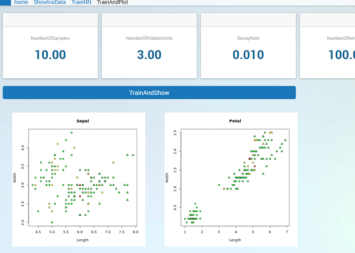

Iris Example
************

This extended example is to demonstrate a simple application of using RLink, and to show what considerations to make when using it. It is not an AIMMS, or R tutorial, nor is it an introduction in machine learning. We will use the :token:`nnet` package that is part of the base install of R. This is a package for feed-forward neural networks with a single hidden layer, and for multinomial log-linear models. 

The three elements of this example are:

* Basic setup: Show the data set and only use R code directly (without scripts)
* Calling scripts: Train a network using the data set and demonstrate how scripts are used.
* Plotting and WebUI: Plot the data set in R and show it using the image widget in the WebUI.

The iris data set
=================

The :token:`nnet` packages comes with the iris data set which is a well known "classic" data set. This data set contains 3 classes of 50 instances each, where each class refers to a type of iris plant. We will use this data set first to show how data can be sent to AIMMS. Later we will use this data set to train a network and make plots.

Basic setup
-----------

We will setup everything needed to use RLink and import the iris dataset into AIMMS identifiers. We will do this by calling lines of R code directly using :token:`ExecScript`.

The three parameters that are needed by DataLink are defined as:

.. code::

    DeclarationSection RLinkSetup {
      StringParameter MapName; 
      StringParameter DataMap {
        IndexDomain: (dl::dt,dl::idn,dl::cn,dl::dn);
      }
      StringParameter XA {
        IndexDomain: dl::rwattr;
        Definition: {
           { 'DataProvider' : rlink::DataLink };
        }
      }
    }

The :token:`MapName`, :token:`DataMap` and :token:`XA` declared here will be reused throughout the examples.

This iris data sets consists of 3 different types of irises (*Setosa*, *Versicolour*, and *Virginica*) and gives the petal and sepal length and width for 50 examples each. So in R we have a data frame with 5 columns: :token:`Sepal.Length`, :token:`Sepal.Width`, :token:`Petal.Length`, :token:`Petal.Width` and :token:`Species`. In AIMMS we define the parameters to read in those values.

.. code::

    Set SampleID {
      Index: i;
    }
    StringParameter Species {
      IndexDomain: i;
    }
    Parameter SepalLength {
      IndexDomain: i;
    }
    Parameter SepalWidth { 
    ! etc....

Read iris data set
------------------

We also introduced an extra domain set :token:`SampleID` so we can read each of the 150 samples and represent them in AIMMS.
Now we can define a data map:

.. code::

    dl::DataTables+={'IrisOut'};              
    empty DataMap;
    DataMap(dl::dt,dl::idn,dl::cn,dl::dn) += data {
      !(tablename, identifier   , col, dom ) : dataframe.colname
      ( IrisOut  , SampleID     , 1  , 1   ) : "SampleID",
      ( IrisOut  , Species      , 2  , 0   ) : "Species",
      ( IrisOut  , SepalLength  , 3  , 0   ) : "Sepal.Length",
      ( IrisOut  , SepalWidth   , 4  , 0   ) : "Sepal.Width",
      ( IrisOut  , PetalLength  , 5  , 0   ) : "Petal.Length",
      ( IrisOut  , PetalWidth   , 6  , 0   ) : "Petal.Width"
    } ;

The strings on the right hand side are the names in the data frame. :token:`SampleID` is not yet part of the data frame. We need it as domain for all other parameters and have to add this to the data frame.

Now we can reset and associate the data map with map name "*ShowIris*". 

.. code::

    MapName := "ShowIris";
    dl::RemoveDataSourceMapping( MapName );
    dl::AddDataSourceMapping( MapName, DataMap,
               dl::DependEmpty, dl::TableAttributesEmpty, dl::ColAttributeEmpty );
    empty SampleID, Species, SepalLength, SepalWidth, PetalLength, PetalWidth;

Before we can use package ``nnet`` we have to "load" it into R using the function library.

.. code::

    dl::ExecScript("library(nnet)",MapName,XA);

Now data set iris becomes available in R and we can turn this into a data frame :token:`dfiris` using:

.. code::

    dl::ExecScript("dfiris<-as.data.frame(iris)",MapName,XA);                

The :token:`SampleID` has to be added as extra column to :token:`dfiris` and it is filled with the values 1 to 150 using function seq.int:

.. code::

    dl::ExecScript("dfiris$SampleID <- seq.int(nrow(dfiris))",MapName,XA);

Now we can read data frame :token:`dfiris`:

.. code::

    dl::ExecScript("aimms::SetData(\"IrisOut\",dfiris)",MapName,XA);

Read more data
--------------

We can also make a set KindOfSpecies containing the iris species. For this we need to append the data map.

.. code::

    dl::DataTables+={'KofS'};
    DataMap(dl::dt,dl::idn,dl::cn,dl::dn) += data {
      ( KofS, KindOfSpecies, 1, 1) : "KindOfSpecies"
    } 

Replace the old data map with the new one and clear set :token:`KindOfSpecies`.

.. code::

    dl::RemoveDataSourceMapping(MapName);
    dl::AddDataSourceMapping(MapName,DataMap,dl::DependEmpty,dl::TableAttributesEmpty,dl::ColAttributeEmpty);
    empty KindOfSpecies;

Now we can create a data frame :token:`dfnames` with the levels from column :token:`Species` of :token:`dfiris` and give the column name :token:`KindOfSpecies`.

.. code::

    dl::ExecScript("dfnames=as.data.frame(levels(dfiris$Species))",MapName,XA);
    dl::ExecScript("colnames(dfnames)<-\"KindOfSpecies\"",MapName,XA);

And we can send it to AIMMS:

.. code::

    dl::ExecScript("aimms::SetData(\"KofS\",dfnames)",MapName,XA);

Calling scripts
===============

We will now train a network with the data set and show the resulting weights. This will be more involved and so we move all R code into scripts. All scripts are placed in directory r in our project. Note that in the remainder of the example we will skip some of the overhead and not describe the adding of the data map and the clearing of identifiers. 

Script trainnn.r
----------------

In this example we will create a network ``nn``. The network has parameters called weights that will be tuned during training by presenting some examples from the iris data set. The network has 3 outputs corresponding to the three species with values ranging from 0 to 1. This output represents the likelihood of this species given the input values, which are the sepal and petal lengths and widths. The output with the highest value (so the most likely) determines the predicted species.

Let's look at R code in file :token:`trainnn.r`:

.. code-block:: r

    # get args from AIMMS
    dfin <- aimms::GetData("ArgsIn")
    # read varable from dfin
    nsamps    <- as.integer(dfin$nsamps[1])
    nhids     <- as.integer(dfin$nhids[1])
    decayrate <- as.double( dfin$decayrate[1])
    maxiter   <- as.integer(dfin$maxiter[1])

    library(nnet)
    dfiris=as.data.frame(iris)
    # pick nsamps from each species an store idx in array sampidx
    sampidx <- c(sample(1:50   , nsamps), 
                 sample(51:100 , nsamps), 
                 sample(101:150, nsamps))

    nn <- nnet( 
        # out   ~ in1          + in2         + in3          + in4 
        Species ~ Sepal.Length + Sepal.Width + Petal.Length + Petal.Width,
        data   = dfiris,     # for columns from data frame dfiris
        subset = sampidx,    # only use the samples from sampidx
        size   = nhids,      # number of hidden units
        decay  = decayrate,  
        maxit  = maxiter)

Note that a hash (:token:`#`) indicates a comment in R. At the bottom we see that we create a network :token:`nn`. The first argument defines the formula that is being formed. Here they are the names of the column of :token:`dfiris` (second argument): column :token:`Species` is output and columns :token:`Sepal.Length`, :token:`Sepal.Width`, :token:`Petal.Length`, :token:`Petal.Width` are inputs. 

We do not use the entire data set as indicated by the third argument. Array :token:`sampidx`, determined in the middle, contains :token:`nsamp` samples selected from each species. We can select it this way because the data set is sorted by species. So we take :token:`nsamp` rows from 1 to 50, and :token:`nsamp` rows from 51 to 100 etc.

Besides :token:`nsamp` we also have to specify :token:`nhids` (the number of hidden units of the network), :token:`decayrate` (the decrease of weight changes during training) and the :token:`maxiter` (number of iteration steps). We like to set these values from AIMMS so at the top of the R code we do :token:`aimms::GetData` to read data into data frame :token:`dfin`. After that we can assign the values from :token:`dfin` to :token:`nsamp`, :token:`nhids`, :token:`decayrate` and :token:`maxiter`.

Note that if you take the code above, you cannot run it from a standalone R instance itself because the function :token:`aimms::GetData` assumes that AIMMS is running. This can make the coding and testing of the R code hard. To make R code runnable without AIMMS one could introduce an boolean:

.. code-block:: r

    NOAIMMS <- TRUE

And then calls to :token:`aimms::GetData` and :token:`aimms::SetData` can be enclosed in an :token:`if` statement, like:

.. code-block:: r

    if (NOAIMMS){
        dfin <- data.frame(nsamp=10, nhids=3, decayrate=0.001, maxiter=100)
    } else {
        dfin <- aimms::GetData("ArgsIn")
    }

Then, once writing the code in R is done, the value :token:`NOAIMMS` should be set to :token:`FALSE` so it can be called by RLink in AIMMS.

Call trainnn.r in AIMMS
-----------------------

We can now deduce what we have to do in AIMMS to send the arguments as data frame to the R code in :token:`trainnn.r`. First we need to define the scalar parameters:

.. code::

    DeclarationSection TrainNN {
      Parameter NumberOfSamples {
        InitialData: 10;
      }
      Parameter NumberOfHiddenUnits {
        InitialData: 3;
      }
      Parameter DecayRate {
        InitialData: 0.001;
      }
      Parameter NumberOfIterations {
        InitialData: 100;
      }
    }

Then we have to specify a data map:

.. code::

    dl::DataTables+={'ArgsIn'};
    DataMap(dl::dt,dl::idn,dl::cn,dl::dn) += data {
      ( ArgsIn  , NumberOfSamples      , 1  , 0   ) : "nsamps",
      ( ArgsIn  , NumberOfHiddenUnits  , 2  , 0   ) : "nhids",
      ( ArgsIn  , DecayRate            , 3  , 0   ) : "decayrate",
      ( ArgsIn  , NumberOfIterations   , 4  , 0   ) : "maxiter"
    } ;

After adding this data map we can call the script using:

.. code::

    dl::ExecScript("source('r/trainnn.r')",MapName,XA);

p(banner tip). Note the slash in :token:`'r/trainnn.r'` is the path separator. File :token:`trainnn.r` is in the :token:`r` directory in the project folder. If we don't change the working directory in R using function :token:`setwd`, the project folder is the working directory, so we have to tell R to look inside :token:`r` to find file trainnn.r.

In R function :token:`source` also an absolute path can be given: 

.. code::

    dl::ExecScript("source('C:/Users/Alice/Documents/mycode/trainnn.r')",MapName,XA);

Here, even on windows, slashes have to be used as path separator. Drawback of absolute paths are that the project only runs on one particular machine and is not platform independent.

Continue working with the active R session
------------------------------------------

When we run this we do not see anything happening because we basically sent some parameters to R and told it to train a network. Nothing is sent back to AIMMS. To see that something actually did happen we could look at the weights of the trained network. To do this we create script :token:`showweights.r`. When we call this script using :token:`ExecScript` we assume that the network :token:`nn` exists in R and that script :token:`trainnn.r` has been called. To prevent from accidentally calling it when :token:`nn` does not exist we start :token:`showweights.r` with:

.. code-block:: r

    if (!exists("nn")){ 
        stop(c("Call TrainNN before calling this function"),call. = FALSE)
    }

The R function :token:`stop` will throw an error that is caught by AIMMS and shown in the Error/Warning panel.

The weights of the network are stored in the array :token:`nn$wts` (the :token:`$` is R syntax for :token:`wts` of object :token:`nn`). The number of elements of :token:`nn$wts` depends on the number of hidden layers. Each hidden unit has 5 weights, 4 for the inputs and one bias. The output units have one weight for each hidden unit plus one bias.

To present this neatly we have to rearrange :token:`wts`. The constrain we have is that we need to create a data frame with a fixed width to be able to define a data map in AIMMS. The number of inputs and outputs are fixed and the only variable is the hidden units. For the hidden units we can define a data frame with a column for each input plus one for the bias. For the output units we can take a data frame with a column for each outcome. In this way we can add hidden units by adding rows to the data frames.

Script :token:`showweights.r` continues with:

.. code-block:: r

    whidx <- 1:(nn$n[2]*(nn$n[1]+1)) 
       
    # weights hidden units: names default to "V1" "V2" "V3" "V4" "V5"
    dfwh <- as.data.frame(matrix(nn$wts[whidx],nrow=nn$n[2]))
    # weights output units: names default to "V1" "V2" "V3" 
    dfwo <- as.data.frame(matrix(nn$wts[-whidx],ncol=nn$n[3]))
        
    # We need Hidden Unit ID as domain
    dfwh$HidID <- seq.int(nrow(dfwh))
    dfwo$HidID <- seq.int(nrow(dfwo)-1,from=0)
        
    # send to AIMMS
    aimms::SetData("WeightsHiddenUnits", dfwh)
    aimms::SetData("WeightsOutputUnits", dfwo)

This code uses :token:`nn$n` which contains the network structure, where :token:`nn$n[1]` is the number of inputs,  :token:`nn$n[2]` is the number of hidden units and :token:`nn$n[3]` is the number of outputs. 

First we create :token:`whidx` containing only the indices of the weights of the hidden units. Then we create a data frame :token:`dfwh` by taking only the weights of the hidden units and convert it first to a matrix with :token:`nn$n[2]` (=number of hidden units) rows. Data frame :token:`dfwo` is created the same way with the remainder of the weight and specifying :token:`nn$n[3]` (=number of outputs) columns.

We then have to add column :token:`HidID` to both data frames that serve as a domain in AIMMS. Now we can send them to AIMMS, where we have defined a data map:

.. code::

    dl::DataTables+={'WeightsHiddenUnits','WeightsOutputUnits'};
    DataMap(dl::dt,dl::idn,dl::cn,dl::dn) += data {
      ( WeightsHiddenUnits  , HiddenUnitID  , 1  , 1 ) : "HidID",
      ( WeightsHiddenUnits  , WeightsBias   , 2  , 0 ) : "V1",
      ( WeightsHiddenUnits  , WeightsIn1    , 3  , 0 ) : "V2",
      ( WeightsHiddenUnits  , WeightsIn2    , 4  , 0 ) : "V3",
      ( WeightsHiddenUnits  , WeightsIn3    , 5  , 0 ) : "V4",
      ( WeightsHiddenUnits  , WeightsIn4    , 6  , 0 ) : "V5",

      ( WeightsOutputUnits  , HiddenUnitID  , 3  , 1 ) : "HidID",
      ( WeightsOutputUnits  , WeightsOut1   , 4  , 0 ) : "V1",
      ( WeightsOutputUnits  , WeightsOut2   , 1  , 0 ) : "V2",
      ( WeightsOutputUnits  , WeightsOut3   , 2  , 0 ) : "V3"
    } ;

Here the :token:`HiddenUnitID` is a set with index :token:`hu` and the rest are parameters with index domain :token:`hu`. The :token:`"HidID"` is the column we added to both data frames. All other string values were default names given by R to the columns when converting the matrices into a data frames. 

After adding the data map we can call the script:

.. code::

    dl::ExecScript("source('r/showweights.r')",MapName,XA);

Read multi-dimensional data
---------------------------

If we want to test the network we can compute the confusion matrix on the samples that were not used for training. In the confusion matrix the columns represent predicted outputs computed by the network using :token:`nn$wts` and the rows represent the correct outputs given in the data set. The values represent the frequency of the occurrence over the test set.

In script :token:`confusionmatrix.r` we first create a table and then convert it to a data frame. Of course we first have to test for the existence of :token:`nn`, and then we can add the following R code: 

.. code-block:: r

    cm <- as.data.frame(table( # names default to  "Var1" "Var2" "Freq"
      dfiris$Species[-sampidx],                      # correct
      predict(nn, dfiris[-sampidx, ], type="class")  # predicted
    ))
    aimms::SetData("ConfusionMatrix",cm) # send to AIMMS

In AIMMS we define:

.. code::

    DeclarationSection Declaration_ConfusionMatrix {
      Set Correct {
        Index: cor;
      }
      Set Predicted {
        Index: pred;
      }
      Parameter Frequency {
        IndexDomain: (cor,pred);
      }
    }

And define a data map as:

.. code::

    dl::DataTables+={'ConfusionMatrix'};
    DataMap(dl::dt,dl::idn,dl::cn,dl::dn) += data {
      ( ConfusionMatrix  , Correct   , 1  , 1   ) : "Var1",
      ( ConfusionMatrix  , Predicted , 2  , 2   ) : "Var2",
      ( ConfusionMatrix  , Frequency , 3  , 0   ) : "Freq"
    } ;

Here :token:`"Var1"`, :token:`"Var2"` and :token:`"Freq"` are default names for the columns added by R when converting the table to a data frame. Now we can read it in AIMMS using:

.. code::

    dl::ExecScript("source('r/confusionmatrix.r')",MapName,XA);

p(banner tip). Instead of defining the data map in AIMMS, a data map can also be defined in a file and read using :token:`read from file datamap.txt`. In this way the data map can be stored with the R scripts.

Plotting in WebUI
=================

Till now we only moved data back an forward between AIMMS and R. The WebUI can be used to visualize the data using different types of graphs, but R has plotting capabilities by itself. We will show how a plot made by R can be shown the in the WebUI.

We use two image widgets in the WebUI, one to show a plot of sepal length and width and one to show a plot of petal length and width. The file names used by the widgets are retrieved from StringParameters :token:`SepalImg` and :token:`PetalImg`. The image widget searches for these file in the images directory of the :doc:`/webui/resources-subfolder`. We create a StringParameter :token:`ImgPath` for this:

.. code::

    StringParameter ImgPath {
      InitialData: "MainProject/WebUI/resources/images/";
    }
    StringParameter SepalImg {
      InitialData: "SepalA.png";
    }
    StringParameter PetalImg {
      InitialData: "PetalA.png";
    }

If this path and the file names are passed to script ``plotresult.r`` it can create those plots where the image widget can find it. 

Script ``plotresult.r``
-----------------------

We can simply do:

.. code-block:: r

    dfin    <- aimms::GetData("ArgsIn")
    imgpath <- as.character( dfin$imgpath[1]  )
    sepalpng<- as.character( dfin$sepalpng[1] )
    petalpng<- as.character( dfin$petalpng[1] )

We want to make a plot that shows the data used for training and the test results for each species. Again we have to check first if :token:`nn` exists, and if it does we know that :token:`trainnn.r` was called and that also :token:`sampidx` exist. We can make a data frame :token:`dftrain` containing an extra column :token:`Result` indicating that these are samples from the train set.

.. code-block:: r

    dftrain <- dfiris[sampidx,]
    dftrain$Result <- as.factor("TrainSet")

The remainder of :token:`sampidx` is used to specify the data frame :token:`dftest`, where extra column :token:`Result` now contains :token:`FALSE` or :token:`TRUE` indicating whether the sample is predicted correctly.

.. code-block:: r

    dftest <- dfiris[-sampidx,]
    tst <- predict(nn,dftst,type="class")
    dftest$Result <- as.factor((tst==dftest$Species))

Now combine both data frames into one :token:`dfresult` data frame that is ready for plotting:

.. code-block:: r

    dfresult <- rbind(dftrain,dftest)

We can use the column :token:`Result` of :token:`dfresult` to determine the color in the plot. We choose *yellow* for the train set, *red* for :token:`FALSE` and *green* for :token:`TRUE` and place the result in array :token:`bgval`:

.. code-block:: r

    bgval <- c("yellow","red","green")[ unclass(dfresult$Result) ]  

For each species we want to choose a shape, so we can look at column :token:`Species` of :token:`dfresults`. Shapes are indicated by a value ranging from 21 to 25, where 21 is circle, 22 is square, 23 is diamond, 24 is triangle up and 25 is triangle down. Here we select the circle, diamond and triangle up and place this result in array :token:`pchval`:

.. code-block:: r

    pchval <- c(21,22,24)[ unclass(dfresult$Species) ]

Now we only have to open a :token:`png` device and pass the concatenation of :token:`imgpath` and the filename. Plot the result using the created :token:`bgval` and :token:`pchval` and add names for axis and title. When the :token:`png` device is closed using :token:`dev.off` the png file will be created in the right directory. In R code this is:

.. code-block:: r

    png( filename = sprintf("%s%s",imgpath,sepalpng) )
    plot(dfresult$Sepal.Length, dfresult$Sepal.Width,
         pch = pchval, bg = bgval, 
         main = "Sepal", xlab = "Length", ylab = "Width" )
    dev.off()
      
    png( filename = sprintf("%s%s",imgpath,petalpng) )
    plot(dfresult$Petal.Length, dfresult$Petal.Width,
         pch = pchval, bg = bgval,
         main = "Petal", xlab = "Length", ylab = "Width" )
    dev.off()

Call ``plotresult.r`` in AIMMS
------------------------------

In AIMMS we do the following:

.. code::

    ! toggle images to refresh image widget
    if ( SepalImg <> "SepalA.png" ) 
         then SepalImg := "SepalA.png" 
         else SepalImg := "SepalB.png" endif;
    if ( PetalImg <> "PetalA.png" ) 
         then PetalImg := "PetalA.png" 
         else PetalImg := "PetalB.png" endif;
                                    
    empty  DataMap;
    DataMap(dl::dt,dl::idn,dl::cn,dl::dn) += data {
      ( ArgsIn , ImgPath  , 1 , 0 ) : "imgpath",
      ( ArgsIn , SepalImg , 2 , 0 ) : "sepalpng",
      ( ArgsIn , PetalImg , 3 , 0 ) : "petalpng"
    } ;
    MapName := "TrainNN";
    dl::RemoveDataSourceMapping( MapName );
    dl::AddDataSourceMapping( MapName, DataMap,
           dl::DependEmpty, dl::TableAttributesEmpty, dl::ColAttributeEmpty );

    dl::ExecScript("source('r/plotresult.r')",MapName,XA);
 

Now we have a function that can be called to generate the test plots. If we make a procedure in AIMMS that first calls :token:`trainnn.r` and then ``plotresult.r`` we can make a button in the WebUI that will train a network and show the plots of the results. We can then simply make an interactive WebUI application that allows us to choose the input arguments, press the button and show the result.

.. important::

    In our example application the image folder should start empty because first the R code has to run and generate the images. When making an  :token:`aimmspack` it is possible that the image folder is not included because it is empty and then the :token:`png` device will fail in creating the images. You can place an empty :token:`do_not_delete.txt` file in the image folder to make sure that the folder will not be accidentally excluded from the :token:`aimmspack`.

.. spelling::

    trainnn
    multinomial