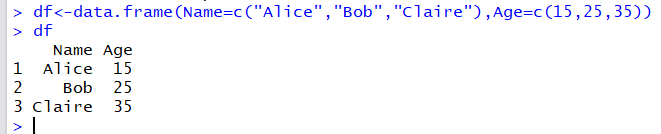
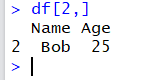

Using RLink
***********

The purpose of RLink is that it allows us to execute R code from AIMMS. This alone is not very useful if AIMMS and R cannot exchange data. So to use RLink you need to know:

* How to execute R code from AIMMS
* How to pass data between AIMMS and R

Execute R code
==============

DataLink has a function :token:`ExecScript` that can start an R session and pass code to R that will be executed.

Calling R code
--------------

Suppose we have a line of R code that we want to execute: 

.. code-block:: r

    write( "Hello World" , file = "helloworld.txt" )

This script just takes the string "Hello World" and saves this in file :token:`helloworld.txt`.

Using RLink we can call the same R code from AIMMS by doing:

.. code::

    dl::ExecScript("write(\"Hello World\",file=\"helloworld.txt\")",MapName,XA);

where :token:`MapName` and :token:`XA` are defined as:

.. code::

    DeclarationSection RLinkSetup {
        StringParameter MapName {
            InitialData: "MyRLink";
        }
        StringParameter DataMap {
            IndexDomain: (dl::dt,dl::idn,dl::cn,dl::dn);
        }
        StringParameter XA {
            IndexDomain: dl::rwattr;
            Definition: {
                { 'DataProvider' : rlink::DataLink };
            }
        }
    }

The first thing to notice is that :token:`ExecScript` is a "DataLink":http://manual.aimms.com/datalink/ function and RLink is only attached as a provider. In this simple example this seems a bit silly. Here :token:`MapName` is a string that DataLink uses for the data map, so before the call can be made :token:`dl::AddDataSourceMapping` has to be called to associate :token:`MapName` with a data map. By making RLink a DataLink provider it seems that we added a lot of unnecessary overhead.

The second thing to notice are backslashes (:token:`\\`) in front of the quotes (:token:`\"`) in the R code around *Hello World*. This is because the command is passed as a string starting and ending with a quote. The backslash tells that the quote following the backslash does not end the string. Using the backslash like this is called escaping.

It is clear that too much escaping is not very readable and having many lines of R code like that results in very unmaintainable code. Typically you want to keep all R code in a file and then tell R to execute the file using the R function :token:`source` that also accepts single quotes that do not have to be escaped. So we could do:

.. code::

    dl::ExecScript("source('savehelloworld.r')",MapName,XA);

Here the file :token:`savehelloworld.r` contains the line of R code we want to execute. 

Usually the file would not contain just one line of code but many, and then the DataLink overhead starts to make sense. It becomes very likely that data has to be send back and forth between AIMMS and R, and in this way DataLink is already setup for that.

.. important::

    Always use the slash as path separator, **even on windows**. The backslash is also the path separator in windows and should be escaped. R does accept the slash on windows so the backslash is not needed for paths in :token:`ExecScript`. This also makes the project **platform independent**, which is important if you develop on windows and wants to publish the project in the cloud.

The R session
-------------

RLink starts by looking at the system to find an installment of R. It looks at :token:`R_HOME`, at some predefined locations and on windows it queries the registry. Once an installment of R is found it will establish a connection. 

The next step is that it will make sure that Rcpp and the aimms package are loaded by executing :token:`library(Rcpp)` and :token:`library(aimms)`. In case the :token:`rlink::CheckAndInstallPackage` function is called, the aimms package may be installed as well. The last step is initialing the aimms package by telling it how to communicate with RLink.

The above initialization happens on the very first call to :token:`dl::ExecScript` where :token:`rlink::datalink` is chosen as provider. After that the connection has been established and the R session keeps running. This means that if we create a variable in R in one call it still exists in a next call. We can do:

.. code::

    dl::ExecScript(" myVariable <- 3 ",MapName,XA);
    dl::ExecScript(" write(myVariable,file=\"helloworld.txt\") ",MapName,XA);

Here in the first call the value 3 is assigned to :token:`myVariable` and then in the next call the content of :token:`myVariable` is written to file :token:`helloworld.txt`. The file then contains the value :token:`3`, because the R session was not closed after the first call and :token:`myVariable` still has the value :token:`3`.

Passing Data
============

In RLink the functions :token:`aimms::SetData` and :token:`aimms::GetData` can be used to pass data between R and AIMMS. These function make use of data frames, so it is important to understand data frames. 

The R data frame
----------------

A data frame is a build in R structure to store data tables. Let's make a data frame :token:`df`:

We see in the first line that the function :token:`data.frame` is used to create a data frame. Its first argument :token:`Name=c("Alice","Bob","Claire")` creates a column :token:`Name`, with three string values. The second argument creates a second column :token:`Age` with integer values.

If we look at the data frame by calling :token:`df`, R will show the data frame. Here we see three columns, the two we created and the row index. The row index is not part of the data frame, and it can be used to select one row from the data frame.

In AIMMS jargon we could say that the row index acts like a domain. Since this row index is not part of the data frame itself it can not be transferred to AIMMS. Instead if we need it we should extend the data frame with an extra row index using the R function :token:`seq.int`.

Data frames have some limitations. All columns in a data frame should have the same length and all elements in one columns are of the same type. If we change the :token:`Age` of :token:`Alice` from :token:`15` to :token:`fifteen`, then also the other integer values in :token:`Age` will change to string :token:`25` and :token:`35`. In order to make sure that the R structure is a data frame, the R function :token:`as.data.frame` can be used.

The columns in a data frame have a name. These names are important because they are used as column names by DataLink.

.. important::

    In R columns can have empty values (called :token:`NA` in R). However, data frames with empty values are not supported by RLink yet.

SetData and GetData
-------------------

RLink is a DataLink provider but it operates differently. It still uses a data map to specify the mapping between identifiers in AIMMS and names of tables and columns in the source. The difference is that it allows the R code to decide when data is being read or written. For this calls can be made in R using the functions :token:`aimms::SetData` and :token:`aimms::GetData` from the aimms package.

Data can be send from R to AIMMS using:

.. code::

    aimms::SetData( Name , Dataframe )

Data can be send from AIMMS to R using:

.. code-block:: r

    Dataframe <- aimms::GetData( Name )

Here :token:`Name` is a string and :token:`Dataframe` is a data frame. 

Both :token:`aimms::SetData` and :token:`aimms::GetData` have as first argument a name. This is the *table name* in DataLink jargon, and represents a table specified in the data map. When we call :token:`SetData` or :token:`GetData`, the table name is used to determine how the names in the data frame are mapped onto the identifiers in AIMMS. Unlike :token:`DataRead` and :token:`DataWrite` that read and write all tables in the data map, SetData and GetData only write to the one particular table specified as first argument.

Now we can describe the setup of DataLink to Assume the AIMMS model contains a parameter :token:`AIMMS_age` that has as domain an index from set :token:`AIMMS_name`. Then the data frame described above can be read from R using aimms::SetData.

First we have to create a data map:

.. code::

    dl::DataTables+={'MyDataFrame'};   
    empty  DataMap;
    DataMap(dl::dt,dl::idn,dl::cn,dl::dn) += data {
      !( table_name  , identifier  , col , dom ) : name_in_dataframe
       ( MyDataFrame  , AIMMS_Name  , 1   , 1   ) : "Name",
       ( MyDataFrame  , AIMMS_age   , 2   , 0   ) : "Age"
    } ;

In the first line we add :token:`MyDataFrame` to the set of tables in DataLink and then we reset the 4D string parameter DataMap. 

Then we assign the names of the columns in the data frame (the string on the right hand side), to the 4D domain of DataMap. The first domain of DataMap is the table name which we just added, followed by the identifiers in AIMMS. Then we specify the column number followed by the domain number. The domain number is 0 when it is a parameter, and it has all identifiers with a non zero domain number as domain.

To associate the data map with a map name do:

.. code::

    MapName:="MyMapName";
    dl::RemoveDataSourceMapping(MapName);
    dl::AddDataSourceMapping( MapName, DataMap,
        dl::DependEmpty,dl::TableAttributesEmpty,dl::ColAttributeEmpty);
 
To read the data from data frame df in R into AIMMS_name and AIMMS_age, we can do:  

.. code::

    dl::ExecScript("aimms::SetData(\"MyDataFrame\",df)",MapName,XA);

Here the second argument of SetData is the data frame :token:`df` from which is being read.

To write to data frame :token:`df` in R we can do:

.. code::

    dl::ExecScript("df <- aimms::GetData(\"MyDataFrame\")",MapName,XA);

:token:`GetData` only has the table name as argument and returns a data frame.

.. important::

    Other DataLink providers use functions :token:`DataRead` and :token:`DataWrite` for passing data. They are **not** supported in RLink.

