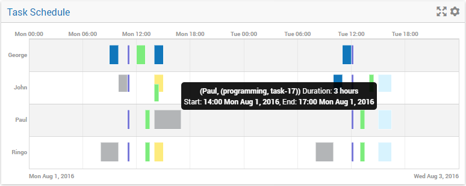
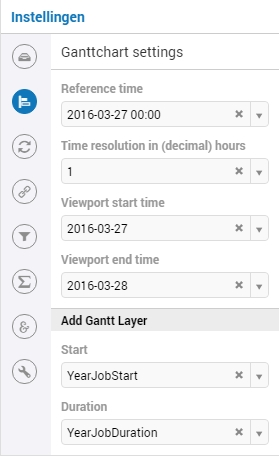
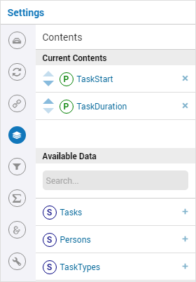
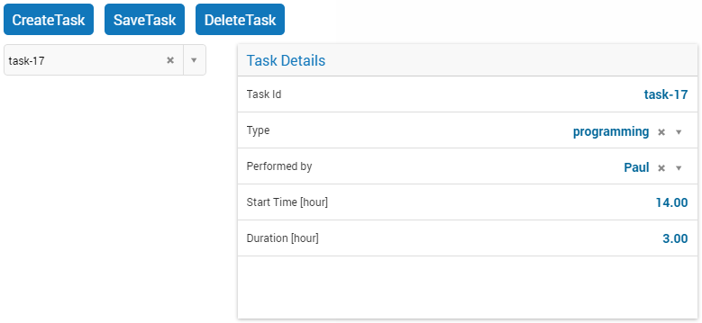

Gantt Chart Widget
------------------

Description
+++++++++++

The Gantt chart widget allows you to visualize a planning: the horizontal axis of the Gantt chart shows a time scale and the vertical axis typically shows a set of resources. Each bar in the Gantt chart can be identified with a task (or job).

Features
++++++++

In the example Gantt chart displayed in the picture above, a number of features of this widget are visible:

* The rows of the chart are alternately colored white and light grey, to make it easier for the user to distinguish between consecutive rows.
* Overlapping or partly overlapping bars in the chart are always displayed in such a way that it is unambiguously clear that they do.
* The tooltip appearing when you hover over a specific bar shows detailed information about the task.
* The top X-axis annotation intelligently shows the points in time, based on the total time duration displayed in the chart. In this case, it displays hours. If, for example, you have a chart displaying data over a few months, the top X-axis will show dates instead of hours.
* The bottom X-axis always shows the begin date on the left and the end date on the right. If you have a chart only showing hours on the top X-axis, the bottom X-axis makes it clear to which days these hours refer.
* In case of a transition to or from Daylight Saving Time, the X-axis annotations make this clear by a reference to the relevant UTC time. For example 'Sun 02:00 (UTC+2)' and 'Sun 07:00 (UTC+1)' for a Gantt chart that shows October 30, 2016, 03:00 (which is the time DST ends (in the Netherlands)).

Specification
+++++++++++++

Ganttchart Settings
^^^^^^^^^^^^^^^^^^^

To specify a Gantt chart in WebUI you will need to specify the *start* and the *duration* of each task in the Gantt Chart Settings tab of the options editor (see image below), in the **Add Gantt Layer** section.

* Previously, the *start* identifier needed to contains the word *start* in the identifier name and the *duration* identifier needed to contain the word *duration* in the identifier. This is not necessary anymore fro AIMMS 4.28.2 onwards.
* The *start* and *duration* identifiers in your model need to share the same index domain which should have at least some task index. 
* The *start* identifier should represent the number of *hours* relative to Gantt Chart reference time.
* The *duration* identifier should represent the amount of *hours* that the corresponding job takes.
* To support vertical dragging the *duration* identifier in the AIMMS model must be updatable.
* To support vertical dragging and task modification (using forms), the *start* and *duration* identifiers can have at most one non-zero data entry for every task.

The following code snippet is taken out of the WebUI Gantt chart example.

.. code::

    Set Tasks {
        Index: t;
    }

    Set Persons {
        Index: p;
    }

    Set TaskTypes {
        Index: tt;
    }

    Parameter TaskStart {
        IndexDomain: (t,tt,p);
        Unit: hour;
    }

    Parameter TaskDuration {
        IndexDomain: (t,tt,p);
        Unit: hour;
    } 

Options
^^^^^^^

This paragraph gives you an overview of all the specific Gantt Chart options, which can also be found on the Gantt Chart Settings tab of the options editor:

* *Reference time* (required): This represents the reference time of the Gantt Chart, i.e. the time at which the Gantt Chart axis starts. The reference time of the Gantt Chart needs to be a string representing an `RFC2822 <http://tools.ietf.org/html/rfc2822#page-14>`_ or `ISO 8601 <http://www.w3.org/TR/NOTE-datetime>`_ date. These standards accept many, many date formats. Examples of valid formats are AIMMS formats like :token:`2015-04-02`, :token:`2015-04-02 13:04:12`, but also formats like :token:`April 2, 2015 03:04:12`, :token:`Thu Apr 2, 2015`, :token:`2015/4/2`, :token:`2015/04/02 13:04:12.345`, :token:`04/02/2015`, :token:`2-4-15`, :token:`2015-04-02T13:04`, :token:`Thu Apr 05 2015 13:04:12 GMT-0400` are accepted. When entering a literal date value, *please make sure NOT to use quotes or double quotes around the date*.
* *Time resolution in (decimal) hours* (required): With this option you can determine precisely at which position or size the dragging or resizing of a bar will end. If you set this to, for example, 1, you can drag and resize in whole hours. So, a drag action to the left will place the bar at the nearest whole hour preceding the current position of the bar. And a resize action makes sure that the duration will be set in whole hours. You are not limited to multiples of whole hours here, though. When specifying 0.25, you set the resolution to quarters of an hour, for example.
* *Viewport start time* (optional): With this option you can specify what time the leftmost part of the Gantt Chart displays. In combination with the *Viewport End Time* option, you can specify a 'time window' over your displayed data.
* *Viewport end time* (optional): With this option you can specify what time the rightmost part of the Gantt Chart displays. In combination with the *Viewport Start Time* option, you can specify a 'time window' over your displayed data.

Pivoting
^^^^^^^^

The Gantt chart will display a task for every index (or better: combination of indices) that has been put in the *jobs* part. The task index needs to be present in the *jobs* part.

The Gantt chart will display a row for every index (or better: combination of indices) that has been put in the *resources* part. The Gantt chart will display a single row if no index is present in the *resources* part.

.. image:: images/gantt-chart-pivot.png
    :align: center

Viewport control
++++++++++++++++

By using AIMMS string parameters to specify the *viewport start time* and *viewport end time*, you can write procedures that implement custom scrolling or zooming behavior. What you typically need to do in such a procedure is to transfer the string into a *moment*, do some math and convert the *moment* back into a string. The following example shows some identifiers and procedures that add support for scrolling the Gantt chart to the left or to the right.

.. code::

    StringParameter ViewportStart;

    StringParameter ViewportEnd;

    Procedure MoveDate {
        Arguments: (dateString,numHours);
        Body: {
            moment := StringToMoment("%m-%d-%c%y %H:%M", [hour], "2016-01-01 00:00", dateString);
            moment += numHours;
            dateString := MomentToString("%m-%d-%c%y %H:%M", [hour], "2016-01-01 00:00", moment);
        }
        StringParameter dateString {
            Property: InOut;
        }
        Parameter numHours {
            Unit: hour;
            Property: Input;
        }
        Parameter moment {
            Unit: hour;
        }
    }

    Procedure ScrollViewport {
        Arguments: (numHours);
        Body: {
            MoveDate(ViewportStart,numHours);
            MoveDate(ViewportEnd,numHours);
        }
        Parameter numHours {
            Unit: hour;
            Property: Input;
        }
    }

    Procedure ViewportScrollToTheRight {
        Body: {
            ScrollViewport(1[hour]);
        }
    }

    Procedure ViewportScrollToTheLeft {
        Body: {
            ScrollViewport(-1[hour]);
        }
    }

Please note that the AIMMS function :token:`StringToMoment` is used to convert a date string into a number. The number is then used to easily perform date calculations. After that, the number is converted back to a date string using the AIMMS function :token:`MomentToString`.

Retrieving the selected task
++++++++++++++++++++++++++++

To be able to create a detail view in which the properties of the clicked task are displayed, the Gantt chart has been extended with a store focus option. This option allows you to specify a mapping between the indices that play a role in the Gantt chart and some element parameters in your model. Whenever the user clicks on a task in the Gantt chart, the associated elements are stored in the corresponding element parameters.

.. image:: images/gantt-chart-store-focus.png
    :align: center

Adding, deleting and modifying tasks
++++++++++++++++++++++++++++++++++++

Modifying a task by drag-and-drop
^^^^^^^^^^^^^^^^^^^^^^^^^^^^^^^^^

Horizontal dragging
"""""""""""""""""""

As a user of the Gantt chart you can adjust the start time of a task by horizontally dragging the task to another position. You can adjust the duration of a task by dragging the right end of the task to another position. While dragging, the chart displays a small tooltip to make it clear at which position (in time) the bar will be placed when you release the mouse.

Vertical dragging
"""""""""""""""""

In addition, you can allocate the task to another resource by vertical dragging. In order for vertical dragging to work properly, you should make sure that the duration identifier is editable. Also note, that if you drag the last remaining bar of a row to another row, the originating row will disappear (as the WebUI displays its data in a sparse manner).

Snapping to time resolution while dragging
""""""""""""""""""""""""""""""""""""""""""

During both horizontal and vertical dragging the time resolution as specified in the corresponding property is taken into account.

Creating a form to add, delete or modify a task
^^^^^^^^^^^^^^^^^^^^^^^^^^^^^^^^^^^^^^^^^^^^^^^

When you want the user to be able to adjust some task property that cannot be changed through drag-and-drop, or if you want your user to be able to add or delete a task, you can extend the Gantt chart with a WebUI form that provides all of the requested possibilities.

Task update handler
"""""""""""""""""""

The *task update handler* is called when the form is saved by the user (through calling the *SaveForm* procedure that is created in the *AIMMSWebUIRuntime* library by the call to :token:`webui::SetupForm`). This handler is responsible for

* creating a new task element (in case a new item is created)
* initializing (in case of a new item) or updating model data reflecting the changes that have been made

An example of such a task handler is shown below. All form data is present as string parameters through the *formData* input argument. The model identifiers :token:`TaskStart`, :token:`TaskDuration` and :token:`TaskDescription` are updated based on the provided form data.

.. code::

    Procedure UpdateTaskCallback {
        Arguments: (formData,taskName);
        Body: {
            taskName := formData('DetailTaskId');
            currentTask := StringToElement(Tasks, taskName);
            
            ! Create new task if not yet present
            if ( not currentTask ) then
                SetElementAdd(Tasks,currentTask,taskName);
            endif;
            
            ! Retrieve current job type and current job resource from form data
            currentTaskType := StringToElement(TaskTypes,formData('DetailTaskType'));
            currentPerson := StringToElement(Persons,formData('DetailTaskPerformer'));
            
            ! Clear data for old version of the task
            ! (relevant when either task-type or person has been changed)
            TaskStart(currentTask,tt,p) := 0 [hour];
            TaskDuration(currentTask,tt,p) := 0 [hour];
            
            ! Update start and duration in model based on form data
            TaskStart(currentTask,currentTaskType,currentPerson) := (Val(formData('DetailTaskStart'))) [hour]; 
            TaskDuration(currentTask,currentTaskType,currentPerson) :=(Val(formData('DetailTaskDuration'))) [hour];
            
            ! Update task description based on updated values
            startTime := MomentToString("%m-%d-%c%y %H:%M",[hour],"2016-08-01 00",TaskStart(currentTask,currentTaskType,currentPerson));
            endTime := MomentToString("%m-%d-%c%y %H:%M",[hour],"2016-08-01 00",TaskStart(currentTask,currentTaskType,currentPerson)+TaskDuration(currentTask,currentTaskType,currentPerson));
            TaskDescription(currentTask) := FormatString("%e performs task %e from %s till %s",currentPerson,currentTaskType,startTime,endTime);
        }
        StringParameter formData {
            IndexDomain: (webui::ffn);
            Property: Input;
        }
        StringParameter taskName {
            Property: Output;
        }
        ElementParameter currentTask {
            Range: Tasks;
        }
        ElementParameter currentPerson {
            Range: Persons;
        }
        ElementParameter currentTaskType {
            Range: TaskTypes;
        }
        StringParameter startTime;
        StringParameter endTime;
    }

Task validation
"""""""""""""""

The *task validation handler* provides you with a mechanism to check the validity of the entered form data. Input can be marked as invalid by creating a validation error for one or more entries. Whenever a form has been marked as invalid, it will not be possible to commit the changes (by running the *SaveForm* procedure).

The example validation procedure below will mark the form input as invalid when the task id is empty, when the duration is zero or negative, or when the task start and task duration have been specified such that the task is executed while the office is closed.

.. code::

    Procedure ValidateTask {
        Arguments: (formData,validationErrors);
        Body: {
            empty validationErrors;
            
            newStart := (Val(formData('DetailTaskStart'))) [hour];
            newDuration := (Val(formData('DetailTaskDuration'))) [hour];
            
            ! office is closed between 20:00 and 06:00
            ! find latest 20:00 before the proposed start time
            if ( Mod(newStart,24) < 6 [hour]) then
                officeClosed := (Div(newStart,24)-1 [hour])*24+20 [hour];
            else
                officeClosed := Div(newStart,24)*24+20 [hour];
            endif;
            officeOpen := officeClosed + 10 [hour];
            
            if ( webui::FormIsNewEntry('TaskForm') and
                 StringToElement(Tasks,formData('DetailTaskId')) ) then
                validationErrors('DetailTaskId') := webui::CreateValidationError("validation-error-task-id-should-be-unique");
            endif;
            
            if ( newDuration <= 0 [hour] ) then
                 validationErrors('DetailTaskDuration') := webui::CreateValidationError("validation-error-duration-should-be-strictly-positive");
            elseif ( Max(newStart,officeClosed) < Min(newStart+newDuration,officeOpen) ) then
                 validationErrors('DetailTaskStart') := webui::CreateValidationError("validation-error-office-closed");
                 validationErrors('DetailTaskDuration') := webui::CreateValidationError("validation-error-office-closed");
            endif;
        }
        StringParameter formData {
            IndexDomain: (webui::ffn);
            Property: Input;
        }
        StringParameter validationErrors {
            IndexDomain: (webui::ffn);
            Property: InOut;
        }
        Parameter newStart {
            Unit: hour;
        }
        Parameter newDuration {
            Unit: hour;
        }
        Parameter officeClosed {
            Unit: hour;
        }
        Parameter officeOpen {
            Range: free;
            Unit: hour;
        }
    }

Linking the focus task in the Gantt chart to the selected task in the form
""""""""""""""""""""""""""""""""""""""""""""""""""""""""""""""""""""""""""

To link the element parameter that has been specified in the store focus option to the one-dimensional parameter that is linked to the master view in the form, a WebUI data change monitor is used.

.. code::

    ElementParameter SelectedTaskMonitor {
        Range: webui::RegisteredDataChangeMonitors;
    }

    Set SelectedTaskIdentifierSet {
        SubsetOf: AllIdentifiers;
        Definition: data { 'SelectedTask' };
    }

    Procedure UpdateSelectionInForm {
        Body: {
            SelectedTasks(t) := 1 onlyif ( t = SelectedTask );
        }
    }

    Procedure SetupTaskForm {
        Body: {
            SelectedTasks(t) := 0;
            
            FormFields := data { 'DetailTaskId', 'DetailTaskType', 'DetailTaskPerformer', 'DetailTaskStart', 'DetailTaskDuration' };
            
            webui::SetupForm("TaskForm", 'SelectedTasks', FormFields, 'ValidateTask', 'UpdateTaskCallback' );
            
            ! Use DataChangeMonitor to update the selection in the form as the selection in the Gantt chart changes
            webui::DataChangeMonitorRegisterCallback(
                identifierSet :  SelectedTaskIdentifierSet,
                callback      :  'UpdateSelectionInForm',
                aMonitor      :  SelectedTaskMonitor
            );
        }
        Set FormFields {
            SubsetOf: AllIdentifiers;
        }
    }

Gantt chart details form
""""""""""""""""""""""""

After having run the *SetupForm* procedure you typically create a selection widget showing the contents of the identifier that has been specified as the second argument. In addition, you typically create a scalar widget containing some generated runtime identifiers. These runtime identifiers are generated in the *AIMMSWebUIRuntime* library (i.e. in the *webui_runtime* namespace). The identifier names are constructed from the original identifier names (of the identifiers in the set that has been specified as the third argument to the call to the *SetupForm* procedure), prefixed with the name of the form (i.e. the first argument of the call to the *SetupForm* procedure), separated by an underscore character. To control the addition, deletion and modification of task data, you will need to create three buttons, each of which should be linked to one of the generated runtime procedures *CreateEntry*, *DeleteEntry* and *SaveForm*, again prefixed with the name of the form, separated with an underscore character.

Downloading the WebUI Gantt chart example
+++++++++++++++++++++++++++++++++++++++++

The fully functional Gantt chart example that is discussed in this document can be downloaded from the `AIMMS WebUI example repository at GitHub <https://github.com/aimms/WebUI-Examples>`_. In order for this example to run, you need AIMMS version 4.24 or higher.