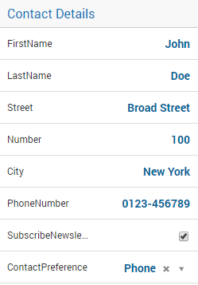
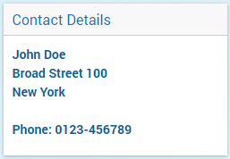

Scalar Widget
-------------

The Scalar Widget allows you to show one or more scalar values in your WebUI. A scalar value can be 

*  the data of a scalar identifier in AIMMS
* a multi-dimensional identifier that is automatically aggregated (summed up) for all its dimensions
* a multi-dimensional identifier that is sliced to one of the above.

Just like most of the other widgets, the Scalar Widget has a set of `Widget Options <widget-options.html>`_. At the Miscellaneous tab of the option editor, the following Scalar Widget specific options are available:

* contents.labels.visible: By default, the labels (e.g. identifier name) of the scalar values are displayed. By setting this option to 0, the labels are no longer displayed. This is especially useful when you display a single scalar value and you already use the Title of the widget to explain what value is displayed.
* Enable Multi-Line (1/0): By default, the scalar values (also strings) are displayed on a single line (edit) field. If you set this option to 1, string values are displayed in multi-line mode. This allows the user to read and write values that use more than one line. E.g. when a description is displayed/edited. If you want to add linebreaks to your string value, you can do this in the Scalar Widget by using the Enter key. From within the AIMMS code, you can use the newline character '\n' (without quotes), like described in the AIMMS Language Reference.

Examples
++++++++

Here are some examples of the scalar widget that show you some typical usage.

* Scalar widget displaying a single scalar value.

.. image:: images/scalar-exampletotalcost.png
    :align: center

* Multiple scalar values in the Scalar Widget. Note that you can have strings, numbers, binary values and element values.
    

* Transport is a 2-dimensional identifier. In the Scalar Widget it is automatically aggregated to the total sum of transport.
    
.. image:: images/scalar-exampletransportinformation.png
    :align: center

* Scalar displaying a single string parameter that contains multiple lines of data.
    

