Application Management 
======================

.. |page-manager| image:: images/PageManager_snap1.png

.. |kebab|  image:: images/kebab.png

.. important:: Application Management is available in software versions from AIMMS 4.82 onwards.

With the introduction of application management features, the Page Manager not only renders the page tree structure of your WebUI, but it also renders beneath each page the list of widgets belonging to that page. That allows the WebUI developer to manage the application contents by moving things around in this extended tree structure offered now by the Page Manager.

You can access the Application Manager by clicking on the hamburger icon |page-manager| on the top-left position of the WebUI. The Application Manager has two sections. The "App" section helps create the application structure and manage the widgets on each page of the app, and the "Page" section helps to select a layout for pages and the arrangement of widgets on the page.

The various operations for the "App" section available to the WebUI developer are described below using illustrations based on the TransNet application example in the `WebUI Tutorial <quick-start.html>`_ section.

To know more about the "Page" section, you can view the `Page Manager with Grid Pages <webui-grid-pages.html#page-manager-with-grid-pages>`_ topic.

The Manager opens with the App tab that renders the page tree structure. You can expand a subtree by clicking on the expand arrow |arrow-expand| in front of a parent page and you can collapse it by clicking on the collapse arrow |arrow-collapse| in front of a parent page. In our example, we start with a single Home page with several widgets on it:

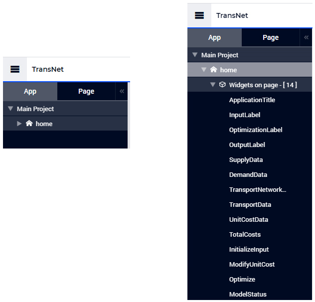

Notice that all widgets that are part of a page are categorized and listed under the respective page's "Widgets on page" section along with a count of the widgets on the page. Also, unlike pages or sub-pages, the widgets listed underneath a page do not have an icon at the left of their names. 

Next, we will create a new page, say Input Data, on the same level as the Home page in the tree. We can do this by using the options for adding new pages from the menu at the right of the Main Project node situated at the top of the tree:

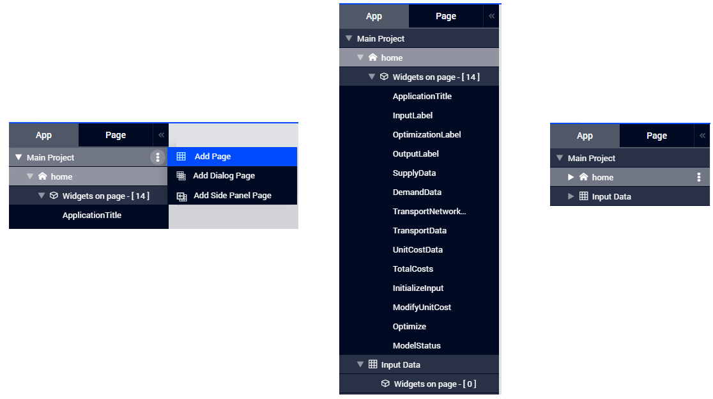

New pages created will have the "Widgets on page" section by default so that it is easy to drag and drop widgets from one page to another.

Suppose we would like to place all the widgets related to input data on the newly created Input Data page. Starting with the InputLabel widget, one can simply **drag-and-drop** this widget in the tree from the initial location underneath the Home page to its new location underneath the Input Data page:

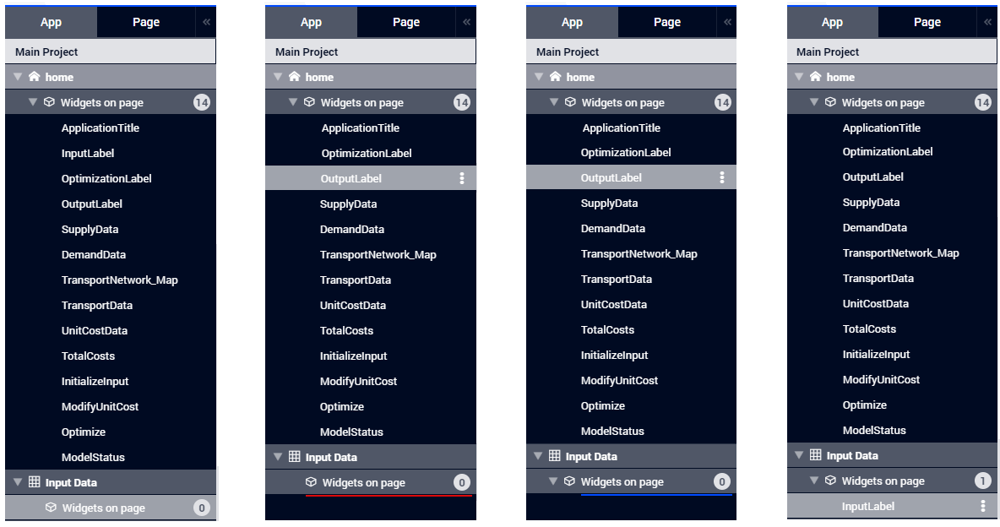

.. important:: Widgets can only be dragged and dropped from the source page's "Widgets on page" section to the destination page's "Widgets on page" section.

.. note:: Note that the drop location during the **drag-and-drop** operation is marked by a coloured line in the tree. The starting poing of such a line (at its left side) indicates the intended location in the tree structure. A red line (see above) indicates that the intended drop location is not allowed, whereas a blue line (see above) indicates that the location is allowed and the node may be dropped there. 

With the introduction of application management features, this way of working not only applies to widget nodes in the tree, but also to page nodes in the tree and it complements the drag-and-drop feature described in the section `Moving a Page <webui-classic-pages.html#moving-a-page>`_. 

.. note:: Note that a parent page which has its subtree expanded may not be moved by using drag-and-drop. So, its subtree must be collapsed first, before moving the parent page (including its subtree) to a different location in the overall tree. 
		
Clearly, the drag-and-drop operation in our example at hand will have the effect that the InputLabel widget won't be rendered any more on the Home page, but it will become present on the Input Data page, instead.

Next, one can **copy** the SupplyData widget using the menu at its right and **paste** it on the Input data page by using the menu at the right of this page:

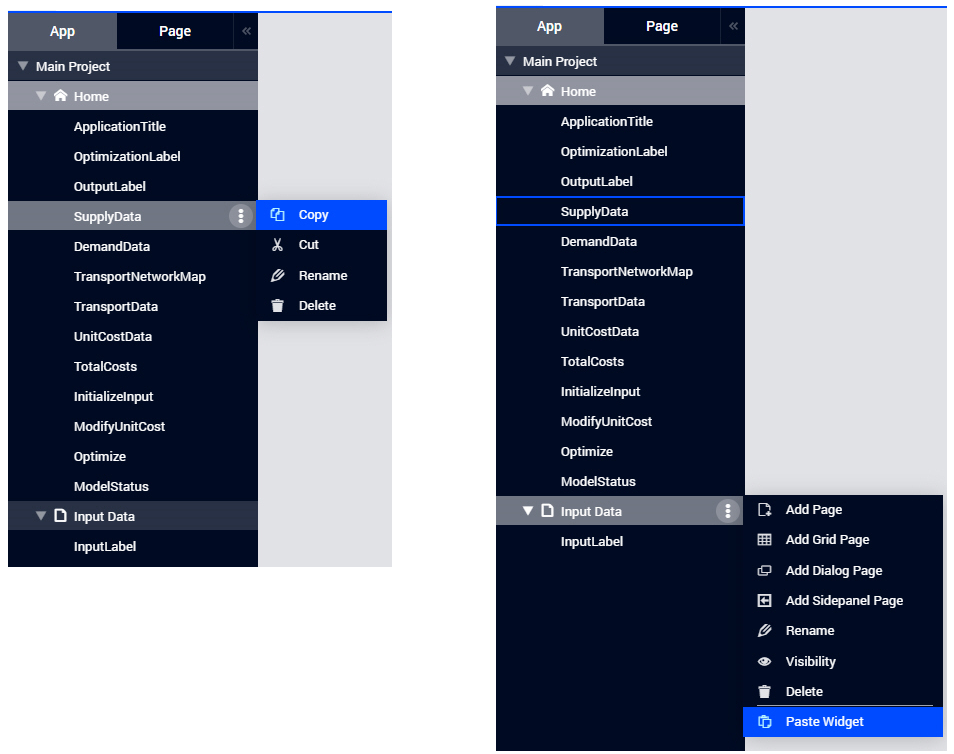

At this point, it can be noticed that, besides the **Paste Widget** option (and the options for adding a sub-page), the menu at the right of a page also offers options to **rename** the page, to change **visibility** of the page, or to **delete** the page from the tree.

The copy-pasted widget is named automatically as SupplyData(1). By using the option to **rename** from the menu at the right of this widget, the name may be changed, for example into Supply_Data:

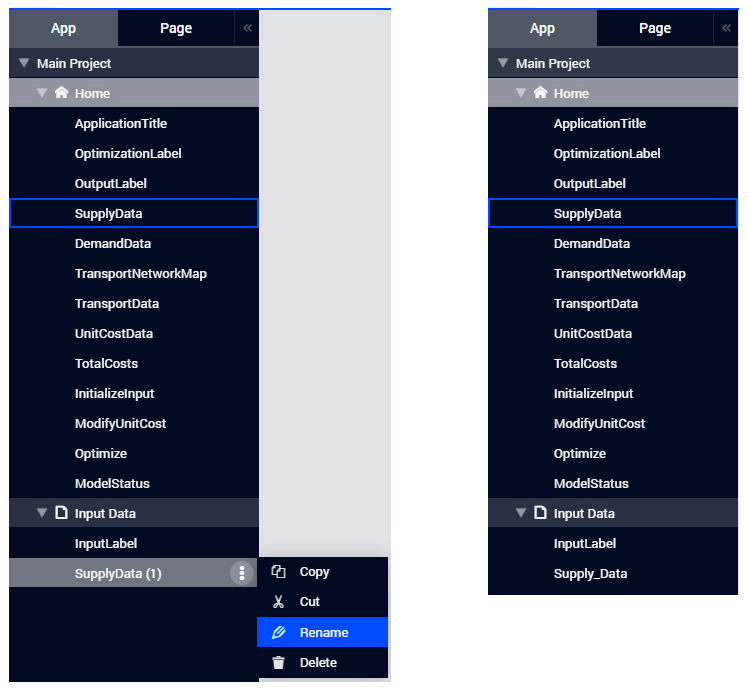

When a widget is no longer needed on a page, it may be removed by using the option to **delete** from the menu at the right of the widget, as is the case with the SupplyData widget on the Home page:

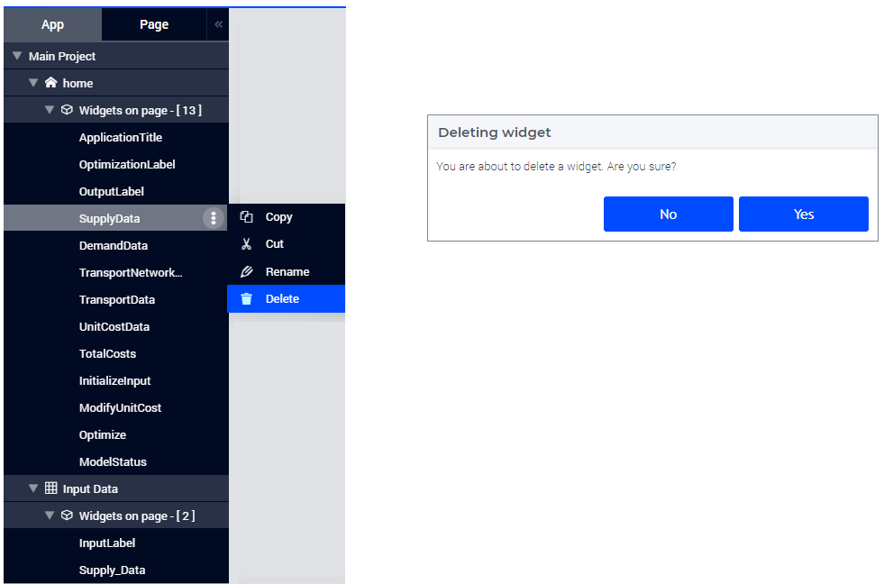

The deletion must be confirmed in the corresponding pop-up dialog which appears before the operation is completed (as shown above).

Of course, it is equally possible to **cut-and-paste** a widget in one go as illustrated below for the DemandData widget:

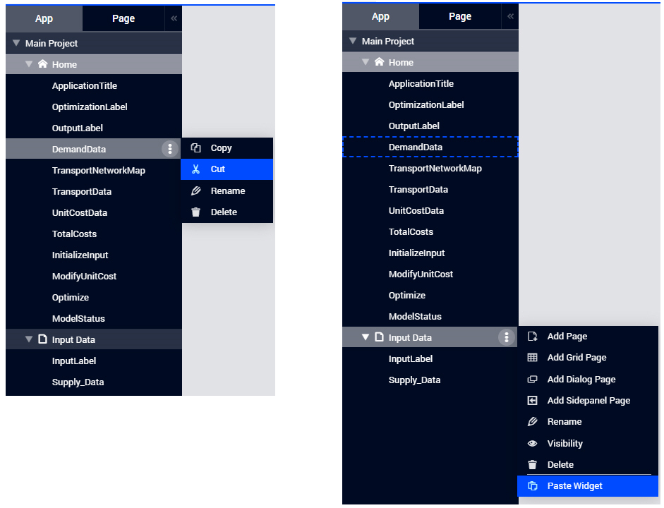

The **cut-and-paste** operation can be repeated for each widget which should be moved to a different page in the tree. In our example, after performing **cut-and-paste** also for the widgets UnitCostData, InitializeInput, and ModifyUnitCost (and maybe renaming the pasted widgets), the page tree would like in the following picture:

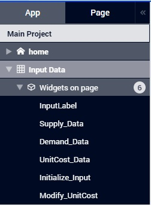
	
When we additionally move the Page Actions from the Home Page to the Input Data page (using the Page Settings on either page), the newly created Input Data page in the WebUI will look as follows:

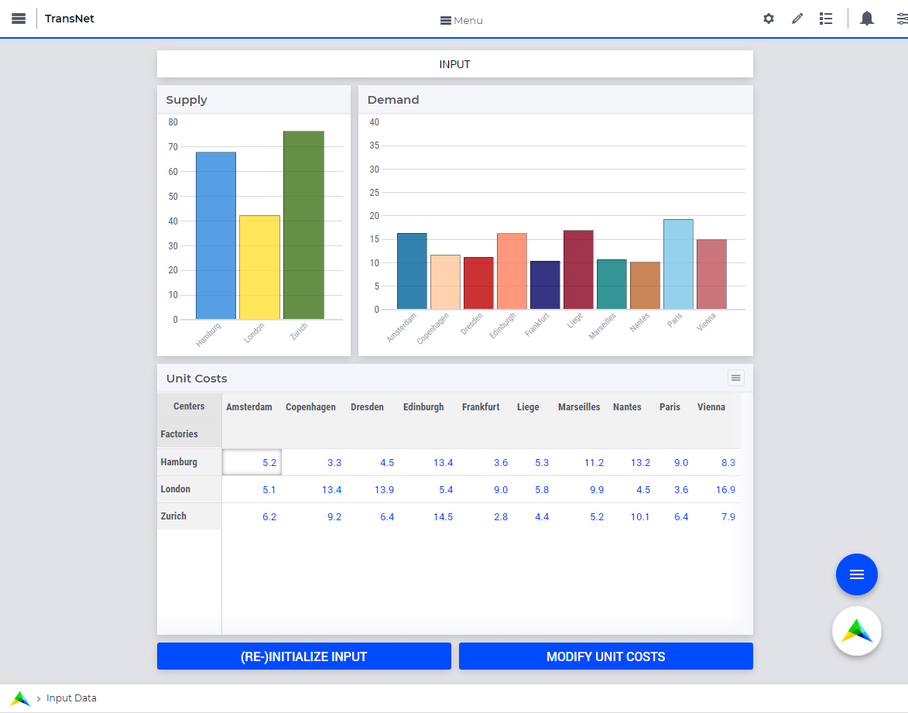

.. note:: Note that the order or the positioning of the widgets on a page is determined as follows:

          * for the `WebUI classic pages <webui-classic-pages.html>`_, the order of widgets on the page is the one given by the `Widget Manager <widget-manager.html>`_
          * for the `WebUI grid pages <webui-grid-pages.html>`_, the positioning of the widgets on the page is the one given by the corresponding **Page tab** of the `Page Manager with Grid Pages <webui-grid-pages.html#page-manager-with-grid-pages>`_. In this case, the copy-pasted or cut-pasted widgets are placed in the Unssigned area of the destination page.

In this example at hand, we can use similar actions as those illustrated above in order to create two new page, say Optimization and Output Data, and move the correspoding widgets from the Home page to these newly created pages, such that the page tree looks like in the following picture:

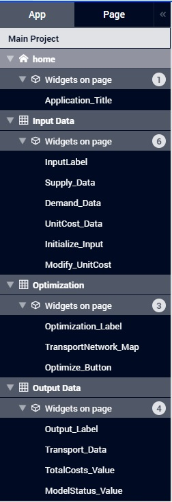

In this case, the Optimization and Output Data pages will look as follows in the WebUI:

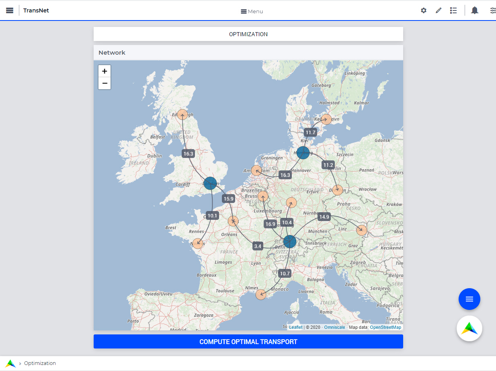

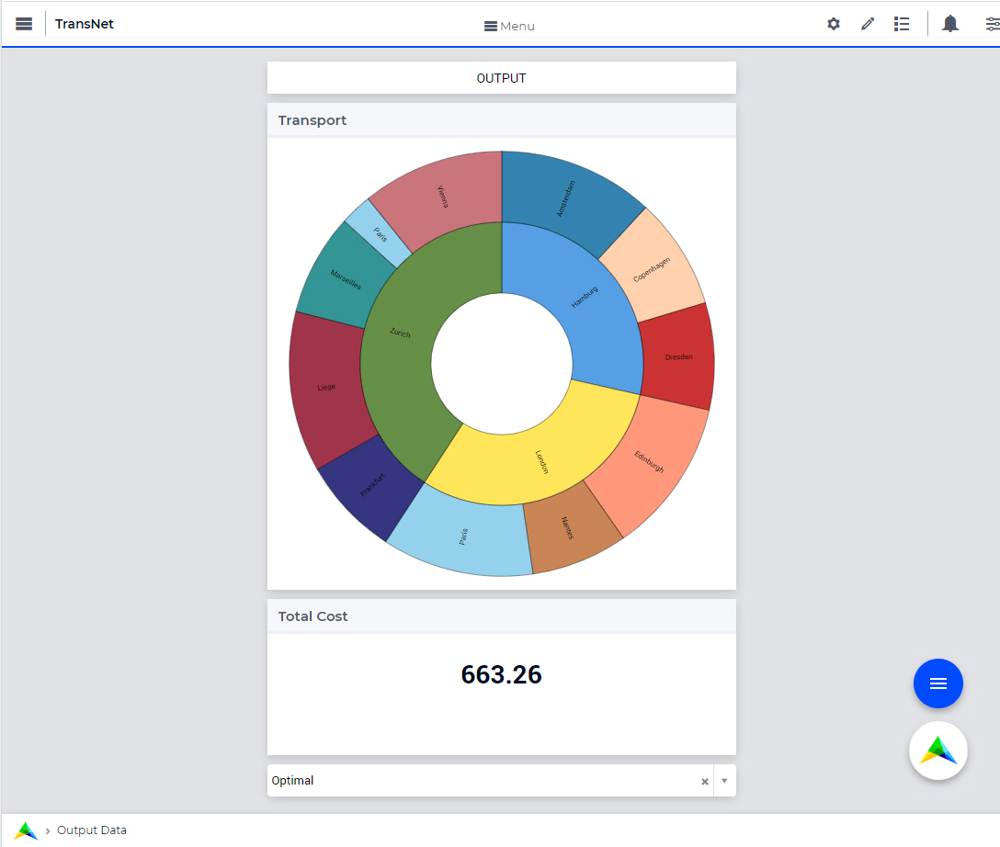
   
To summarize, this section illustrated how the application management features facilitate the (re-)structuring of the page tree in the WebUI and allow for moving widgets around between the various WebUI pages.