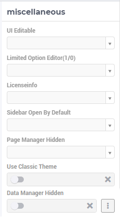

Miscellaneous Application Settings
==================================

.. |applicationsettings-icon| image:: images/applicationsettings-icon.png

.. |application-settings-open| image:: images/app_settings_open_new.png

.. |use-classic-theme-on| image:: images/use_classic_theme_on.png

The application options under the Miscellaneous tab of the Application Settings are explained below. Please note that some of these options may no longer be available in the latest AIMMS versions, but may be still visible in apps running under some older AIMMS versions.

Use Classic Theme
-----------------

From AIMMS 4.59 onwards, the look and feel of the WebUI has been upgraded to a more modern look and a consistent styling. 
However, for app developers who need more time to make sure their customized application looks as required with this new theme, 
the WebUI will offer you the choice which theme you want to use. More specifically, if you open an entirely new WebUI application, 
you automatically get the new look and feel (because there cannot be any backward compatibility issues in that scenario). 
If you open an already existing WebUI, however, you are offered the choice to try the new theme or to keep the old one for the time being. 
Should you want to toggle between the two, after having made this choice, we offer the 'Use Classic Theme' option in the 'Miscellaneous' tab. 
Simply set the switch to 'on' for the old theme, or to 'off' for the new theme:

.. image:: images/use_classic_theme_on.png
    :align: center
	
Besides this, we offer a `ClassicTheme.css file <https://gitlab.aimms.com/public-repos/retain-classic-theme>`_, which you can use to adjust some settings when you choose to retain the classic theme. The comments in this file should provide pointers on what to change. When adjusted, the file should be copied into the resources/css folder of your WebUI project. Furthermore, make sure you do use the `new page navigation menu <https://www.aimms.com/support/new-features/#UX20Menu>`_, as released with AIMMS 4.53.1. 

When opting to use the new theme, we offer `two .css files <https://gitlab.aimms.com/public-repos/adjust-new-theme>`_, which you can use to easily add a logo to the header bar of your WebUI pages and to change the color of the horizontal line below the header bar. The `ReadMe file <https://gitlab.aimms.com/public-repos/adjust-new-theme/blob/master/README.md>`_ offers guidance on how to do this. If you indeed start using the new theme, we strongly advice you to 'start from scratch', in case you are using lots of customized css for your model. If you want a more extensive change, we suggest to connect with our support team. Please also make sure to remove any 'ClassicTheme.css' file, as described in the previous paragraph, in case you have copied it to your css folder.

UI Editable
-----------

This is a logical condition which determines whether or not the user interface is editable when the application is run under the AIMMS PRO platform.

When this condition evaluates to "true" and the value of the "Limited Options Editor" (see also below) evaluates to "false", then all editing options available in developer mode 
are also made available to the end-user who runs the application in AIMMS PRO/Cloud. For example, the end-user can change the order of the widgets on a page in this case.

When the "UI Editable" condition evaluates to "false", then the end-user running the application in AIMMS PRO/Cloud is no longer allowed to edit the user interface, but only to use the pages 
and widgets as they are, i.e. as provided by the app developer. More specifically, the Application Settings, Page Settings, Widget Manager and Page Manager icons are no longer available in the Menu Bar. The latter (the Page Manager) is never displayed when run under the PRO platform.

Moreover, the "cog wheel" Settings icon is no longer available for any of the widgets, so the widget options are no longer editable.

Limited Option Editor(1/0)
--------------------------

This is a logical condition which determines whether or not the PRO user of the app gets limited access to the options in the widget/page editor.

Please note that, when the "UI Editable" option value evaluates to "false", then the value of this "Limited Options Editor" is not relevant.

When the "UI Editable" option value evaluates to "true" and the value of the "Limited Options Editor" evaluates to "true" as well, then the editing options available
in developer mode are made available to the end-user who runs the application in AIMMS PRO/Cloud. For example, the order of the widgets on a page in the Widget Manager can still be changed in this latter case. 

However, in this latter case there are also some limitations, such as the following:

* The Application Settings are not available for editing

* In widget options editor only the following sections are shown: Pivoting, Contents, Change Type, and Totals. So, in particular, the Miscellaneous and Advanced sections are not available for editing in the settings of any widget.

Licenseinfo
-----------

This a string option for some text about the used license which may be placed on the top of the menu bar.

Sidebar Open by Default
-----------------------

This is a logical condition which determines whether or not the Page Manager window is opened by default on the left side of the pages.  

.. note:: Starting from AIMMS 4.78 this option is no longer available.

Page Manager Hidden
-------------------

This is a logical condition which determines whether or not the Page Manager button on the menu bar is visible or is hidden.

.. note:: Starting from AIMMS 4.78 this option is no longer available.

Data Manager Hidden
-------------------

This is a logical condition which determines whether or not the Data Manager button on the menu bar is visible or is hidden.

Menu Hidden
-----------

This is a logical condition which determines whether or not the dropdown navigation menu is visible or is hidden.