Application Settings
====================

.. |applicationsettings-icon| image:: images/applicationsettings-icon.png

.. |application-settings-open| image:: images/app_settings_open_new.png

.. |use-classic-theme-on| image:: images/use_classic_theme_on.png

.. |workflowicon| image:: images/workflowicon.png

There are some settings that not only apply to a specific widget or page, but to the WebUI application as a whole. 
These settings can be accessed through the Application Settings menu, which you can open by clicking on the |applicationsettings-icon| icon:

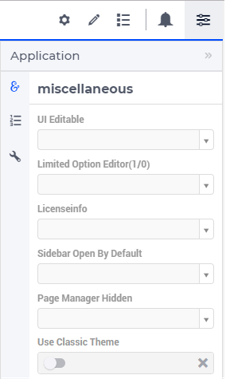

The application options under the Miscellaneous tab of the Application Settings are explained further down in this section. 
Firstly, the options of the Workflow Panel behind the icon |workflowicon| are described here.

Workflow Panel
--------------

.. important:: Workflow panels are available in software versions from AIMMS 4.68 onwards as part of Experimental Features. Please reach out to User Support on how to enable Experimental Features.

Starting from AIMMS 4.68, it is possible to design and configure Workflows in the AIMMS WebUI. The Workflow Panel is used to represent and run any workflow which is designed and defined by the application developer in the model. AIMMS allows the application developer to configure multiple workflows in an application.

A Workflow Panel is a progression of steps (tasks, events, interactions) that comprise a work/business process and create or add value to the organization's activities. 

The Workflow Panel guides the user through the defined set of steps in a specific workflow. It also gives the user the flexibility to enter or leave a workflow at any step of the process. The user can also navigate between workflows, so there is no restriction to only one workflow at a time. 

The workflow has states for each step that indicate to a user which steps can or cannot be accessed. Data states help indicate which steps are complete, incomplete or in an error state, as illustrated below.

.. image:: images/Workflow_Demo.png
    :align: center

The Workflow Panel can also be collapsed and expanded:

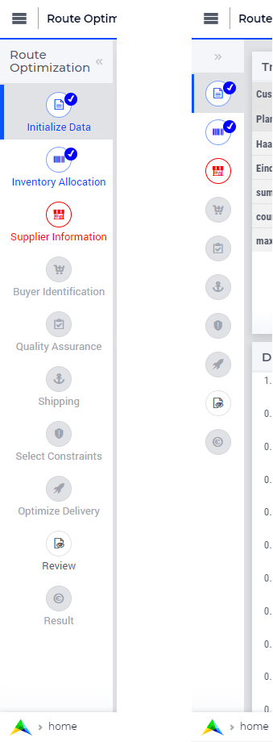

In the collapsed view, when the user hovers over a step the tooltip helps with identifying the purpose of that step:

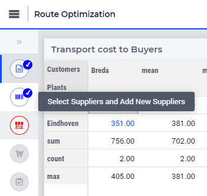

Configuring the Workflow Panel
++++++++++++++++++++++++++++++

The Workflow Panel can be configured by the application developer via the AIMMS model. Public Workflow Support Declarations have been defined in the inside the `Pages and Dialog Support <library.html#pages-and-dialog-support-section>`_ section of the AIMMS WebUI system library. These pre-declared identifiers can be used to configure different workflows and their respective steps.

WorkflowSpecification - This set is used to configure the number of workflows and their respective titles. The elements of this set (defining workflow properties) are the following:

* :token:`title` - The title for the workflow to be displayed on top of the Workflow Panel
* :token:`style` - A defined style for the workflow (This property is not in use currently. We have made the provision to incorporate different styles that we expect will be available in the future.)

WorkflowPageSpecification - This set is used to configure the steps for each workflow. The elements of this set (defining workflow properties) are as follows:

* :token:`displayText` - The label you want to give to the workflow step
* :token:`icon` - The icon you want to associate with the step. You can select from a list of 1600+ icons, the reference can be found in the `icon list <../_static/aimms-icons/icons-reference.html>`_. `Custom icons <folder.html#custom-icon-sets>`_ can also be used if required.
* :token:`pageId` - The pageId of the Page this step should be associated with. Ideally, every page in a workflow is a step in the Workflow Panel. The pageIds can be referred from the pre-declared :token:`AllRegularPages` set.
* :token:`tooltip` - The text to be displayed when the user hovers over the step
* :token:`workflowPageState` - The workflow state of the page, which may be Active (displayed and clickable), Inactive (displayed and not clickable) or Hidden (not visible). If not defined, by default the state is Hidden. 
* :token:`pageDataState` - The data state of the page, which may be Complete, Incomplete or Error. The specification of this state is optional. If not defined, by default it has an Empty state.
* :token:`redirectPageId` - The pageId of the page the user should be redirected to when the :token:`workflowPageState` is Inactive or Hidden. When the user tries to navigate to an Inactive or Hidden workflow step they are redirected to this page. The pageId's can be referred from the elements of the pre-declared set :token:`AllRegularPages`.

WorkflowNumbers - This is a sub-set of the pre-declared set of Integers, which has two pre-declared indices: :token:`indexWorkflowOrder`, used to reference the number of workflows, and :token:`indexNoOfPages`, used to reference he number of pages or steps in each workflow. These indexes are used as dimensions of the string parameters which will configure the application workflows, see further below.

To create and configure the Workflow Panel in the application you will need to create two string parameters. The first string parameter will configure the number of workflows in the application, while the second string parameter will configure the steps of each workflow.

Configuring Workflows
+++++++++++++++++++++

For illustration, let's call the first sting parameter :token:`MyWorkflows(webui::indexWorkflowOrder,webui::indexWorkflowSpec)`. This string parameter is indexed by the WorkflowNumbers set with the index :token:`indexWorkflowOrder` and the WorkflowSpecification set with the index :token:`indexWorkflowSpec`. This string parameter is used to define the number of workflows and their respective titles. The values of this string parameter may be initialized in the Initial Data attribute, in a procedure or manually, by right clicking the string parameter and clicking on the Data option in order to open its data page. There you can add the details for the Workflow and their titles (leave the style property empty for now):

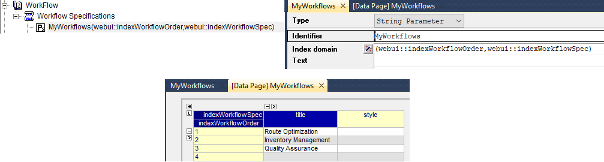

The values in the example above indicate that there are 3 workflows in the application at hand.

Configuring Steps of a Workflows
++++++++++++++++++++++++++++++++

Create the second string parameter, let's call it :token:`MyWorkflowSteps(webui::indexWorkflowOrder,webui::indexNoOfPages,webui::indexWorkflowPageSpec)` indexed over both indices of the WorkflowNumbers set and over the  index of the WorkflowPageSpecification set. This string parameter is used to define the steps for each workflow which has been defined in the MyWorkflows string parameter. In particular, each :token:`pageId` which is configured becomes a step displayed in the Workflow Panel, see further below.

Most of the times, configuring a page only in one workflow could suffice for the application at hand. However, the Workflow functionality is flexible enough such that one page may be configured in multiple workflows, if necessary. Although the page will be shown as a step in each of those workflow, there will be one workflow with the highest rank (ie, the smallest order number) referencing the page and this workflow will be the one shown on the page when the page is opened. So, whenever you click on that step (in any workflow) you will be taken to the corresponding step in the first workflow where the :token:`pageId` is referenced. Here "first workflow" is meant in the order of the workflows as defined by the MyWorkflows string parameter. 

For example, if a page 'Results' with :token:`pageId = results_1` is configured for two workflows "Route Optimization" and "Inventory Management", then the page Results will appear in both workflows, but will redirect the user to step in Route Optimization workflow when accessed, as illustrated below.

The page Results is configured for two workflows:

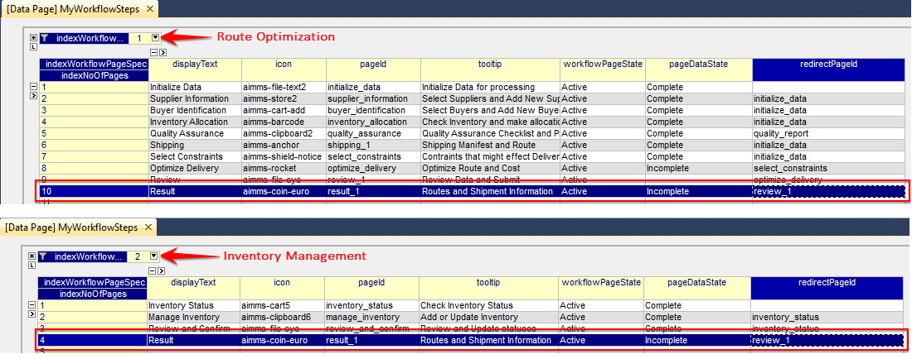

The page Results is shown as a step in both workflows:

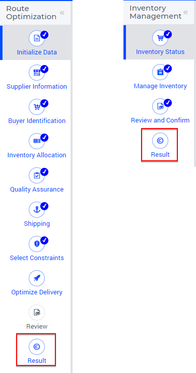

In this case, when the user is on the Inventory Management workflow and clicks on the Results step, the user will be redirected to the Results step in the Route Optimization workflow, because Route Optimization is the first workflow (referencing the page Results) in the order of the workflows as defined by the MyWorkflows string parameter.

There is no limit for the number of steps each workflow may have. As a guideline, AIMMS recommends no more than 10 steps per workflow. If more than 10 steps are required, then please try to breakdown the workflow into smaller workflows, if possible.

In order to inspect the values, right click on the MyWorkflowSteps string parameter and click on the Data option in order to open its Data page:

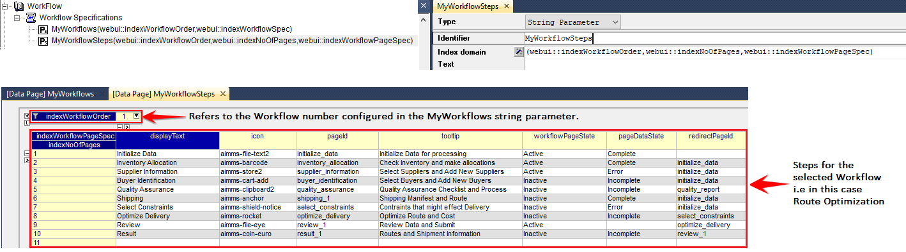

The data entered in the above illustration is for the 1st Workflow which was configured in "MyWorkflows" string parameter, that is, the Route Optimization workflow (with 10 steps defined).

In order to configure the steps for the other workflows, one may just select the respective value for indexWorkflowOrder at the top in the Data page.

For instance, 3 steps may be configured for the 2nd workflow Inventory Management as follows:

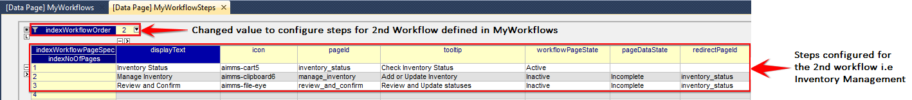

Similarly, an example of configuring 4 steps for the 3rd workflow Quality Assurance is illustrated here:

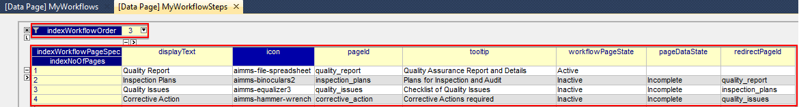

.. Note::
    Please do not use a page configured with the Wizard in a Workflow, this will result in unwanted behaviour.

workflowPageState and pageDataState
+++++++++++++++++++++++++++++++++++

The :token:`workflowPageState` determines the state of a step in the workflow. A step can have an Active (displayed and accessible), Inactive (displayed and not accessible) or Hidden (not displayed) state. This state is used to control the flow of actions in the workflow. Some steps can be made accessible only when certain conditions are met. For example, in a sequential workflow the next step should be accessible only when the current step is considered done. 

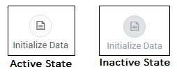

The :token:`pageDataState` determines the data state of a page. This state indicates if a step is Complete, Incomplete or in an Error state. There is a default (Empty) state as well when a certain step does not need a data state, for example an "Instruction" or an "Introduction" type of page.

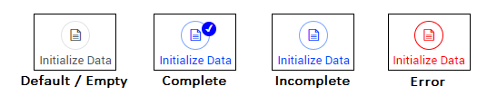

These two states are actually interdependent, hence the style of a displayed step may change accordingly as illustrated below:

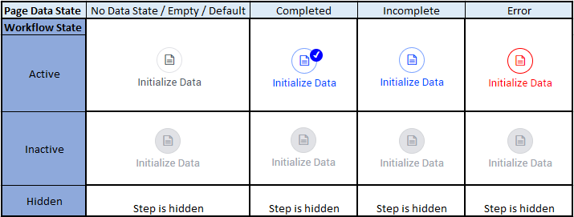

These states can be changed dynamically, as required, and as the user progresses in the workflow. This is achievable either by applying data changes made on a page or by using model procedures which are triggered based on certain actions in the front end.

.. Note:: 
    To make changes on the page please ensure the workflowPageState is Active. Or, before configuring the workflow steps, first make changes to the respective pages and then configure the workflow steps. When the workflowPageState is Inactive or Hidden you will not be able to access the respective page. 

redirectPageId
++++++++++++++

In the case of an invalid :token:`pageId` or when the :token:`workflowPageState` for a certain step is Inactive or Hidden, the workflow will be redirected to the page indicated by the :token:`redirectPageId`. This is a fallback scenario for the situation in which a user tries to access a page in a workflow, via the Menu or by an OpenPage procedure defined somewhere in the application, but the page is not made available to the workflow yet. The :token:`redirectPageId` is typically a page which is part of the same workflow. This ensures that the user stays in the workflow and learns that a previous step needs to be completed before accessing other steps of the workflow.

When the :token:`redirectPageId` is also invalid or not defined, an error is generated and the workflow stays on the current step. There is also a possibility that the workflow steps enter a loop, in which case the redirection is applied 25 times, after which an error is generated and the workflow stays on the current step page.

Changing states
+++++++++++++++

As mentioned earlier, the :token:`workflowPageState` and :token:`pageDataState` can be changed dynamically while the user performs actions in the workflow. The user can also be restricted from leaving a certain step if some data is incorrect or certain actions need to be performed before moving to any other step or page.

To change the :token:`workflowPageState` of a step in a workflow, simply reference the workflow and the step number in the "MyWorkflowSteps" string parameter and assign the desired value. For example:

.. code:: 

    MyWorkflowSteps(1, 2, 'workflowPageState') := "Active";

The above illustration sets the :token:`workflowPageState` for Step 2 i.e. Inventory Allocation in Workflow 1 i.e Route Optimization to "Active".

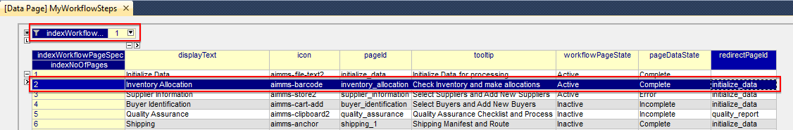

Similarly, to change :token:`pageDataState` an assignment statement like the following may be used in a model procedure:  

.. code:: 

    MyWorkflowSteps(1, 2, 'pageDataState') := 'Complete';

If you need to validate some data or actions and maybe to retain the user on the same step, please follow the steps explained in `Procedure for Restricting Page Navigation. <page-settings.html#procedure-for-restricting-page-navigation>`_ .

Configuring the string parameters in the Application settings
+++++++++++++++++++++++++++++++++++++++++++++++++++++++++++++

To enable the Workflow Panel click on the Workflow Panel icon |workflowicon| of the Application Settings and add the configured string parameters to the respective fields as illustrated below:

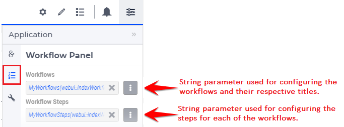

Once the string parameters are added in their respective fields, the Workflow Panel functionality will become visible on the pages which are part of a workflow.

This sub-section concludes the explanation of the Workflow Panel functionality configured in the Application Settings of a WebUI app.

Miscellaneous options
---------------------

The application options under the Miscellaneous tab of the Application Settings are explained below.

Use Classic Theme
+++++++++++++++++

From AIMMS 4.59 onwards, the look and feel of the WebUI has been upgraded to a more modern look and a consistent styling. 
However, for app developers who need more time to make sure their customized application looks as required with this new theme, 
the WebUI will offer you the choice which theme you want to use. More specifically, if you open an entirely new WebUI application, 
you automatically get the new look and feel (because there cannot be any backward compatibility issues in that scenario). 
If you open an already existing WebUI, however, you are offered the choice to try the new theme or to keep the old one for the time being. 
Should you want to toggle between the two, after having made this choice, we offer the 'Use Classic Theme' option in the 'Miscellaneous' tab. 
Simply set the switch to 'on' for the old theme, or to 'off' for the new theme:

.. image:: images/use_classic_theme_on.png
    :align: center
	
Besides this, we offer a `ClassicTheme.css file <https://gitlab.aimms.com/public-repos/retain-classic-theme>`_, which you can use to adjust some settings when you choose to retain the classic theme. The comments in this file should provide pointers on what to change. When adjusted, the file should be copied into the resources/css folder of your WebUI project. Furthermore, make sure you do use the `new page navigation menu <https://aimms.com/english/developers/downloads/product-information/new-features/#UX20Menu>`_, as released with AIMMS 4.53.1. 

When opting to use the new theme, we offer `two .css files <https://gitlab.aimms.com/public-repos/adjust-new-theme>`_, which you can use to easily add a logo to the header bar of your WebUI pages and to change the color of the horizontal line below the header bar. The `ReadMe file <https://gitlab.aimms.com/public-repos/adjust-new-theme/blob/master/README.md>`_ offers guidance on how to do this. If you indeed start using the new theme, we strongly advice you to 'start from scratch', in case you are using lots of customized css for your model. If you want a more extensive change, we suggest to connect with our support team. Please also make sure to remove any 'ClassicTheme.css' file, as described in the previous paragraph, in case you have copied it to your css folder.

UI Editable
+++++++++++

This is a logical condition which determines whether or not the user interface is editable when the application is run under the AIMMS PRO platform.

When this condition evaluates to "true" and the value of the "Limited Options Editor" (see also below) evaluates to "false", then all editing options available in developer mode 
are also made available to the end-user who runs the application in AIMMS PRO/Cloud. For example, the end-user can change the order of the widgets on a page in this case.

When the "UI Editable" condition evaluates to "false", then the end-user running the application in AIMMS PRO/Cloud is no longer allowed to edit the user interface, but only to use the pages 
and widgets as are, i.e. as provided by the app developer. More specifically, the Application Settings, Page Settings, and Widget Manager icons are no longer available in the Menu Bar. In particular, 
the order of the widgets on a page cannot be changed in this case.
The Page Manager icon may still be available, but the option for adding new pages (i.e., the "+" button) is removed. The page visibility and the page settings (including page name) are not
editable by the end-user. The page order may be temporarily modified for visualization, but as soon as a complete re-load take place the original page order is re-established. 
Moreover, the "cog wheel" Settings icon is no longer available for any of the widgets, so the widget options are no longer editable.

Limited Option Editor(1/0)
++++++++++++++++++++++++++

This is a logical condition which determines whether or not the PRO user of the app gets limited access to the options in the widget/page editor.

Please note that, when the "UI Editable" option value evaluates to "false", then the value of this "Limited Options Editor" is not relevant.

When the "UI Editable" option value evaluates to "true" and the value of the "Limited Options Editor" evaluates to "true" as well, then the editing options available
in developer mode are made available to the end-user who runs the application in AIMMS PRO/Cloud except from the following:

* The Application Settings are not available for editing

* The Miscellaneous and Advanced sections are not available for editing in the Settings of any widget

For example, the order of the widgets on a page in the Widget Manager can still be changed in this latter case.

Licenseinfo
+++++++++++

This a string option for some text about the used license which may be placed on the top of the menu bar.

Sidebar Open by Default
+++++++++++++++++++++++

This is a logical condition which determines whether or not the Page Manager window is opened by default on the left side of the pages.  

Page Manager Hidden
+++++++++++++++++++

This is a logical condition which determines whether or not the Page Manager button on the menu bar is visible or is hidden.