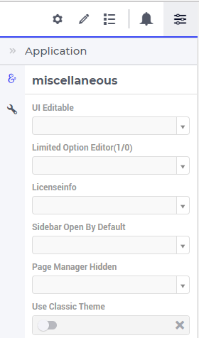
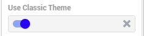

Application Settings
====================

There are some settings that not only apply to a specific widget or page, but to the WebUI application as a whole. 
These settings can be accessed through the Application Settings menu, which you can open by clicking on the |applicationsettings-icon| icon:

Use Classic Theme
-----------------

From AIMMS 4.59 onwards, the look and feel of the WebUI has been upgraded to a more modern look and a consistent styling. 
However, for app developers who need more time to make sure their customized application looks as required with this new theme, 
the WebUI will offer you the choice which theme you want to use. More specifically, if you open an entirely new WebUI application, 
you automatically get the new look and feel (because there cannot be any backward compatibility issues in that scenario). 
If you open an already existing WebUI, however, you are offered the choice to try the new theme or to keep the old one for the time being. 
Should you want to toggle between the two, after having made this choice, we offer the 'Use Classic Theme' option in the 'Miscellaneous' tab. 
Simply set the switch to 'on' for the old theme, or to 'off' for the new theme:

UI Editable
-----------

This is a logical condition which determines whether of not the user interface is editable when the application is run under the AIMMS PRO platform.

Limited Option Editor(1/0)
--------------------------

This is a logical condition which determines whether of not the PRO user of the app gets limited access to the options in the widget/page editor.

Licenseinfo
-----------

This a string option for some text about the used license which may be placed on the top of the menu bar.

Sidebar Open by Default
-----------------------

This is a logical condition which determines whether of not the Page Manager windows is opened by default on the left side of the pages.  

Page Manager Hidden
-------------------

This is a logical condition which determines whether of not the Page Manager button on the menu bar is visible or is hidden.