Bar Chart Widget
----------------

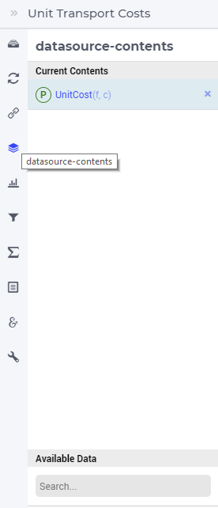

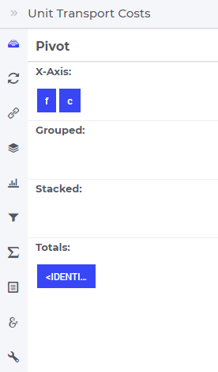

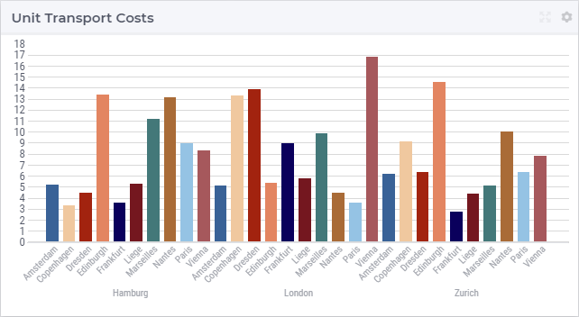

The Bar Chart widget represents data as vertical bars. A typical situation is when a 1-dimentional identifier such as the Supply(f) of a factory f in the TransNet application 
(see the "Quick Start: My First WebUI" section) is displayed like in the following picture:

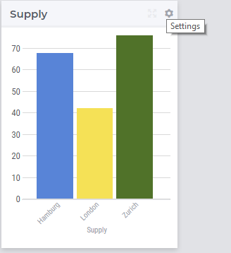

More generally, a bar chart widget offers the possibility to display multi-dimensional data in your model by using an X/Y-plane to display a bar 
for each data point. The height of a bar provides information about the value of the correspoding data point. 
For example, in the TransNet application, the unit transport costs for every combination (factory, center) may be represented using a bar chart widget 
like illustrated in more details in the sequel. More specifically, we discuss and illustrate below one-by-one the tabs in the bar chart's options editor 
which may be accessed through the Settings wheel as shown in the picture above.

Contents and Pivoting
+++++++++++++++++++++

In order to determine the information to be rendered by a bar chart, first one has to specify the data identifier(s) in the Contents tab of the widget's options editor, where one may search 
for the available model data using the correspoding functionality at the bottom:

	
Next, in the Pivot tab of the options editor, one can specify how the data dimensions are to be organized in the chart. 
For example, if both the factory index f and the center index c are specified in the X-axis section and the <IDENTIFIER-SET> in the Totals section then the resulting bar chart looks like 
in the picture below on the right:

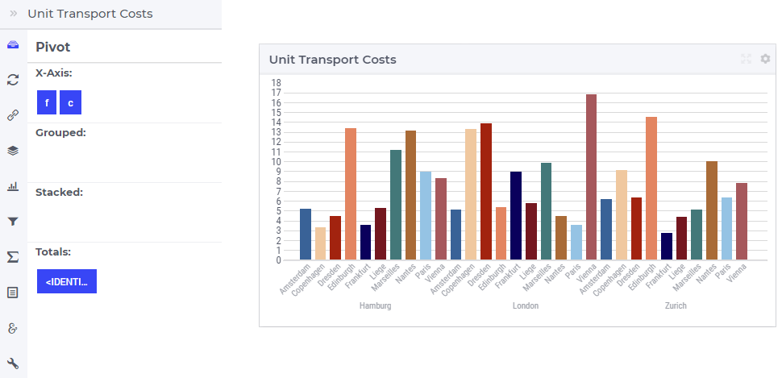

One may move some data indexes in the Grouped section of the Pivot tab. In our example, moving the center index c to the Grouped section results in the following bar chart view:

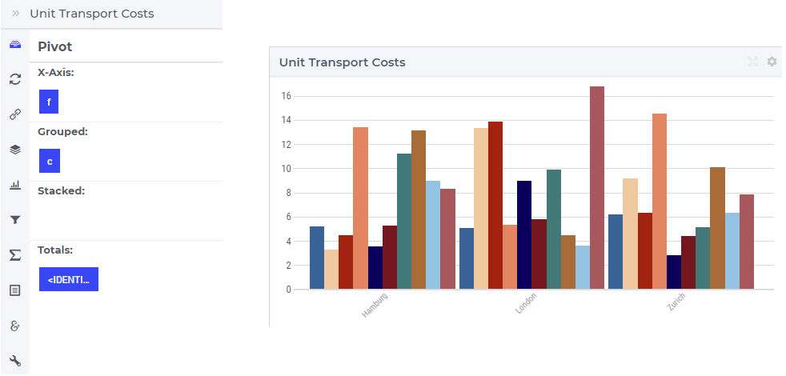

Similarly, one may move some data indexes in the Stacked section of the Pivot tab. In our example, moving the center index c to the Stacked section results in a bar chart view like below:

.. image:: images/BarChart-View3.png
    :align: center
	
Change Type
+++++++++++

In the Change Type tab of the widget's options editor, one can switch from the bar chart type to some other representation type. 
In the example at hand, one can switch eg. from the bar chart to the table, resulting in the tabular view of the same data values:

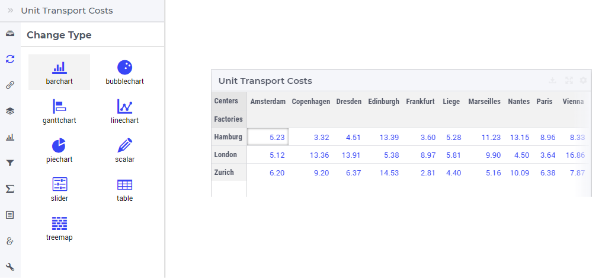

Barchart Settings
+++++++++++++++++

In the Barchart Settings tab of the widget's options editor, a minimum and a maximum bound for the Y-axis may be specified, either as constants or as scalar identifiers from the model.
Additionally, one may also specify a step size which determines the distance between the horizontal grid lines drawn in the chart:

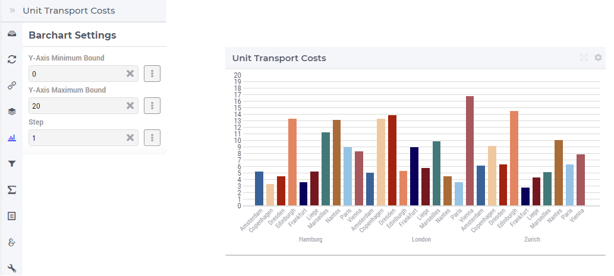
	
Filters
+++++++

In the Filters tab of the widget's options editor, some of the other widgets on the same page may be chosen for filtering the data points shown in the bar chart. 
In our example, chosing TransportData widget as a filter results in a confined bar chart view as only those data points are shown for which the TransportData widget shows non-default values: 

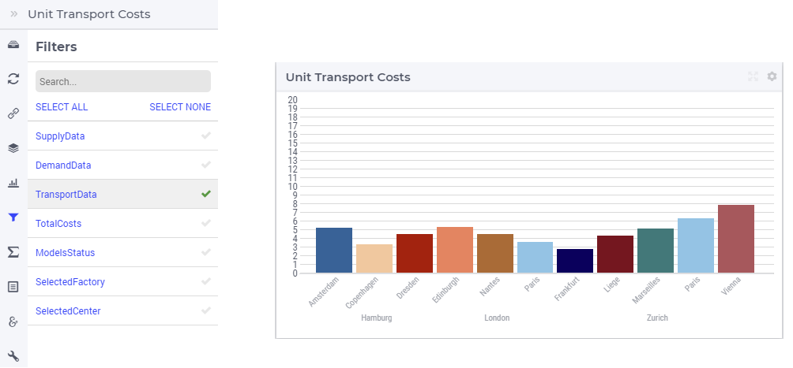

Not accidentally, these filtered values are among the lowest unit transport costs which are preferred when minimizing the overall costs for the entire network.

Totals
++++++

In the Totals tab of the widget's options editor, aggregated values such as sum, mean, count, min, or max computed over one of the data indexes my be added to the chart. 
For example, when we add the sum over the centers c to our example bar chart, three additional (gray) bars representing the aggregated values become visible in the chart 
and the Y-axis is re-scaled accordingly: 

.. image:: images/BarChart-ViewTotals.png
    :align: center

Identifier Settings
+++++++++++++++++++

In the Identifier Settings tab of the widget's options editor, one can apply a display domain or some slicing to the data identifier(s).

In the "Set display domain" section, a constant or a model identifier may be specified. The bar chart will then only display data points for which the display condition is evaluated as true.
In our example, when Transport(f,c) is specified as display domain for UnitCost(f,c), then the bar chart only display the unit costs for the (f,c) combination for which the Transport(f,c) is
not 0, as illustrated below:

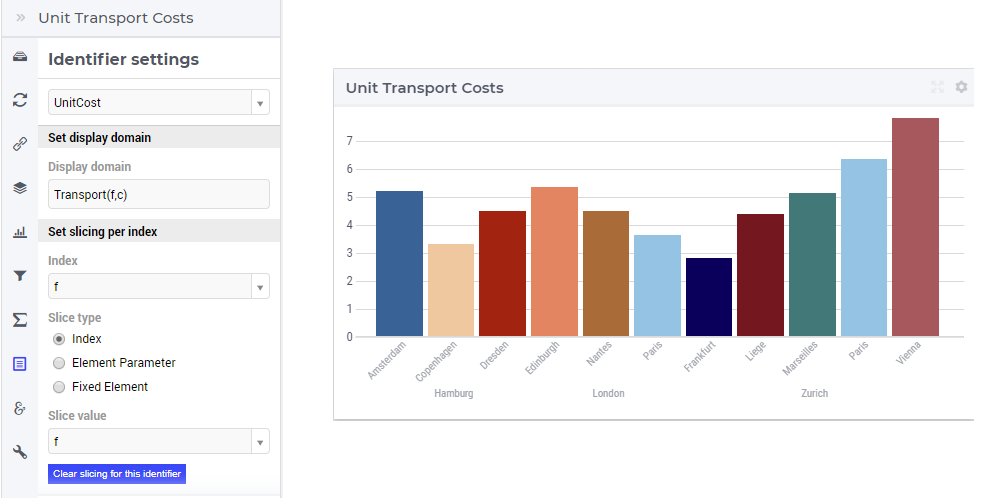

In the "Set slicing per index" section it is possible to slice one index to another index of a subset, to an element parameter or to a fixed element in the corresponding set.
For instance, we can slice our factory index f to the fixed element 'Hamburg' in the Factories set, resulting in the bar chart view as shown here: 

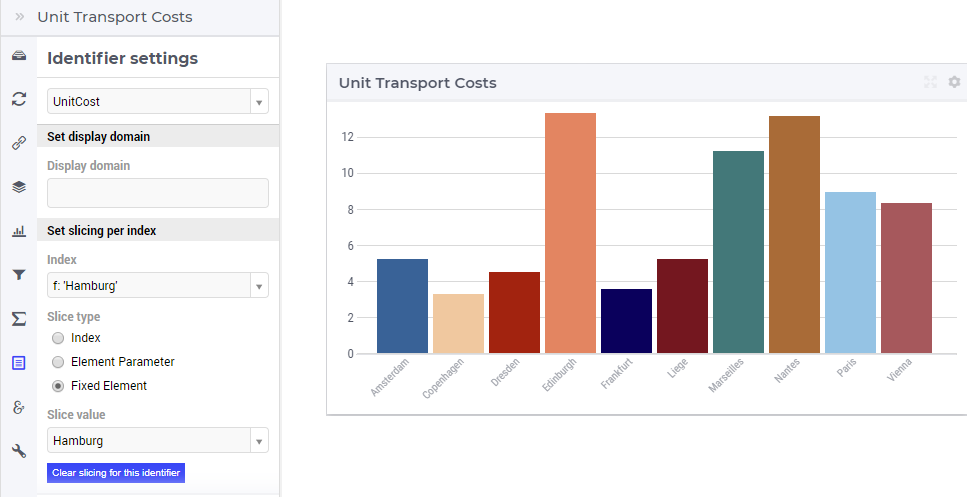

Similarly, one could slice the index f to an element parameter CurrentFactory having the declared range the set Factories (where the value of CurrentFactory may be determined from within the model
or by a choice made through another widget in the user interface). 

Store Focus, Hover and Select
+++++++++++++++++++++++++++++

In the Store Focus tab of the widget's options editor, for each index it is possible to specify an element parameter in the same set which will store the corresponding value when the user sets the
focus on a specific bar in the chart. For example, we can specify SelectedFactory for the index f and SelectedCenter for the index c, where SelectedFactory and SelectedCenter are element paramneters 
in our application at hand with ranges Factories and Centers, respectively. The values of SelectedFactory and SelectedCenter may be displayed for inspection in some other widgets outside the bar chart.
When the user sets the focus on a specific bar, the corresponding factory and center values are stored in SelectedFactory and SelectedCenter, respectively. In this case, the selected bar is highlighted, 
while the other bars are faded away. The picture below depicts this situation:

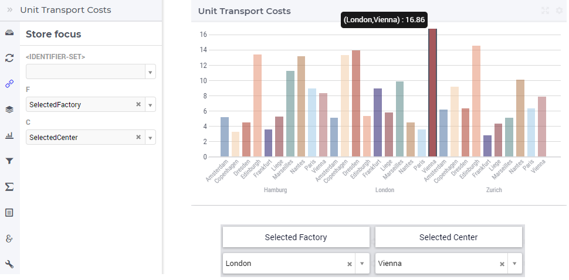

When a bar has been selected, the user may still hover over another bar and inspect the tooltip information, in the same way as the hovering works when no bar has been selected 
(remark: a selected bar may be unselected by clicking again on it):

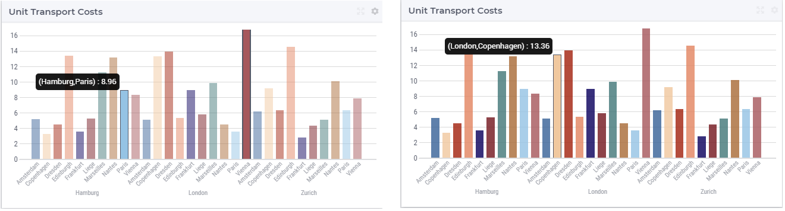

Miscellaneous
+++++++++++++

In the Miscellaneous tab of the bar chart's options editor, other options may be set such as the title of the widget, whether or not the widget is visible (this may be determined by a model parameter)
or the number of decimals for the values displayed in the chart.
